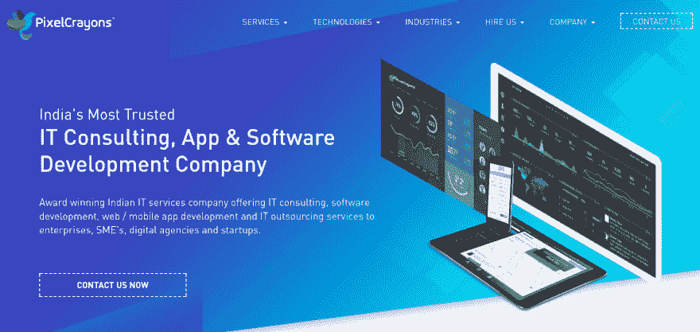
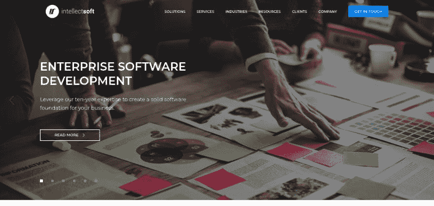

# 面向初创企业和中小企业的前 5 名以上的网络开发和开发商公司

> 原文：<https://dev.to/ankitkapoor5821/top-5-web-development-and-developers-companies-for-startups--smes-f9p>

# 面向初创企业和中小企业的网站开发和开发商公司

如今，很难想象没有任何网络存在的企业。每个公司无论是小规模还是大规模都需要有一个网站，因为人们经常在互联网上搜索产品和服务。不管你的业务是实体的还是数字的，如果你没有在线业务，你的业务就不会成功。

根据 infront.com 的调查，60%的企业为了增加客户数量，更倾向于网上销售。此外，企业 50%的收入来自电子商务网站。此外，60%的人通过各自的智能手机访问互联网。

自 20 世纪 90 年代以来，web 开发行业已经成熟和发展，现在我们有许多面向中小企业的 web 开发公司和面向初创企业的最佳 web 开发公司。你可以根据他们的能力和以前在真实项目中与他们合作过的客户的评价来雇佣网络程序员或网络编码员。

我们已经根据以下凭据列出了这些顶级 web 开发人员和开发公司的候选名单:公司评级、以前的客户反馈、以前的工作历史、提供的后期开发服务以及执行的大量 web 开发项目。

## 这里列出了创业公司和中小企业的顶级网站开发者和网站开发公司

**1。[柳树](https://willowtreeapps.com/services?utm_source=dev.to%2Fwebdevelopmentcompany%2Fankitkappor&utm_medium=narender#web-development)(最佳网络开发公司)**

 **

WillowTree 是另一家专门从事 web 和移动应用程序开发的初创公司的最佳 web 开发公司。到目前为止，他们已经为顶尖的创业公司和中小企业提供了一些最好的网络解决方案。他们的开发人员确保他们的客户获得快速开发、高性能、成本效益、转换、100%的客户满意度等等。

提供的服务:UI/UX 开发、移动应用开发、前端 web 应用开发、后端 web 应用开发。

网站-[https://willowtreeapps.com/](https://willowtreeapps.com/)

**2。 [PixelCrayons](https://www.pixelcrayons.com/web-development/?utm_source=dev.to%2Fwebdevelopmentcompany%2Fankitkappor&utm_medium=narender) (印度顶级网络开发公司)**

PixelCrayons 将自己定位为印度顶级的网络开发公司，为中小企业和初创企业开发世界级的网站和网络应用。此外，他们给客户一个选择，雇佣网络程序员或者雇佣网络编码员作为独立的开发者。PixelCrayons 致力于提供一些最佳的客户体验，创造无缝的数字体验，以改变客户开展业务的方式。

提供的服务:Web 应用开发、PHP 网站开发、前端开发、服务器端开发、后端开发。

网站-[https://www.pixelcrayons.com/](https://www.pixelcrayons.com/)

**3。 [ValueCoders(大众网络开发公司)](https://www.valuecoders.com/application-development?utm_source=dev.to%2Fwebdevelopmentcompany%2Fankitkappor&utm_medium=narender)**

ValueCoders 是创业公司和中小企业的最佳网络开发公司之一。他们使用所有开源和付费的网络开发技术为他们的客户提供最好的网站体验。所有这些都是根据客户的要求完成的。他们已经成功地向客户交付了 500 多个 web 开发项目，包括各种顶级公司和财富 500 强公司。

提供的服务:PHP web app 开发、网站应用开发、AngularJS 开发、后端开发、服务器端网站开发。

网站-[https://www.valuecoders.com/](https://www.valuecoders.com/)

阅读更多- [面向初创公司的顶级 Android 应用开发公司](https://www.linkedin.com/pulse/10-top-android-app-development-companies-ankit-kapoor/)

**4。 [iTechArt](https://www.itechart.com/development/web/?utm_source=dev.to%2Fwebdevelopmentcompany%2Fankitkappor&utm_medium=narender) (一个完整的网页设计&开发解决方案)**

iTechArt 是印度顶级 web 开发公司之一，拥有超过 1000 名 web 应用程序开发人员。他们与许多初创公司和中小企业合作，为他们打造了一个成功的、可扩展的产品。该公司使用成熟的新技术来开发一个全新的网站，具有良好的用户界面和强大的后端。此外，您可以根据您项目的需求轻松地单独雇佣 web 开发人员。

提供的服务:web 开发、移动应用程序开发、跨平台 Web 应用程序开发、大数据等等。

网站-[https://www.itechart.com/](https://www.itechart.com/)

**5。 [Iflexion](https://www.iflexion.com/services/web-application-development?utm_source=dev.to%2Fwebdevelopmentcompany%2Fankitkappor&utm_medium=narender) (领先的网页设计&开发者)**

自 1999 年成立以来，Iflexion 一直与各种创业公司和中小企业合作，为他们提供最好的网站或网络应用程序。他们有一个由 850 名开发人员组成的团队，提供各种各样的 web 开发解决方案，而不考虑地点、领域和组织细节。他们还以按时交付项目而闻名。

提供的服务:Web 应用开发、JavaScript 开发、移动应用开发、后端网站开发、静态网站开发等等。

网站-[https://www.iflexion.com/](https://www.iflexion.com/)

**6。 [Intellectsoft](https://www.intellectsoft.net/?utm_source=dev.to%2Fwebdevelopmentcompany%2Fankitkappor&utm_medium=narender) (一家流行的网页设计&开发公司)**

Intellectsoft 是印度的另一家顶级网络开发公司，它通过创新和使用 AngularJS、Node 等新兴网络技术来帮助企业克服技术进步带来的挑战。JS，ReactJS，前端开发，后端开发等等。

提供的服务:前端开发、后端开发、web 应用开发等等。

网站-[https://www.intellectsoft.net/](https://www.intellectsoft.net/)

阅读更多- [您应该使用 Python 的最佳理由](https://www.linkedin.com/pulse/5-important-reasons-why-you-should-use-python-ankit-kapoor/)

最后一个音符

我已经根据上述标准列出了这些顶级网站开发公司的名单。这些是任何 web 应用程序开发公司的潜在客户考虑的最重要的因素。我真诚地希望这个列表能让你清楚地了解你的需求，并帮助你为你的企业选择合适的网络开发伙伴。如果你想在这个列表中添加任何特定的公司，请在下面的评论中注明。我会根据我的研究参数对公司进行分析，并相应地列出来。**