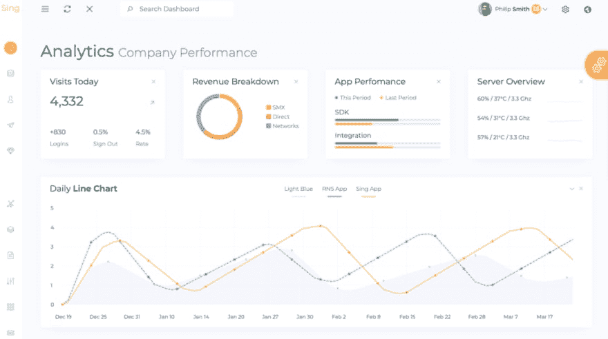
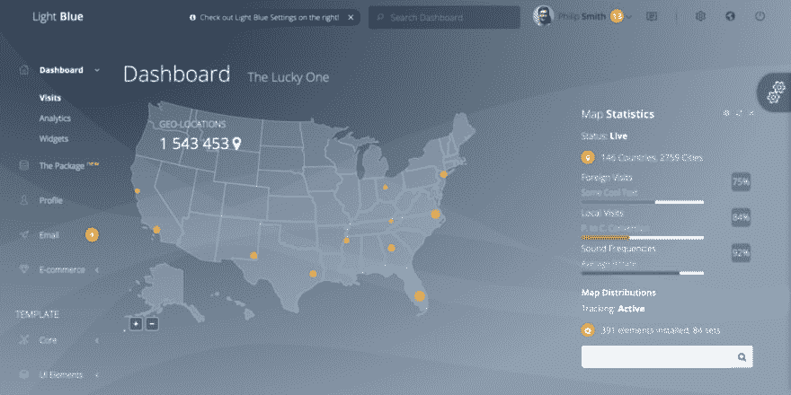
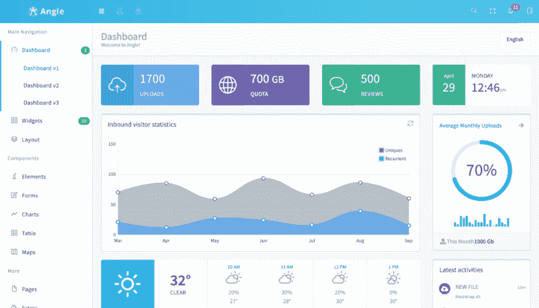
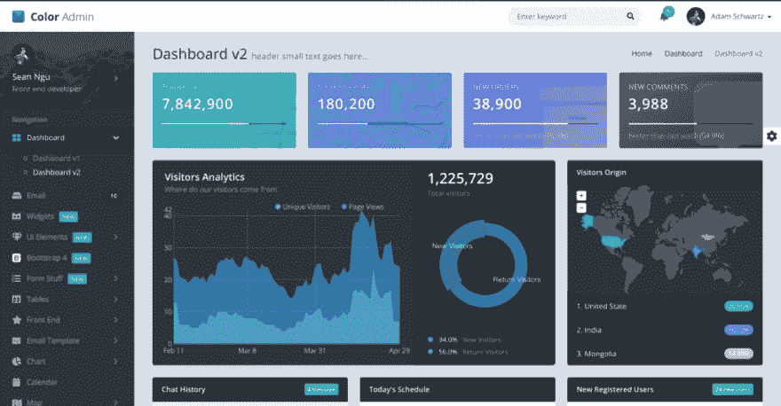

# 前 6 名 Vue 管理模板

> 原文：<https://dev.to/flatlogic/top-6-vue-admin-templates-86d>

[管理模板](https://flatlogic.com/admin-dashboards)使开发过程变得更加简单快捷，但是很难选择正确的管理仪表板，它遵循最新的设计趋势，总是自我改造并考虑市场上出现的新设备。如果你找到了一个完美的管理模板，你作为一个开发者就不必再担心浏览器的兼容性或响应性了。下面列出的所有模板都是用 VueJS 框架和最新的引导程序构建的。VueJS 是 JavaScript 中发展最快的框架，因为它具有高性能、灵活性和难以置信的开发速度。VueJS 有大量现成的插件，适合构建模块化结构，帮助开发人员保持代码可读性。

这里是一个顶级 VueJS 管理模板的列表，它有一个非凡的设计，是用最新的引导程序构建的。我们考虑了 UX 设计的质量，页面(组件和部件)的数量，文档和容易定制管理模板的可能性。

### 由 Flatlogic 演唱 App Vue.js

Sing App Vue 有非常整齐有序的垂直侧边栏，平滑的界面，精心挑选的调色板，帮助您的下一个 web 应用程序看起来独一无二。完全响应式设计可在任何设备的任何屏幕上提供最佳用户体验。对于网页设计者和网页开发者来说，这是一个极好的选择，不仅仅是因为拥有大量 UI 组件的令人惊叹的设计，还因为全面的文档。这使得定制或集成过程变得简单而舒适。每个 UI 元素都完美地工作，仪表板有适当的空间和适当大小的部件和组件。

**价格 59.95 美元**

**评级*******

[演示](https://flatlogic.com/admin-dashboards/sing-app-vue/demo)

[更多详情](https://flatlogic.com/admin-dashboards/sing-app-vue)

### app work view . js 模板

 
Appwork 管理模板有一个响应式的布局许多可定制的主题皮肤和功能。这个基于 Bootstrap 4 的模板结构良好，设计简洁现代。Appwork 管理模板的 Vue.js 项目没有 jQuery 依赖项，是使用 Vue CLI 开发的，除了 5 个图表组件之外，还包括超过 37 个集成组件。50 多个预建页面包括登录/注销、电子商务页面、消息、任务列表等等。Appwork admin dashboard 包还包括 sketch 文件、Vue.js 项目、Laravel + jQuery 项目、Laravel + Vue.js 项目。对于各种各样的企业类型来说，这是一个很好的选择。

**价格 30 美元**

**评级******

[演示](https://uxpowered.com/products/appwork/v131/vue-demo/dashboards/dashboard-1)

[更多详情](https://wrapbootstrap.com/theme/appwork-bootstrap-4-template-ui-kit-WB0C668T3)

### 浅蓝色 Vue by Flatlogic

浅蓝色是一个高级管理模板，设计优雅，几乎可以满足您的任何要求。清晰的文档将帮助您创建令人惊叹的定制管理仪表板。浅蓝色搭配深色和浅色主题。这个功能丰富的管理模板有一个伟大的 UI 元素集合，所有的基本元素，漂亮的图形和排版。该仪表板功能强大，反应灵敏，可用于多种任务。它可以是一个网站后端，CMS，CRM，分析等。清晰的代码组织将帮助您轻松定制这个仪表板，并用于任何类型的 web 应用程序。这个仪表板可以完美地与所有现代浏览器和屏幕尺寸配合使用。

**价格 59.95 美元**

**评级*******

[演示](https://flatlogic.com/admin-dashboards/light-blue-vue/demo)

[更多详情](https://flatlogic.com/admin-dashboards/light-blue-vue)

### angle view . js admin 模板

Angle admin 模板与 Bootstrap 4 兼容，使用包括 VueJS 在内的多种框架，并具有响应式设计。产品包有一个简单的文件组织，包括每个项目版本的文档。您必须在全功能变体和只有少量依赖项和路由的种子变体之间进行选择。这个管理模板的设计是丰富多彩和优雅的，包含了 CRM、电子商务或简单项目管理系统的所有基本 UI 元素。Angle admin 的主要亮点是它的设计很有美感，并且有很好的注释和干净的代码。

**价格 30 美元**

**评级******

[演示](http://themicon.co/theme/angle/v4.3/vue/dashboardv1)

[更多详情](https://wrapbootstrap.com/theme/angle-bootstrap-admin-template-WB04HF123)

### 颜色管理 Vue.js 仪表板

色彩管理支持几乎所有的现代浏览器，并展示简单和新鲜的设计。它可以定制，以满足您的项目的需要，无论这是管理面板或 CRM。这个管理仪表板由许多组织良好的组件组成，用于设计一个终极仪表板。色彩管理模板响应速度非常快，因此无论是平板电脑还是手机，它在任何设备上看起来都非常完美。它有详细记录的代码，长期更新和多种颜色主题的现代设计。还拥有扁平化设计、facebook 设计、透明、材质、电商等几个概念设计。

**价格 34 美元**

**评级******

[演示](https://seantheme.com/color-admin-v4.3/admin/html/index_v2.html)

[更多详情](https://wrapbootstrap.com/theme/color-admin-admin-template-front-end-WB0N89JMK)

### Elements Vue.js 管理模板

Elements 多用途管理模板是非常轻量级的，它可以很容易地实现到现有的项目中，或者你可以在它的基础上构建你的 web 应用程序。该仪表板包括所有能够充分开发引导潜力的组件。您可以将 Elements dashboard 用于任何类型的项目，包括 SAAS、SPA 和 help desk。这个模板有一个扁平的设计概念，完全响应，用最新的引导程序构建，包含所有必要和方便的功能。管理仪表板模板有一个惊人的和用户友好的设计，非常容易定制。布局中的组件排列得非常完美，似乎特别注意确保 Elements template 适用于任何屏幕大小的每一个设备。

**价格 8 美元**

**评级******

[演示](http://demo.adminbootstrap.com/elements/1.3.0/demo/)

[更多详情](https://wrapbootstrap.com/theme/elements-react-vue-angular-static-WB0C63645)

最初发表于[https://flatlogic.com/blog/top-6-vue-admin-templates/](https://flatlogic.com/blog/top-6-vue-admin-templates/)