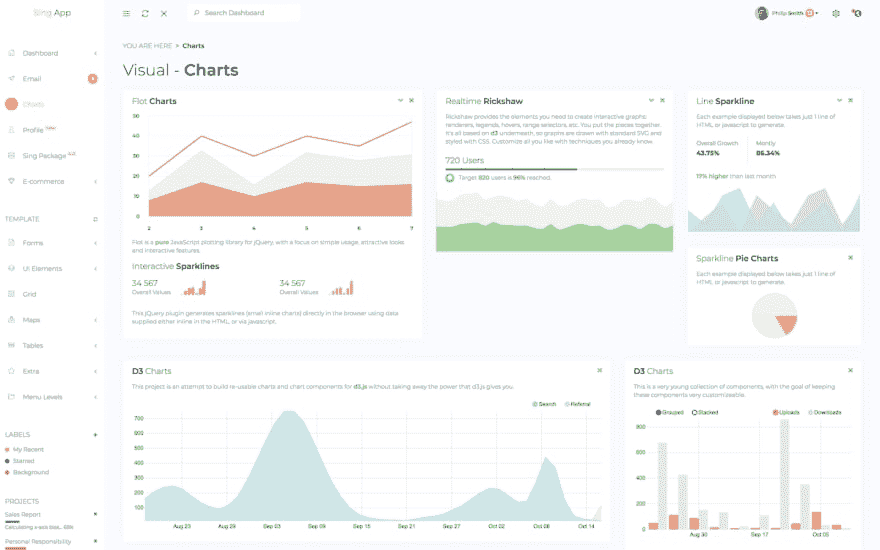
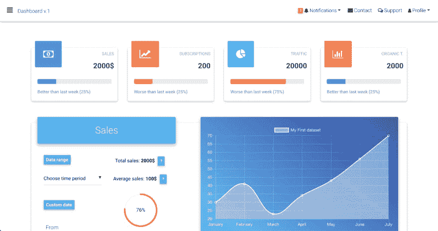
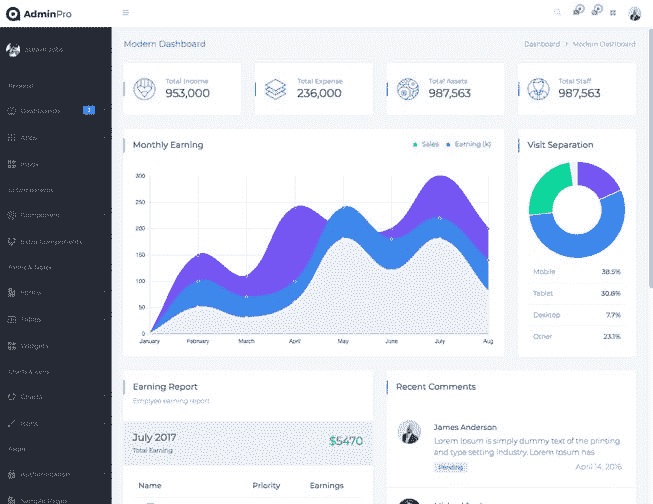
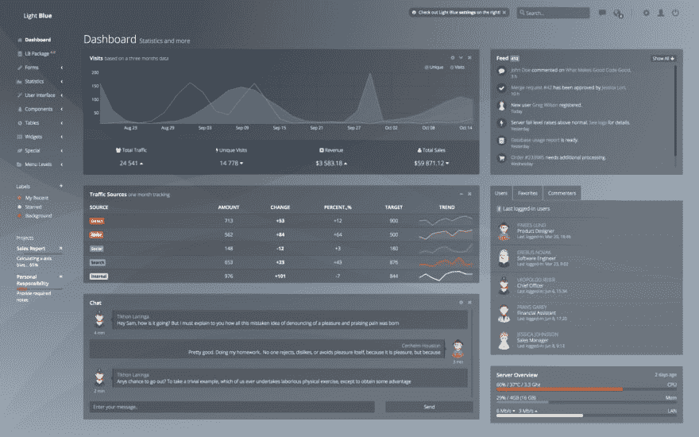
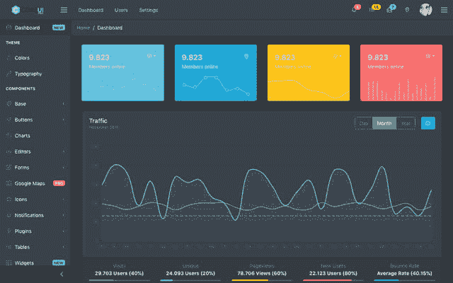
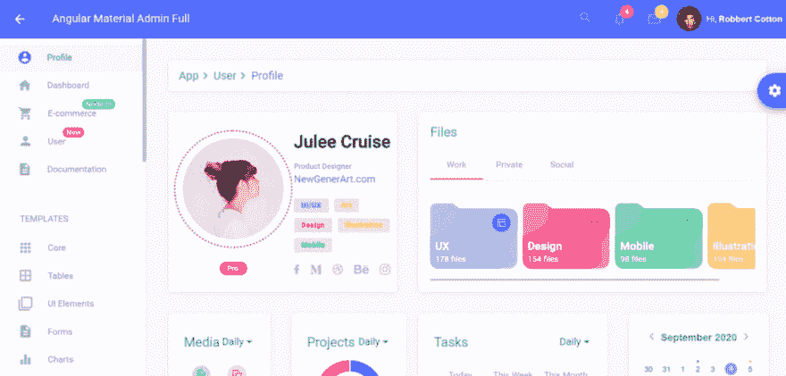
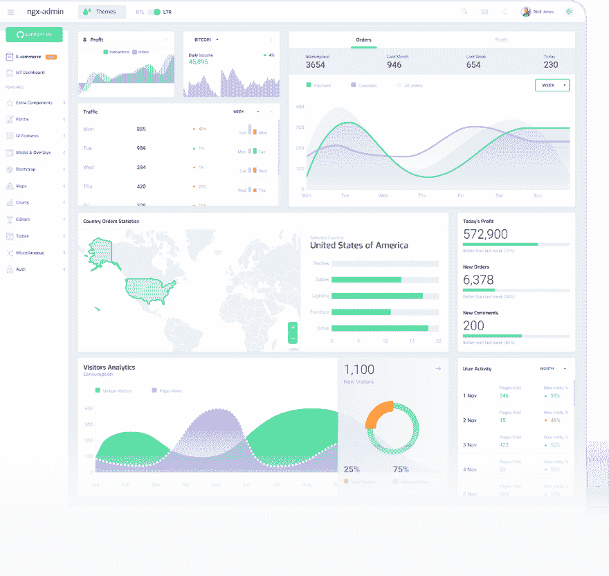
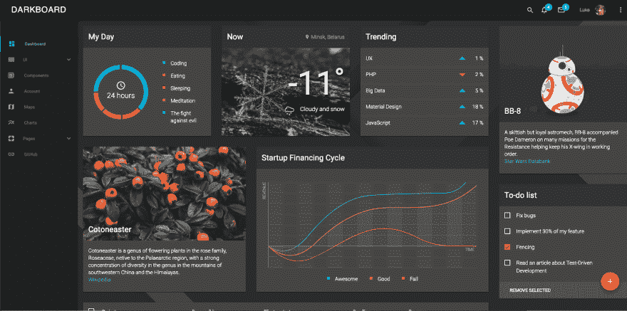
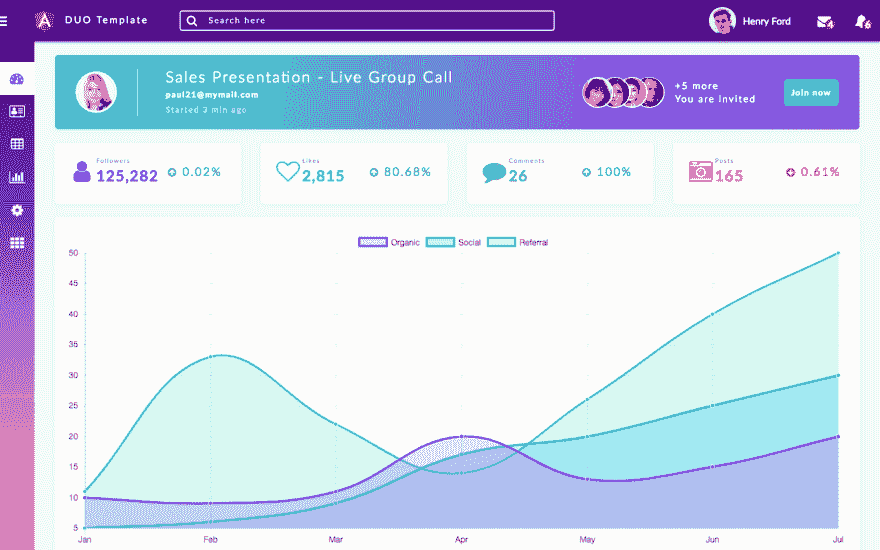

# 2020 年顶级角度管理模板

> 原文：<https://dev.to/flatlogic/top-angular-admin-templates-in-2019--4i81>

审查管理模板的人通常会考虑文章应该以什么样的介绍开始。但是说实话，从来没有人对这些感兴趣。人们只是向下滚动，然后直奔主题。所以这一次我们认为我们可以跳过介绍。我们不会解释为什么和如何使用管理面板可以节省你的钱，你可以在这里阅读。

正如我们所承诺的，让我们直奔主题。以下是管理小组的评估标准列表。在本文的后面部分，您将会看到这些工具的作用。在经历了许多尝试和错误以及 6 年的业务经验后，我们精心选择了这些(而不是其他)。最后，他们来了:

*   设计质量
*   代码质量
*   易于安装
*   文件质量
*   唯一页面的数量
*   项目更新的频率
*   支持质量
*   价格
*   公司和团队经验
*   客户

下面的列表包含我们测试过的免费和高级模板。这些模板通常包括图形/图表库、仪表板页面、警告框、导航方案、图标、表格。我们为您的项目寻找一些最合适的 UI(用户界面)工具包。

## [唱歌 App 棱角分明](https://flatlogic.com/admin-dashboards/sing-app-angular)

Sing App Angular 是一个响应式管理模板，用 Angular 5 和 Bootstrap 4 开发。它附带了数百个设计良好的 UI 组件、页面、元素和小部件。Sing App Angular 可用于创建 SAAS web 应用、仪表盘、CRM、CMS、电子商务应用等。

至于设计，尽管这通常是一个相当主观的话题——我们可以看到浅色和中性字体。没有什么是超载的。该模板非常适合构建企业应用程序，在这种情况下，您不需要使用所有新奇的趋势。

代码具有最小的额外依赖性和良好的可维护性。这是经过充分测试和记录的。

你可以通过纱线安装仪表板。键入两个命令:Run yarn install 和 Run yarn start，然后键入两个 npm 命令:yarn run build 和 yarn run lint。如果您需要构建应用程序(不运行开发服务器)，yarn 运行 lint:检查源代码中的语法错误和潜在问题。

模板是有据可查的。有一个快速入门指南，解释了如何设置仪表板。此外，解释和描述了所有结构和组件。

Sing admin dashboard 有 30 多个页面和更多组件。仪表板提供分析图表、电子邮件和聊天组件。还包括降价编辑器。额外的页面包括发票，日历，登录，错误。Sing App Angular admin dashboard 每月更新一到两次。

价格从单个许可证的 59 美元到扩展许可证的 449 美元不等。基本支持永远免费，24 小时内响应。付费扩展支持包起价 99 美元，为期 6 个月。该公司可以提供集成和定制服务。

该公司已经开发和销售模板 5 年了。伴随着模板的开发。Flatlogic 在开发定制商业应用程序方面拥有丰富的经验。它包括电子商务网站和预约管理系统。Flatlogic 向三星、思科、Doculife、沃尔玛等公司出售管理模板。

总之，这个模板将是您开始一个复杂的商业应用程序的一个很好的选择。内置组件的数量将简化从头构建应用程序的任务。即使是延长许可，价格也很合理。

[更多详情](https://flatlogic.com/admin-dashboards/sing-app-angular)

[实时预览](https://flatlogic.com/admin-dashboards/sing-app-angular/demo)

[立即获取](https://flatlogic.com/admin-dashboards/sing-app-angular)

## [MD bootstrap Angular Admin 仪表盘](https://mdbootstrap.com/products/angular-ui-kit/)

MD bootstrap Angular 是一个管理仪表板模板，包含不同的样式、数据演示和一些组件。它采用最新的 Bootstrap 4、Angular CLI 和材料设计构建，并在麻省理工学院许可下交付，可免费用于个人和商业用途。

模板完全响应。一个类似于谷歌工具的设计给你一个清晰的数据视图。这种风格是直观和信息丰富的。每条信息都与相应的类别相关联。

代码简洁，结构设计良好。这个版本根本不用 jQuery。所有引导脚本都用普通类型脚本重写，并编译成纯 JavaScript。

您可以通过直接下载来下载模板，然后只需打开文件夹并使用模板。

该项目有很好的完整文档，描述了每个组件。

这个模板是用 MDBootstrap 构建的，包含 400+材质 UI 元素，600+材质图标，74 个 CSS 动画。

项目每月更新 1-2 次。

该公司有一个支持问题知识库。该社区还帮助用户解决问题。免费支持也包括在商业许可中。

该产品的商业使用价格从 79 欧元到 149 欧元不等，个人使用是免费的。

这个模板质量好，背后有经验丰富的团队。支持的质量处于良好的水平，有很多来自社区的回答。更新相当频繁。但是材料设计并不是每个人都喜欢的。另外，相对较高的价格和免费版本中的少量组件只会让人泄气。

[更多详情](https://mdbootstrap.com/products/angular-ui-kit/)

[实时预览](https://mdbootstrap.com/docs/angular/components/demo/)

## [Admin pro Angular 7 Admin](https://wrappixel.com/templates/adminpro-angular-dashboard/)

AdminPro Angular 模板可用于管理仪表板和控制管理面板。该模板是完全响应的，并基于强大的角框架。

这个管理模板的最大优势是设计的多样性。例如，有三种查看仪表板的方式:现代、经典和分析。这个仪表板也有黑色、水平甚至 RTL 布局。至于视觉部分，设计还是挺现代的，但也不过分。

模板基于 NgBootstrap 4x、Sass 和 Angular 7，因此可以轻松定制。唯一的问题可能是 Angular 7，因为它仍然是一个相当新的更新。

模板是作为一个已经建立的应用程序提供的。

管理仪表板的描述说，它有完整的文件。然而，我们还没有找到任何链接来检查这个项目之前购买。

管理仪表板包括 30 多个现成的角组件。它还包括 3 个独特的仪表板和 5 个独特的演示。AdminPro Angular 中提供了许多图表、表格和表单选项。

我们没有发现任何关于更新频率的信息，因为模板没有公共的 GitHub 库。

网站上说，你将有一年的免费专门支持。我们相信基本版本将只有电子邮件或聊天支持。也没有指定响应时间。

价格从单机版的 29 美元到扩展版的 399 美元不等。你也可以花 69 美元和 999 美元购买多个许可证。以此价格，您可以获得 1 年支持和终身更新。

管理员在 WrapPixel 市场上销售，所以我们对创作者和客户一无所知。但我们相信 WrapPixel 在检查卖家方面是相当可靠的。这个市场的总下载量大约是 38000，这是一个相当大的数字。

这个项目非常适合那些想要几个布局选项的公司。此外，它还覆盖了需要 RTL 版本的东部市场。多个版本的价格相当高。另一个缺点是你不能在购买产品前检查文档。

[更多详情](https://wrappixel.com/templates/adminpro-angular-dashboard/)

[实时预览](https://wrappixel.com/demos/angular-admin-templates/admin-pro-angular/main/dashboard/dashboard1)

## [浅蓝色棱角分明](https://flatlogic.com/admin-dashboards/light-blue-angular)

浅蓝色棱角分明是一个完全响应的模板，具有现代和简单，但仍然非常光滑的外观。这是一个多功能的管理模板，具有响应迅速、灵活的设计，可顺利适应任何设备。这绝对是一个简单的、非侵入性的模板。此应用程序模板使用 SEO 和 Node.js 后端的服务器端渲染来加速您的开发过程。

你可以通过纱线安装仪表板。键入两个命令:Run yarn install 和 Run yarn start，然后键入两个 npm 命令:yarn run build 和 yarn run lint。如果您需要构建应用程序(不运行开发服务器)，yarn 运行 lint:检查源代码中的语法错误和潜在问题。

浅蓝色棱角分明的仪表板包含 30 多页。该项目每月更新 1-2 次，并有完整的文档记录:每个组件都有完整的描述。

价格从单个许可证的 59 美元到扩展许可证的 449 美元不等。基本支持永远免费，24 小时内响应。付费扩展支持包价格从 99 美元起，为期 6 个月。该公司可以提供集成和定制服务。

该公司已经开发和销售模板 5 年了。除了模板开发，Flatlogic 在开发定制商业应用程序方面有着丰富的经验。它包括电子商务网站和预约管理系统。Flatlogic 向三星、思科、Doculife、沃尔玛等公司出售管理模板。

如果你想要一个深色的应用程序布局，浅蓝色 Angular 是 Sing App 的一个很好的替代品。有了 Flatlogic 的高质量支持，你将能够制作任何类型的应用:SaaS、电子商务、企业。

[更多详情](https://flatlogic.com/admin-dashboards/light-blue-angular)

[实时预览](https://flatlogic.com/admin-dashboards/light-blue-angular/demo)

[立即获取](https://flatlogic.com/admin-dashboards/light-blue-angular)

## [柯睿有棱角](https://coreui.io/angular/)

 
CoreUI 是一个有棱角的& Bootstrap 4 基础管理模板。这些模板被定位为开源的，但实际上，你不会在免费版本中获得很多特性。

CoreUI 模板的低调设计非常适合企业应用程序。有深色和浅色布局版本。这个模板背后的公司也做了一些高质量的图标和旗帜。

开始使用 CoreUI 的最快方法是下载一个现成的管理模板。

然而，这个模板有文档，并不是没有一个小缺陷——它对所有的框架都是一样的。在一些文档页面上也发现了 404 错误。所有组件都有文档记录，但是结构有点模糊。

该网站称，该模板有 50 多个组件，如编辑器、表格、小部件和图表。该项目每月更新几次。一个非常重要的优势是用户为模板的开源版本做出了贡献。

该公司提供免费支持，并承诺在您提出请求后 48 小时内做出回应。该网站为您的问题提供了特殊的支持表格。

根据许可证的不同，价格从 69 美元到 699 美元不等。也可以选择以 999 美元的价格购买所有框架，每个席位每月支付 69 美元。

该公司成立于 2013 年，在构建管理模板方面拥有超过 6 年的经验。OLX、DHL 和其他公司都在使用 CoreUI 管理模板。

这是一个总体良好的模板。价格相对较高，这是一个很大的缺点。此外，由于大量的组件，有一种感觉，他们可能有质量差。

[更多详情](https://coreui.io/angular/)

[实时预览](https://coreui.io/angular/demo/dark/#/dashboard)

## [棱角材料管理员](https://flatlogic.com/templates/angular-material-admin-full)

Angular 材料管理模板是用 Angular 8 和材料设计构建的。既不使用 jQuery 也不使用 Bootstrap。有趣的是，该模板是用微软开发的开源编程语言 TypeScript 创建的。

管理模板可用于创建数据可视化应用程序、CMS、SAAS 和项目管理工具，因为它包含用于数据可视化的仪表板、表格、图表、地图和图形。谨慎的设计和适量的用户界面元素使得这个模板简单而不繁琐。

如果你正在寻找一些清晰、简洁、实用的东西，选择 Angular Material Admin Template 是不会错的。

[更多详情](https://flatlogic.com/templates/angular-material-admin-full)

[实时预览](https://flatlogic.com/templates/angular-material-admin-full/demo)

## [Akveo NGX 管理](http://akveo.github.io/ngx-admin/)

GitHub 上有超过 15，000 颗恒星，ngx-admin 是这个列表创建时最受欢迎的 Angular 项目之一。数十个通用组件也被转移到一个名为 Nebular 的独立包中，该包可通过 npm 进行安装。该项目在 GitHub 上有相当全面的在线文档和社区支持。Akveo 团队正在对该模板进行改进和维护。它带有三个美丽的视觉主题(宇宙、光、企业)，两个仪表盘(物联网和电子商务)，超过 40 页。

Ngx-admin 团队在 Angular 社区得到了广泛认可。他们还与 Angular 团队合作，并在 Angular 博客上发布帖子。最后，ngx-admin 是(惊喜！)完全免费用于商业目的，因为它是 MIT 授权的。总之，这个模板有一个坚实的代码，因此，它的内外都很完美。

[更多详情](http://akveo.github.io/ngx-admin/)

[实时预览](http://akveo.com/ngx-admin/?utm_source=ngx_admin_landing&utm_medium=main_section#/pages/dashboard)

## [creativit 材质棱角分明的仪表盘](https://github.com/CreativeIT/material-angular-dashboard)

CreativeIT dashboard 主题完全免费用于商业用途。仪表盘采用独特的深色材质设计。它依赖于 Angular 框架，旨在响应和优化跨设备使用。

安装过程通过软件包管理器完成。除了安装过程之外，我们没有找到任何文档。

该工具有助于节省开发时间，包含 40 多个现成的小部件、组件和页面。材料角度仪表板是全新的，所以关于更新频率的信息现在还不可用。

这个管理仪表板是完全免费和开源的。该公司通过 GitHub issues 提供支持。该公司从 2016 年开始存在，但之前从未做过任何仪表盘。

[更多详情](https://github.com/CreativeIT/material-angular-dashboard)

[实时预览](http://material-angular-dashboard.creativeit.io/#/app/dashboard)

## [Angular Admin 模板 by Angular Templates IO](https://angular-templates.io/product/angular-admin-template)

该模板包括项目中可能需要的所有组件，以及关于如何开始的详细文档。

这个设计相当干净，然而，色谱的选择引起了怀疑。图表是非常精心制作的。该模板基于 Angular、HTML5 和 CSS3 的最新版本。

要安装该项目，您需要下载 zip 文件并设置开发环境。为此，请安装 npm 和 Angular 命令行界面。这个仪表板有完整的文档:关于开发的每个步骤都有很好的描述。文档甚至有“已知问题”、“变更日志”和“即将推出的功能”等部分。它给人一种项目正在发展的感觉。

仪表板包括 30 多个组件。每月更新一次，支持是免费的，通过电子邮件进行。此外，该公司有几个教程数据库。价格从单个许可证的 30 美元到扩展许可证的 99 美元不等。

该公司相对较新，没有任何关于过去和现在的客户和下载数量的信息。

如果你想尝试一些新的布局和颜色，这个模板可能是一个不错的选择。但是通常设计实验不适合于严肃的项目。此外，它只是觉得很奇怪，延长许可证只需要 99 美元。

[更多详情](https://angular-templates.io/product/angular-admin-template)

[实时预览](https://angular-templates.io/product/angular-admin-template/full-preview)

### 回顾和总结

angular admin 模板的市场已经饱和。有些公司通过市场销售模板，还有许多公司通过他们的商店销售模板。如果您想为大公司开发应用程序，请选择一个设计严谨、客户跟踪记录良好、文档清晰、支持响应速度快的管理面板。

如果你想在 angular 上尝试和探索开发，那么选择开源版本。这样的话，设计就不那么重要了。

最初发布于[https://flat logic . com/blog/top-angular-admin-templates-in-2019/](https://flatlogic.com/blog/top-angular-admin-templates-in-2019/)