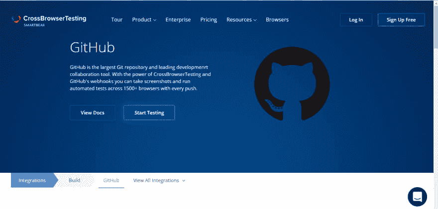
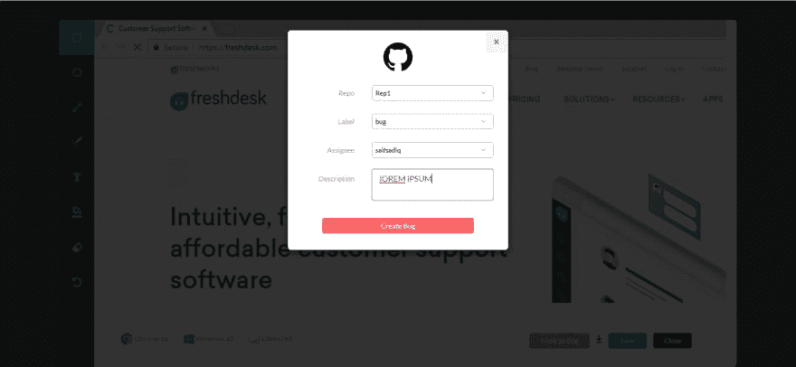
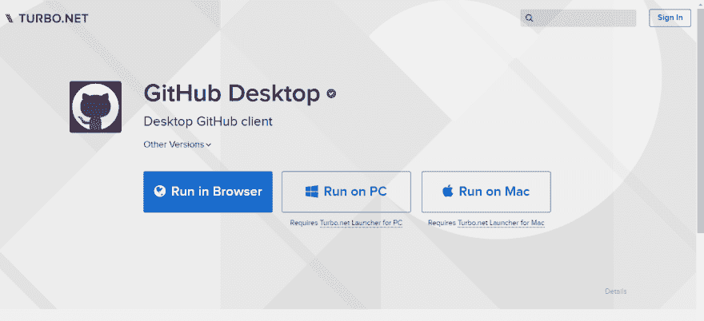
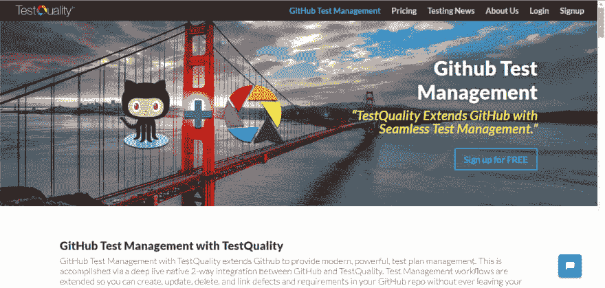
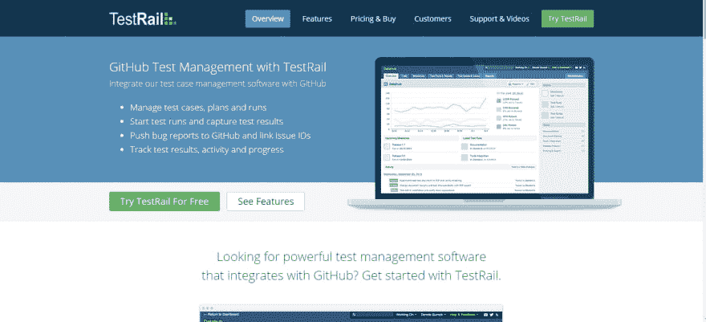
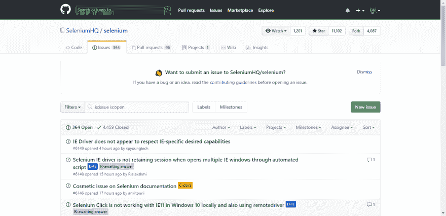
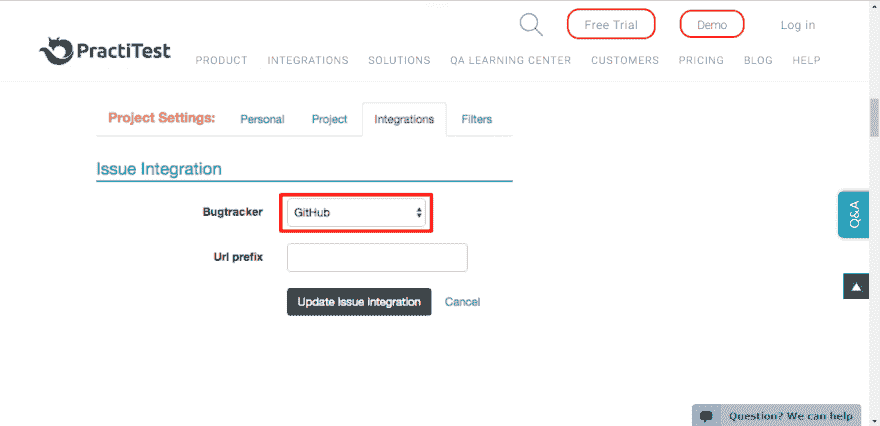

# 集成 GitHub 的顶级软件测试工具

> 原文：<https://dev.to/jaswantkaur/top-software-testing-tools-with-github-integration-2l2i>

2018 年将见证一个数字化进化的时代。软件行业开始缩短上市时间，主要关注质量保证和测试。这些组织的目标是跨渠道进行最佳功能测试。为了在软件测试中获得这种级别的优化，我们必须非常仔细和精确地管理软件中发现的问题和错误。GitHub 在 limelight 中出现了，这是一个非常强大的管理问题、错误和代码的工具。它是最大的 Git 存储库和领先的开发协作工具，去年将来自近 200 个国家的 2400 万人聚集在一起，以更好地编码、管理问题和构建更大的。

我仔细研究了许多在线软件测试工具，并提出了 5 个这样的工具来与 GitHub 集成。这些工具最适合利用 GitHub bug 管理特性。

## 跨浏览器测试

这是一个[工具](https://crossbrowsertesting.com/),可以在几十种浏览器和真实设备中测试你的网站，并立即得到结果。超过一千种浏览器、操作系统和插件的组合。借助跨浏览器测试和 GitHub 的 webhooks 的强大功能，您可以截取屏幕截图，并通过每次推送在 1500 多个浏览器上运行自动化测试。
T3T5】

## LambdaTest

基本上来说，LambdaTest 是一个跨浏览器测试平台，你可以在这个平台上测试 2000 多种浏览器、浏览器版本和操作系统的组合。

很多时候，测试人员在执行跨浏览器测试时可能面临的问题是记录 bug。

他们必须经历一个忙乱的过程，拍摄截图，附上截图，输入描述，工作环境等。这很繁琐，大家都讨厌那个漫长的过程。LambdaTest 的集成使它变得更容易。

如果您在 LambdaTest 平台上测试您的 web 应用程序时发现任何问题，您可以直接从 LambdaTest 平台在您的 GitHub 帐户中将其标记为问题。

您只需要选择存储库、标签，并分配问题以及您的评论。

LambdaTest 会自动在你的 Github 库中创建一个新的问题！新问题将包括从 LambdaTest 截取的屏幕截图的链接，以及测试环境等细节，如操作系统、浏览器及其版本、屏幕分辨率以及问题描述。
[T3】](https://goo.gl/7Fz8PX)

## Turbo.net

[Turbo.net](https://turbo.net/)是一种革命性的应用交付新方法，为世界上任何地方的每个用户提供对世界软件的快速访问。Turbo.net 应用程序可以在您的所有桌面、移动设备和云上即时运行。它提供了一个平台，可以即时在线运行数千个应用程序。

使用 GitHub Desktop，将您的 GitHub 工作流程扩展到浏览器之外。它提供了完全开源和可定制的跨平台体验。
[T3】](https://turbo.net/)

## 测试质量

带有 [TestQuality](http://www.testquality.com/) 的 Github 测试管理扩展了 GitHub，以提供现代的、强大的测试计划管理。这是通过 GitHub 和 TestQuality 之间的深度、实时、本地、双向集成来实现的。

测试管理工作流得到了扩展，因此您可以在 GitHub repo 中创建、更新、删除和链接缺陷和需求，而无需离开您的测试工作流，最棒的是，TestQuality 完全免费用于 GitHub public repo。
[T3】](http://www.testquality.com/)

## 测试轨道

这是一个全面的基于网络的测试用例管理软件，可以有效地管理、跟踪和组织你的软件测试工作。 [TestRail](http://www.gurock.com/testrail/) 帮助测试人员、开发人员和团队领导有效地管理、跟踪和协调软件测试工作，所有这些都来自一个集中且易于使用的 web 应用程序。

TestRail 以多种方式与 GitHub 集成:轻松地将 bug 报告推送到 GitHub，查找问题细节，跳转到 GitHub 的新问题表单，等等。此外，TestRail 针对 GitHub 的缺陷插件可以很容易地被扩展，如果需要的话，允许您根据您的 GitHub 定制来调整集成。
[T3】](http://www.gurock.com/testrail/)

## 硒

Selenium 是一个用于 web 应用程序的可移植软件测试框架。它为创作测试提供了回放工具，而无需学习测试脚本语言。
T3T5】

## 练习测试

[practice test](https://www.practitest.com/)是一款基于云的创新测试管理工具。使用 Practitest，您可以管理您的 QA 和测试流程，控制您的测试任务，同时全面了解您的结果，最重要的是，以专业的方式发布您的产品。

Practitest 正在为 GitHub 提供一个 bug 跟踪工具。当您遇到问题时，您可以在您的 GitHub 存储库中标记该问题。
[T3】](https://www.practitest.com/)

测试愉快！！

原文出处:[dzone.com](https://dzone.com/articles/top-software-testing-tools-with-github-integration)