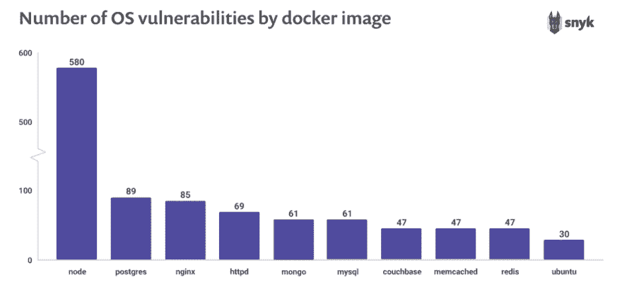

# 十大最受欢迎的 docker 图片每个都包含至少 30 个漏洞

> 原文：<https://dev.to/lirantal/top-ten-most-popular-docker-images-each-contain-at-least-30-vulnerabilities-5f1h>

## 偏好最小基础图像

通常情况下，您可能会用一个通用的 Docker 容器映像来启动项目，比如用一个`FROM node`来写一个`Dockerfile`，作为您的“默认”。

然而，在指定节点映像时，您应该考虑到完全安装的 Debian Stretch 发行版是用于构建它的底层映像。

如果您的项目不需要任何通用系统库或系统实用程序，那么最好避免使用成熟的操作系统(OS)作为基础映像。

在 Snyk 的[State of open source security report–2019](https://snyk.io/blog/top-ten-most-popular-docker-images-each-contain-at-least-30-vulnerabilities/)中，我们发现 Docker Hub 网站上许多流行的 Docker 容器都捆绑了包含许多已知漏洞的图像。

例如，当您使用一个通用的、普遍下载的节点映像(如`docker pull node`)时，您实际上是在您的应用程序中引入了一个已知在其系统库中有 580 个漏洞的操作系统。

从《2019 年开源安全报告》中可以看出，我们在 Docker Hub 上检查的十大 Docker 图片都包含已知漏洞。

通过选择只捆绑运行项目所需的必要系统工具和库的最少映像，您还可以最大限度地减少攻击者的攻击面，并确保您拥有安全的操作系统。

* * *

这个技巧是你应该采用的完整的 [10 个 Docker 图像安全最佳实践](https://snyk.io/blog/10-docker-image-security-best-practices/)的一部分。感谢你的阅读，也感谢和我一起工作的[奥马尔·列维·赫弗罗尼](https://twitter.com/omerlh)。

最初的博客帖子包括一个高分辨率的可打印 PDF，就像你在下面看到的片段。[看看吧](https://snyk.io/blog/10-docker-image-security-best-practices/)