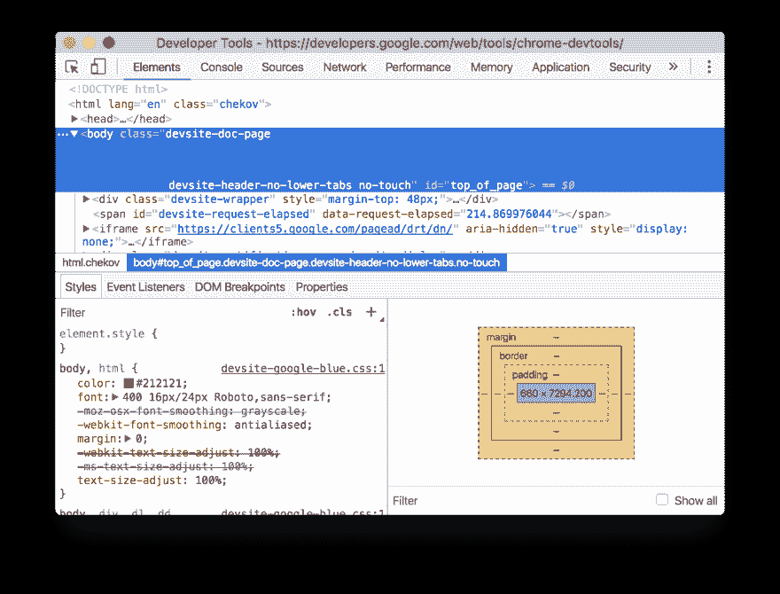
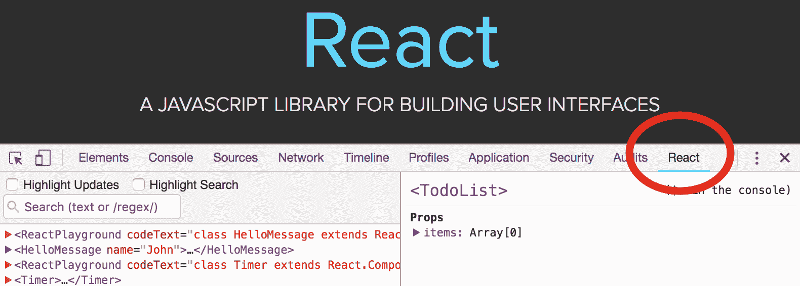
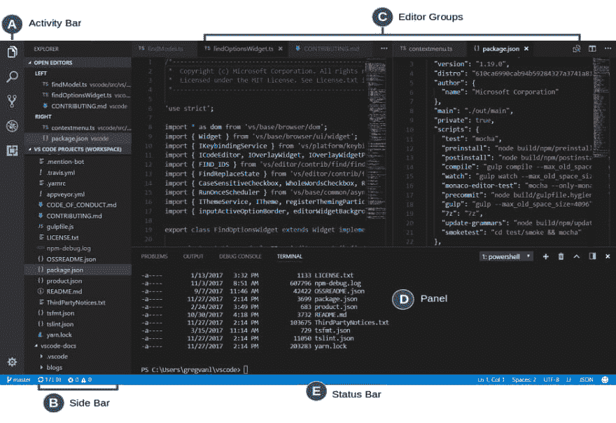
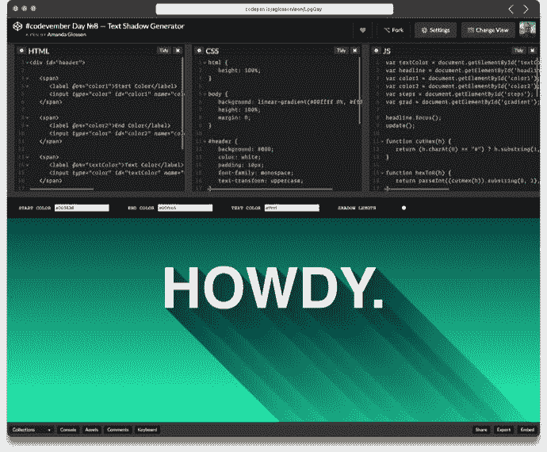
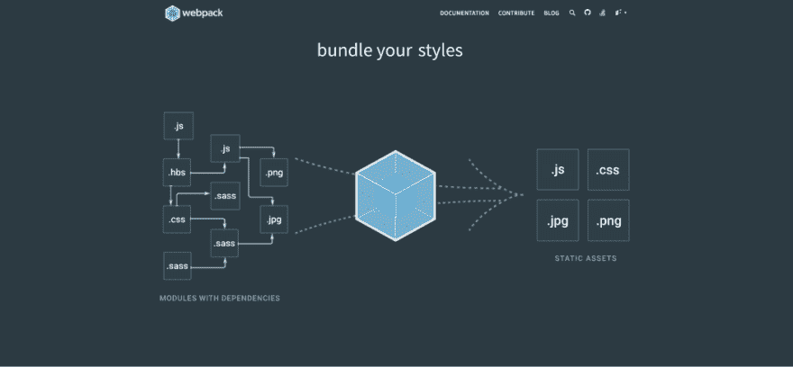
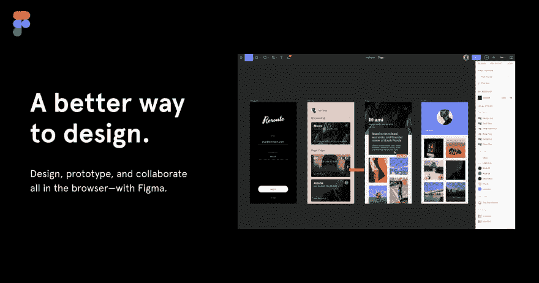
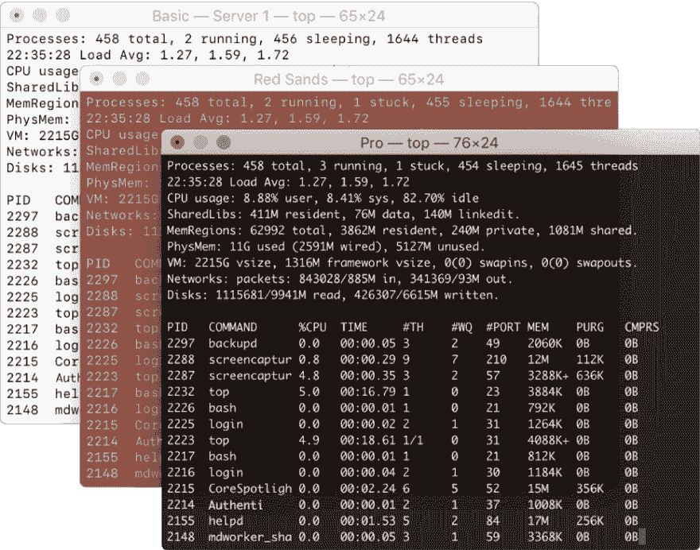

# 初级前端开发人员的顶级工具

> 原文：<https://dev.to/robmatyszewski/top-tools-for-junior-frontend-developer-49b1>

## 简介

当你作为一名前端开发人员开始你的旅程时，很难选择学习什么。有大量的资源、课程、教程或框架可供选择。开始研究以上所有内容，你可能会感到困惑。一个实用的方法是工匠之路，你通过工具来学习过程。我为初级前端开发人员创建了一个顶级工具列表，并解释了为什么应该使用它们。关注我获取更多教程！

# GitHub

GitHub 是一个基于 web 的托管服务，使用 Git 进行版本控制。它提供了 Git 的所有分布式版本控制和源代码管理(SCM)功能，并添加了它的其他特性。它为每个项目提供了访问控制和几个协作特性，比如 bug 跟踪、特性请求、任务管理和 wikis。Github 也是一个很棒的社区，在这里你可以找到并合作很多开源项目。

# 浏览器开发工具

这是 Chrome 浏览器内置的一套开发工具。使用 DevTools，你可以访问任何 web 应用程序的内部，查看它在不同屏幕尺寸上的表现，并更改任何页面。您可以实时编辑页面并快速诊断问题。它最终会帮助你建立更好更快的网站。额外的网络工具可以帮助你优化你的加载流程，而一个时间表可以让你知道浏览器正在做什么。

# React 开发者工具

React 是近年来 web 开发中流行的 javascript 框架。然而，Google Chrome 开发工具不能将 Dom 作为 React 组件进行检查。不要迷茫；Chrome 有一个名为 React Developer Tools 的扩展，可以让你深入了解数据是如何通过组件传递的。

# 像素完美

这个 chrome 扩展有助于开发每像素清晰度的网站！它是为 web 开发人员和标记设计人员准备的。PerfectPixel 允许开发人员将半透明的图像覆盖在开发的 HTML 之上，并在它们之间执行像素完美比较。

# 可视化代码编辑器

Visual Studio 代码是构建和调试现代 web 和云应用程序的头号代码编辑器。它是非常可定制的，有内置的 git，大量的集成列表，强大的自动完成和调试功能。这是一个强大的多语言 IDE，超级快速和简单。还有，免费开放源码。

# 码笔

Codepen 是一个基于网络和社区驱动的代码编辑器。你可以马上看到代码的结果。对于设计师和前端开发人员来说，这是一个神奇的地方，人们可以在这里分享和评论他们的前端技能。这是新想法和编码方法的伟大灵感来源。编辑器的作用是:建立新想法的原型，即时 bug 测试，给客户发东西看，评估潜在雇员，寻找灵感。

# 图形 SQL 和图形 SQL 编辑器

GraphQL 是一种用于 API 的查询语言。如今这非常流行，并得到了领先科技机构的认可。GraphQL 编辑器使得理解 GraphQL 模式更加容易。通过链接视觉块来计划它，我们的编辑器会将它们转换成代码！用 GraphQL 创建假的后端，你就可以启动你的应用程序了。

# Npm

是 JS 的一个包管理器。它有助于找到可重用代码包，并以新的方式编译它们。它在数据库中有超过 470，000 个免费代码包供您使用。这个 web dev 工具是一个命令行工具，用于与软件包中的存储库进行交互。它还具有带有您的私有名称空间的团队功能。

# Webpack

它是 javascript 和 friends 的捆绑器，将许多模块打包成几个捆绑的资产。代码分割允许按需加载部分应用程序。通过“加载器”，模块可以是 CommonJs，AMD，ES6 模块，CSS，Images，JSON，CoffeeScript，LESS，...还有你定制的东西。

# [图](#figma)

Figma 是一款设计应用，但非常时尚，适合与设计师合作。每个 Figma 文件都有代码模式，开发人员可以在其中检查设计文件。当设计人员与开发人员共享只读文件时，他将可以访问代码模式，在该模式下，他们可以检查、注释和导出文件，但没有对文件的完全编辑权限。

# Web.dev

每个 web 项目都需要适当的反馈和测试。有了这个工具，你可以根据现代标准检查你的网站表现如何。你可以衡量的东西:性能，PWA 状态，可访问性或搜索引擎优化。此外，你还可以练习技能:比如加载速度、网络弹性或数据安全性。检查你的网站在一段时间内的表现，并跟踪你的学习进度。

# 终端

终端是一种基于文本的界面，您可以在其中键入命令。shell 接受这些命令，并告诉操作系统执行它们。熟悉从终端使用 Git 这样的工具可以让您在 GUI 上获得更大的能力和灵活性。最后，GUI 是命令行工具前面的图形外壳。“更接近金属”，它还可以帮助你在 GUI 卡住或出错的情况下摆脱困境。这是开发人员武器库中一个必不可少的生产力工具。

# 其他

*   Caniuse.com——你担心一些前沿想法的浏览器兼容性吗？试试这个网站，看看你是否能使用它。
*   stack overflow——那个站点不需要解释；)
*   TinyPNG-PNG 图像的高级有损压缩
*   Compressor.io -另一个图像压缩工具
*   记录笔记、规格、产品所有者反馈和计划。
*   postman——使用 REST APIs 时。