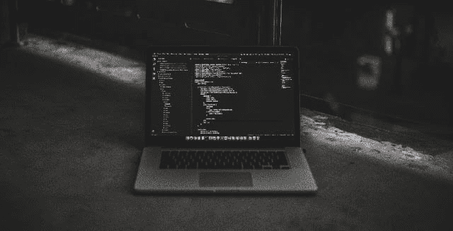

# 跟踪代码时间⏲️💻

> 原文：<https://dev.to/2kabhishek/tracking-code-time-28jh>

如果你是职业或业余爱好编码，或者刚刚开始学习编码，跟踪编码时间会对你非常有用，因为它能为你打开一些有价值的洞见。

我最近遇到了一个这样的工具，在这里对它的特性进行了概述。

Wakatime 是那些<u>工具</u>中的一种。的帮助下，您可以轻松地记录您的所有编码活动，如:

▪️which 编辑你正在使用的

▪️which 项目你正在进行的

▪️which 语言你正在使用

所有这些数据都非常优雅地呈现在 wakatime [仪表盘](http://wakatime.com/dashboard)上。

wakatime 的另一个伟大的特点是目标，你可以为自己设定目标，wakatime 会跟踪这些目标，并通过邮件发送提醒。如果你正试图学习某种框架或库或语言，或者你正试图学习像 vim 这样的新编辑器，这可以帮助你。

Wakatime 还具有其他功能，如可共享的嵌入内容、排行榜、集成等。这种方式使编程游戏化，变得更有趣。

Wakatime 并不是唯一的工具，但是我发现 wakatime 并不复杂，安装起来也很容易。Wakatime 可用于今天使用的大多数编辑器，你只需要安装扩展或插件，并在询问时输入 API 键。