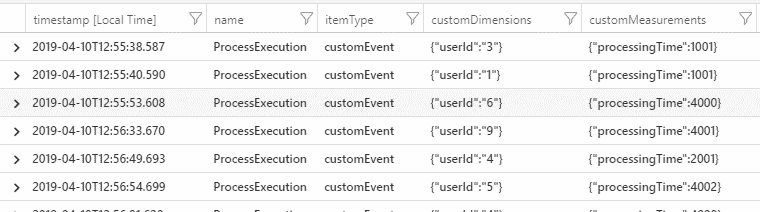
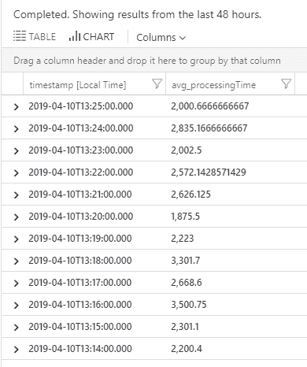
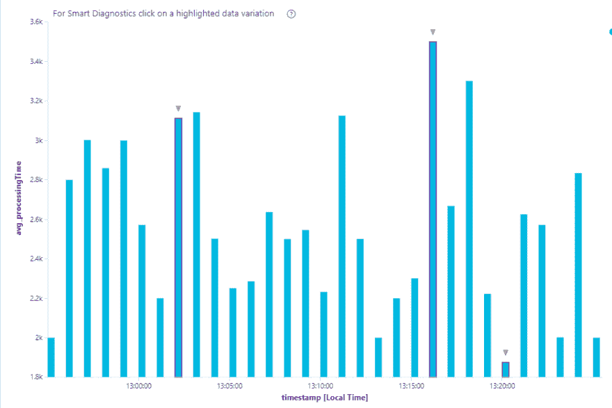

# 利用应用洞察跟踪我的定制处理指标

> 原文：<https://dev.to/timothymcgrath/tracking-my-custom-processing-metrics-with-application-insights-285n>

我有很多为用户运行处理作业的后端应用程序。这些作业全天运行，并且在大多数情况下非常快(不到几秒钟)，但有时一切都陷入困境，所有作业都停止了。用户在他们的客户端应用程序上留下了一个加载微调器，因为他们想知道发生了什么。

我想要的是一个易于使用的仪表板，向我显示有多少这些作业正在运行，哪个用户正在运行它们，以及它们需要多长时间。然后，我可以查看控制面板，看看是否有作业总数、作业执行时间或单个用户作业的峰值。

我有一些自定义数据，如 userId，accountId(帐户正在处理)。我需要这些字段，以便对数据进行筛选和分组。

我可以通过在每次执行结束时向数据库写入一条记录来做到这一点，但是我必须将它连接到 PowerBI 并编写我自己的报告查询。每当我添加一个新的过程来报告时，我也需要做所有这些工作。我想要简单的东西！

或许是 App Insights？

我过去使用过 App Insights。我插入了一组服务来服务 HTTP 调用，作为请求/依赖跟踪，但是它创建了一个数据消防软管，很难从中提取任何有用的信息。

这一次，我将插入我想要的确切数据，并尝试构建一个指示板来显示我想要的数据，而不是使用消防水龙带。

# 原型

我的原型解决方案将模拟一个为不同用户运行不同时间长度的流程。我将把这些数据推送到 App Insights，并生成报告和一个仪表板，我可以浏览一下，看看系统的运行情况。

我用。NET 框架(4.7.2)。我唯一需要的 Nuget 包是 Microsoft.ApplicationInsights。

这是没有指标代码的应用程序。简单，只是为 1 到 10 个用户处理需要 1 到 5 秒的作业。

```
internal class Program
{
    private static readonly Random _random = new Random();

    public static async Task Main(string[] args)
    {
        while (true)
        {
            var userId = _random.Next(1, 10);

            await Process(userId);
            await Task.Delay(1000);
        }
    }

    private static async Task Process(int userId)
    {
        var processingTime = _random.Next(1, 5);
        await Task.Delay(processingTime * 1000);
    }
} 
```

要登录 App Insights，我需要一个远程计量客户端的参考。TelemetryClient 处理与 App Insights 的通信，我可以创建该类的单个实例来共享整个操作。

```
private static readonly TelemetryClient _telemetryClient = new TelemetryClient(); 
```

我还需要在遥测客户端上设置仪器键。InstrumentationKey 来自您的 Azure App Insights 门户。没有这个密钥，它就不知道在哪里存储您的数据。你可以在 Azure 中从你的应用 Insights 的首页复制。

```
 _telemetryClient.InstrumentationKey = "-- ENTER YOUR KEY HERE --"; 
```

我需要自己用秒表来记录手术的时间。还有其他方法让 App Insights 为我跟踪长度，但我现在想简单地做这件事。

```
 var stopWatch = new Stopwatch();
    stopWatch.Start();

    var processingTime = _random.Next(1, 5);
    await Task.Delay(processingTime * 1000);

    stopWatch.Stop(); 
```

现在，我将使用 TelemetryClient 的 TrackEvent 方法将自定义事件存储到 AppInsights。TrackEvent 接受一个 EventName 字符串，我将使用它在 App Insights 中标识这个操作。我称之为“流程执行”。

您还可以将另外两组数据添加到事件中。属性和指标。

属性是您可能想要筛选和分组的对象。因此，在我的例子中，UserId 是一个属性。属性总是字符串。

指标是您想要报告的东西。在这种情况下，ProcessingTime 是度量标准。指标总是数字。

```
 var properties = new Dictionary<string, string> { { "userId", userId.ToString() } };
    var metrics = new Dictionary<string, double> { { "processingTime", stopWatch.ElapsedMilliseconds } };

    _telemetryClient.TrackEvent("ProcessExecution", properties, metrics); 
```

就是这样！这将为我提供所有我需要的信息，来报告这个处理过程需要多长时间。

我将运行应用程序并让它运行几分钟，然后登录 Azure 来查找我的数据。

# 蔚蓝报道

在 Azure 中，我进入 Application Insights，从顶部菜单中选择 Analytics。这将我带到一个看起来像 SQL-y 但不是 SQL 的查询工具。我的第一反应是啊…我不想学习新的查询语言。

但这其实很简单。我通读了 Kusto 语言的入门文档，它教会了我这方面需要知道的一切:
[https://docs . Microsoft . com/en-us/azure/azure-monitor/log-query/Get-Started-queries](https://docs.microsoft.com/en-us/azure/azure-monitor/log-query/get-started-queries)。花点时间通读一下，从长远来看，这会节省你很多时间。

我们感兴趣的表是 customEvents，我们需要名为 ProcessExecution 的记录。

```
customEvents
    | where name == "ProcessExecution" 
```

这是我们的数据！(不敢相信第一次试就成功了……)

[](https://res.cloudinary.com/practicaldev/image/fetch/s--r77RDKQi--/c_limit%2Cf_auto%2Cfl_progressive%2Cq_auto%2Cw_880/https://scribblesofcode.com/wp-content/uploads/2019/04/image.png)

现在，我想看的是一天中每分钟的平均处理时间。轻松使用我的新技能！

```
customEvents
    | where name == "ProcessExecution"
    | extend processingTime = toint(customMeasurements.processingTime)
    | summarize avg(processingTime) by bin(timestamp, 1m) 
    | order by timestamp desc 
```

这会将自定义事件过滤到我们的 ProcessExecution 事件中。Extend 从我们添加的指标数据中获取处理时间(注意它是一个字符串，所以我们需要将其转换为一个整数)。Summarize 让我们通过使用 bin(时间戳，1m)来平均 1 分钟间隔的处理时间。这给了我一份很棒的报告。

[](https://res.cloudinary.com/practicaldev/image/fetch/s--SAWJbldI--/c_limit%2Cf_auto%2Cfl_progressive%2Cq_auto%2Cw_880/https://scribblesofcode.com/wp-content/uploads/2019/04/image-2.png)

现在，我甚至可以通过点击结果上方的图表按钮将其显示为图表。

[](https://res.cloudinary.com/practicaldev/image/fetch/s--aozX5eMx--/c_limit%2Cf_auto%2Cfl_progressive%2Cq_auto%2Cw_880/https://scribblesofcode.com/wp-content/uploads/2019/04/image-3.png)

我甚至可以通过使用屏幕右上方的大头针按钮将该图表快速添加到仪表板中。

这很容易，比我想象的要容易得多。我用了大约一个小时完成了这项工作，然后用了大约两个多小时让我的实际应用程序使用它。我现在有了一个运行中的仪表板，它显示了平均执行时间、每个用户的执行次数以及一段时间内的执行失败率。

我将让它在生产中运行一段时间，看看它消耗了多少数据，因为使用 App Insights，您需要为使用的数据付费。还有添加警报的能力，所以我可以在达到阈值时收到警报。因此，如果 ExecutionTime 超过 30 秒，我可以提醒我的开发团队。我将来可能会玩这个，但是当你添加警报时，成本会增加。

我很兴奋这如此简单。用一个数据库从头开始写这个也会很快，但是我不能得到快速的报告数据，我必须自己管理这些数据的所有存储。如果接下来几周进展顺利，我会把它添加到我更多的服务中。