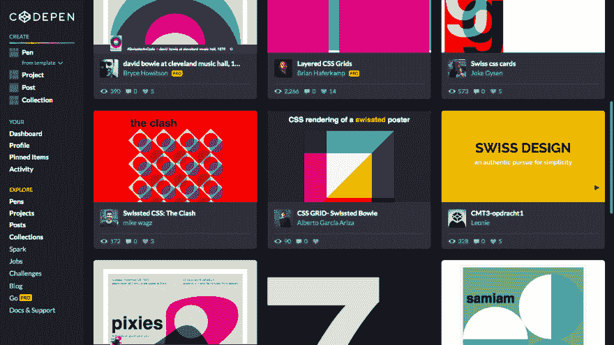

# 向瑞士致敬—简介

> 原文：<https://dev.to/ekafyi/tribute-to-swissted-introduction-2c6i>

我正在阅读惠晶关于构建一个逐渐增强的 Node.js 网络应用的帖子。我以前从未与 Node.js 合作过，但我很好奇并“重新混合”了她的[故障演示](https://glitch.com/~no-js-no-problem)。果然，我最终构建了完全不同的东西！🙈

 [## 渐进增强练习

### 陈晖京 3 月 5 日 198 分钟阅读

#javascript #node](/huijing/an-exercise-in-progressive-enhancement-lk1)

#### 我造了什么？

我构建了一个简单的 web 应用程序，显示来自 swissted.com T2 的海报和他们相应的代码“娱乐”。

Swissted 是艺术家 Mike Joyce 的一个视觉设计项目，他为标志性的音乐会设计了带有国际印刷风格[的海报。海报独特的风格适合开发者和设计师用 HTML 和 CSS 重新制作海报。在](https://www.csun.edu/~pjd77408/DrD/Art461/LecturesAll/Lectures/lecture08/InternationalTypeStyle.html)[的代码栏中搜索“Swiss ted”](https://codepen.io/search/pens?q=swissted&page=1)会得到几十个结果。这些仅仅是我在这个世界上最喜欢的东西:另类音乐，瑞士设计和排版，HTML 和 CSS！😻

#### 我为什么要建？

当我在浏览哪些海报被重新创作时，我不得不在 Swissted 和 Codepen 网站之间来回切换，费力地浏览这两个网站的页面。我制作了**“致敬 Swiss ted”**来解决这个问题，也就是让*从一个界面*看到所有海报设计和相应 Codepen 娱乐的链接。

#### 我是怎么建的？

我使用这些库在 [Glitch](https://glitch.com) 上构建了一个节点 web 应用程序:

*   [Koa](https://koajs.com/)
*   Koa middleware: [koa-static](https://github.com/koajs/static) , [koa-router](https://github.com/ZijianHe/koa-router) , [koa-views](https://github.com/queckezz/koa-views)
*   [双节棍](https://mozilla.github.io/nunjucks/)
*   [再见](https://cheerio.js.org/)

* * *

在这个系列中，我将记录我是如何构建这个 web 应用程序的。请关注接下来的帖子！

*   [第一部分:用 Koa 和 Nunjucks 建立 Node.js Web 应用程序](https://dev.to/ekafyi/tribute-to-swissted-part-i-setting-up-a-node-js-web-app-with-koa-and-nunjucks-ph4)
*   第二部分:用 Cheerio“抓取”和解析数据
*   第三部分:样式、标记、可访问性和性能