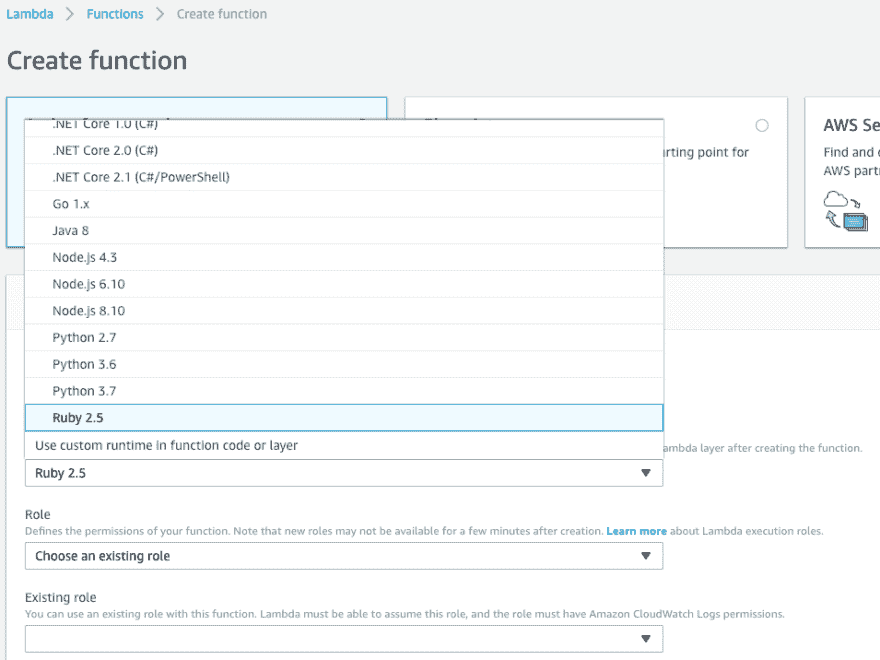
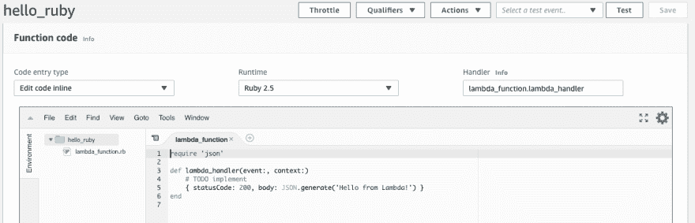
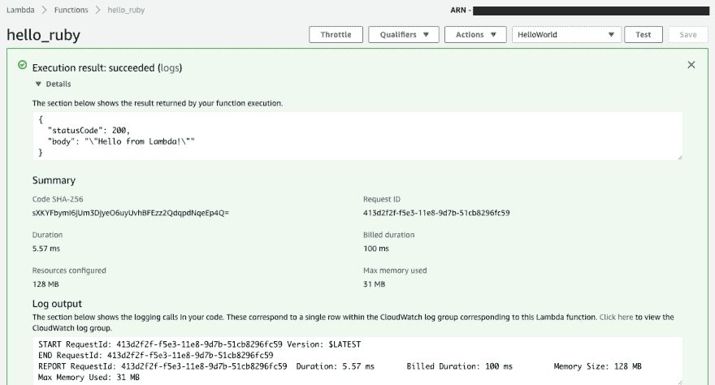
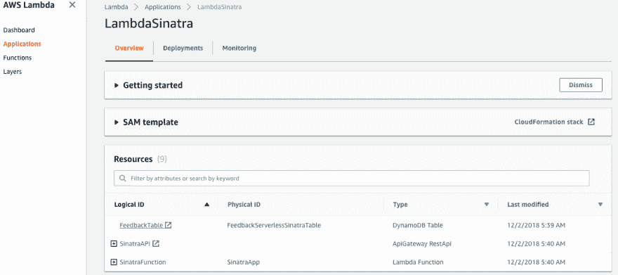
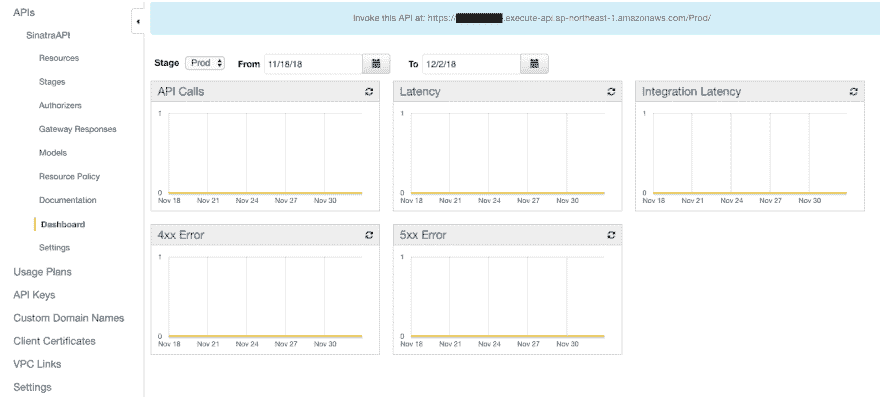
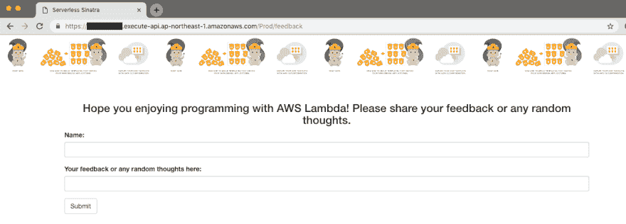

# 尝试使用带有 AWS Lambda 的 Ruby 和 Sinatra 应用程序

> 原文：<https://dev.to/windupbird/try-to-use-ruby-and-sinatra-app-with-aws-lambda--44f7>

注:
这是我自己翻译的文章，来自 [Qiita 博客](https://qiita.com/wind-up-bird/items/08b911a64baea962b1b8)

# 简介

2018 年 [AWS re:invent](https://reinvent.awsevents.com/) 有很多公告。
特别是与 AWS Lambda 有关的、

我们使用 Lambda 作为 ALB 的后端；
[λ作为应用负载平衡器|网络的目标&内容交付](https://aws.amazon.com/blogs/networking-and-content-delivery/lambda-functions-as-targets-for-application-load-balancers/)

我们不必再打包每个函数，因为 Lambda 层已经启动；
[AWS Lambda 的新功能——使用任何编程语言并共享通用组件| AWS 新闻博客](https://aws.amazon.com/jp/blogs/aws/new-for-aws-lambda-use-any-programming-language-and-share-common-components/)

今天，我将在本文中介绍带有 AWS Lambda 的 Ruby。
[宣布 Ruby 支持 AWS Lambda | AWS Compute 博客](https://aws.amazon.com/blogs/compute/announcing-ruby-support-for-aws-lambda/)

# 你好世界

首先我会做博客里的[教程](https://aws.amazon.com/blogs/compute/announcing-ruby-support-for-aws-lambda/)。
我做一个新的函数如下；
[T6】](https://res.cloudinary.com/practicaldev/image/fetch/s--DPsxAKvU--/c_limit%2Cf_auto%2Cfl_progressive%2Cq_auto%2Cw_880/https://qiita-image-store.s3.amazonaws.com/0/118641/fccff7b3-9b64-ae72-667f-826f0d2fdbde.png)

我可以选择 ruby 的运行时间。但是你现在可以选择`Ruby 2.5`。
然后，样例代码照常显示在λ中:
[](https://res.cloudinary.com/practicaldev/image/fetch/s--K3yBkSgS--/c_limit%2Cf_auto%2Cfl_progressive%2Cq_auto%2Cw_880/https://qiita-image-store.s3.amazonaws.com/0/118641/15670f8a-93bd-c476-353b-c955a8702de1.png)

所以，我会执行这个函数。
当你点击`Test`按钮时，你会找到新的窗口，你应该输入`Event Name`。然后，你必须点击`Create`按钮来创建测试。

我将执行我之前创建的测试事件。
[](https://res.cloudinary.com/practicaldev/image/fetch/s--eIl2qtFT--/c_limit%2Cf_auto%2Cfl_progressive%2Cq_auto%2Cw_880/https://qiita-image-store.s3.amazonaws.com/0/118641/23a9e620-7d44-16a4-43d7-05aa89bc1dd3.png)T4】

```
{  "statusCode":  200,  "body":  "\"Hello from Lambda!\""  } 
```

Enter fullscreen mode Exit fullscreen mode

我能看见它，它看起来很好。

# 部署 Web 应用程序

**注:**我用的是 AP-东北-1(东京)地区。

接下来，我尝试用博客中写的 Sinatra 部署 Web 应用程序。
[GitHub -在 AWS Lambda 上运行 Ruby Sinatra 的演示代码](https://github.com/aws-samples/serverless-sinatra-sample)

我们不仅会使用 AWS lambda，还会使用 [API 网关](https://aws.amazon.com/api-gateway/)和 [DynamoDB](https://aws.amazon.com/dynamodb/) 。

### 先决条件

我将使用 [AWS SAM](https://aws.amazon.com/serverless/sam/) 并用 pip 命令预先安装它，如下:

```
> pip install aws-sam-cli 
```

Enter fullscreen mode Exit fullscreen mode

此外，我必须 S3 桶，以便上传应用程序后。

```
> aws s3 mb s3://sample-sinatra-application 
```

Enter fullscreen mode Exit fullscreen mode

在这种情况下，我将 bucket 名称设置为`sample-sinatra-application`。

### 从 Github 克隆示例应用程序

克隆[样本代码](https://github.com/aws-samples/serverless-sinatra-sample)。

```
> git clone https://github.com/aws-samples/serverless-sinatra-sample 
```

Enter fullscreen mode Exit fullscreen mode

我将用下面的`bundler`安装包。

```
> cd serverless-sinatra-sample
> bundle install --deployment 
```

Enter fullscreen mode Exit fullscreen mode

### 包装

然后，我将应用程序上传到我用这个命令制作的 S3 木桶中；

```
> sam package --template-file template.yaml \
 --output-template-file packaged-template.yaml \
 --s3-bucket sample-sinatra-application 
```

Enter fullscreen mode Exit fullscreen mode

你会发现结果如下；

```
Uploading to XXXXXXXXXXXXXXXXXXXX  64727 / 64727.0  (100.00%)
Successfully packaged artifacts and wrote output template to file packaged-template.yaml.
Execute the following command to deploy the packaged template
aws cloudformation deploy --template-file /path/to/serverless-sinatra-sample/packaged-template.yaml --stack-name <YOUR STACK NAME> 
```

Enter fullscreen mode Exit fullscreen mode

### 部署

我用 sam 命令部署应用程序；

```
> sam deploy --template-file packaged-template.yaml \
 --stack-name LambdaSinatra \
 --capabilities CAPABILITY_IAM 
```

Enter fullscreen mode Exit fullscreen mode

你会发现结果如下；

```
Waiting for changeset to be created..
Waiting for stack create/update to complete
Successfully created/updated stack - LambdaSinatra 
```

Enter fullscreen mode Exit fullscreen mode

我将能够在 AWS 控制台中确认结果；
[T3】](https://res.cloudinary.com/practicaldev/image/fetch/s--EYsIyVmv--/c_limit%2Cf_auto%2Cfl_progressive%2Cq_auto%2Cw_880/https://qiita-image-store.s3.amazonaws.com/0/118641/94413ef2-30e6-3323-3a5c-b59cace3502f.png)

### 确认 app

您必须点击`SinatraAPI`，在概览中找到`Resources`。
点击如下网址即可；
[T6】](https://res.cloudinary.com/practicaldev/image/fetch/s--eA63Uq7T--/c_limit%2Cf_auto%2Cfl_progressive%2Cq_auto%2Cw_880/https://qiita-image-store.s3.amazonaws.com/0/118641/948b4e95-31ba-f8b5-264c-b12a433e7f30.png)

*   **例 1:****Top _ Page**
    T5】https://xxxxx . execute-API . AP-northeast-1 . amazonaws . com/Prod/
    [](https://res.cloudinary.com/practicaldev/image/fetch/s--NyoB5P5Z--/c_limit%2Cf_auto%2Cfl_progressive%2Cq_auto%2Cw_880/https://qiita-image-store.s3.amazonaws.com/0/118641/033be1a2-5b62-98de-00be-06591cf7029e.png)

*   **例 2:****API**
    T5】https://xxxxx . execute-API . AP-northeast-1 . Amazon AWS . com/Prod/hello-world

```
{"Output":"Hello World!"} 
```

Enter fullscreen mode Exit fullscreen mode

*   *例 3:* * **反馈 _ 页面**[https://xxxxx . execute-API . AP-northeast-1 . Amazon AWS . com/Prod/Feedback](https://XXXXX.execute-api.ap-northeast-1.amazonaws.com/Prod/feedback)

# 结论

这是我第一次用英语写文章。但是我注意到我不需要这样做，因为教程是用英语写的...

既然写了，就发表这篇文章。