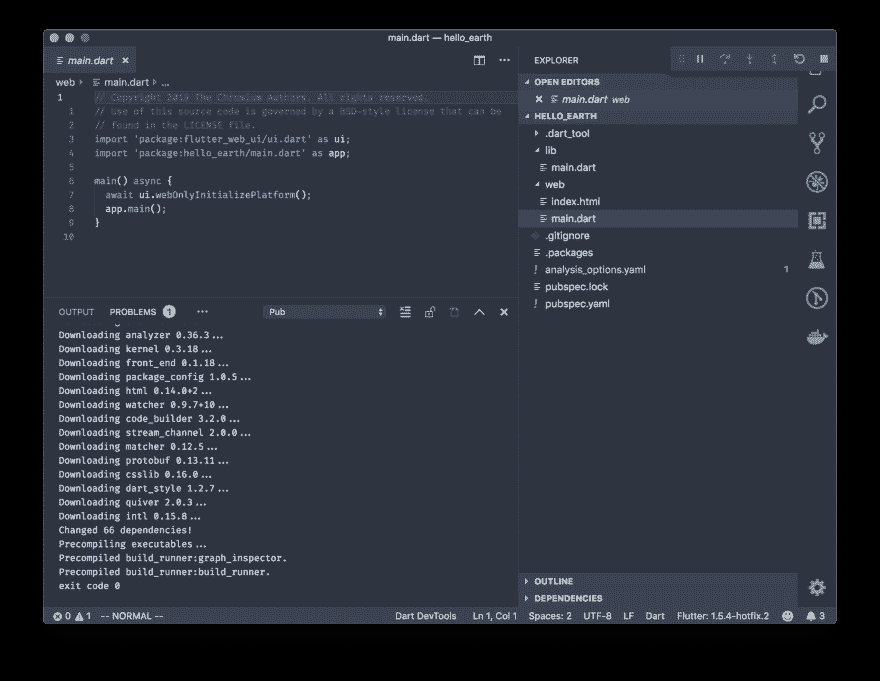
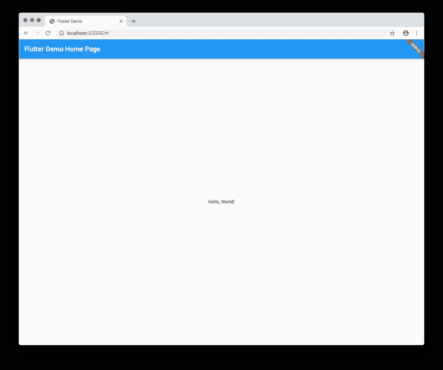

# 尝试颤动网

> 原文：<https://dev.to/muhajirdev/trying-flutter-web-2ek7>

谷歌刚刚为网络发布了 flutter。这太棒了。借助 flutter，您将能够使用单一代码库开发 iOS 应用、Android 应用、桌面应用、Web 应用和嵌入式应用🌟

[](https://res.cloudinary.com/practicaldev/image/fetch/s---DmAjeGE--/c_limit%2Cf_auto%2Cfl_progressive%2Cq_auto%2Cw_880/https://techcrunch.com/wp-content/uploads/2019/05/Screen-Shot-2019-05-01-at-9.19.45-AM.png)

我们会试试看

# 入门

### 安装颤振/升级颤振

遵循 [Flutter 官方文档](https://flutter.dev/docs/get-started/install)上的安装路径

或者如果曾经安装过，只需升级即可

```
flutter upgrade 
```

Enter fullscreen mode Exit fullscreen mode

参考:

*   [安装颤振](https://flutter.dev/docs/get-started/install)

### 创建新项目

你可以克隆`flutter/flutter_web`。像这样

```
# Clone
git clone https://github.com/flutter/flutter_web

# cd into example dir
cd flutter_web/examples/hello_world

# Activate web build tool
flutter packages pub global activate webdev 
```

Enter fullscreen mode Exit fullscreen mode

或者直接用 Visual Studio 代码。安装`Dart Code` & `Flutter`插件。

然后`cmd + shift + p`(MAC 上)或者`ctrl + shift + p`(windows/Linux 上)。
和`>Flutter: New Web Project`类型

[](https://res.cloudinary.com/practicaldev/image/fetch/s--V4pTy5bX--/c_limit%2Cf_auto%2Cfl_progressive%2Cq_auto%2Cw_880/https://muhajir.dev/static/b15997983197d085c3a6bca5bfefee8d/a808b/vscode-opening-flutter.png) 
事成之后。转到`main.dart`并按下笔记本电脑上的`F5`(调试快捷键)。或者按下 Macbook Pro Touchbar 上的▶️

就是这样。看看这个美人💙

[](https://res.cloudinary.com/practicaldev/image/fetch/s--CA01ByqQ--/c_limit%2Cf_auto%2Cfl_progressive%2Cq_auto%2Cw_880/https://muhajir.dev/static/a9fcc6fa94760db653b49a711f9ff9c8/a808b/flutter-web-demo.png)

我会发布更多关于 flutter web 的更新。我会通过我的推特 [@muhajirdev](https://twitter.com/muhajirdev) 让你们知道

*原载于[https://muhajir.dev/writing/trying-flutter-web/](https://muhajir.dev/writing/trying-flutter-web/)T3】*