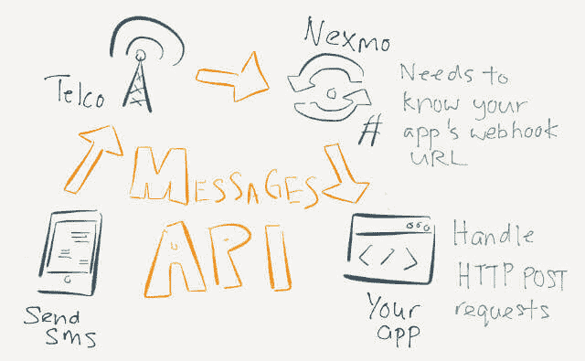
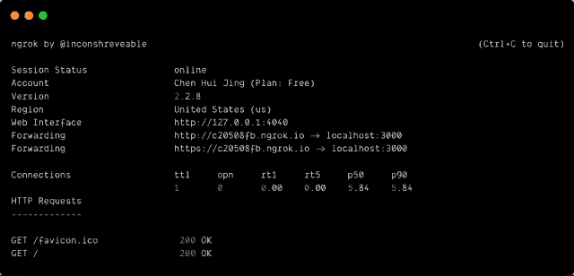
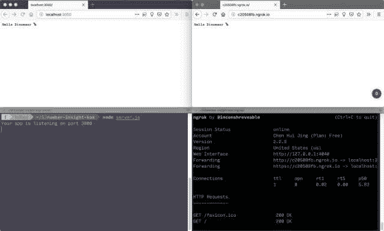
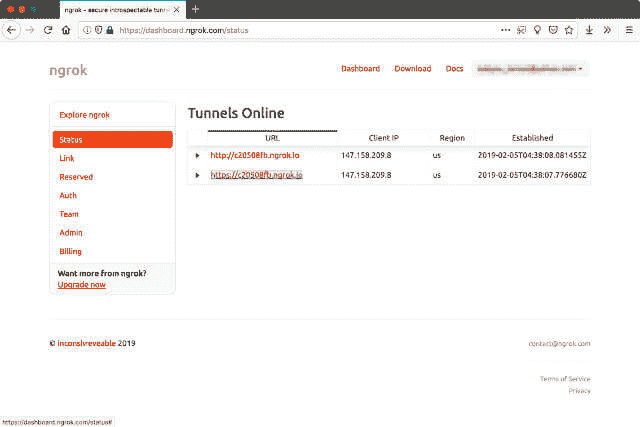
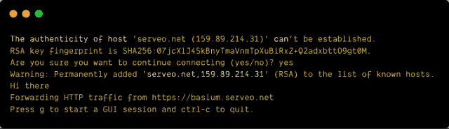
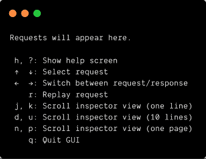
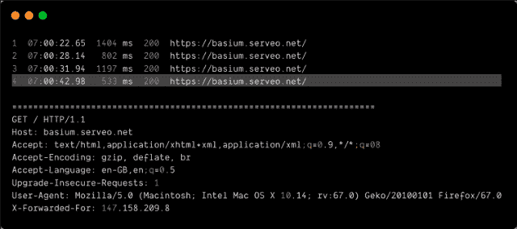
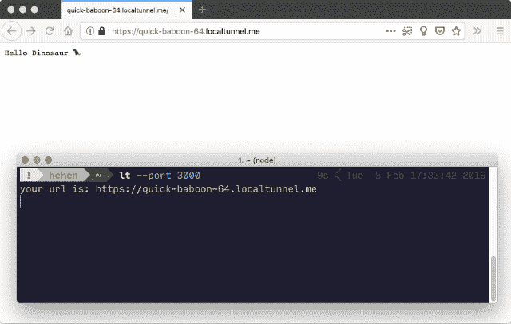
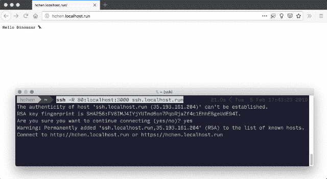
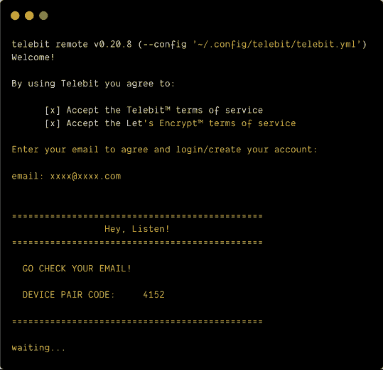

# 向 web 公开本地主机的隧道服务

> 原文：<https://dev.to/huijing/tunnelling-services-for-exposing-localhost-to-the-web-2in6>

我过去将在本地机器上运行的项目暴露给公共 URL 的经历主要是在我排除故障和需要帮助时调用“给朋友打电话”选项。你可能不知道，我以前靠建网站为生。我现在仍然做那件事，只是不再是白天的工作了。

另一个用例是在 Opera Mini 上进行测试。 [Browsersync](https://www.browsersync.io/) 是我 web 开发过程中的一个关键部分，尤其是在做跨浏览器测试的时候。不幸的是，它不能在 Opera Mini 上运行，所以使用公共 URL 服务是一个可行的解决方法。

使用像 [Nexmo](https://www.nexmo.com/) 这样的 API 平台进行开发通常意味着与 [webhooks](https://web.archive.org/web/20180630220036/http://progrium.com:80/blog/2007/05/03/web-hooks-to-revolutionize-the-web/) 打交道。Webhooks 被许多应用程序使用，如 [Github](https://developer.github.com/webhooks/) 、 [Dropbox](https://www.dropbox.com/developers/reference/webhooks) 、 [Heroku](https://devcenter.heroku.com/articles/app-webhooks) 等等，它方便开发者将自己的应用程序与这些服务集成。简而言之，它们允许一个应用程序在发生事情时通知另一个应用程序。引用杰夫·林赛的话:

> Web 钩子本质上是用户定义的用 HTTP POST 进行的回调。为了支持 web 挂钩，您允许用户指定一个 URL，您的应用程序将在这个 URL 上发布什么事件。

这意味着您正在构建的应用程序应该设置一个路由来处理对 webhook URL 的传入 POST 请求。下面是我的粗略尝试，来说明 [Nexmo 的 Messages API](https://developer.nexmo.com/messages/overview) 如何处理你的应用程序的入站 SMS:

<figcaption>短信如何通过 Nexmo 到达您的应用</figcaption>

[](https://res.cloudinary.com/practicaldev/image/fetch/s--ECZNfNg---/c_limit%2Cf_auto%2Cfl_progressive%2Cq_auto%2Cw_880/https://www.chenhuijing.com/asseimg/posts/public-url/webhook-640.jpg)

为了让 Nexmo(或您试图集成的任何服务)向您的应用程序发出成功的 HTTP 请求，它必须可以通过 web 公开访问。大多数时候，我们通过连接到附近的路由器，通过私有 IP 网络访问互联网。

出于安全考虑，路由器通常不允许来自网络外设备的通信，除非进行额外配置。您可能还需要从您的互联网服务提供商那里获得一个静态 IP 地址。

如果你手头正好有一些公共可访问的服务器，可能是你桌子下面的 [AWS 实例](https://aws.amazon.com/)、[数字海洋水滴](https://www.digitalocean.com/)盒子，你也可以使用 [OpenSSH](https://www.openssh.com/) 尝试端口转发。迈克尔·布兰卡写了一篇[全面的博文](https://medium.com/botfuel/how-to-expose-a-local-development-server-to-the-internet-c31532d741cc)介绍如何建立这种关系。

但是，如果配置服务器真的不是你的事情，可能是时候考虑一些隧道服务了。

## 隧道工程服务

根据维基百科的说法，隧道协议是一种允许数据从一个网络移动到另一个网络的通信协议。它允许私有网络通信通过称为封装的过程在公共网络(如 Internet)上发送。

对于隧道服务如何工作的详细解释，我建议这个由 [AJ ONeal](https://coolaj86.com/) 的[栈溢出答案](https://stackoverflow.com/a/52614266)。通过反向代理向外界公开您的本地 web 服务器确实有安全隐患，所以如果您在公司网络上这样做，最好事先通知您的网络/IT 管理员。

您可以随时采取预防措施，如实施 HTTPS，或使用密码保护，因此这可能会成为您选择服务的因素，尽管正如您将看到的，反向代理不是唯一可用的实现。

## 自由选项

### ngrok

ngrok 可能是解决这个问题的最佳方案。要么，或者他们的搜索引擎优化是对的。如果你用谷歌搜索“公共本地主机”，它会出现在最前面。从技术上讲，它不是免费的，更像是免费增值，但免费层的成本为零，足以满足大多数开发目的。

我们也来回答一下创始人本人提出的“ngrok”如何发音的问题:

> 艾伦·施里夫@不可改变的[@ Noamshemesh](https://twitter.com/Noamshemesh)我念出来 en-grok2014 年 3 月 22:48[](https://twitter.com/intent/tweet?in_reply_to=443881256107769856)[](https://twitter.com/intent/retweet?tweet_id=443881256107769856)[](https://twitter.com/intent/like?tweet_id=443881256107769856)

你将被要求注册一个帐户，以获得一个 authtoken 来访问一系列漂亮的功能。ngrok 有一个非常好的[入门文档](https://dashboard.ngrok.com/get-started)，它涵盖了你可能想要完成的大多数常见问题和任务。有 Windows、Mac 和几种 Linux 风格的安装程序。

对于像 Mac/Linux 这样基于 Unix 的系统，您可以将二进制文件移动到您的`$PATH`上的一个位置，这样您就可以在任何地方使用`ngrok`命令，或者为二进制文件添加一个[别名](https://shapeshed.com/unix-alias/)以便于访问。

Windows 也有一个系统路径，尽管向其中添加东西要复杂一些。谢天谢地，网上有这个的全面说明。为了找到更多关于`$PATH`的信息，这篇[的文章](https://alistapart.com/article/the-path-to-enlightenment)会有所帮助。

authtoken 是为您的帐户自动生成的，所以只需复制第 3 步中的命令，根据如何通过命令行访问`ngrok`来修改它，您就可以开始了。确保您的本地 web 服务器正在运行，并记下您正在使用的端口。

例如，如果您的应用程序运行在端口 3000 上，那么使用以下命令来启动 HTTP 隧道:

```
ngrok http 3000 
```

Enter fullscreen mode Exit fullscreen mode

[](https://res.cloudinary.com/practicaldev/image/fetch/s--40hGQeKC--/c_limit%2Cf_auto%2Cfl_progressive%2Cq_auto%2Cw_880/https://www.chenhuijing.com/asseimg/posts/public-url/ngrok2-640.png)

<figcaption>如果一切顺利，您的本地 web 服务器将可以公开访问</figcaption>

[](https://res.cloudinary.com/practicaldev/image/fetch/s--jNnUbFyp--/c_limit%2Cf_auto%2Cfl_progressive%2Cq_auto%2Cw_880/https://www.chenhuijing.com/asseimg/posts/public-url/ngrok-640.jpg)

如果你登录你的 ngrok 账户，你可以看到你目前在线的 HTTP 隧道列表。

<figcaption>为您跟踪您的 HTTP 隧道</figcaption>

[](https://res.cloudinary.com/practicaldev/image/fetch/s--JAOFGNhg--/c_limit%2Cf_auto%2Cfl_progressive%2Cq_auto%2Cw_880/https://www.chenhuijing.com/asseimg/posts/public-url/ngrok-dash-640.jpg)

ngrok 提供的另一个有用的特性是检查公共 URL 收到的所有请求的方法。如果你在第一次运行 ngrok 时查看控制台中记录的信息列表，你会看到一个 *Web 界面*的 URL，默认为`http://127.0.0.1:4040`。

<figcaption>为您跟踪您的 HTTP 隧道</figcaption>

[](https://res.cloudinary.com/practicaldev/image/fetch/s--JAOFGNhg--/c_limit%2Cf_auto%2Cfl_progressive%2Cq_auto%2Cw_880/https://www.chenhuijing.com/asseimg/posts/public-url/ngrok-dash-640.jpg)

您还可以重放特定的请求。因此，如果在您的应用程序中触发一个特定的请求需要一系列步骤，您可以跳过所有这些步骤，只需使用 ngrok 将请求重新发送到您的本地服务器。

ngrok 的特性非常丰富，所以浏览一下[文档](https://ngrok.com/docs)看看有什么可能是个好主意。ngrok 的付费功能包括使用自定义/保留域(而不是每次运行时都有一个随机字符串)，保留 TCP 地址和 IP 白名单，等等。

### 服务

Serveo 是 ngrok 的替代产品。它甚至在自己的网站上这样说。一个关键的区别是不需要安装。Serveo 通过 SSH 将所有到达它提供的唯一 URL 的流量转发到您的本地主机服务器。

要获得公共 URL(相应地调整端口号和主机名)，运行以下命令:

```
ssh -R 80:localhost:3000 serveo.net 
```

Enter fullscreen mode Exit fullscreen mode

您将收到一条关于服务器 RSA 密钥指纹的消息，询问您是否想继续连接。说是，服务器将被添加到您的已知主机列表中。

[](https://res.cloudinary.com/practicaldev/image/fetch/s--SBDtEats--/c_limit%2Cf_auto%2Cfl_progressive%2Cq_auto%2Cw_880/https://www.chenhuijing.com/asseimg/posts/public-url/serveo-640.png)

您会注意到有一个触发 GUI 的选项。它并不像我们所期望的那样是一个真正的图形用户界面，因为这个界面仍然在命令行上运行，但是可以选择重放请求和检查请求的细节，就像 ngrok 一样。

[](https://res.cloudinary.com/practicaldev/image/fetch/s--XjF_SDLk--/c_limit%2Cf_auto%2Cfl_progressive%2Cq_auto%2Cw_880/https://www.chenhuijing.com/asseimg/posts/public-url/serveo-gui.png)

[](https://res.cloudinary.com/practicaldev/image/fetch/s--vQYKcNZY--/c_limit%2Cf_auto%2Cfl_progressive%2Cq_auto%2Cw_880/https://www.chenhuijing.com/asseimg/posts/public-url/serveo-ui-640.png)

它还免费保存分配的 URL，所以这可能对你们中的一些人有吸引力。

### [局部隧道](#localtunnel)

Localtunnel 是一个开源项目，做的事情和前面两个服务完全一样。您需要在您的机器上安装 Node.js，这样您就可以通过 npm 安装它。

```
npm install -g localtunnel 
```

Enter fullscreen mode Exit fullscreen mode

之后，您将可以访问`lt`命令，并可以使用以下命令启动 HTTP 隧道(同样，根据您的应用程序运行的端口进行修改):

```
lt --port 3000 
```

Enter fullscreen mode Exit fullscreen mode

您将获得一个可公开访问的 URL，并且在很大程度上，这足以让您建立一个与支持 webhooks 的服务的集成。

[](https://res.cloudinary.com/practicaldev/image/fetch/s--0KVff06x--/c_limit%2Cf_auto%2Cfl_progressive%2Cq_auto%2Cw_880/https://www.chenhuijing.com/asseimg/posts/public-url/lt-640.png)

关于 Localtunnel 有趣的是，还有一个库[你可以克隆来建立你自己的 localtunnel 服务器，从而使用你自己的自定义域。这种方法要求您控制一个服务器，在那里您可以设置 DNS 条目，以及处理任何非根 TCP 端口的传入 TCP 连接。](https://github.com/localtunnel/server)

### localhost.run

localhost.run 与 Serveo 非常相似，但功能较少。事实上，据我所知，它只做了一件事:用一个公共 URL 将您的本地 web 服务器暴露给 web。对我来说已经足够了。

您需要运行以下命令(再次修改端口号以适应您的设置):

```
ssh -R 80:localhost:3000 ssh.localhost.run 
```

Enter fullscreen mode Exit fullscreen mode

当您第一次连接时，将会出现一条包含 localhost.run 隧道服务器的 RSA 密钥指纹的消息，您需要同意继续连接。

[](https://res.cloudinary.com/practicaldev/image/fetch/s--yEpsTGC2--/c_limit%2Cf_auto%2Cfl_progressive%2Cq_auto%2Cw_880/https://www.chenhuijing.com/asseimg/posts/public-url/localhostrun-640.png)

### Telebit

出于多种原因，Telebit 对我来说非常有趣。除了进行端口转发，你还可以通过 Telebit 共享文件，将其配置为 VPN，项目背后的人 [AJ ONeal](https://coolaj86.com/) ，将其托管在自己的 git 服务器上(建立在 [Gitea](https://gitea.io/en-us/) ，一个 [Gogs](https://gogs.io/) 的社区分支)。这对我来说很酷。

由于它提供了许多功能，安装程序做了许多事情，这些都列在[文档页面](https://git.coolaj86.com/coolaj86/telebit.js)上:

*   将 Telebit Remote 安装到 *~/Applications/telebit/*
*   为了方便起见，将可执行文件符号链接到 *~/telebit*
*   创建适当的系统启动器文件
    *   */etc/systemd/system/tele bit . service*
    *   *~/Library/launch agents/cloud . tele bit . remote . plist*
*   创建本地用户配置
    *   *~/。config/telebit/telebit.yml*
    *   *~/。本地/共享/远程位*

我遇到了一些权限问题，但仍然可以运行可执行文件，所以不太清楚发生了什么。当你第一次运行`telebit`命令时，你会被要求用你的电子邮件地址注册。

[](https://res.cloudinary.com/practicaldev/image/fetch/s---Xa4pQIA--/c_limit%2Cf_auto%2Cfl_progressive%2Cq_auto%2Cw_880/https://www.chenhuijing.com/asseimg/posts/public-url/telebit.png)

在此之后，我陷入了困境，因为我从未收到电子邮件，所以这是一种不完整的 Telebit 运行。🤷

## 付费选项

还有一些付费选项，像 [pagekite](https://pagekite.net/) 、 [Forward](https://forwardhq.com/) 和 [Burrow.io](https://burrow.io/) 。我没有尝试它们，因为对我来说，免费的选项远远满足了我的需求。但是我还是把它们放在这里，以防它们覆盖到你的一些用例。

## 包装完毕

我没有意识到有这么多的方法可以让你的本地主机暴露在网络上，但是你做到了。我建议花点时间去看看他们(至少访问他们的网站)，看看哪一个符合你的需求。

## 额外阅读

*   [网络挂钩革新网络](https://web.archive.org/web/20180630220036/http://progrium.com:80/blog/2007/05/03/web-hooks-to-revolutionize-the-web/)
*   [如何向互联网公开本地开发服务器](https://medium.com/botfuel/how-to-expose-a-local-development-server-to-the-internet-c31532d741cc)
*   [通往觉悟的道路](https://alistapart.com/article/the-path-to-enlightenment)
*   [如何在 Windows 中编辑系统路径以便于命令行访问](https://www.howtogeek.com/118594/how-to-edit-your-system-path-for-easy-command-line-access/)
*   [使用 ngrok 隧道将本地开发服务器连接到 NEX mo API](https://www.nexmo.com/blog/2017/07/04/local-development-nexmo-ngrok-tunnel-dr/)
*   [使用 Ngrok 的网络钓鱼](https://medium.com/@g33xter/phishing-with-ngrok-252309890b87)