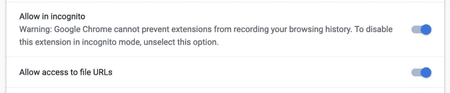

# 使用 aXe Core For Chrome 打开本地主机测试

> 原文：<https://dev.to/chrisdemars/turn-on-localhost-testing-using-axe-core-for-chrome-3bli>

嘿朋友们！这是怎么回事？我希望每个人都有一个好的新年开端。真不敢相信已经 2019 年了。还有什么比在 dev.to 上发表我的第一篇**帖子更好的方式来庆祝新的开始呢！事不宜迟，让我们开始学习吧。**

这篇文章只是一个快速提示。

## 斧芯镀铬

谈到可访问性审计和测试，我❤️和我❤️是核心。这是我对测试工具的追求，我在我演讲的每个会议上都提倡使用这种工具。好吧，你有没有试过用 aXe Core Chrome 扩展收到一个错误，不能测试本地文件，在扩展的设置里打开本地文件？你有吗？我也是！

我联系了我的朋友 Marcy Sutton，她现在为 Gatsby 工作，但是在我写这篇文章的时候，她告诉我如何修复这个错误，这样我就可以在本地测试。如果你也遇到同样的问题，下面是几个步骤。

*   在 Chrome 中导航至`chrome://extensions`
*   打开本地文件的开关，如果你觉得幸运的话，可以隐姓埋名。

我希望这有助于测试您正在开发和发布的体验的可访问性。