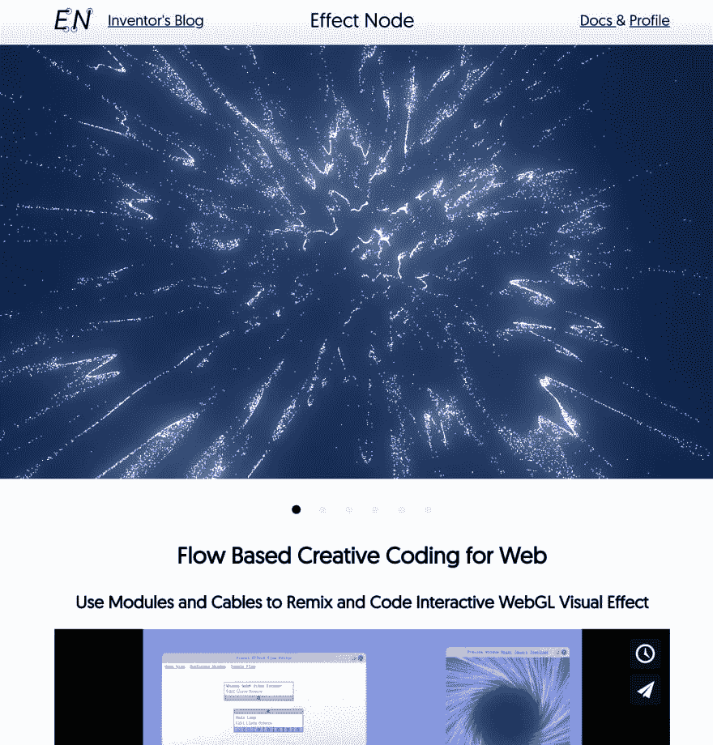
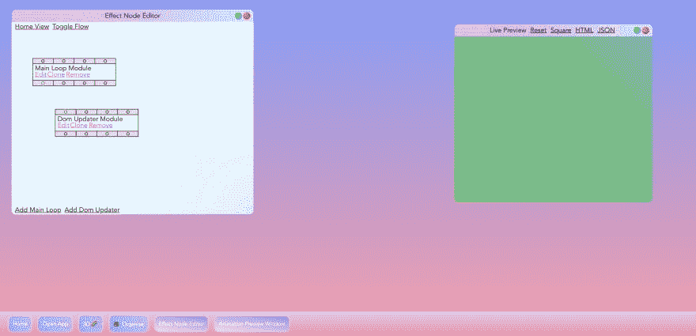

# 将我的 WebGL webapp 转换为 npm 库

> 原文：<https://dev.to/wonglok/turning-my-webgl-webapp-into-a-npm-library-4fmo>

# [T1】简介](#intro)

我的应用程序叫做[effectnode.com](https://effectnode.com)这是一个基于流程的创意编码平台，开发者和设计师可以一起工作:)

为了与全世界分享这项技术，我想把它变成一个前端专用库，这样所有的开发者都可以玩我做的东西。

[](https://res.cloudinary.com/practicaldev/image/fetch/s--TMV9_Ys6--/c_limit%2Cf_auto%2Cfl_progressive%2Cq_auto%2Cw_880/https://thepracticaldev.s3.amazonaws.com/i/71440lzyombqffx04afp.png)

# 安装

```
npm i enos --save 
```

Enter fullscreen mode Exit fullscreen mode

# 演示

[使用 WebPack 构建效果节点的现场演示](https://enos.netlify.com)

[不带效果节点的现场演示](https://codesandbox.io/s/r7oy8r2nmn)

[带效果节点的现场演示](https://codesandbox.io/s/vj67lqm9m3)

[](https://res.cloudinary.com/practicaldev/image/fetch/s--mHdCQTMU--/c_limit%2Cf_auto%2Cfl_progressive%2Cq_auto%2Cw_880/https://thepracticaldev.s3.amazonaws.com/i/6gc5kapbotpba1lt5dez.png)

# 它是如何工作的？

为了组织代码，我们使用模块，就像 es6 的想法一样。

对于创造性编码，我们经常需要设计师的输入，如颜色，大小，动画种子，效果数量和时间线等。

每个模块都可以拥有自己的值滑块、颜色选择器和时间轴。

我采用基于流的编码的原因是，它可以以一种可视化的方式传递动画数据，也提供了一种快速的方式来合成效果或在设计中混合和匹配值。

# 举例

上面的演示图中有两个模块。

1.  主循环模块
2.  他们在更新

主循环模块运行 requestAnimationFrame 循环，并向消息总线(vuejs 实例)发出渲染事件

Dom Updater 模块从消息总线接收 render 事件，然后动画显示项目的根 Dom 的 CSS 背景线性渐变。