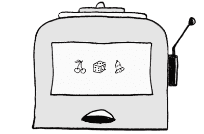
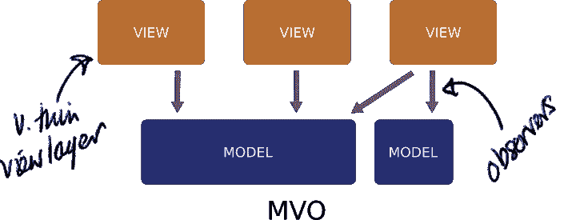
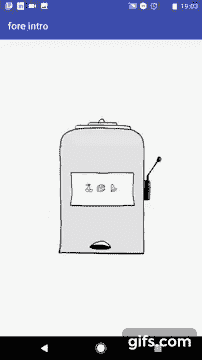

# 教程:android fore 基础

> 原文：<https://dev.to/erdo/tutorial-android-fore-basics-1155>

*这是 android 系列的一部分[fore](https://erdo.github.io/android-fore/)T3】*

| 系列教程 |
| --- |
| 1)教程:[发现故意的 bug](https://dev.to/erdo/tutorial-spot-the-deliberate-bug-165k) |
| 2)教程: [Android fore 基础知识](https://dev.to/erdo/tutorial-android-fore-basics-1155) |
| 3)教程: [Android 架构，全 todo app (MVO 版)](https://dev.to/erdo/tutorial-android-architecture-blueprints-full-todo-app-mvo-edition-259o) |
| 4)教程:[安卓状态诉事件](https://dev.to/erdo/tutorial-android-state-v-event-3n31) |
| 5)教程:[科特林协程，改型和前代](https://dev.to/erdo/tutorial-kotlin-coroutines-retrofit-and-fore-3874) |

让我们写一个简单的吃角子老虎机游戏。我们将使用微型 [**fore**](https://erdo.github.io/android-fore/) 库来演示:

*   一种真正将你的应用从用户界面层中分离出来的方法
*   获得坚如磐石的用户界面一致性的方法
*   一种处理**异步代码**而不发生内存泄漏的方法

<figure>

[](https://res.cloudinary.com/practicaldev/image/fetch/s--kE5TRX8x--/c_limit%2Cf_auto%2Cfl_progressive%2Cq_auto%2Cw_880/https://thepracticaldev.s3.amazonaws.com/i/2fxfrc02wlg7z3yzvgyd.png)

<figcaption>unlikely slot machine game</figcaption>

</figure>

因为我们正在使用 fore: **旋转支持**和**可测试性**将在最后自动退出，并且我们还将编写非常少的代码。

我们会用科特林语写这个，因为科特林语。

* * *

***更简单的**:更简单的例子见前面的 github repo。它附带了许多微小的应用程序示例，仅涵盖: [reactive-ui](https://erdo.github.io/android-fore/#fore-1-reactive-ui-example) 基础、[异步代码](https://erdo.github.io/android-fore/#fore-2-asynchronous-code-example)、[适配器](https://erdo.github.io/android-fore/#fore-3-adapter-example)、[联网](https://erdo.github.io/android-fore/#fore-4-retrofit-example)(带有 Retrofit2，但 fore repo 中的其他示例使用 Ktor 以及 Apollo for graphQL APIs)和 [db 驱动的应用程序](https://erdo.github.io/android-fore/#fore-6-db-example-room-db-driven-to-do-list)(带有空间)*

***更复杂**:一旦你超越琐碎的复杂性，许多架构开始显示出紧张。UI 层的复杂性是 **fore** 处理得特别好的东西，这里有一个更大更复杂的应用[讨论](https://dev.to/erdo/tutorial-android-architecture-blueprints-full-todo-app-mvo-edition-259o)来帮助你研究那个*

* * *

## 我们开始吧

[](https://res.cloudinary.com/practicaldev/image/fetch/s--j6puVyMw--/c_limit%2Cf_auto%2Cfl_progressive%2Cq_auto%2Cw_880/https://thepracticaldev.s3.amazonaws.com/i/nhwuewbqjn1e6rdkvwq0.png)

**因为**是实现[模型视图观察者](https://erdo.github.io/android-fore/00-architecture.html#shoom)架构的理想选择，我们将依次处理每个组件:

## 型号

我们需要一个模型来驱动我们的老虎机，我们将称之为 **SlotMachineModel** 。它将有一个 **spin()** 方法来启动轮子。这三个轮子要么旋转，要么显示樱桃、骰子或铃铛。(好吧，我从来没有玩过真正的吃角子老虎机，真倒霉。p)。

简单点说，有三个方法叫做: **getState1()** ， **getState2()** ， **getState3()** 。并且它们可以为每个轮子返回一个具有这些状态之一的枚举:**旋转**、**樱桃**、**骰子**、**铃铛**

我们还有一个 **isWon()** 方法，它总是返回 false，除非这三个轮子是:**所有**相同的**并且不是**旋转的(例如 CHERRY，CHERRY，CHERRY 将是一个 win)

为了制造悬念(并让你自己检查旋转支持)，我们将异步地进行旋转计算*，我们将慢慢来，随机地给每个旋转增加几秒钟的延迟。*

 *最后但绝非最不重要的一点是:**模型需要是可观察的**，每当这个模型的状态改变时，它需要让它的观察者知道它已经改变了。(如果你在用手机，你可能想把它调到横向模式来阅读下面的代码片段)

```
class SlotMachineModel constructor(
        private val stateFetcher: RandomStateFetcher,
        private val workMode: WorkMode)
: Observable by ObservableImp(workMode) {

    enum class State {
        SPINNING,
        CHERRY,
        DICE,
        BELL
    }

    private val rnd = Random()
    private val wheel1 = Wheel(State.CHERRY)
    private val wheel2 = Wheel(State.DICE)
    private val wheel3 = Wheel(State.BELL)

    fun spin() {
        spinWheel(wheel1)
        spinWheel(wheel2)
        spinWheel(wheel3)
    }

    private fun spinWheel(wheel: Wheel) {

        //if wheel is already spinning, just ignore
        if (wheel.state != State.SPINNING) {
            wheel.state = State.SPINNING
            notifyObservers()
            AsyncBuilder<Void, State>(workMode)
                .doInBackground {
                    stateFetcher.fetchRandom(randomDelayMs())
                }
                .onPostExecute { state ->
                    wheel.state = state; notifyObservers()
                }
                .execute()
        }
    }

    fun getState1(): State {
        return wheel1.state
    }

    fun getState2(): State {
        return wheel2.state
    }

    fun getState3(): State {
        return wheel3.state
    }

    fun isWon(): Boolean {
        return (wheel1.state == wheel2.state
                && wheel2.state == wheel3.state
                && wheel1.state != State.SPINNING)
    }

    //anywhere between 1 and 10 seconds
    private fun randomDelayMs(): Long {
        return (1000
              + rnd.nextInt(8) * 1000
              + rnd.nextInt(1000)).toLong()
    }

    internal inner class Wheel(var state: State)
} 
```

Enter fullscreen mode Exit fullscreen mode

这应该是我们的模型，需要注意一些事情:

*   每当我们的模型的任何状态改变时，我们立即调用 **notifyObservers()**
*   我们正在传递一个**工作模式**依赖项，该依赖项控制通知的发送方式，并使测试变得容易(这非常清楚地显示了正在发生的事情，但在 fore 的最新版本中没有必要)
*   除了当我们显式跳转到后台线程来获取车轮状态(这是联网通常发生的地方)时，一切都被设计为在 **UI 线程**上运行
*   为此我们使用了 **fore** 的 **AsyncBuilder** (它只是一个支持 lambdas 的 AsyncTask 的包装器)。这让我们可以轻松地以同步模式运行代码(例如，为了测试)，但是您也可以为此使用协程:参见 fore repo 中的示例应用程序，了解使用协程的可测试方式。
*   这个模型对 android 视图层类或上下文一无所知
*   我们还使用 RandomStateFetcher 依赖项来获取实际状态(与 fore 无关，这只是使事情更容易测试，这也是您将来可能放置网络代码的地方，见[此处](https://erdo.github.io/android-fore/#fore-4-retrofit-example)一个带有网络层的简单应用程序)

当你使用 fore 时，更多的信息和编写模型的清单在这里

## 视图

我们将编写一个自定义视图类来显示我们的老虎机，我们将把它命名为 **SlotMachineView** ，它不会与模型在同一个包中。

我们可以在标准的 XML 布局中这样做，如下所示，这个布局的根恰好是 RelativeLayout，所以我们的 SlotMachineView 将扩展它。

```
<?xml version="1.0" encoding="utf-8"?>
<foo.bar.example.foreintro.ui.SlotMachineView
    xmlns:android="http://schemas.android.com/apk/res/android"
    android:layout_width="match_parent"
    android:layout_height="match_parent"
    android:padding="@dimen/slot_spacer">

    <ImageView
        android:id="@+id/slots_machine"
        android:layout_width="wrap_content"
        android:layout_height="wrap_content"
        android:layout_centerInParent="true"
        android:layout_marginLeft="@dimen/slot_spacer"
        android:layout_marginStart="@dimen/slot_spacer"
        android:contentDescription="slot machine background"
        android:scaleType="fitCenter"
        android:src="@drawable/machine" />

    <!-- central slot -->

    <foo.bar.example.foreintro.ui.widget.SlotView
        android:id="@+id/slots_2_slotview"
        android:layout_width="@dimen/slot_icon_size"
        android:layout_height="@dimen/slot_icon_size"
        android:layout_centerInParent="true"
        android:background="@drawable/slots_dice"
        android:contentDescription="2nd slot" />

    <!-- left most slot -->

    <foo.bar.example.foreintro.ui.widget.SlotView
        android:id="@+id/slots_1_slotview"
        android:layout_width="@dimen/slot_icon_size"
        android:layout_height="@dimen/slot_icon_size"
        android:layout_centerVertical="true"
        android:layout_toLeftOf="@+id/slots_2_slotview"
        android:background="@drawable/slots_bell"
        android:contentDescription="1st slot" />

    <!-- right most slot -->

    <foo.bar.example.foreintro.ui.widget.SlotView
        android:id="@+id/slots_3_slotview"
        android:layout_width="@dimen/slot_icon_size"
        android:layout_height="@dimen/slot_icon_size"
        android:layout_centerVertical="true"
        android:layout_toRightOf="@+id/slots_2_slotview"
        android:background="@drawable/slots_cherry"
        android:contentDescription="3rd slot" />

    <!-- slot machine handle -->

    <ImageView
        android:id="@+id/slots_handle_imageview"
        android:layout_width="wrap_content"
        android:layout_height="wrap_content"
        android:layout_centerVertical="true"
        android:layout_toRightOf="@+id/slots_machine"
        android:src="@drawable/slot_handle_selector" />

    <!-- slot machine win banner -->

    <ImageView
        android:id="@+id/slots_win"
        android:layout_width="wrap_content"
        android:layout_height="wrap_content"
        android:layout_alignParentTop="true"
        android:layout_centerHorizontal="true"
        android:src="@drawable/slots_win" />

</foo.bar.example.foreintro.ui.SlotMachineView> 
```

Enter fullscreen mode Exit fullscreen mode

我们的自定义视图将处理以下标准内容:

*   获取我们需要的所有视图元素的**引用**
*   获取对 **SlotMachineModel** 的引用，它将告知用户界面上显示的是什么状态
*   连接**按钮监听器**,以便它们与模型交互
*   **同步我们的视图**,使其与 SlotMachineModel 的状态相匹配(设置所有的 SlotView 背景，并在每次模型通知我们它已更改时显示 win 横幅)

```
class SlotMachineView @JvmOverloads constructor(
        context: Context?, 
        attrs: AttributeSet? = null, 
        defStyleAttr: Int = 0, 
        defStyleRes: Int = 0) :
        RelativeLayout(context, attrs, defStyleAttr), SyncableView {

    //models that we need
    private lateinit var slotMachineModel: SlotMachineModel

    //single observer reference
    val observer = Observer { syncView() }

    override fun onFinishInflate() {
        super.onFinishInflate()

        //(getting view references is handled for us by kotlin tools)

        getModelReferences()

        setClickListeners()
    }

    private fun getModelReferences() {   
        slotMachineModel = OG[SlotMachineModel::class.java]
    }

    private fun setClickListeners() {
        slots_handle.setOnClickListener { slotMachineModel.spin() }
    }

    //fore data binding stuff below

    override fun syncView() {
        slots_1_slotview.setState(slotMachineModel.getState1())
        slots_2_slotview.setState(slotMachineModel.getState2())
        slots_3_slotview.setState(slotMachineModel.getState3())
        slots_win.showOrInvisible(slotMachineModel.isWon())

    override fun onAttachedToWindow() {
        super.onAttachedToWindow()
        slotMachineModel.addObserver(observer)
        syncView() //  <- don't forget this
    }

    override fun onDetachedFromWindow() {
        super.onDetachedFromWindow()
        slotMachineModel.removeObserver(observer)
    }
} 
```

Enter fullscreen mode Exit fullscreen mode

顺便说一下，只要您在编写 syncView()方法时遵守 2 条规则，它就会惊人地强大:

-如果被观察的模型以任何方式改变**，那么**整个**视图被刷新。
——如果**有**的地方，必然也有**否则****

这将在的[部分详细解释](https://erdo.github.io/android-fore/01-views.html#writing-an-effective-syncview-method)

## 观察者

这是实现 MVO 的最后一部分，我们差不多已经完成了。

所有的**模型**需要做的就是扩展 **fore** 的 **observableImp** *(或者实现 Observable 接口)*，并确保每次任何状态改变时都调用 **notifyObservers()** 。

对于**视图**，观察模型所要做的就是按照 Android 生命周期方法**添加**和**移除**它的可观察对象，并在模型通知它有变化时调用 **syncView()** 。

这里考虑了线程问题，因为一切都是在 UI 线程上操作的(包括观察者通知),这正是您需要 UI 代码运行的方式。异步代码在模型内部远离 UI 层运行，并在 UI 线程中触发轻量级通知之前完成。

我们还没有提到 [DI](https://erdo.github.io/android-fore/05-extras.html#dependency-injection-basics) ，但这是关键。您在视图中看到的行:

```
slotMachineModel = App.get(SlotMachineModel::class.java) 
```

Enter fullscreen mode Exit fullscreen mode

每次都为视图提供相同的模型实例，这样即使旋转屏幕，一切也保持一致。为此，您可以使用 Dagger2，这里的示例使用了一个纯 DI 解决方案。

<figure>

[](https://res.cloudinary.com/practicaldev/image/fetch/s--U_kwDne7--/c_limit%2Cf_auto%2Cfl_progressive%2Cq_66%2Cw_880/https://thepracticaldev.s3.amazonaws.com/i/0s05vx6ror703z1h074x.gif)

<figcaption>as promised… this already supports rotation</figcaption>

</figure>

为了完整性，这样您就可以看到它有多小，这是我们用来启动视图的[活动代码](https://github.com/erdo/fore-intro-tutorial/blob/master/app/src/main/java/foo/bar/example/foreintro/ui/MainActivity.kt)(您可能想将视图和活动类结合起来，但是为了清楚起见，我们在这里将它们分开了)

## 测试

因为视图层和应用程序的其余部分之间有太多的分离，所以这段代码特别容易测试。主 [fore repo](https://github.com/erdo/android-fore/) 有很多示例应用程序，如果想研究测试示例，其中许多都经过了广泛的测试。

## 现在是真正酷的东西…

这是一个简单的例子:一个视图观察一个模型。

但是在这个看起来非常基础的观察者代码中有一些聪明的地方。它没有参数。这意味着，如果你的视图突然需要观察的不仅仅是一个 **SlotMachineModel** ，还有一个 **UserRepository** ，或者一个 **AccountModel** ，或者 **NetworkStatusModel** ， **ChatInboxModel** ，**WeatherModel**——或者同时观察所有 6 个模型。可以的。很容易。观察者接口对于所有的模型都是相同的，所以所有视图需要做的就是使用 DI 获得对模型的引用，然后:

```
override fun onAttachedToWindow() {
    super.onAttachedToWindow()
    slotMachineModel.addObserver(observer)
    userRepository.addObserver(observer)
    accountModel.addObserver(observer)
    networkStatusModel.addObserver(observer)
    chatInboxModel.addObserver(observer)
    weatherModel.addObserver(observer)
    syncView() //  <- don't forget this
}

override fun onDetachedFromWindow() {
    super.onDetachedFromWindow()
    slotMachineModel.removeObserver(observer)
    userRepository.removeObserver(observer)
    accountModel.removeObserver(observer)
    networkStatusModel.removeObserver(observer)
    chatInboxModel.removeObserver(observer)
    weatherModel.removeObserver(observer)
} 
```

Enter fullscreen mode Exit fullscreen mode

如果您强烈反对 boiler plate 的级别，您可以在这里使用一个 [ObservableGroup](https://erdo.github.io/android-fore/03-reactive-uis.html#removing-even-more-boiler-plate) (这是唯一可能的，因为在每种情况下观察器 api 都是相同的)

至于模型本身，他们甚至不知道有多少视图在观察他们，这对他们的代码没有任何影响。

假设视图想要:*如果帐户中没有钱，禁用老虎机句柄*。**但是，当余额增加或减少，或者如果手机屏幕旋转等，我们希望保持反应，并保持启用状态正确。**同步视图中的一行:

```
slots_handle.isEnabled = accountModel.balance > 0 
```

Enter fullscreen mode Exit fullscreen mode

也许视图应该:*在屏幕顶部显示天气预报文本*。**但是我们需要保持用户界面的美观和反应性，这样如果天气预报改变或者手机旋转，一切都保持一致**。syncView 中多了一行:

```
weather_text.text = weatherModel.getForecastText() 
```

Enter fullscreen mode Exit fullscreen mode

如果风速超过 50 英里/小时，该文本应该是红色的。**但是我们不希望测试人员在旋转手机时发现任何用户界面一致性的错误，或者把手机放在抽屉里一周或者其他他们会尝试的事情**。syncView 中多了一行:

```
weather_text.setTextColor(resources.getColor(
                             if (weatherModel.windSpeed>50)
                                   R.color.red else R.color.blue)) 
```

Enter fullscreen mode Exit fullscreen mode

或者，如果您希望这一小部分逻辑单元是可测试的，那么将它放在一个模型中(一个视图模型将是理想的),然后简单地从您的视图中调用它:model.getWeatherColor()

这段代码可能会让事情看起来非常简单，但有很多方法会出错，当然，如果你的应用程序中有什么地方感觉不对劲，或者你有任何性能问题，你很可能会在检查表[这里](https://erdo.github.io/android-fore/05-extras.html#troubleshooting--how-to-smash-code-reviews)中找到一些指导。

* * *

好了，谢谢你读到这里！

希望这能给你一些关于如何利用 fore 库或 T2 MVO 库来编写更快、更干净、更易测试的应用的想法。我在工作中一直使用它，因为它已经可以生产了(它是一个非常小的库，所以不会有太多问题)。当您查看[网络](https://erdo.github.io/android-fore/#fore-4-retrofit-example)、[适配器](https://erdo.github.io/android-fore/#fore-3-adapter-example)、[数据库](https://erdo.github.io/android-fore/#fore-6-db-example-room-db-driven-to-do-list)等时，需要讨论更多的考虑事项，但是它们都以**相同的标准方式**使用 syncView()约定来处理。目前，寻找清晰例子的最佳地方是在 github repo 之前的[。](https://erdo.github.io/android-fore/)

这里是教程的完整代码*