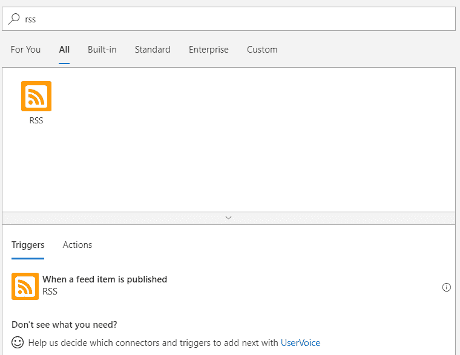
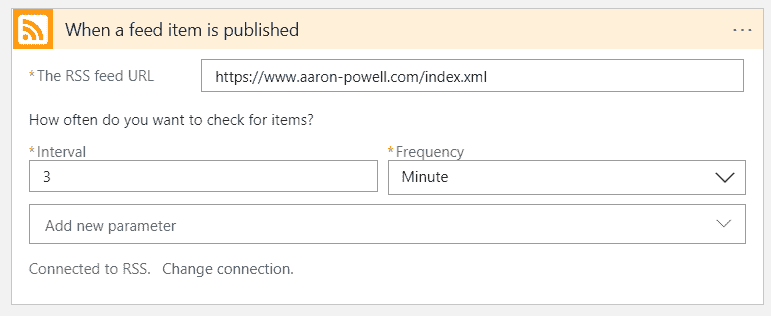
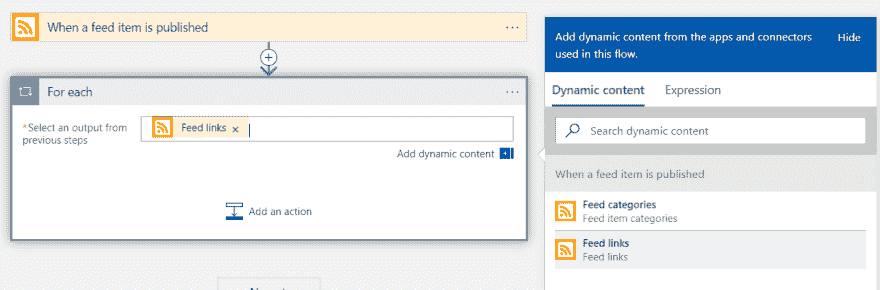
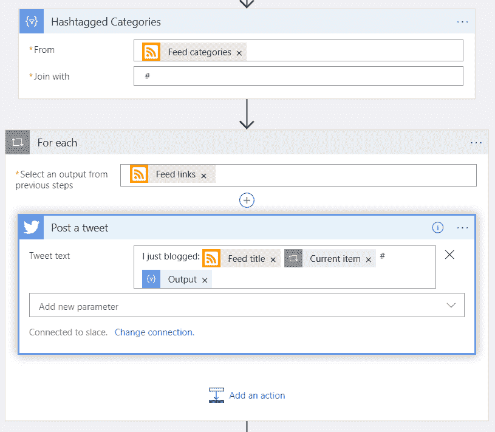

# 使用 Logic 应用程序发布新的博客帖子

> 原文：<https://dev.to/azure/tweeting-new-blog-posts-with-logic-apps-524p>

当我写博客时，我喜欢确保内容一经发布，就被发送给我的受众，而不仅仅是我的普通 RSS 订阅者，我发现 Twitter 是做到这一点的有效方式。

2017 年年中，我决定将我的博客[重建为一个静态网站](https://www.aaron-powell.com/posts/2017-07-27-site-rebuild/)，因为我喜欢在 Markdown 中写作，我想要一种我感觉更能控制内容的方式。去年，我决定使用 [Azure Storage Static Sites](https://docs.microsoft.com/en-us/azure/storage/blobs/storage-blob-static-website?WT.mc_id=azureapril_devto-blog-cxa) 和 [Azure Pipelines](https://azure.microsoft.com/en-us/services/devops/pipelines/?WT.mc_id=azureapril_devto-blog-cxa) 到[自动化部署](https://www.aaron-powell.com/posts/2018-07-05-automating-deployments-for-dddsydney/)，让它成为一个真正的静态网站。

因为这个过程可能需要一两分钟来运行，然后再花几分钟来清除 CDN 并部署新内容，所以我经常会忘记发我的新帖子，或者我会疯狂地刷新我的主页，诅咒 CDN 清除得不够快！

所以我决定是时候采取另一种方法了，是时候把这个小任务从我的生活中自动化出来了。

现在，我可以写一点代码并将其部署为一个 [Azure 函数](https://docs.microsoft.com/en-us/azure/azure-functions/?WT.mc_id=azureapril_devto-blog-cxa)，在计时器上运行它来检查我的 RSS，然后再写一些代码来发布推文，但我真的希望事情越简单越好。

这让我想到了[逻辑应用](https://docs.microsoft.com/en-us/azure/logic-apps/?WT.mc_id=azureapril_devto-blog-cxa)，它类似于函数，但却是一个*无代码*解决方案。

## 逻辑应用快速概述

Logic Apps 是一种集成工具，允许您创建由外部系统中的事件触发的工作流。

有许多可用的触发器:

您可以连接到 SalesForce 等系统，监听要创建的新记录，然后启动新的工作流。此工作流可以执行一系列任务，从操作触发器中的数据到调用另一个外部系统:

所有这些都可以在不编写任何代码的情况下完成！

## 听博客发布

虽然探索 SalesForce 到 SAP 的集成而不编写任何代码可能很有趣，但我们实际上是在看我们的博客。为此，我将选择发布提要条目时的**RSS 触发器:**

 **

并提供我的 RSS 提要的 URL:

我将保留默认的轮询间隔，虽然我不会每 3 分钟发布一次，但这意味着当我发布时，它会很快被选中。

## 发布我们的帖子

Logic Apps 现在正在收听何时有新文章发表，是时候对它们做些什么了。

因为提要中的一个条目可能有多个关联的 URL，所以我们希望遍历它们。谢天谢地，Logic 应用程序中有一个动作叫做`For each`。我们必须给它一些东西来循环，所以我们将提供来自触发器的`Feed links`内容，从出现的**动态内容**面板中选择:

最后，我们可以为每个链接提供要运行的操作，我们将使用发布推文操作(您需要授权 Logic 应用程序来访问您计划使用的 Twitter 帐户)并输入一些信息:

`Feed title`是文章的标题，`Current item`是来自循环的链接。

完成后，发布一篇文章，它会自动为与这篇新文章相关的每个链接发一条推文(实际上，很可能是一条推文)！

## 改进我们的推文

当我们创建一条推文以确保我们获得最广泛的覆盖时，我们可能希望在适当的位置放置一两个标签，这样做的一个逻辑方法是抓取你在帖子上放置的标签，毕竟，它们是你希望人们寻找的关键词。当新的条目来自触发器时，标签是一个字符串数组(例如:`[azureapril, azure, serverless, logicapps]`)，但是我们希望将它转换成一组可以附加到 tweet 上的标签。

为此，我们将使用`Join`数据操作动作，它接受一个集合，并使用您提供的连接标记执行字符串连接操作。我们将在循环之前添加它，这样我们就可以在 tweet 中使用动态内容:

我使用的连接符是`#`，所以是前导符 `followed by the `#`，这样我们就会得到一个类似`azureapril #azure #serverless #logicapps`的字符串。然后，在 tweet 中，我们将在动态内容前添加一个`#`,这样第一个标签也成为了一个 hashtag。😉`

 `## 安排后续推文

当一条推文发布时，它是一个时间点，一条消息将被正在查看其提要的人看到*然后是*。但我想尝试打动现在在线的观众和未来的观众。

为此，我们可以向我们的逻辑应用程序添加另一个动作，Delay。延迟允许我们将逻辑应用程序的后续步骤延迟一段预定的时间。让我们延迟 12 个小时，在最初的一个熄灭时，找到最有可能睡着的人，然后运行一个新的循环:

因为这是一条新的推文，我们可以稍微调整一下信息(我添加了“ICYMI”，这是“万一你错过了”的缩写)。

## 结论

现在我们有了它，只需在 Logic 应用程序设计器中点击几下，我们就可以创建一个 Logic 应用程序，它会自动发布推文，并在每次我们在博客上发布文章时安排未来的推文。

此外，使用 Logic 应用程序，你可以将其导出为 JSON，如果你想快速入门，我已经这样做了(只要记得更新 RSS 链接和 Twitter 连接):`**