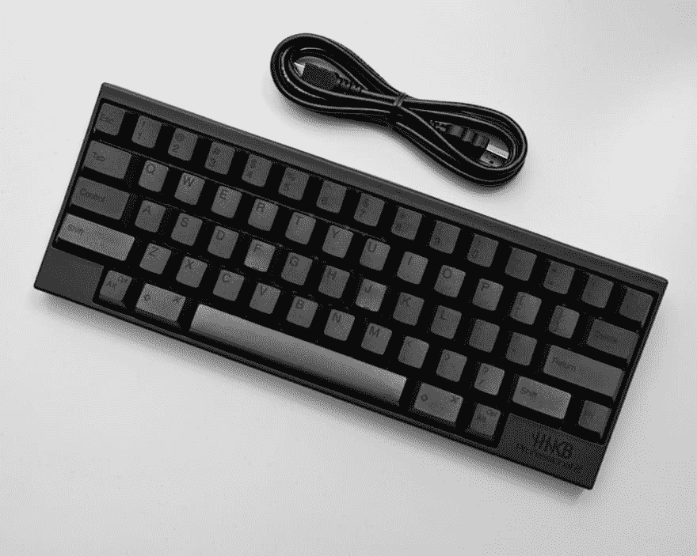

# 和科尔曼在一起二十个月

> 原文：<https://dev.to/kevcui/twenty-months-with-colemak-1ln6>

[](https://res.cloudinary.com/practicaldev/image/fetch/s--qaY5Vx-c--/c_limit%2Cf_auto%2Cfl_progressive%2Cq_auto%2Cw_880/https://cdn-images-1.medium.com/max/1000/1%2AhcY3Bk8YY_1keCJW_b70Vw.jpeg)

时间过得真快。从[我从 QWERTY 换到 Colemak 键盘布局](https://dev.to/kevcui/why-i-switch-to-colemak-keyboard-layout-24h4)已经 20 个月了。我现在在 Colemak 键盘上打字的速度能和时间一样快吗？当然不是。20 个月前，我的打字速度在 QWERTY 上是平均每分钟 75 个字，现在在 Colemak 上是平均每分钟 85 个字。我能感觉到进步，这就是为什么我再也不会回头看 QWERTY 了。

除了《与科尔马克共度的一周》中提到的事情，在这 20 个月里有没有发生什么特别的事情？

### 将大写锁定重新映射为...？

大写锁定键在标准键盘上是一个巨大的浪费。它的地位如此重要，但功能效益却很低。有些人把它重新映射为 Escape 键；有些人将其重新映射为退格键...

我最喜欢的重新映射解决方案是:按下大写锁定一次，它发送“退出”键事件；按住大写锁定，它发送“控制”键事件。所以，一个 Caps Lock 键可以同时作为 Escape 和 Control 键。

#### 如何在 Linux 上实现这个密钥绑定？

*   按住时充当**控制键**:默认情况下，HHKB 键盘将控制键放在通常的大写锁定位置，这对我来说很好，所以不需要调整。对于其他键盘，我一般用`xmodmap`把 Caps Lock 键映射成左控制键。

*   单次按下时充当**转义**:[xcape](https://github.com/alols/xcape)可以配置一个键在按下和释放时充当另一个键:

```
xcape -t 300 -e 'Control_L=Escape' 
```

#### 如何在 macOS 上实现这个密钥绑定？

Karabiner 是一个在 macOS 上归档相同密钥绑定概念的伟大工具。Karabiner 支持定制的 json 配置文件。这里是[我的配置文件](https://github.com/KevCui/dotfiles/blob/master/karabiner/capslock.json)。

```
...
"from": {
    "key_code": "caps_lock",
    "modifiers": {
        "optional": [ "any" ]
    }
},
"to": [{
    "key_code": "right_control"
}],
"to_if_alone": [{
    "key_code": "escape"
}],
... 
```

### 现实世界中的一些小麻烦

当你在现实世界中使用一些不常见的工具时，你知道你必须准备一些可能每天都会降临到你身上的小麻烦:

*   QWERTY 几乎无处不在:接受现实，加强 QWERTY 布局的肌肉记忆。不然就像我一样，在 QWERTY 上打字极其笨拙。

*   在我的机器上进行结对编程或测试:记得根据不同的人动态切换键盘和按键绑定设置。

*   “这家伙是个怪人。”:那又怎样？

* * *

总的来说，我现在对 Colemak 非常满意。我不打算学习另一种键盘布局。我想我会继续使用 Colemak 很多年。也许几年后，我会再写一篇关于 Colemak 的文章。我将称之为“与科尔马克二十年”。😉