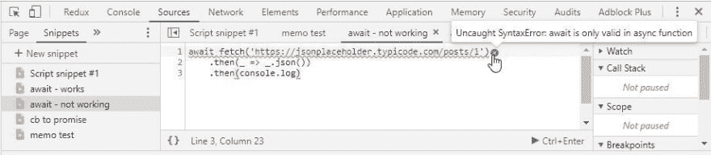
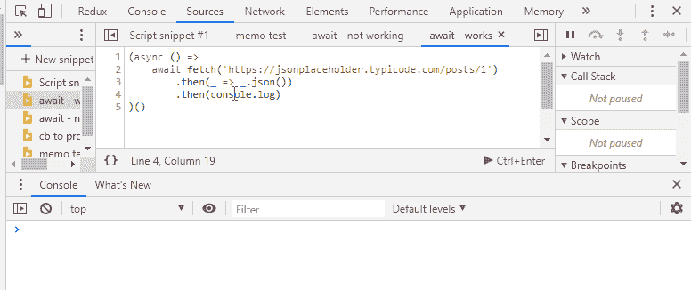
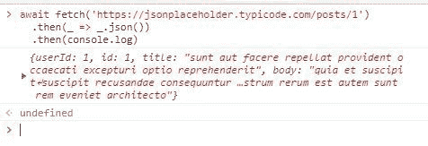
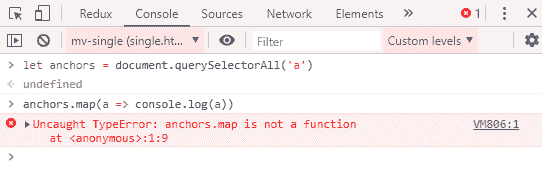
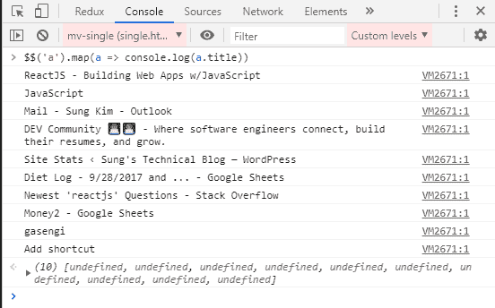
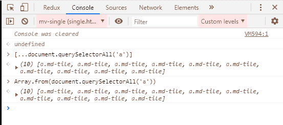

# Chrome 开发者工具控制台中的两个问题

> 原文：<https://dev.to/dance2die/two-gotchas-in-chrome-developer-tool-console-11k3>

*照片由[梁锦松](https://unsplash.com/photos/ZV7lnfyQLmA?utm_source=unsplash&utm_medium=referral&utm_content=creditCopyText)在[Unsplash](https://unsplash.com/search/photos/console?utm_source=unsplash&utm_medium=referral&utm_content=creditCopyText)T5 上拍摄*

Chrome 开发者工具控制台(以下简称“控制台”)上有两个令人惊讶的行为。

第一个是我的朋友 [Nicolas Marcora](https://twitter.com/nicolasmarcora) 指出的，你可以等待一个异步方法，第二个是[$ $](https://developers.google.com/web/tools/chrome-devtools/console/utilities#queryselectorall)([document . query selector all](https://developer.mozilla.org/en-US/docs/Web/API/Document/querySelectorAll)的快捷方式)返回一个数组，而不是一个 [NodeList](https://developer.mozilla.org/en-US/docs/Web/API/NodeList) 对象。

让我们回顾一下它们有什么不同。

## 1️⃣在控制台恭候

在编辑器中(我使用的是 [Snippets](https://developers.google.com/web/tools/chrome-devtools/javascript/snippets) 特性，它类似于便笺式存储器，但工作起来像编辑器)，`await`不起作用，因为它需要在异步方法中被调用。

为了解决这个问题，您可以将它包装在一个异步方法中(在本例中是一个异步[life](https://developer.mozilla.org/en-US/docs/Glossary/IIFE))。

这应该是您所期望的正常行为，但是…

您可以在控制台中等待，而不用将语句包装在异步方法中~

<figure> 

<figcaption>真是神奇~~~</figcaption>

</figure>

这是自 2017 年发布的 Chrome 62 以来添加到 Chrome Devtools 中的行为[。](https://developers.google.com/web/updates/2017/08/devtools-release-notes#await)

所以这是一个很好的特性，但是你必须小心，因为你不能简单地将你的代码粘贴到你的编辑器中。

它需要被包装在一个异步方法中。

## $ $ vs document . query selectorall

[$$](https://developers.google.com/web/tools/chrome-devtools/console/utilities#queryselectorall) 是控制台实用程序 API 的一部分，仅在控制台内可用，不属于 JavaScript 或 [DOM](https://developer.mozilla.org/en-US/docs/Web/API/Document_Object_Model/Introduction) 。

[谷歌文档](https://developers.google.com/web/tools/chrome-devtools/console/utilities#queryselectorall)将`$$`描述为

> *$$(选择器)返回与给定 CSS 选择器匹配的元素数组。该命令等效于调用 document.querySelectorAll()。*
> 
> <cite>[https://developers . Google . com/web/tools/chrome-dev tools/console/utilities # query selector all](https://developers.google.com/web/tools/chrome-devtools/console/utilities#queryselectorall)T3】</cite>

文档中说它等同于调用[document . query selectorall()](https://developer.mozilla.org/en-US/docs/Web/API/Document/querySelectorAll)，但是`$$`不同于

，其中`document.querySelectorAll()`返回一个 [NodeList](https://developer.mozilla.org/en-US/docs/Web/API/NodeList) 对象，而`$$`返回一个数组。

`NodeList`是一个[类数组对象](http://speakingjs.com/es5/ch18.html#_pitfall_array_like_objects)，它的原型没有继承[数组.原型](https://developer.mozilla.org/en-US/docs/Web/JavaScript/Reference/Global_Objects/Array/prototype)。这意味着，`NodeList`对象实例不能访问诸如 [Array#map](https://developer.mozilla.org/en-US/docs/Web/JavaScript/Reference/Global_Objects/Array/map) 或 [Array#reduce](https://developer.mozilla.org/en-US/docs/Web/JavaScript/Reference/Global_Objects/Array/Reduce) 这样的方法。

<figure> 

<figcaption>不能映射覆盖 NodeList 对象</figcaption>

</figure>

<figure> 

<figcaption>虽然可以过$</figcaption>

</figure>

当你使用`$$`选择器复制粘贴代码，然后简单地转换成使用`document.querySelectorAll()`并试图调用`Array.prototype`时，这会导致一个问题

*你可以使用* [*spread 语法*](https://developer.mozilla.org/en-US/docs/Web/JavaScript/Reference/Operators/Spread_syntax) *或*[*array . from*](https://developer.mozilla.org/en-US/docs/Web/JavaScript/Reference/Global_Objects/Array/from)*轻松地将 NodeList 对象转换为数组。*

## 👋离别赠言

控制台可以为您节省大量的击键次数，但是在将代码从控制台复制粘贴到编辑器之前，您可能需要仔细检查。

如果你有更多的问题，请告诉我🙂

*帖子[Chrome 开发者工具控制台](https://www.slightedgecoder.com/2019/04/19/two-gotchas-in-chrome-developer-tool-console/)的两个问题最先出现在 [Sung 的技术博客](https://www.slightedgecoder.com)上。*