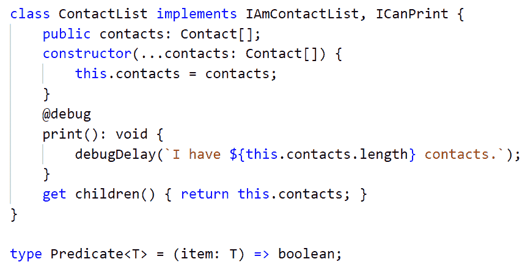

# 通过重构为 JavaScript 开发人员编写类型脚本第 2 部分，共 2 部分

> 原文：<https://dev.to/azure/typescript-for-javascript-developers-by-refactoring-part-2-of-2-eda>

#### 引入了像接口和装饰器这样的高级概念。

这是通过重构 JavaScript 应用程序来教授 TypeScript 的一系列步骤的第二部分，也是最后一部分。如果您还没有阅读第一部分，请务必阅读并逐步完成[！这是我们最终将使用的代码示例。](https://dev.to/jeremylikness/typescript-for-javascript-developers-by-refactoring-part-1-of-2-52jl)

<figure> 

<figcaption>样本代码</figcaption>

</figure>

### 10。简单重构

为了开始后半部分，我从一个简单的重构开始。我添加了一个`debugDelay`方法来简化我为了跟踪目的而记录的消息。

[https://www.youtube.com/embed/2Cz3bct8n-U](https://www.youtube.com/embed/2Cz3bct8n-U)

### 11。接口

接口开始带我们进入 TypeScript 的更高级和独特的特性。接口不存在于生成的 JavaScript 代码中，有助于提高开发过程中的生产率。与其他语言不同，TypeScript 不将接口名称视为唯一类型，而是将签名视为唯一类型。具有相同属性和/或功能集的两个不同命名的接口是相同的接口。了解如何定义和应用接口。

[https://www.youtube.com/embed/EUGNhz7y5TQ](https://www.youtube.com/embed/EUGNhz7y5TQ)

🔗[了解更多关于接口的信息](https://jlik.me/fdu)

### 12。递归打印

该接口被扩展为包括一个可选属性。创建一个通用函数，它接受任何实现了`ICanPrint`的项，并递归调用该项上的`print()`和其子项上的函数(如果它们存在的话)。使用`ContactList`类上的“getter”实现一个只读属性，然后重构代码以使用递归打印函数。

[https://www.youtube.com/embed/rSER94B3Uyg](https://www.youtube.com/embed/rSER94B3Uyg)

🔗[了解关于界面](https://jlik.me/fe4)
中可选参数的更多信息🔗[了解关于访问器(获取器和设置器)的更多信息](https://jlik.me/fe5)

### 13。格式化打印输出

一些辅助函数通过传递一个属性并输出一个带有相应值的标签来格式化打印结果。代码被重构以使用新的功能，一个新的缺陷出现了；姓名不再打印，显示为`undefined`。幸运的是，TypeScript 准备在下一次迭代中修复它。

[https://www.youtube.com/embed/1n2cvHyuA50](https://www.youtube.com/embed/1n2cvHyuA50)

### 14。救援的关键类型

TypeScript 支持一种特殊的约定`keyof`(称为“索引类型”)，它将检查类或接口的签名，然后基于该签名创建一个允许的字符串值列表。在这一步中，为`IAmContact`的属性创建一个自定义键类型。这立即揭示了缺陷，并提供了修复它的自动完成建议。

[https://www.youtube.com/embed/tJrF1l6by60](https://www.youtube.com/embed/tJrF1l6by60)

🔗[了解有关索引类型的更多信息](https://jlik.me/fff)

### 15。防护类型

类型保护是另一个非常有用的特性，它有助于提高生产率，并在 JavaScript 编译之前捕捉错误。它们允许您指定确定变量类型的测试，并允许编译器在测试成功时理解变量的特征。这将启用自动完成，并基于访问不属于该类型的属性或方法来捕捉错误。

[https://www.youtube.com/embed/QIE1rZJoXJM](https://www.youtube.com/embed/QIE1rZJoXJM)

🔗[了解更多关于防护类型的信息](https://jlik.me/ffg)

### 16。严格类型

在项目开始时，“严格类型”被关闭，以避免在迁移 JavaScript 应用程序后引入的几个错误。已经做了足够多的重构工作，这可以在没有任何错误的情况下打开。增加了一个新方法，它需要一个年龄来计算“出生年份”…但这不是重点。它为展示一些真正强大的功能奠定了基础。

[https://www.youtube.com/embed/89IkjFMXmfM](https://www.youtube.com/embed/89IkjFMXmfM)

### 17。字体装璜师

装饰器是 TypeScript 最强大的方面之一。它们支持面向方面的开发。您可以创建一项功能或“行为”，并使用属性将该行为应用于代码。如果你做过任何角度的开发，装饰器在框架中被广泛使用。在这一步中，看看如何构建和应用您自己的装饰器。

[https://www.youtube.com/embed/sgAa9NHShGw](https://www.youtube.com/embed/sgAa9NHShGw)

🔗[了解更多关于装修工的信息](https://jlik.me/fgh)

### 18。编译目标

我喜欢 TypeScript 通过跟上更新的规范让我了解最新的 JavaScript 版本。我可以使用新的语言特性，当我针对旧版本时，它们被转换成遗留的 JavaScript，或者当我为现代浏览器编写时，它们被“传递”。看看这是怎么回事吧！

[https://www.youtube.com/embed/6ozpF7Of7Do](https://www.youtube.com/embed/6ozpF7Of7Do)

### 结束

这个系列就到这里。我希望通过使用 JavaScript 作为起点，我能够传达:

*   它在打字世界中是如何工作的
*   打字稿的灵活性
*   TypeScript 带来的好处包括在您的代码进入生产之前找到并自动建议常见缺陷的修复

 *我很想听听你的想法和反馈，所以请在下面的评论中分享吧！

问候，

* * **