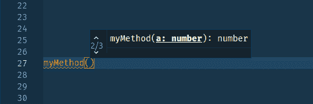

# TypeScript 函数重载

> 原文：<https://dev.to/iamandrewluca/typescript-function-overloading-hd0>

在这个例子中，我使用了 [ow](https://github.com/sindresorhus/ow) 进行运行时参数类型检查，但是你也可以自己检查`typeof a === 'string'`

[](https://res.cloudinary.com/practicaldev/image/fetch/s--ByoJs8CI--/c_limit%2Cf_auto%2Cfl_progressive%2Cq_auto%2Cw_880/https://thepracticaldev.s3.amazonaws.com/i/5jf2px2bfllmr6mflkip.png)T3】

```
import ow from "ow";

function myMethod(a: string): string;
function myMethod(a: number): number;
function myMethod(a: number, b: string): [number, string];
function myMethod(
  a: string | number,
  b?: string
): string | number | [number, string] {
  if (ow.isValid(a, ow.string) && ow.isValid(b, ow.undefined)) {
    console.log("function myMethod(a: string): string");
    return a;
  }

  if (ow.isValid(a, ow.number) && ow.isValid(b, ow.undefined)) {
    console.log("function myMethod(a: number): number");
    return a;
  }

  if (ow.isValid(a, ow.number) && ow.isValid(b, ow.string)) {
    console.log("function myMethod(a: number, b: string): [number, string]");
    return [a as number, b];
  }
}

console.log(myMethod(123));
// function myMethod(a: number): number
// 123

console.log(myMethod("Andrew"));
// function myMethod(a: string): string
// Andrew

console.log(myMethod(123, "Andrew"));
// function myMethod(a: number, b: string): [number, string]
// [123, "Andrew"] 
```

Enter fullscreen mode Exit fullscreen mode

这同样适用于类别

```
import ow from "ow";

class MyClass {
  myMethod(a: string): string;
  myMethod(a: number): number;
  myMethod(a: number, b: string): [number, string];
  myMethod(
    a: string | number,
    b?: string
  ): string | number | [number, string] {
    if (ow.isValid(a, ow.string) && ow.isValid(b, ow.undefined)) {
      console.log("function myMethod(a: string): string");
      return a;
    }

    if (ow.isValid(a, ow.number) && ow.isValid(b, ow.undefined)) {
      console.log("function myMethod(a: number): number");
      return a;
    }

    if (ow.isValid(a, ow.number) && ow.isValid(b, ow.string)) {
      console.log("function myMethod(a: number, b: string): [number, string]");
      return [a as number, b];
    }
  }
}

const myClass = new MyClass()

console.log(myClass.myMethod(123));
// function myMethod(a: number): number
// 123

console.log(myClass.myMethod("Andrew"));
// function myMethod(a: string): string
// Andrew

console.log(myClass.myMethod(123, "Andrew"));
// function myMethod(a: number, b: string): [number, string]
// [123, "Andrew"] 
```

Enter fullscreen mode Exit fullscreen mode

[https://codesandbox.io/embed/l7k6p45589](https://codesandbox.io/embed/l7k6p45589)