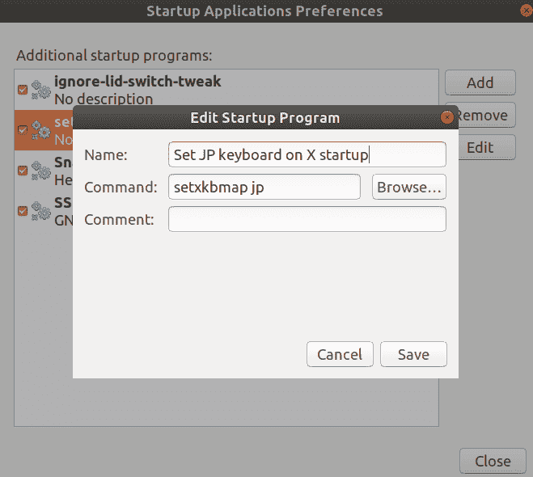
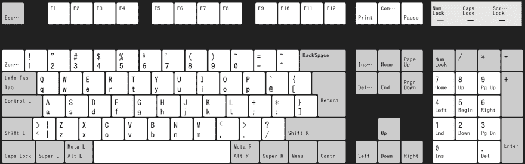

# 在 Ubuntu 上使用日语键盘

> 原文：<https://dev.to/vochicong/ubuntu-5b5j>

在 Ubuntu 18.04 上可以比较简单地进行日语输入的设定，但是键盘布局如果是美国的话，用全角半角按钮无法进行 IME 开关，或者`@`的位置不同，很难使用，所以想把键盘的布局变成日语。

## 控制台使用的键盘设定

```
sudo dpkg-reconfigure keyboard-configuration 
```

输入`Generic 105-key PC (intl.)`→ `Japanese`→ `Japanese`→ `The default for the keyboard layout`→ `No compose key`→ `Yes`。

## 在 X(GUI )中使用的键盘的设定

```
gnome-session-properties 
```

`Add`→ `setxkbmap -layout jp`→ `Save`
顺便说一下，如果想把`Caps Lock`键作为`Ctrl`使用的话

```
setxkbmap -layout jp -option ctrl:nocaps 
```

[](https://res.cloudinary.com/practicaldev/image/fetch/s--yUdbWSlA--/c_limit%2Cf_auto%2Cfl_progressive%2Cq_auto%2Cw_880/https://qiita-image-store.s3.amazonaws.com/0/36973/138983fc-7518-901c-042f-558fe25973df.png)

另外，用`Ctr-Alt-F3`暂时切换到控制台，用
或者`Ctr-Alt-F2`返回 X GUI 的话，会有键盘布局变成
US 的错误，所以在终端上

```
 setxkbmap -layout jp 
```

用解决。

## 键盘布局的确认

```
$ setxkbmap -print -verbose 10 | grep layout
layout:     jp 
```

从 Ubuntu 的设定工具来看，为
[](https://res.cloudinary.com/practicaldev/image/fetch/s--1wh0Icbr--/c_limit%2Cf_auto%2Cfl_progressive%2Cq_auto%2Cw_880/https://thepracticaldev.s3.amazonaws.com/i/nx178ryk7i2latbxa3iz.png)