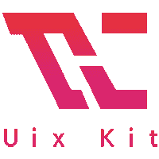

# Uix 工具包-用于快速网页设计和开发的免费网页工具包

> 原文：<https://dev.to/uiux_lab/uix-kit-free-web-kits-for-fast-web-design-and-development-1jmn>

[](https://github.com/xizon/uix-kit)

项目:[https://github.com/xizon/uix-kit](https://github.com/xizon/uix-kit)演示:[https://uiux.cc/uix-kit](https://uiux.cc/uix-kit)

## 关键特性

Uix Kit 可以单独使用，也可以使用 bootstrap 合并组件和网格系统。不管屏幕大小如何，网站内容自然会适合给定的分辨率。使用 Uix 工具包将为您节省大量构建项目的时间。它支持使用 three.js 和 pixi.js 进行 3D 和 2D 渲染。更典型的是，使用 Webpack 为每个模块自动生成核心文件(包含。js，。scss，。html 文件)。

*   使用 three.js 和 pixi.js 支持 3D 和 2D 渲染
*   使用 Sass 控制 BEM 命名的范围
*   自动生成每个模块名称注释的目录。
*   简单的定制 CSS 和 JS 核心文件
*   100%响应和移动就绪
*   提前准备一些通用插件
*   与 Bootstrap 4.x 兼容
*   提供通用的网页组件和布局
*   W3C 标准支持
*   支持 PJAX 无刷新方法加载页面
*   支持 JS，HTML 和 SASS 组件库自动打包。
*   为 React 架构奠定基础。

* * *

## 安装和测试

您需要在您的机器上安装[节点](https://nodejs.org/)。这将向`./dist/*`和`./examples/*.html`输出已构建的可分发内容。

**第一步。**使用 NPM(找到您当前所在的项目目录，并输入以下命令。)或者从 [Github](https://github.com/xizon/uix-kit) 下载最新版本。对于 nodejs，你必须安装一些依赖项。

```
$ sudo npm install uix-kit 
```

或者克隆 repo 以获得包括构建脚本在内的所有源文件:

```
$ git clone git://github.com/xizon/uix-kit.git 
```

**第二步。**首先，使用绝对路径进入你的`"uix-kit/"`文件夹目录。

```
$ cd /{your_directory}/uix-kit 
```

**第三步。**在做所有开发工作之前，确保你已经安装了`Node 10+`。之后，在主目录中运行下面的代码来安装节点模块依赖项。

```
$ sudo npm install --save-dev  --unsafe-perm node-sass 
```

**第四步。**运行下面的代码进入开发模式。将创建转换后的 ES5 文件。

```
$ npm run build 
```

**第五步。**完成后，这将启动一个可以在
访问的服务器

```
http://localhost:8080/examples/ 
```

### 注:

**错误:npm 更新检查失败。**

```
$ sudo chown -R $USER:$(id -gn $USER) /Users/{username}/.config 
```

* * *

## 如何使用

### 1。HTML 结构

```
 <!DOCTYPE html>
<html dir="ltr" lang="en-US">
    <head>
        <meta charset="utf-8" />
         

        <!-- Mobile Settings
        ============================================= -->
        <meta name="viewport" content="width=device-width, initial-scale=1, maximum-scale=1" />
        <!-- Mobile Settings end -->

        <!-- Vendor
        ============================================= -->
        <script src="assets/js/wp-jquery/jquery.min.js?ver=3.3.1"></script>
        <script src="assets/js/wp-jquery/jquery.migrate.min.js?ver=1.4.1"></script>
        <!-- Vendor  end -->

        <!-- Compatibility
        ============================================= -->
        <script src="assets/js/min/modernizr.min.js?ver=3.5.0"></script>
        <meta http-equiv="X-UA-Compatible" content="IE=edge">
        <!-- Compatibility  end -->

        <!-- Core & Theme CSS
        ============================================= -->

        <!-- Basic  -->
        <link rel="stylesheet" href="assets/css/bootstrap.min.css?ver=4.2.1" media="all"/>
        <link rel="stylesheet" href="assets/css/video.min.css?ver=7.4.1" media="all"/>

        <!-- Icons  -->
        <link rel="stylesheet" href="assets/fonts/fontawesome/css/all.min.css?ver=5.7.0">
        <link rel="stylesheet" href="assets/fonts/fontawesome/css/v4-shims.min.css?ver=5.7.0">

        <!-- Theme  -->
        <link rel="stylesheet" href="../dist/css/uix-kit.min.css?ver=1.0.0" media="all"/>

         <!--[if lt IE 10]>
           <link rel="stylesheet" href="assets/css/IE.css?ver=1.0.0" media="all" />
        <![endif]-->

        <!-- Core & Theme CSS  end -->

        <!-- Break free from CSS prefix hell!
        ============================================= -->
         <script src="assets/js/min/prefixfree.min.js?ver=1.0.7"></script>

  </head>     
  <body>

    ...

    <!-- Vendor -->
    <script src="assets/js/min/jquery.easing.min.js?ver=1.3"></script>
    <script src="assets/js/min/jquery.waitforimages.min.js?ver=1.0"></script>
    <script src="assets/js/min/video.min.js?ver=7.4.1"></script> 
    <script src="assets/js/min/jquery.waypoints.min.js?ver=4.0.1"></script> 
    <script src="assets/js/min/template7.min.js?ver=1.2.5"></script>
    <script src="assets/js/min/TweenMax.min.js?ver=2.0.2"></script>
    <script src="assets/js/min/pixi.min.js?ver=4.8.4"></script>
    <script src="assets/js/min/three.min.js?ver=r99"></script>
    <script src="assets/js/min/anime.min.js?ver=2.2.0"></script>
    <script src="assets/js/min/hammer.min.js?ver=2.0.8"></script>
    <script src="assets/js/min/muuri.min.js?ver=0.7.1"></script>

    <!-- Your Plugins & Theme Scripts
    ============================================= -->

    <script>
        var REVISION     = "1.0.0",
            APP_ROOTPATH = {
                "templateUrl" : "", //If the file is in the root directory, you can leave it empty. If in another directory, you can write: "/blog"
                "homeUrl"     : "",  //Eg. https://uiux.cc
                "ajaxUrl"     : ""   //Eg. https://uiux.cc/wp-admin/admin-ajax.php
            };
    </script>  
    <script src="../dist/js/uix-kit.min.js?ver=1.0.0"></script>

  </body>
</html> 
```

### 2。文件结构

```
 uix-kit/
├── README.md
├── CHANGELOG.md
├── CONTRIBUTING.md
├── LICENSE
├── webpack.config.js
├── package-lock.json
├── package.json
├── dist/
│   ├── css/
│   │   ├── uix-kit.css
│   │   ├── uix-kit.css.map
│   │   ├── uix-kit.min.css
│   │   ├── uix-kit.min.css.map
│   │   ├── uix-kit-rtl.css
│   │   ├── uix-kit-rtl.css.map
│   │   ├── uix-kit-rtl.min.css
│   │   └── uix-kit-rtl.min.css.map
│   └── js/
│   │   ├── uix-kit.js
│   │   ├── uix-kit.js.map
│   │   ├── uix-kit.min.js
│   │   ├── uix-kit.min.js.map
│   │   ├── uix-kit-rtl.js
│   │   ├── uix-kit-rtl.js.map
│   │   ├── uix-kit-rtl.min.js
│   │   ├── uix-kit-rtl.min.js.map
│   │   ├── uix-kit.concat.es5.dev.js
│   │   └── uix-kit.concat.es5.dev.js.map
├── misc/
│   ├── screenshots/
│   └── grid/
├── src/
│   ├── index.js
│   ├── index-rtl.js
│   ├── components/
│   │   ├── ES5/
│   │   └── ES6/
├── examples/
│   ├── *.html
│   ├── assets/
│   │       ├── css/
│   │       ├── fonts/
│   │       ├── images/
│   │       ├── videos/
│   │       ├── models/
│   │       ├── json/
│   │       └── js/
└── 
```