# 🤯超列表:一个列表来统治他们所有人。19 年 4 月

> 原文：<https://dev.to/xenoxdev/ultra-list-one-list-to-rule-them-all-april-19-2386>

哇哦。这是地狱般的一个月，从《复仇者联盟:终极游戏》到《GoT》中的《临冬城之战》，一切都是那么令人兴奋。所以我认为这个月的 Ultra 列表也应该同样令人震惊。上一个 [Ultra List](https://dev.to/teamxenox/-ultra-list-one-list-to-rule-them-all-march-19-4p4f) 相当成功，所以我们又推出了另一个。但这一次，它将是一个更大的，这意味着大量的资源！😻🙌

### 赠品🎁

谁不喜欢免费赠品呢？因此，这里有一些免费的开发材料来享受和分享。别忘了感谢制作者！相信我，这让他们很开心。

#### *Fonts*

**1。詹姆斯·拉富恩特点燃**👉🏼[链接](https://jameslafuente.com/ignite-free-font/?ref=ewebdesign.com)

**2。诺亚**由字体织成👉🏼[链接](https://www.fontfabric.com/fonts/noah/)

**3。克里斯塔普斯·泽尔梅尼斯的探险家**👉🏼[链接](https://wildpicks.design/product/explorer-free-script-font/)

**4。安德罗斯·索萨👉🏼[链接](https://www.behance.net/gallery/77591279/EN-GARDE-FREE-FONT/)**

**5。罗萨琳娜〔t1〕由马里亚诺十□□□□□□□□□□□□□□□□□□□□□□□□□□链接□□□□□□□□□□□□**

**6。阿德里安·米季奇的《黑帮奇遇记》👉🏼[链接](https://www.freshfonts.io/)**

* * *

#### *图标*

**1。混音图标**👉🏼[链接](https://remixicon.com)

[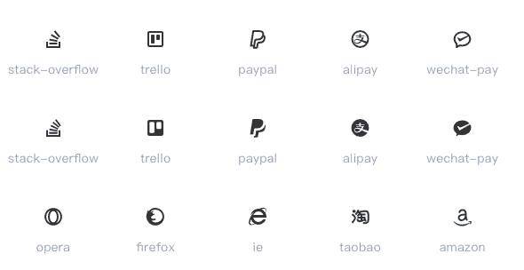](https://res.cloudinary.com/practicaldev/image/fetch/s--CeD8HSFZ--/c_limit%2Cf_auto%2Cfl_progressive%2Cq_auto%2Cw_880/https://thepracticaldev.s3.amazonaws.com/i/sngqj5p2qq53y6f37ajk.png)

**2。亚洲冒险**👉🏼[链接](https://pixelbuddha.net/freebie/asian-adventure-flat-icons-kit)

**3。虚拟现实图标**👉🏼[链接](https://speckyboy.com/freebie-virtual-reality-icon-pack/)

**4。城市生活图标**👉🏼[链接](https://pixelbuddha.net/freebie/city-life-icons-collection)

* * *

#### *产品*

**1。Mac 菜单栏**200 多个 Mac 菜单栏应用的精选目录
👉🏼[链接](https://macmenubar.com/)

[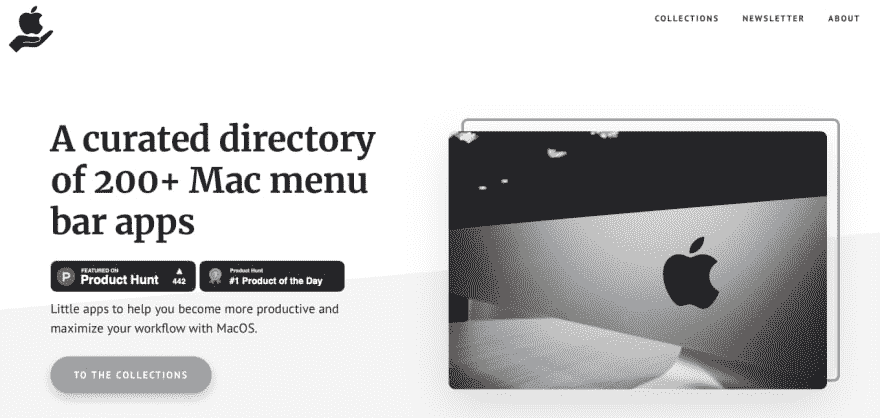](https://res.cloudinary.com/practicaldev/image/fetch/s--nublFDb8--/c_limit%2Cf_auto%2Cfl_progressive%2Cq_auto%2Cw_880/https://thepracticaldev.s3.amazonaws.com/i/zdjh18pifp51szeth2xl.png)

**2。蜘蛛**将网站转化为有组织的数据，无需编码
👉🏼[链接](https://tryspider.com/)

[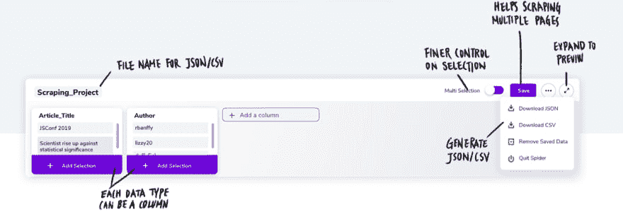](https://res.cloudinary.com/practicaldev/image/fetch/s--pfRsTtFt--/c_limit%2Cf_auto%2Cfl_progressive%2Cq_auto%2Cw_880/https://thepracticaldev.s3.amazonaws.com/i/ymabvoqvldg7jbii025v.png)

**3。快速创建模拟 API。
👉🏼[链接](https://mockit.netlify.com)**

[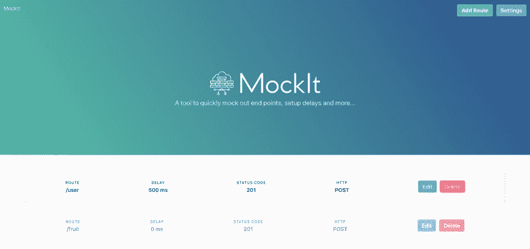](https://res.cloudinary.com/practicaldev/image/fetch/s--BPvDmut1--/c_limit%2Cf_auto%2Cfl_progressive%2Cq_auto%2Cw_880/https://mockit.netlify.com/img/mockit-screen1.png)

**4。🐶MoDDoC** 轻松访问任何国家预防机制包的文档
👉🏼[链接](https://github.com/sarthology/moddoc)

**5。Lorem Picsum** Lorem Ipsum-我...。而是为了照片！
👉🏼[链接](https://picsum.photos)

[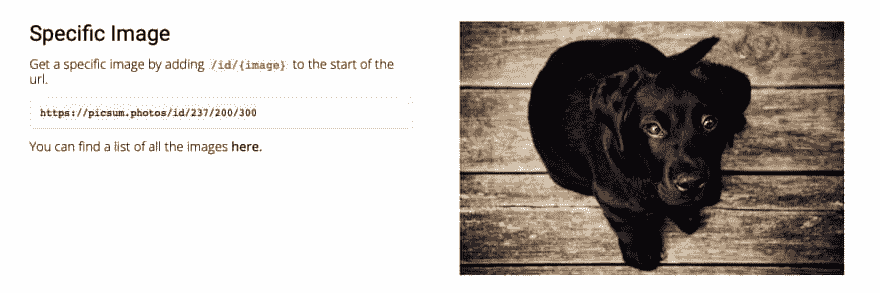](https://res.cloudinary.com/practicaldev/image/fetch/s--ssQ672WD--/c_limit%2Cf_auto%2Cfl_progressive%2Cq_auto%2Cw_880/https://thepracticaldev.s3.amazonaws.com/i/dbkwe3kekhtrdx0z3sw8.png)

* * *

#### *杂项*

**1。概念模板库**👉🏼[链接](https://www.notion.so/Notion-Template-Gallery-181e961aeb5c4ee6915307c0dfd5156d)

[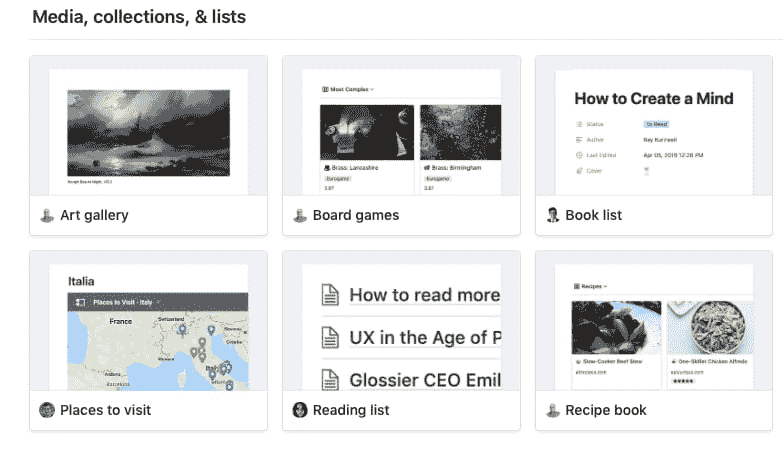](https://res.cloudinary.com/practicaldev/image/fetch/s--xDfG77Ea--/c_limit%2Cf_auto%2Cfl_progressive%2Cq_auto%2Cw_880/https://thepracticaldev.s3.amazonaws.com/i/hawnfcon2ehz4oae8xyj.png)

**2。IMGBIN:免费 PNG 图片**👉🏼[链接](https://imgbin.com)

**3。固体:免费的 HTML 模板**👉🏼[链接](https://cruip.com/solid/)

[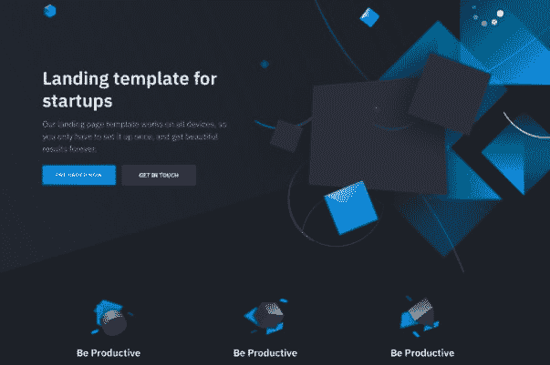](https://res.cloudinary.com/practicaldev/image/fetch/s--IiF4GbHl--/c_limit%2Cf_auto%2Cfl_progressive%2Cq_auto%2Cw_880/https://thepracticaldev.s3.amazonaws.com/i/lhpjbsehaqhs4i4395ue.png)

* * *

### 图书馆🗃

**1。Dropcss** 一款异常快速、彻底且小巧的未使用 css 清洁剂👉🏼[链接](https://github.com/leeoniya/dropcss/)

[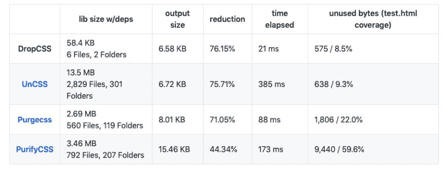](https://res.cloudinary.com/practicaldev/image/fetch/s--C724Py9i--/c_limit%2Cf_auto%2Cfl_progressive%2Cq_auto%2Cw_880/https://thepracticaldev.s3.amazonaws.com/i/6l1c4j46qwfn57lxu928.png)

**2。步进器**动画数字步进器组件👉🏼[链接](https://github.com/alikinvv/stepper/)

[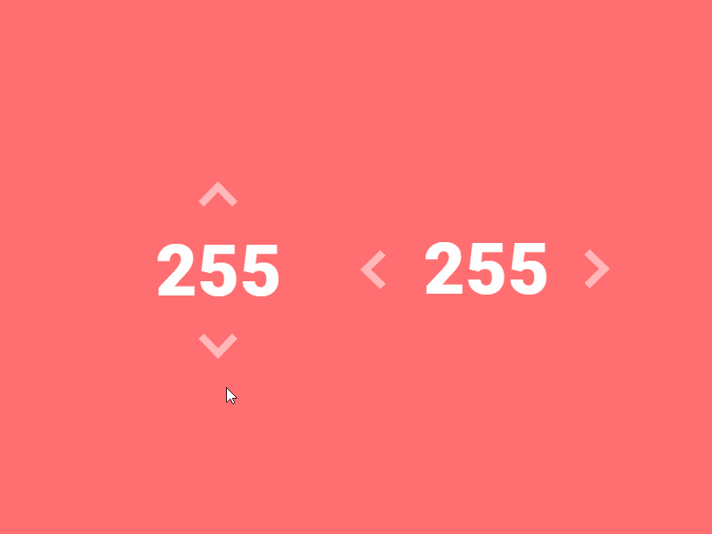](https://res.cloudinary.com/practicaldev/image/fetch/s--8AAcX713--/c_limit%2Cf_auto%2Cfl_progressive%2Cq_66%2Cw_880/https://github.com/alikinvv/stepper/blob/gh-pages/src/img/gif.gif%3Fraw%3Dtrue)

**3。CSS 网格:样式指南**👉🏼[链接](https://codepen.io/oliviale/full/mgWjpq)

[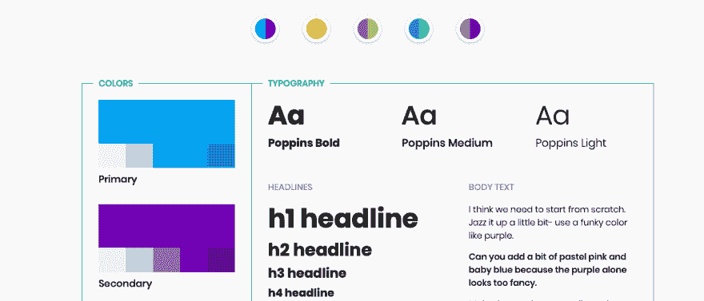](https://res.cloudinary.com/practicaldev/image/fetch/s--B9gYcPgC--/c_limit%2Cf_auto%2Cfl_progressive%2Cq_auto%2Cw_880/https://thepracticaldev.s3.amazonaws.com/i/01l5ylfpy5oliw1sjh8a.png)

**4。Editor.js** 一个具有清晰 JSON 输出的块样式编辑器👉🏼[链接](https://github.com/codex-team/editor.js)

[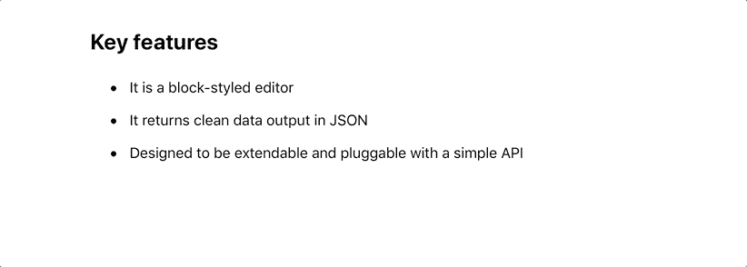](https://res.cloudinary.com/practicaldev/image/fetch/s--9hXVQcjE--/c_limit%2Cf_auto%2Cfl_progressive%2Cq_66%2Cw_880/https://github.com/editor-js/list/raw/master/assets/example.gif)

* * *

### VS 代码素材👩🏻‍💻

放下无聊的 ui，给你的代码注入一些个性吧！

**1。2077 主题**👉🏼[链接](https://marketplace.visualstudio.com/items?itemName=Endormi.2077-theme)

[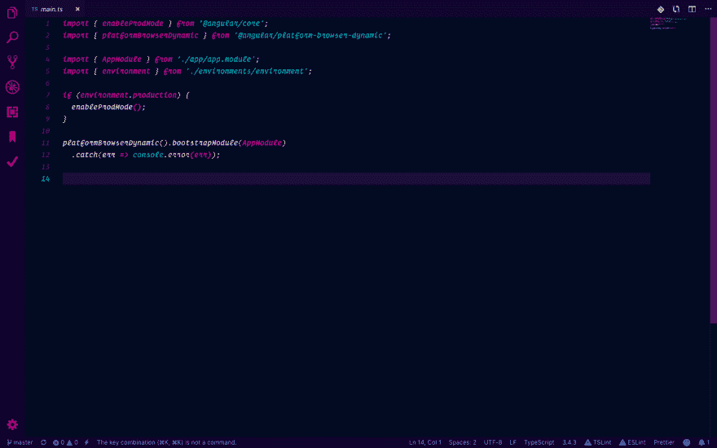](https://res.cloudinary.com/practicaldev/image/fetch/s--FCITj7dg--/c_limit%2Cf_auto%2Cfl_progressive%2Cq_auto%2Cw_880/https://thepracticaldev.s3.amazonaws.com/i/ld5ru6jhct6c7cbs0bkz.png)

**2。宇宙主题**👉🏼[链接](https://marketplace.visualstudio.com/items?itemName=MatiasOlivera.universe)

[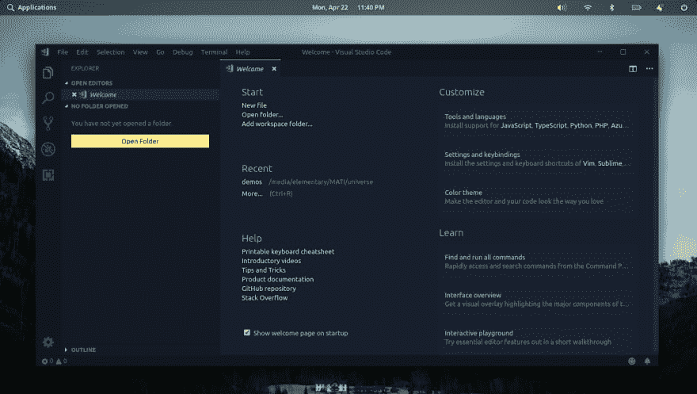](https://res.cloudinary.com/practicaldev/image/fetch/s--DdFZqZvR--/c_limit%2Cf_auto%2Cfl_progressive%2Cq_auto%2Cw_880/https://github.com/MatiasOlivera/universe-theme/blob/master/static/screenshots/universe-blue.png%3Fraw%3Dtrue)

**3。合成波' 84** 👉🏼[链接](https://marketplace.visualstudio.com/items?itemName=RobbOwen.synthwave-vscode)

[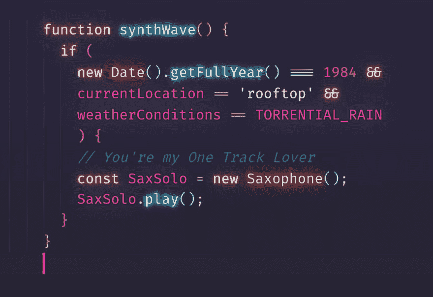](https://res.cloudinary.com/practicaldev/image/fetch/s--vnO7Duwv--/c_limit%2Cf_auto%2Cfl_progressive%2Cq_auto%2Cw_880/https://github.com/robb0wen/synthwave-vscode/raw/master/theme.png)

* * *

### 指南/备忘单📓

**1。Http-headers 指南**👉🏼[链接](https://www.twilio.com/blog/a-http-headers-for-the-responsible-developer)

[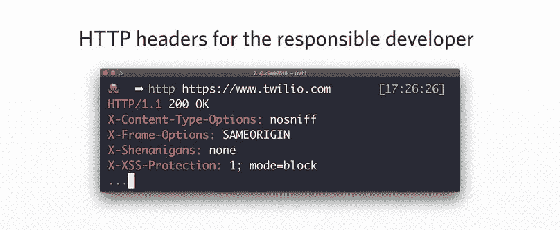](https://res.cloudinary.com/practicaldev/image/fetch/s--LWyKWHSa--/c_limit%2Cf_auto%2Cfl_progressive%2Cq_auto%2Cw_880/https://thepracticaldev.s3.amazonaws.com/i/89uu065zjakpc8g3ltc1.jpg)

**2。CSS 手册**👉🏼[链接](https://medium.freecodecamp.org/the-css-handbook-a-handy-guide-to-css-for-developers-b56695917d11)

**3。React hooks cheatsheet** 👉🏼[链接](https://github.com/ohansemmanuel/react-hooks-cheatsheet)

[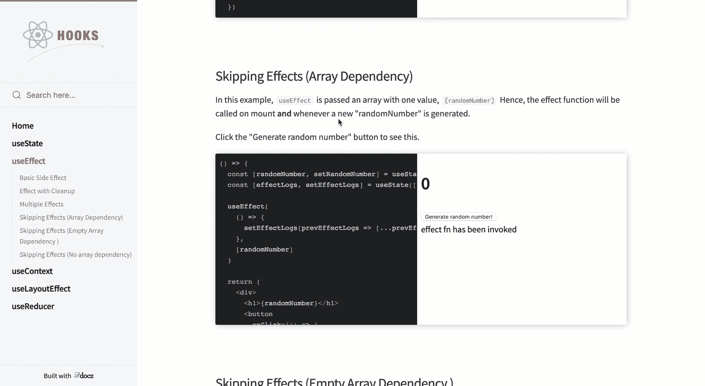](https://camo.githubusercontent.com/ed0352f50efd23a49f85ff2355f318c79fc1233f/68747470733a2f2f692e696d6775722e636f6d2f64734f466e65742e676966)

**4。提交消息指南**👉🏼[链接](https://github.com/RomuloOliveira/commit-messages-guide)

[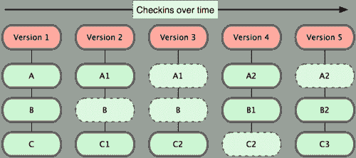](https://camo.githubusercontent.com/461832542a2262717f4cd9e843e8e523a10b83b2/68747470733a2f2f692e737461636b2e696d6775722e636f6d2f41513554472e706e67)

**5。CORS 指南**👉🏼[链接](https://auth0.com/blog/cors-tutorial-a-guide-to-cross-origin-resource-sharing/)

[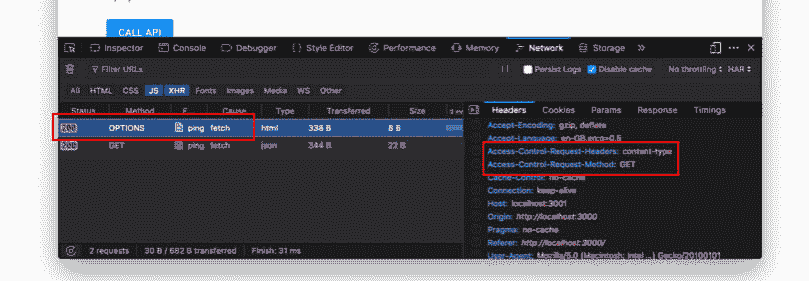](https://res.cloudinary.com/practicaldev/image/fetch/s---wb5zYcn--/c_limit%2Cf_auto%2Cfl_progressive%2Cq_auto%2Cw_880/https://thepracticaldev.s3.amazonaws.com/i/cegw3tzt8h6y7yymyq6z.png)

* * *

### 健康小贴士

这里有一些在编码时要做的椅子练习。过会儿谢谢我。

[https://www.youtube.com/embed/Lg8PFfd85ts](https://www.youtube.com/embed/Lg8PFfd85ts)

## 感谢

感谢阅读这篇文章，伙计们！请在评论区告诉我你对这个新系列的看法。如果你爱它，你知道该怎么做！与你的朋友和家人分享，他们会从中受益。如果你想在下一篇文章中加入一些你自己的东西，请在 [@sarthology](https://twitter.com/sarthology) 给我发 DM，或者如果你有任何建议，欢迎在下面评论。就这样吧，朋友们。回头见。✌

