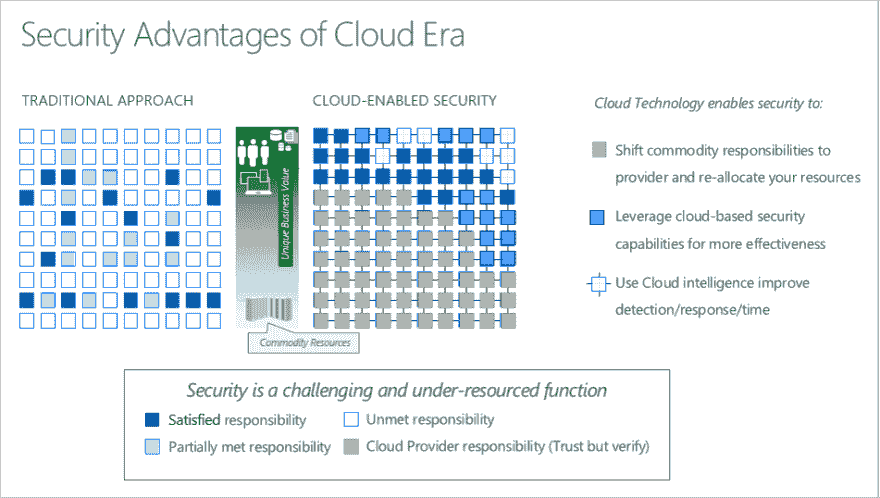
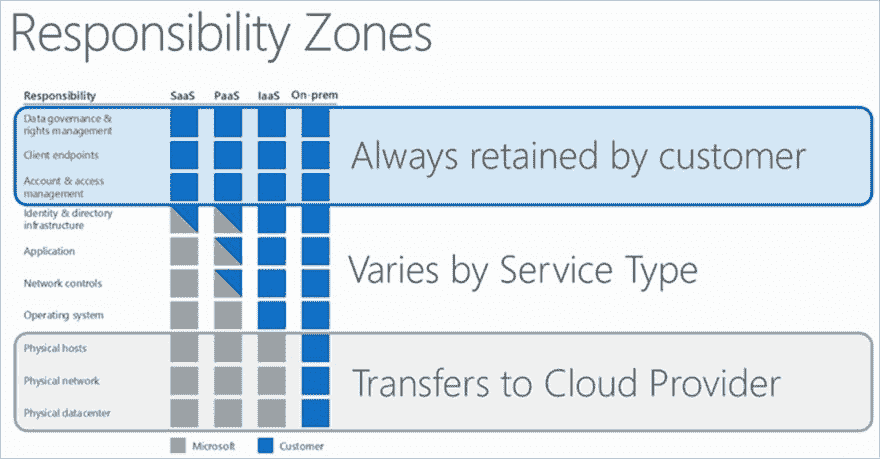
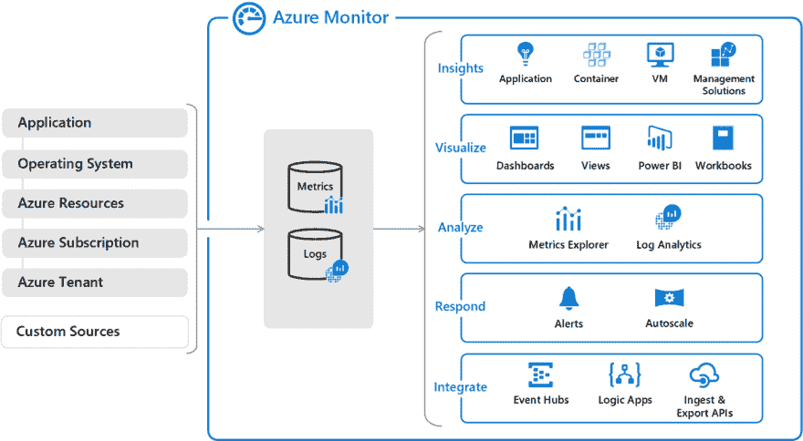

# 了解云安全

> 原文：<https://dev.to/cheahengsoon/understand-cloud-security-1jjm>

**共同责任模式简介**

*   组织面临的挑战:
    *   保护他们的数据中心
    *   招募和留住安全专家
    *   使用许多安全工具
    *   跟上威胁的数量和复杂性
*   将责任转移到 Azure 的好处:
    *   为组织提供增强的安全保护
    *   使组织能够将安全资源和预算分配转移到其他业务优先级  

**弹性和可扩展性概述**

*   DevOps 完全改变了应用程序的开发和维护方式
*   云应用通常会遇到不同的工作负载和活动高峰
*   您可以使用 Azure Monitor 来了解您的应用程序是如何执行的
*   Azure Monitor Autoscale 有助于启用云的弹性扩展功能

**了解虚拟化、容器和无服务器计算**

*   虚拟化创建了一个模拟的或虚拟的计算环境，而不是物理环境
*   然后，每个虚拟机可以独立交互，并运行不同的操作系统或应用程序
*   虚拟化有四个主要类别:
    *   桌面虚拟化
    *   网络虚拟化
    *   软件虚拟化
    *   存储虚拟化
*   Azure 虚拟机允许您在云中创建和使用虚拟机，用于以下场景:
    *   测试和开发
    *   在云中运行应用程序
    *   将您的数据中心扩展到云
    *   灾难恢复
*   容器是经过修改的运行时环境，它可以防止程序访问受保护的资源
*   容器直接与主机操作系统(OS)交互，并增强了包容功能
*   容器不使用虚拟化
*   对于容器管理，微软在 2018 年 4 月发布了 Azure 容器实例
*   您可以将现有应用程序移动到容器中，并在 Azure Kubernetes 服务(AKS)中运行它们
*   无服务器计算是服务器、基础设施和操作系统的抽象
*   当您构建无服务器应用时，您不需要配置和管理任何服务器
*   Azure Functions 是一个无服务器的应用平台
*   Azure Logic Apps 允许开发者添加工作流来支持他们的 Azure 功能
*   无服务器计算通常包含三个方面:
    *   服务器的抽象
    *   事件驱动的规模
    *   微生物研磨