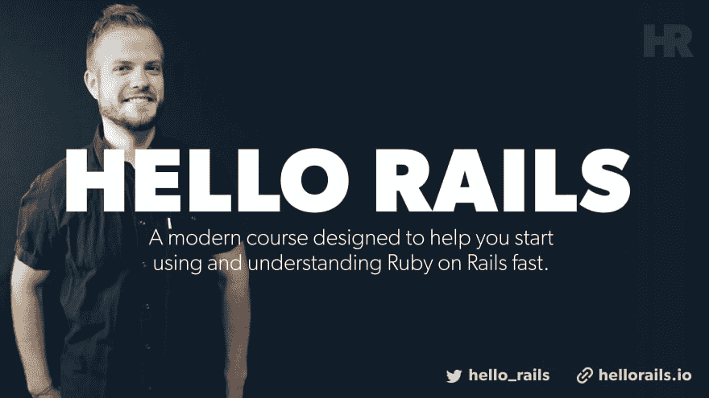

# 了解活动记录迁移

> 原文：<https://dev.to/justalever/understanding-active-record-migrations-5a1n>

活动记录迁移(在 Ruby on Rails 中)是改变一段时间内数据库模式的一种便捷方式。这篇概述/指南介绍了您可以通过迁移实现什么，以及为什么它们是任何给定的 Ruby on Rails 应用程序的主干。我们将讨论约定、技术，以及如何扩展迁移以满足应用程序各自的需求。

[https://www.youtube.com/embed/WJxvcvKgiT8](https://www.youtube.com/embed/WJxvcvKgiT8)

### 什么是迁移？

活动记录迁移使用 Ruby DSL(特定于领域的语言)来自动生成必要的 SQL，因此您不必手动编写它。这允许您保持模式更改独立于数据库。

将每次迁移视为数据库的新版本。您可以添加到模式中，也可以从模式中减去。

查看 schema 的是 Ruby on Rails 应用程序 head to `db/schema.rb`。

迁移的语法可能如下所示:

```
class CreatePosts < ActiveRecord::Migration[5.2]
  def change
    create_table :posts do |t|
      t.string :title
      t.text :content

      t.timestamps
    end
  end
end 
```

Enter fullscreen mode Exit fullscreen mode

迁移后，将创建一个名为`posts`的新数据库表。表内将有一个类型为`string`的`title`列，一个类型为`text`的`column`列，以及两个名为`created_at`和`updated_at`的`timestamp`列，它们可以通过`t.timestamps`行免费获得。

这是通过一个可以从命令行生成的`migration`自动创建的。在大多数情况下，当您在 rails 中创建新模型时，就会“创建”一个表。

可能是这样的:

```
$ rails g model Post title:string content:text 
```

Enter fullscreen mode Exit fullscreen mode

注意这里的惯例。这一代的型号名称需要是单数，但要翻译成复数。所以当命令声明`Post`时。`db/migrate`中的新迁移文件将包含一个`posts`。

`change`方法允许迁移“改变”。因此，在这种情况下，您需要回滚您的数据库:

```
$ rails db:rollback 
```

Enter fullscreen mode Exit fullscreen mode

您可以放心，删除那些表、列等..会顺利发生。

### 创建活动记录迁移

假设您正在为 Ruby on Rails 应用程序构建一个新特性，并且您需要在已经通过在 rails CLI 中创建新模型而生成的表上添加一个新列。

要创建新的迁移，您可以像其他生成器一样从命令行调用它。

```
$ rails generate migration AddSkuNumberToProducts sku_number:string 
```

Enter fullscreen mode Exit fullscreen mode

这里，假设我已经创建了一个`Product`模型/表格。为了扩展这个表，我想为一个`sku`号添加一个新列，以便在内部跟踪它。

我喜欢这里发生的一些神奇的事情:

*   迁移内部人员会知道，如果您在命名迁移的开头添加“add”或“Remove ”,它会自动生成必要的 Ruby DSL 代码来添加或删除列
*   当迁移开始时，文件被打上时间戳并保存到`db/migrate`。在那里，您可以参考它，也可以查看应用程序的迁移历史。
*   在命令行上，您可以选择传递“列”和它们的“类型”以节省一些时间。有些情况下，在创建迁移后手工编写这些文件会更容易。要做到这一点，只需省去任何列名，直接进入生成的文件进行更改。你想申报多少就申报多少。
*   专业提示。如果您需要一个类型为`string`的列。在命令行上，您可以选择省略您传递的列名的`:string`声明。默认情况下，这种类型可以节省时间

上面的迁移生成了以下内容:

```
class AddSkuNumberToProducts < ActiveRecord::Migration[5.2]
  def change
    add_column :products, :sku_number, :string
  end
end 
```

Enter fullscreen mode Exit fullscreen mode

由于迁移命名约定，迁移在数据库的`products`表上生成了正确的变更请求。这种魔力有助于您远离 SQL 的杂草，这是迁移的一大好处。

#### 有益的变体

想要为上次迁移添加索引吗？

```
$ rails generate migration AddSkuNumberToProducts sku_number:string:index 
```

Enter fullscreen mode Exit fullscreen mode

这很简单，只需在要修改的列的末尾传递`:index`。

最后看起来是这样的:

```
class AddSkuNumberToProducts < ActiveRecord::Migration[5.2]
  def change
    add_column :products, :sku_number, :string
    add_index :products, :sku_number
  end
end 
```

Enter fullscreen mode Exit fullscreen mode

### 更高级的伟大

```
$ rails generate migration AddDetailsToProducts 'price:decimal{5,2}' supplier:references{poloymorphic} 
```

Enter fullscreen mode Exit fullscreen mode

您可以用一个 bash 命令做很多事情来生成一个非常独特的迁移。这会生成以下内容:

```
class AddDetailsToProducts < ActiveRecord::Migration[5.2]
  def change
    add_column :products, :price, :decimal, precision: 5, scale: 2
    add_reference :products, :supplier, polymorphic: true
  end
end 
```

Enter fullscreen mode Exit fullscreen mode

#### 类型修饰符

在列和表的顶部，您可以在给定的迁移中传递修饰符。这些可能取决于特定的场景，许多需要手动添加，而不是从命令行添加。从 rails 文档中，我们得到了这个列表。

*   `limit`设置`string/text/binary/integer`字段的最大尺寸。
*   `precision`定义`decimal`字段的精度，代表数字的总位数。
*   `scale`定义`decimal`字段的刻度，代表小数点后的位数。
*   `polymorphic`为`belongs_to`关联添加一个`type`列。
*   `null`允许或不允许列中的`NULL`值。
*   `default`允许在列上设置默认值。请注意，如果您使用的是动态值(如日期)，默认值将仅在第一次计算时计算(即在应用迁移的日期)。
*   `index`为列添加索引。

##### 上下相反变化

如果你在野外看过旧的教程和/或 Rails 应用程序/gems，你可能会注意到每个迁移文件中有不同的语法。

而不是:

```
class CreateProducts < ActiveRecord::Migration[5.2]
  def change
    create_table :posts do |t|
      t.string :title
      t.text :content

      t.timestamps
    end
  end
end 
```

Enter fullscreen mode Exit fullscreen mode

您会看到类似这样的内容:

```
class CreateProducts < ActiveRecord::Migration[5.2]
  def up
    create_table :posts do |t|
     t.string :title
     t.text :content

     t.timestamps
    end
  end

  def down
    remove_table :posts do |t|
     t.string :title
     t.text :content

     t.timestamps
    end
  end
end 
```

Enter fullscreen mode Exit fullscreen mode

两者都工作得很好，尽管`change`方法似乎很枯燥——呃不？当有疑问时，使用它。

我建议不要使用`UP`或`DOWN`方法，而是创建另一个迁移来执行对数据库模式的新更改。

#### 更好的方法？

假设您想要删除之前的`sku_number`条目。您可以为此进行新的迁移。

```
$ rails generate migration RemoveSkuNumberFromProducts sku_number:string 
```

Enter fullscreen mode Exit fullscreen mode

这将在`db/migrate`
中创建一个新文件

```
class RemoveSkuNumberFromProducts < ActiveRecord::Migration[5.2]
  def change
    remove_column :products, :sku_number, :string
  end
end 
```

Enter fullscreen mode Exit fullscreen mode

这更容易回滚，并允许您在需要时旋转应用程序。

### 调用关系

自动定义关系不是很好吗？在许多应用程序中，您需要通过向另一个表添加一个`modelname_id`来关联模型。这可以通过迁移来实现，但是如果您已经知道前进的方向，您也可以加快这个过程。

假设您有一个`Product`模型，您希望将它与给定的用户相关联。(假设您已经建立了一个`User`模型。)

```
$ rails generate migration AddUserRefToProducts user:references 
```

Enter fullscreen mode Exit fullscreen mode

`user:references`行允许您在一个命令中使用适当的索引自动创建一个`user_id`列。

```
class AddUserRefToProducts < ActiveRecord::Migration[5.2]
  def change
    add_reference :products, :user, foreign_key: true
  end
end 
```

Enter fullscreen mode Exit fullscreen mode

### 相关内容

*   [了解 Ruby on Rails ActiveRecord 验证](https://dev.to/justalever/understanding-ruby-on-rails-activerecord-validations-11hj-temp-slug-6531874)
*   [调试 Ruby on Rails](https://dev.to/justalever/debugging-ruby-on-rails-55jk)
*   [了解 Ruby on Rails CLI](https://web-crunch.com/understanding-the-ruby-on-rails-cli/)

### 不要脸的塞！

如果你喜欢这篇文章，我在 [YouTube](https://youtube.com/c/webcrunch) 和我的[博客](https://web-crunch.com)上有更多视频。希望收件箱中有更多这样的内容吗？[订阅我的简讯](https://web-crunch.com/subcribe)自动获取。

#### 查看我的课程

[

T4】](https://hellorails.io)

[](https://res.cloudinary.com/practicaldev/image/fetch/s--WU8p7Cey--/c_limit%2Cf_auto%2Cfl_progressive%2Cq_auto%2Cw_880/https://s.w.oimg/core/emoji/11/72x72/261d.png) 想从头开始学习 Ruby on Rails？查看我即将推出的课程 [Hello Rails](https://hellorails.io) 。

帖子[了解活动记录迁移](https://web-crunch.com/understanding-active-record-migrations/)最早出现在[网站](https://web-crunch.com)上。