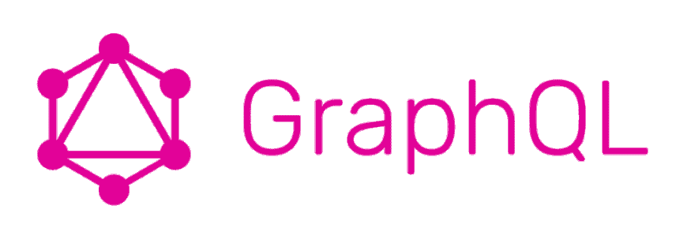
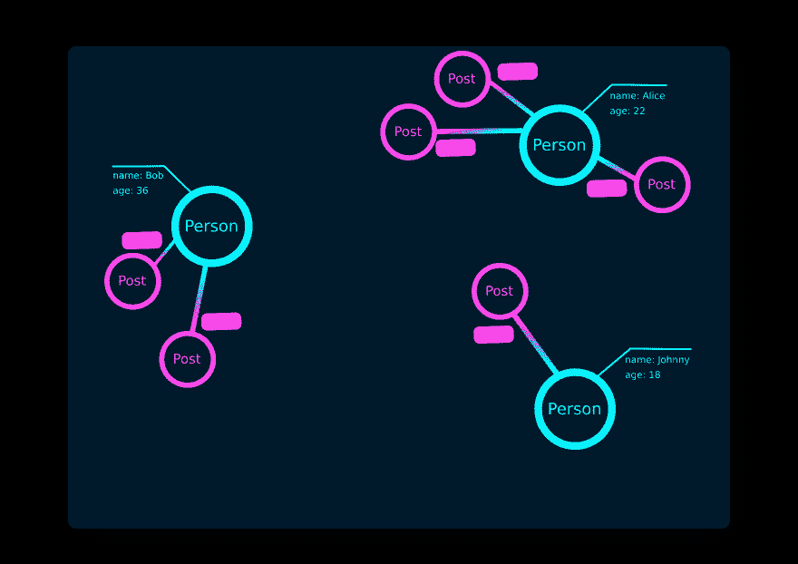

# 了解基本 GraphQL 模式

> 原文：<https://dev.to/dmitryvdovichencko/understanding-basic-graphql-schema-1gnb>

[](https://res.cloudinary.com/practicaldev/image/fetch/s--KqFeFbOb--/c_limit%2Cf_auto%2Cfl_progressive%2Cq_auto%2Cw_880/https://cdn-images-1.medium.com/max/1200/1%2ARHQ7lpGDV_M3yWRa9DiR2g.png)

这是我在 DEV 上的第一篇文章。还有，我不是 GraphQL 的专家，我只是在学，所以...

目标:理解 GraphQL 模式是如何工作的。

我决定和盖茨比一起重建我的作品集网站。于是我开始从[盖茨比教程](https://www.gatsbyjs.org/tutorial/)中学习如何与盖茨比共事。在[教程-第四部分](https://www.gatsbyjs.org/tutorial/part-four/)中，在阅读 Gatsby 中的数据时，我转到了【howtographql 教程】，因为我以前没有使用 graphql 的经验。如果你查看 GraphQL 的基本核心概念，你可以看到一个模式定义的例子:

```
type  Query  {  allPersons(last:  Int):  [Person!]!  }  type  Mutation  {  createPerson(name:  String!,  age:  Int!):  Person!  }  type  Subscription  {  newPerson:  Person!  }  type  Person  {  name:  String!  age:  Int!  posts:  [Post!]!  }  type  Post  {  title:  String!  author:  Person!  } 
```

为了理解它是如何工作的，我用俄语从整篇文章中为自己写了关于核心概念的简短提纲。

我也为视觉创造了图片。希望，它能帮助一些人。

[](https://res.cloudinary.com/practicaldev/image/fetch/s--tzrrXnNX--/c_limit%2Cf_auto%2Cfl_progressive%2Cq_auto%2Cw_880/https://thepracticaldev.s3.amazonaws.com/i/90hhjmdwd077crgzu6bn.png)