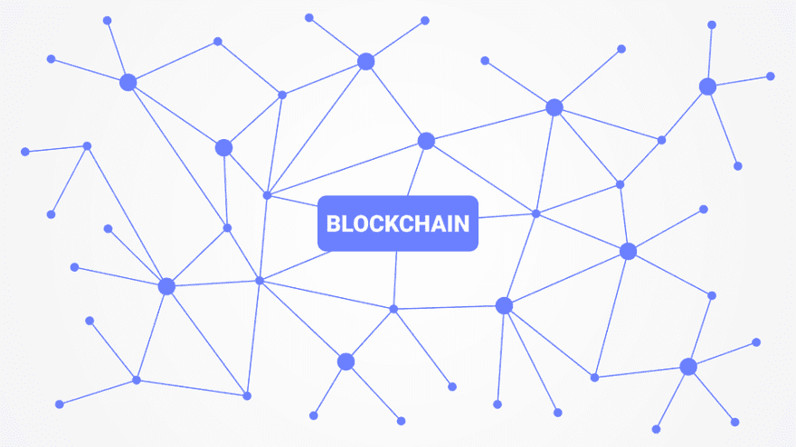
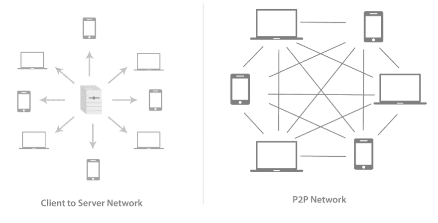
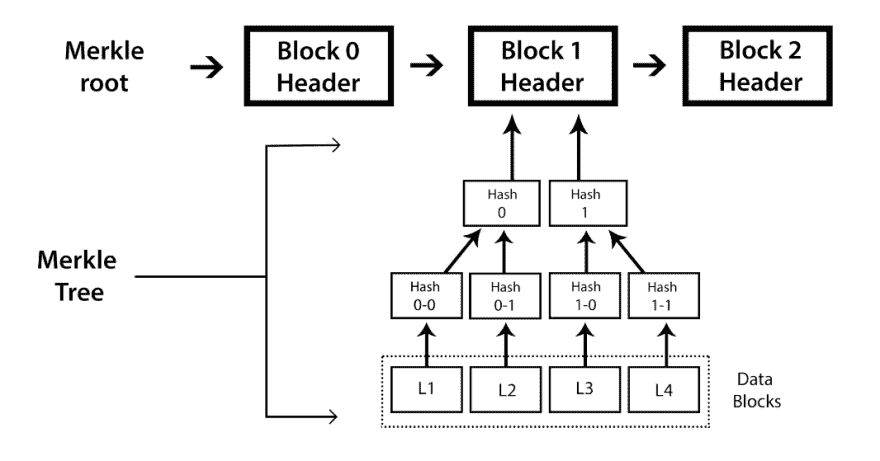
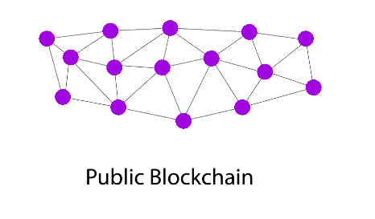
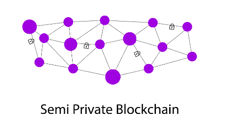
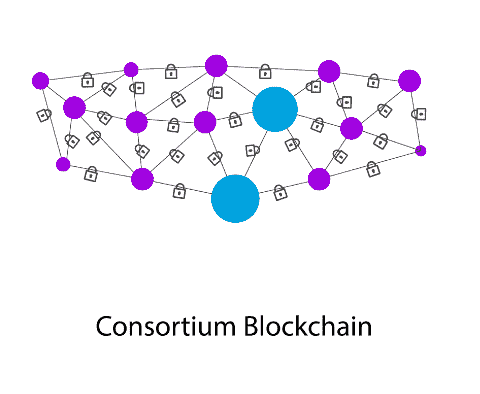

# 了解区块链基本结构

> 原文：<https://dev.to/mairelin/understanding-blockchain-basic-structure-5efg>

区块链的概念是在 2008 年推出的，当时中本聪发布了比特币，他将其描述为纯粹的点对点版本的电子现金。由于区块链技术最初仅用于基于比特币的金融交易，在首字母缩写期间，人们将区块链视为比特币。但是，后来人们看到，区块链机制并不仅仅局限于比特币的金融交易。

区块链是分布式和去中心化的开放平台，由对等体之间的共识协议和协议进行加密管理和更新。知道了这种工作方式后，其他类型的应用开始激增，如以太坊、超级账本等，还有莱特币、命名币等货币。这里列出了使用区块链作为基础技术行业:

加密货币:比特币就是最好的例子。除此之外，还有各种可供选择的加密货币，如以太币、莱特币、对等币等等。

网络安全:有许多公司和项目利用区块链的分布式特性来创建供大众使用的特殊认证协议。

**医疗:**可扩展性是区块链最好的催化剂之一；许多项目都在安全地存储数据，并使用分析得出完美的解决方案。提供分散的患者记录和认证已经在各种机构中使用。

**金融服务:**许多保险和金融机构都在使用区块链来维护大量的银行数据，如财务记录、分类账、担保、债券等等。

**制造:**供应链、原型制作和概念验证，以及货物的跟踪和追踪都在以最高的效率利用区块链。

治理:许多政府都在努力成为世界上第一个由区块链掌权的政府。区块链正在被大多数政府部门使用，而不仅限于公共安全、交通、卫生和航运。

零售:许多创业公司和项目都致力于引入开放的、没有中间商的生态系统；一些公司正在开发忠诚度系统和区块链衍生的礼品卡系统。

**媒体:**唱片公司可以利用区块链来保护其所有权网络和知识产权的安全。

**出行:**一些项目正在进行中，旨在引入并革新汽车租赁、拼车和其他与出行相关的查询。

**法律:**区块链可以带来透明度，并解决日益复杂的法律系统中的缩放问题。

# 区块链结构的一般要素

**对等网络(P2P):** 与传统网络不同，在传统网络中，所有系统都连接到中央服务器，中央服务器充当系统间通信的中心点。P2P 网络可以在不需要中央服务器或主机的情况下相互通信。

传统网络与 P2P 的对比图:

###### 图片摘自 Brenn Hill、Samanyu Chopra、Paul Valencourt、Narayan Prusty 所著的《区块链开发者》一书

**块:**是区块链的最小元素；第一个块称为 genesis 块，每个块包含成批的散列和编码事务。每一个都储存在一个[的](https://hackernoon.com/merkle-trees-181cb4bc30b4)阵型中。

**块头:**包含关于块的元数据。在比特币的情况下考虑以下:*比特币版本、先前块哈希、Merkle 根、时间戳、挖掘难度和 Nonce* 。查看图片:

###### 图片摘自 Brenn Hill、Samanyu Chopra、Paul Valencourt、Narayan Prusty 所著的《区块链开发者》一书

**地址:**地址是区块链交易中使用的唯一标识符，用于向另一个地址发送数据；就比特币而言，地址是用于发送或接收比特币的标识符。

**钱包:**用于存储交易的公钥或私钥以及地址。有各种类型的钱包可供选择。

*软件:*这个钱包安装在实际电脑上；私钥由安装了钱包软件的机器的所有者访问。

网络钱包:这些钱包基于云，可以在任何地方访问。私钥与钱包服务共享。

*纸钱包:*这个钱包的私钥是印在纸上的。

*硬件:*这些是实体钱包，本质上是小巧便携的。每个钱包的硬件用户都有私钥。

**交易:**是将数据从区块链的一个地址转移到另一个地址的过程。

**节点:**是由区块链网络的参与者管理的分类账的副本。

# 区块链网络的类型

我们可以根据访问类型和节点将区块链分为多种类型:

###### 图片摘自 Brenn Hill、Samanyu Chopra、Paul Valencourt、Narayan Prusty 所著的《区块链开发者》一书

**公共区块链:**是一个区块链，世界上任何人都可以成为交易过程中的一个节点。这是一个完全开放的公共分类账系统。公共区块链也可以被称为无许可账簿。这种类型的区块链的一些流行的例子是比特币、以太坊、莱特币等等。

###### 图片摘自 Brenn Hill、Samanyu Chopra、Paul Valencourt、Narayan Prusty 所著的《区块链开发者》一书

**半私有区块链:**通常由单个组织或一组个人运营，他们向任何用户授予访问权限，这些用户可以是直接消费者或用于内部组织目的。这种类型的区块链有一个面向普通观众的公共部分，任何人都可以参与。

###### 图片摘自 Brenn Hill、Samanyu Chopra、Paul Valencourt、Narayan Prusty 所著的《区块链开发者》一书

**私有区块链:**在这一个中，写权限是与一个组织或与某一组个人。

###### 图片摘自 Brenn Hill、Samanyu Chopra、Paul Valencourt、Narayan Prusty 所著的《区块链开发者》一书

**财团区块链:**在这种类型的区块链中，共识力量被限制在一组人或节点中。它也可以被称为一个许可私人区块链。

# 共识

共识是网络的所有参与者就交易的有效性达成一致的过程，确保分类账是彼此的精确副本。对于这个过程，使用共识机制，对于处理验证，区块链的一些主要共识机制如下:

**工作证明(PoW)** 这是最常用的共识机制，也是有史以来第一种加密货币比特币所使用的。这种算法已经证明对 Sybil 攻击是最成功的。

**股份证明(PoS)** 这使得那些拥有最高加密货币数量的人更容易挖掘新区块。

**委托股权证明(DPOS)** 它与 POS 相比的一个小变化是，每个有股权的节点都可以通过投票的方式将交易的验证委托给其他节点。

**重要性证明(POI)** 这是为了节能而设计的，也可以在功能相对较弱的机器上运行。它依靠赌注以及代币的使用和移动来建立信任和重要性。

**运行时间证明(PoET)** 这是由英特尔创建的一种区块链算法，使用可信执行环境(TEE)在投票过程中使用有保证的等待时间来实现随机性和安全性。

**烧录证明(PoB)** 这主要用于将一种加密货币引导到另一种加密货币。基本概念是矿工要证明自己烧过硬币，也就是把硬币送到了一个可验证的不可描述的地址。

**活动证明(PoA)** 在这种情况下，从整个网络中选择一个随机对等体来签署必须防篡改的新块。

*有一个了解区块链结构及其用途的路线图，阅读密码经济学和传统金融交易的一些概念也很重要，比如基于信用卡的支付流程。想深入了解可以跟着参考:*

## 主要引用:

[区块链开发者指南](https://www.packtpub.com/big-data-and-business-intelligence/blockchain-developers-guide)

## 其他:

[区块链基本词汇](https://blockgeeks.com/guides/blockchain-glossary-from-a-z/)
[成为区块链开发商](https://blockgeeks.com/guides/blockchain-developer)