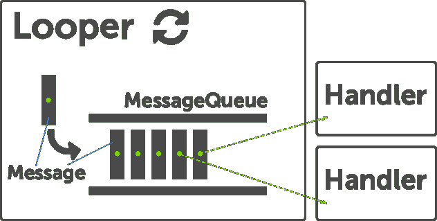

# 了解处理器、弯针和处理器线程

> 原文：<https://dev.to/anuj/understanding-handler-looper-and-handler-thread-3anf>

在我的第一篇文章中，我将尝试简化处理程序、循环程序和处理程序线程类以及它们之间的关系。直到现在，我一直在努力理解它们之间的关系。所以我想为其他像我一样的人简化这个。

让我们开始吧。

首先让我们看看什么是处理线程:处理线程只不过是一个执行特定任务的简单线程(如在 Java 中)。它最终扩展了 Thread 类并实现了它的 run 方法。要启动它，我们可以像 Java 中所有其他线程一样使用 Thread.start()方法。

那么区别在哪里呢？

想象一下，你遇到了一个问题，你想让你的线程运行，你可以向它发送任务，让它执行这些任务，我的意思是你想重用你的线程。在 Java 中这样做的方法是

保持线程活动，即不要让它脱离 run 方法。维护一个队列并在其中发布你的任务。
在你的运行方法中处理队列，即一个接一个地执行任务，或者当任务来临时
完成/终止线程一旦完成
我猜你看到了你必须管理很多事情的问题，如果不是很多，那么至少你应该非常小心使用这种方法。但是处理线程的好处是你可以避免所有这些。它附带了一个相关的消息队列，一旦线程启动，它可以用来发送任何消息/任务到这个线程。那么处理线程是如何做到的呢？

Android 有 3 个主要组件来处理 HandlerThread 使用的这些组件。让我们过一遍。
[T3】](https://res.cloudinary.com/practicaldev/image/fetch/s--Nj15dkTo--/c_limit%2Cf_auto%2Cfl_progressive%2Cq_auto%2Cw_880/https://thepracticaldev.s3.amazonaws.com/i/953lp2lvq3f0mrq9jsx5.png)

Looper: Looper 是一个保持线程活动的工作器，它在消息队列中循环，并将消息发送到各自的处理程序。

Handler:这个类负责将任何任务加入消息队列并处理它们。每个处理程序可以与一个线程和该线程的消息队列相关联。

Message Queue:这个类保存了由 looper 发送的消息列表。您可以调用 Looper.myqueue()来获取消息列表。我们通常不处理它。

当然，你也可以在普通的线程类中使用以上三个组件。你可以创建自己的线程，并使用上述所有组件。完成此操作的过程如下所述

创建一个线程类
调用 Looper.prepare 内部运行方法。
实例化你的 Handler 类，实现 handleMessage 方法。
调用 Looper.loop()
我可以写代码做到这一点，但因为我不希望你遵循这种方法，我将跳过它。由于这不是非常有效的方式，所以 Android 通过引入 HandlerThread 简化了工作。

我们可以编写自己的类来扩展 HandlerThread..每个 HandlerThread 类都有一个与。我们可以使用这个循环来创建处理程序，然后我们可以开始向这个线程发送消息。

做它的步骤。

创建一个扩展 Handler 的类 Thread
实例化你的 handlerThread class
调用 start 方法//你的线程正在运行
从上面创建的处理程序线程中使用 looper 创建/实例化你的处理程序

公共抽象类 BaseHandlerThread 扩展 HandlerThread
{
公共 BaseHandlerThread(字符串名)
{
super(名称)；
}
@ Override
protected void onLooperPrepared()
{
init handler()；

}
私有 void init Handler()
{
mHandler = new Handler(get looper()){
@ Override
公共 void handleMessage(Message msg)
{
//
}
}；
}
}
我们可以简单地创建 BaseHandlerThread 的实例，然后在其上调用 start()方法。一旦开始，Looper 就做好准备。在 Looper 准备好之后，我们得到一个回调，在这里我们初始化处理程序。只有在活套操作系统准备好之后，才能初始化处理器。现在，您可以使用该处理程序将消息排队。
当你想终止这个线程时，只需在你的处理线程实例上调用 quitSafely()方法，或者对于比 JELLY_BEAN_MR2 旧的操作系统版本调用 quit()。

当您不想创建单独的类，但仍想使用 HandlerThread 时，您可以遵循以下步骤。注意，当您创建一个新的处理程序时，它被绑定到创建它的线程的线程/消息队列。所以一定要确定你是如何创建处理程序的。

//创建处理程序
mHandlerThread = new Handler thread(" name ")；
mhandlerthread . start()；
mHandler = new Handler(mhandlerthread . get looper())；
差不多了。请随意分享您的意见并指出需要改进的地方。