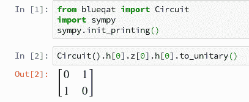
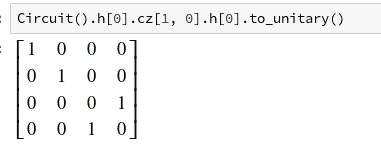
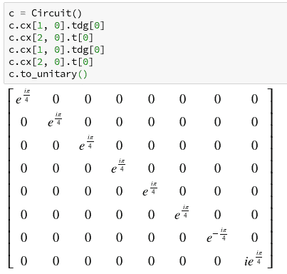
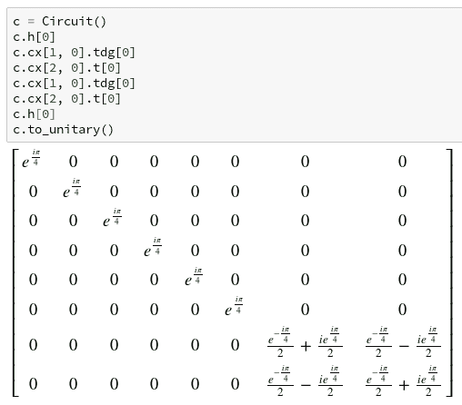
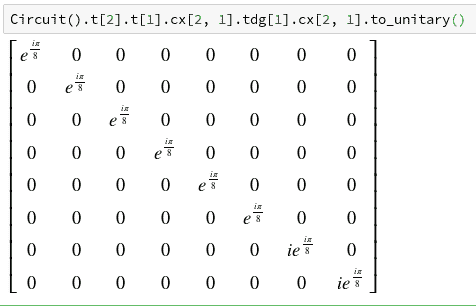
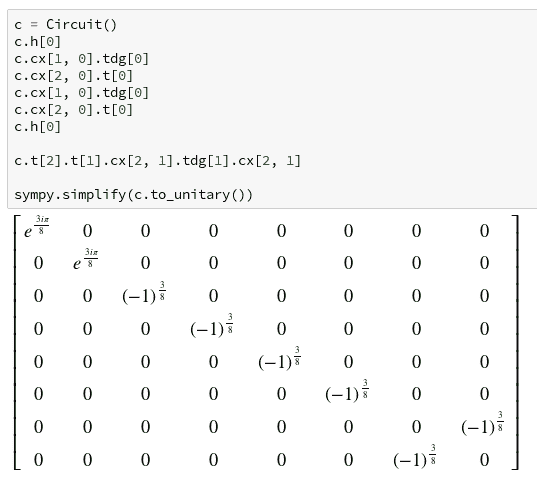
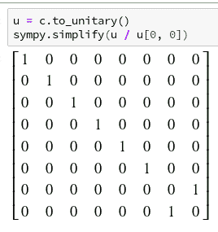

# 了解如何使用 Blueqat 创建 Toffoli 门

> 原文：<https://dev.to/beef_and_rice/understanding-how-to-create-toffoli-gate-using-blueqat-39en>

# 什么是 Blueqat？

Blueqat 是量子计算机的开源库。
[https://github.com/Blueqat/Blueqat](https://github.com/Blueqat/Blueqat)

## 如何安装 Blueqat？

Blueqat 作为 Python(3.6 版以上)库提供。你可以通过 pip 安装。

```
pip install blueqat 
```

# 什么是托夫里门？

托夫里门是二控非门。如果两个控制量子位都是|1 >，Toffoli 门翻转一个目标量子位(|0> → |1 >，|1> →|0 >)，否则什么也不做。

## 托夫里门真值表

| c1 | c2 | t |
| --- | --- | --- |
| Zero | Zero | 0 → 0 |
| Zero | Zero | 1 → 1 |
| Zero | one | 0 → 0 |
| Zero | one | 1 → 1 |
| one | Zero | 0 → 0 |
| one | Zero | 1 → 1 |
| one | one | 0 → 1 |
| one | one | 1 → 0 |

## IBM open qasm 的 Toffoli 门实现

OpenQASM 的标准库`qelib1.inc`定义了 Toffoli 门。下面是它的定义。

```
gate ccx a,b,c
{
  h c;
  cx b,c; tdg c;
  cx a,c; t c;
  cx b,c; tdg c;
  cx a,c; t b; t c; h c;
  cx a,b; t a; tdg b;
  cx a,b;
} 
```

“h”是 Hadamard 门，“cx”是 CNOT 门，“T”是将布洛赫球体 Z 轴旋转π/4 弧度的 T 门，“tdg”是将布洛赫球体 Z 轴旋转-π/4 弧度的 T 门。

为了理解这种实现，我们对一些操作进行重新排序。通常，门控操作是不可替换的。然而，有些门是可以互换的，例如对于第 I 个量子位和第 j 个量子位的单量子位操作，如果 i ≠ j，它们是可以互换的。cx a、b 和 t a 也是可互换的，因为 T 门只旋转 Z 轴，而 CNOT 门不介意控制量子位的相位。

这是重新排序的实现。

```
gate ccx a,b,c
{
  h c;
  cx b,c; tdg c;
  cx a,c; t c;
  cx b,c; tdg c;
  cx a,c; t c;
  h c;
  t a; t b;
  cx a,b; tdg b; cx a,b;
} 
```

这个实现可以分为两个部分。第一部分是除相位调整外的 ccx，第二部分是调整相位因子。

# 创建托夫里门

第一部分，一些操作夹在哈达玛门之间。

```
 h c;
  cx b,c; tdg c;
  cx a,c; t c;
  cx b,c; tdg c;
  cx a,c; t c;
  h c 
```

从结论开始，两个受控 Z 门夹在 H 门中间。
我们知道，-H-Z-H 门就是 X 门。我们可以用 Blueqat 确认一下。

```
from blueqat import Circuit
print(Circuit().h[0].z[0].h[0].to_unitary())
# => Matrix([[0, 1], [1, 0]]), This is X gate.
# We can see X gate definition by print(Circuit().x[0].to_unitary())
# => Matrix([[0, 1], [1, 0]]), Yes! They're same! 
```

如果你使用 Jupyter 笔记本，你可以得到更漂亮的显示。

[](https://res.cloudinary.com/practicaldev/image/fetch/s--ilGpPvVo--/c_limit%2Cf_auto%2Cfl_progressive%2Cq_auto%2Cw_880/https://thepracticaldev.s3.amazonaws.com/i/2qywhf9sf665pnpuhina.png)

夹在 H 门之间用于目标量子位的受控 Z 门是 CNOT 门。

[](https://res.cloudinary.com/practicaldev/image/fetch/s--A1qHv-nA--/c_limit%2Cf_auto%2Cfl_progressive%2Cq_auto%2Cw_880/https://thepracticaldev.s3.amazonaws.com/i/e4iew92e1pc7flzykau1.png)

与此相同，夹有 H 门的 2 控 Z 门是 Toffoli 门。然而，在这一部分，我们会得到奇怪的 2 控制的 Z 门，因为调整相位因子还没有。

让我们用 Blueqat 实现 2-控制 Z 门。

```
cx b,c; tdg c;
cx a,c; t c;
cx b,c; tdg c;
cx a,c; t c; 
```

我们选择 a = 2，b = 1，c = 0。实施非常容易。

```
from blueqat import Circuit
c = Circuit()
c.cx[1, 0].tdg[0]
c.cx[2, 0].t[0]
c.cx[1, 0].tdg[0]
c.cx[2, 0].t[0]
c.to_unitary() 
```

[](https://res.cloudinary.com/practicaldev/image/fetch/s--NBmEFvKF--/c_limit%2Cf_auto%2Cfl_progressive%2Cq_auto%2Cw_880/https://thepracticaldev.s3.amazonaws.com/i/34wdncts7shfixwjsqkq.png)

相位因子很奇怪，但类似于 2 控 Z 门。

在第一次操作之前和最后一次操作之后增加 H 门。

[](https://res.cloudinary.com/practicaldev/image/fetch/s--asAgdmf3--/c_limit%2Cf_auto%2Cfl_progressive%2Cq_auto%2Cw_880/https://thepracticaldev.s3.amazonaws.com/i/deal17mw7i8uk4zkzpvq.png)

这是托夫里门吗？这似乎不是一个托夫里门。但是如果我们知道，`exp(-iπ/4) = i * exp(iπ/4)`，我们可以感觉到它类似于托夫里门。

Blueqat 的酉门是 Sympy 矩阵，Sympy 可以自动简化这些术语。让我们简化酉矩阵。

[](https://res.cloudinary.com/practicaldev/image/fetch/s--Uokj61n7--/c_limit%2Cf_auto%2Cfl_progressive%2Cq_auto%2Cw_880/https://thepracticaldev.s3.amazonaws.com/i/ifd189cet9vvy70gsoe2.png)

除相位因子外，它与托夫里门相同。

然后，我们将看到第二部分。

```
 t a; t b;
 cx a,b; tdg b; cx a,b; 
```

这是什么意思？通过 Blueqat 检查。

[](https://res.cloudinary.com/practicaldev/image/fetch/s--uFlF65MB--/c_limit%2Cf_auto%2Cfl_progressive%2Cq_auto%2Cw_880/https://thepracticaldev.s3.amazonaws.com/i/5vl7q39m976qsu7khqur.png)

哇！如果量子位 1 和量子位 2 都是|1 >，则该部分乘以相位因子 I。

最后，我们结合第一部分和第二部分。

[](https://res.cloudinary.com/practicaldev/image/fetch/s--yiKuOumH--/c_limit%2Cf_auto%2Cfl_progressive%2Cq_auto%2Cw_880/https://thepracticaldev.s3.amazonaws.com/i/xirio2n8w5mxxfzpiicy.png)

出什么事了吗？别担心。首先，`exp(3iπ/8) = (-1)^3/8`因为`-1 =exp(iπ)`然后，我们可以忽略酉矩阵的标量部分，它是“全局相位”。

因此，除以第[0，0]个元素并简化矩阵，我们可以得到 Toffoli 门矩阵。

[](https://res.cloudinary.com/practicaldev/image/fetch/s--Zkd9xFib--/c_limit%2Cf_auto%2Cfl_progressive%2Cq_auto%2Cw_880/https://thepracticaldev.s3.amazonaws.com/i/uaw3jmxi8ghsc7n8rbga.png)

完美！

# 多学习 Blueqat！

我是 Blueqat 的核心开发者。Blueqat 为量子计算提供了非常简单易用的界面。学习量子计算机编程，推荐使用 Blueqat。

我们准备了 Blueqat 教程，我们将增加越来越多的内容。
[https://github.com/Blueqat/Blueqat-tutorials](https://github.com/Blueqat/Blueqat-tutorials)

如果您有任何问题或建议，请随时通过我们的 [Slack 社区](https://blueqat2.slack.com/)联系我们。(从[这里](https://join.slack.com/t/mdrqcglobal/shared_invite/enQtNjM1NDgxMjg2NDY4LWJmNjU1Mzk1OTcwN2IwZTY3ZjUyOTM3ZDZjNjJiMzkwZTc2ZmQ0OTY4YTgyN2JmZTQzY2VjMmIxMTk1NTE0YmM)加入)

Blueqat 仓库在这里。
[https://github.com/Blueqat/Blueqat](https://github.com/Blueqat/Blueqat)