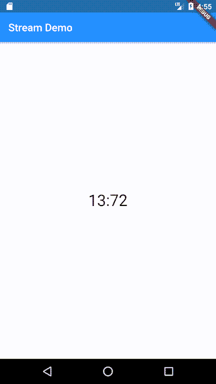

# 了解 Flutter 中的流(Dart)

> 原文：<https://dev.to/nitishk72/understanding-streams-in-flutter-dart-2pb8>

# 了解溪流在颤动(飞镖)

对于初学者来说，流是一个具有挑战性的话题。需要很大的努力才能理解。为了理解流，你将需要通过各种例子，然后你会得到流到底是什么。

在这篇文章的最后，我将编写一个 Flutter 应用程序，它将基于我在 Dart 中讨论过的同一个例子。

我也将把我对溪流的理解融入单词和例子中。

流是一个概念镖。因此，我将从 Dart 中的流开始，以在 Flutter 中应用这些概念结束。

> # Dart 中异步编程的特点是[未来](https://api.dartlang.org/stable/dart-async/Future-class.html)和[流](https://api.dartlang.org/stable/dart-async/Stream-class.html)类。
> 
> 什么是未来？

*   一个[未来](https://api.dartlang.org/stable/2.2.0/dart-async/Future-class.html)被用来表示一个潜在的值，或误差，它将在未来的某个时间可用。> #一个具有潜在价值的未来的简单例子。

```
 // asynchronous data 
    main() async {
      String x = await HelloAsync();
      print(x);
    }

    Future<String> HelloAsync() async{
       await Future.delayed(Duration(seconds:5));
       return 'Message from Future.';
    } 
```

> 为什么是溪流？

*   流提供了异步的数据序列。

**流和未来有多相似？**

*   两者异步工作

*   两者都有一些潜在的价值

**流和未来有什么不同？**

*   现金流是未来的组合

*   Future 只有一个响应，但是 Stream 可以有任意数量的响应。

如果你曾经在你的 flutter 应用程序中向任何 API 发送过任何请求，那么你可能知道 async(未来)。

> # There are two kinds of flows:

1.  **单个订阅**:该流可能有一个** *最多一个收听者***。

2.  **广播**:这个流可能有无限个*听众*。

我将在这篇文章中讨论的所有例子都是基于单一订阅的。一旦你理解了单一订阅，那么你就可以很容易地理解广播。

> # We use examples to understand this

这个例子的主要目的是让你理解流是如何工作的。这些例子将使你熟悉一些可用的方法和流的属性。

## 流方法

所有可用的例子都可以在 Dartpad 上运行。我强烈建议您运行这些示例，看看输出的模式并理解它们。
[镖靶](https://dartpad.dartlang.org/)

# 例 1:

> 溪流。周期性()→ [流<T>T1】](https://api.dartlang.org/stable/2.3.0/dart-async/Stream-class.html)

```
// asynchronous data 
main() async {
  Duration interval = Duration(seconds: 2);
  Stream<int> stream = Stream<int>.periodic(interval, callback);

  await for(int i in stream){
    print(i);
  }
}

// This callback modify the given value to even number.
int callbank(int value){
  return ( value + 1 ) * 2;
} 
```

让我们来了解一下流的创建。

溪流。periodic:创建以周期间隔重复发出事件的流。

这是一个基本的流，你可以很容易地创建它，让任何人都了解它。

如果省略 callback，事件值将全部为空。

*   该流每秒向我们提供数据，因为我们已经将间隔指定为 2 秒。

*   这个回调的参数是一个整数，从 0 开始，每发生一次事件就递增一次。

*   这是一个无限的数据流，因为我们没有指定任何条件。

# 例二:

> Stream . take(int count)→[Stream<T>T1】](https://api.dartlang.org/stable/2.3.0/dart-async/Stream-class.html)

让我们创建一个有限流

```
// asynchronous data 
main() async {
  Duration interval = Duration(seconds: 1);
  Stream<int> stream = Stream<int>.periodic(interval,transform);
  // Added this statement
  stream = stream.take(5);

await for(int i in stream){
    print(i);
  }
}

int transform(int x){
  return (x + 1) * 2;
} 
```

*   这是一个有限的数据流，因为我们没有指定条件。条件表明只发出指定的数据事件。这将打印 2，4，6，8，10。

*   **take** : take(int count)基于事件的数量

# 例 3:

> Stream . take while(bool test(T element))→[Stream<T>T1】](https://api.dartlang.org/stable/2.3.0/dart-async/Stream-class.html)

您还可以指定返回值的条件。

```
// asynchronous data 
main() async {
  Duration interval = Duration(seconds: 1);
  Stream<int> stream = Stream<int>.periodic(interval,transform);
  // Added this statement
  stream = stream.takeWhile(condition);
  await for(int i in stream){
      print(i);
   }
}
int transform(int x){
  return (x + 1) * 2;
}  
// Added this function
bool condition(int x){
  return x <= 10;
} 
```

*   **take while**:take while(bool test(T element))基于事件发出的值。

# 例 4:

> Stream . skip(int count)→[Stream](https://api.dartlang.org/stable/2.3.0/dart-async/Stream-class.html)

您可以跳过一些首次发出的事件。

```
// asynchronous data 
main() async {
  Duration interval = Duration(seconds: 1);
  Stream<int> stream = Stream<int>.periodic(interval,transform);
  stream = stream.take(10);
  stream = stream.skip(2);
  await for(int i in stream){
      print(i);
   }
}
int transform(int x){
  return (x + 1) * 2;
} 
```

*   这将跳过前两个发出的事件

# 例 5:

> Stream . skip while(bool test(T element))→[Stream](https://api.dartlang.org/stable/2.3.0/dart-async/Stream-class.html)

您也可以根据事件值跳过事件。

```
// asynchronous data 
main() async {
  Duration interval = Duration(seconds: 1);
  Stream<int> stream = Stream<int>.periodic(interval,transform);
  stream = stream.take(10);
  stream = stream.skipWhile(condition);
  await for(int i in stream){
      print(i);
   }
}
int transform(int x){
  return (x + 1) * 2;
}
bool condition(int x){
  return x < 5;
} 
```

*   如果测试通过，那么它将跳过这些值。

*   一旦测试失败，它将开始发出值。

*   如果测试失败，它将停止检查条件。

# 例 6:

> Stream.toList() →未来< List < T >>

该方法从流中收集所有数据并存储在列表中。

```
// asynchronous data 
main() async {
  Duration interval = Duration(seconds: 1);
  Stream<int> stream = Stream<int>.periodic(interval,transform);
  stream = stream.take(5);
  List<int> data = await stream.toList();
  for(int i in data){
      print(i);
   }
}
int transform(int x){
  return (x + 1) * 2;
} 
```

*   这是异步的，意味着你需要等待一段时间来完成任务。

*   当这个流结束时，返回的未来用那个列表完成。

# 例 7:

> 溪流。listen()→[stream subscription<T>T1】](https://api.dartlang.org/stable/2.3.0/dart-async/StreamSubscription-class.html)

有一种特定的方法可以监听数据流。我喜欢 for 循环方法，因为它更友好。

```
// asynchronous data 
main() async {
  Duration interval = Duration(seconds: 1);
  Stream<int> stream = Stream<int>.periodic(interval,transform);
  stream = stream.take(10);

  stream.listen((x){
    print(x);
  });

}
int transform(int x){
  return (x + 1) * 2;
} 
```

# 例 8:

> 溪流。forEach() →未来

有一种特定的方法可以监听数据流。我喜欢 for 循环方法，因为它更友好。

```
// asynchronous data 
main() async {
  Duration interval = Duration(seconds: 1);
  Stream<int> stream = Stream<int>.periodic(interval,transform);
  stream = stream.take(10);

  stream.forEach((int x){
    print(x);
  });

}
int transform(int x){
  return (x + 1) * 2;
} 
```

## 流属性

# 例 9:

> 溪流。长度→ [未来<int>T1】](https://api.dartlang.org/stable/2.3.0/dart-async/Stream-class.html)

```
// asynchronous data 
main() async {
  Duration interval = Duration(seconds: 1);
  Stream<int> stream = Stream<int>.periodic(interval);
  stream = stream.take(10);
  print(await stream.length);
} 
```

*   长度是流的属性。

*   它指定发出事件的数量。

*   等待所有事件在流中发出。

现在我将基于上面的例子创建一个简单的颤振应用程序。我很肯定你会理解流是如何在一个 flutter 应用中工作的。在颤振应用中，有各种使用流的方法。我给你看其中一个。

[](https://res.cloudinary.com/practicaldev/image/fetch/s--9U5dZ0J6--/c_limit%2Cf_auto%2Cfl_progressive%2Cq_66%2Cw_880/https://cdn-images-1.medium.com/max/2000/1%2ApJDmkYh_6i6EVYzMl6wkDA.gif)

要构建类似这样的应用程序，每个初学者都会使用 build a Stateful Widget，并且可能会反复使用 setState((){})来更新 UI。

我要建立一个完全相同的应用程序，如图所示

*   无状态小部件

*   没有 setState((){})(不能用无状态调用 setState((){})

*   我将使用 Stream

*   我将使用 StreamBuilder

这个 StreamBuilder 是什么？

StreamBuilder 监听流，并在每一个由[流](https://docs.flutter.io/flutter/dart-async/Stream-class.html)发出的新事件上构建自己。

让我们看看流构建器的实现。

```
child: StreamBuilder<T>(
  stream: stream, // a Stream<int> or null
  builder: (BuildContext context, AsyncSnapshot<T> snapshot) {
    if (snapshot.hasError) return Text('Error: ${snapshot.error}');

    switch (snapshot.connectionState) {
      case ConnectionState.none:
        return Text('Not connected to the Stream or null');
      case ConnectionState.waiting:
        return Text('awaiting interaction');
      case ConnectionState.active:
        return Text('Stream has started but not finished');
      case ConnectionState.done:
        return Text('Stream has finished');
    }
  },
), 
```

你可以看看上面* *的例子* *并对 StreamBuilder 有所了解。Stream Builder 需要两样东西。

1.  流:异步数据事件的来源。我们知道如何构建自己的异步数据事件源(使用 Stream.periodic())。

2.  构建者:我们需要为基于异步交互(流发出的事件)的 UI 编写逻辑。

**连接状态**

1.  ConnectionState.none:流为空

2.  等待:等待交互

3.  ConnectionState.active:流已开始发出数据，但尚未完成。

4.  ConnectionState.done:流已完成。

## 这里是最终代码。

```
import 'package:flutter/material.dart';

void main() {
  runApp(MaterialApp(
    home: HomePage(),
    title: 'Stream Demo',
  ));
}

class HomePage extends StatelessWidget {
  @override
  Widget build(BuildContext context) {
    return Scaffold(
      appBar: AppBar(
        title: Text('Stream Demo'),
      ),
      body: Center(
        child: StreamBuilder(
          builder: (BuildContext context, AsyncSnapshot<int> snapshot) {
            if (snapshot.connectionState == ConnectionState.done) {
              return Text(
                '1 Minute Completed',
                style: TextStyle(
                  fontSize: 30.0,
                ),
              );
            } else if (snapshot.connectionState == ConnectionState.waiting) {
              return Text(
                'Waiting For Stream',
                style: TextStyle(
                  fontSize: 30.0,
                ),
              );
            }
            return Text(
              '00:${snapshot.data.toString().padLeft(2,'0')}',
              style: TextStyle(
                fontSize: 30.0,
              ),
            );
          },
          initialData: 0,
          stream: _stream(),
        ),
      ),
    );
  }

  Stream<int> _stream() {
    Duration interval = Duration(seconds: 1);
    Stream<int> stream = Stream<int>.periodic(interval, transform);
    stream = stream.take(59);
    return stream;
  }

  int transform(int value) {
    return value;
  }
} 
```

这段代码使用了两个主要的东西

1.  溪流

2.  流生成器

    > # If you have any questions about this stream, you can ask. I'm happy to answer your questions.

我将很快把代码上传到 GitHub，并更新这里的链接。