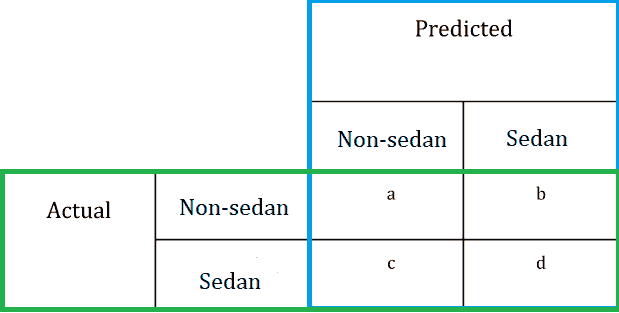
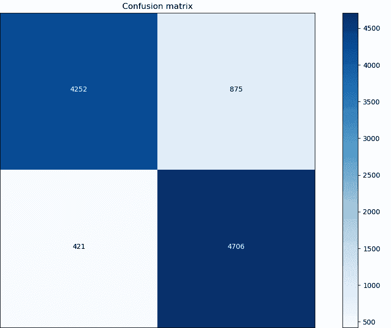

# 理解混淆矩阵

> 原文：<https://dev.to/overrideveloper/understanding-the-confusion-matrix-2dk8>

[](https://res.cloudinary.com/practicaldev/image/fetch/s--ExuCM9Bd--/c_limit%2Cf_auto%2Cfl_progressive%2Cq_auto%2Cw_880/https://thepracticaldev.s3.amazonaws.com/i/5s8xw56ad21s6skkmjuh.png)

混淆矩阵是描述分类器/分类模型的性能的表格。它包含关于分类器完成的**实际分类和预测分类**的信息，该信息用于评估分类器的性能。

请注意，混淆矩阵仅用于分类任务，因此不能用于回归模型或其他非分类模型。

在我们继续之前，让我们看看一些术语。

*   分类器:分类器基本上是一种算法，它使用从训练数据中获得的“知识”将输入数据映射到特定的类别或类。分类器要么是二元分类器，要么是多类/多分类/多标签/多输出分类器。
*   训练和测试数据:在建立分类模型/分类器时，数据集被分成**训练数据**和**测试数据**，它们都有关联的标签。标签是数据所属的类别或类的预期输出。
*   实际分类:这是数据的预期输出(标签)。
*   预测分类:这是分类器针对特定输入数据给出的输出。

**一个例子**:假设我们已经建立了一个分类器，将一辆汽车的输入图像分类为轿车或非轿车，我们的数据集中有一幅图像被标记为非轿车，但分类模型将其分类为轿车。
在这个场景中，实际分类是**非轿车**，而预测分类是**轿车**。

### 混淆矩阵的类型

有两种类型的混淆矩阵:

*   二类混淆矩阵
*   多类混淆矩阵

### 二级混淆矩阵

顾名思义，2-class 是描述二元分类模型性能的混淆矩阵。我之前描述的**轿车**分类器的 2 级矩阵可以这样可视化:

[](https://res.cloudinary.com/practicaldev/image/fetch/s--G8U6PxCq--/c_limit%2Cf_auto%2Cfl_progressive%2Cq_auto%2Cw_880/https://thepracticaldev.s3.amazonaws.com/i/x5jengc1mjseexyl0r1b.png)

在这个可视化中，我们有两个已被概述的部分。我们有**预测**分类部分，它包含每个类别的两个子部分，还有**实际**分类部分，它包含每个类别的两个子部分。

如果这是你第一次看到混淆矩阵，我知道你一定想知道表格中的所有变量代表什么。实际上这很简单，我会尽可能简单地解释，但在我解释之前，重要的是要知道这些变量代表了许多预测。

##### 变量 a

变量 **a** 在**实际**和**预测**分类区段中都属于**非轿车**子区段。这意味着**做出了**预测，正确地将非轿车图像分类为非轿车。

##### 变量 b

变量 **b** 属于**实际**分类段的**非轿车**子段，属于**预测**分类段的**轿车**子段。这意味着 **b** 预测错误地将一张非轿车图片归类为轿车。

##### 变量 c

变量 **c** 属于**实际**分类部分的**轿车**子部分和**预测**分类部分的**非轿车**子部分。这意味着 **c** 做出的预测错误地将轿车图片归类为非轿车。

##### 变量 d

变量 **d** 在**实际**和**预测**分类区段中都属于**轿车**子区段。这意味着做出了正确分类轿车图像的预测。

简易柠檬榨汁机。(希望？😅)

##### 但是等等，我们还没完呢.......

现在我们有了**轿车**分类器的混淆矩阵，但是这如何帮助我们确定分类器的性能/效率呢？
为了使用混淆矩阵及其包含的数据来确定分类器的性能，我们可以使用混淆矩阵中的数据(变量)来计算一些标准指标。

##### 准确度

2 类混淆矩阵中的准确度是正确预测总数与预测总数的比率。
从我们的混淆矩阵中，我们可以看到 **a** 和 **d** 预测对输入图像进行了正确分类，而 **b** 和 **c** 预测对输入图像进行了错误分类。

因此，精度可以通过下式计算:

**精度**=(**a+d**)/(**a+b+c+d**)

其中， **a + d** 是正确预测的总数， **a + b + c + d** 是预测的总数。

##### 真阳性、真阴性、假阳性和假阴性

关于我们的分类器和混淆矩阵:

**真阳性(TP)** 是轿车图像被正确分类为轿车的预测次数。
从我们的混淆矩阵来看，变量 **d** 也是 **TP** 。

**真阴性(TN)** 是将非轿车图像正确分类为[非轿车]的预测数。
从我们的混淆矩阵来看，变量 **a** 也是我们的 **TN** 。

**假阳性(FP)** 是非轿车图像被错误分类为轿车的预测次数。
从我们的混淆矩阵来看，变量 **b** 也是我们的 **FP** 。

**假阴性(FN)** 是轿车图像被错误分类为非轿车的预测次数。
从我们的混淆矩阵来看，变量 **c** 也是我们的 **FN** 。

##### 真阳性率

真阳性率是**真阳性**与**真阳性**和**假阴性**之和的比值。它显示了分类器将轿车图像分类为轿车的频率。

因此，真正的阳性率可以计算为:

**真阳性率** = **d** / ( **c + d** )
其中 **d** 是 **TP** 而 **c** 是 **FN**

真实阳性率也被称为**回忆**或**灵敏度**

##### 假阳性率

假阳性率是**假阳性**与**真阴性**和**假阳性**之和的比值。它显示了分类器将非轿车图像分类为轿车的频率。

因此，假阳性率可以计算为:

**假阳性率** = **b** / ( **a + b** )
其中 **a** 是**TN**b 是 **FP**

##### 真负率

真阴性率是**真阴性**与**真阴性**和**假阳性**之和的比值。它显示了分类器将非轿车图像分类为非轿车的频率。

因此，假阳性率可以计算为:

**真负率** = **a** / ( **a + b** )
其中 **a** 是**TN**b 是 **FP**

真正的阴性率也被称为特异性。

##### 假阴性率

假阴性率是**假阴性**与**假阴性**和**真阳性**之和的比率。它显示了分类器将轿车图像分类为非轿车图像的频率。

因此，假阳性率可以计算为:

**假阴性率** = **c** / ( **c + d** )
其中 **d** 是 **TP** 和 **c** 是 **FN**

##### 精度

精度是**真阳性**与**真阳性**和**假阳性**之和的比值。它显示了分类器将输入图像分类为轿车的频率，结果证明是正确的。

其计算方法如下:

**精度** = **d** / **(b + d)**
其中 **d** 是 **TP** 而 **b** 是 **FP**

### 举个例子

假设我们有下图作为分类器的混淆矩阵，我们可以使用上面定义的度量来评估它的性能。

[](https://res.cloudinary.com/practicaldev/image/fetch/s--v8krdHq4--/c_limit%2Cf_auto%2Cfl_progressive%2Cq_auto%2Cw_880/https://thepracticaldev.s3.amazonaws.com/i/29erno9l9601wqb9zbqs.png)

从混淆矩阵中，我们可以看出:

> 进行了 4252 次预测，正确地将非轿车分类为非轿车。因此，我们的变量 **a** 和**真负(TN)** 是 4252。做出了 875 个错误地将非轿车归类为轿车的预测。因此，我们的变量 **b** 和**误报(FP)** 是 875。*   421 predictions mistakenly classified cars as non-cars. Therefore, the false negatives (fn) of our variables **c** and **are 421.***   4706 predictions were made, and cars were correctly classified as cars. Therefore, the real (TP) of our variables **d** and **is 4706.**T25】

使用我们“提取”的数据，我们可以计算上述指标并确定分类器的性能。由于正确预测的数量大于不正确预测的数量，我们已经知道分类器表现良好。

##### 准确度

准确度=**(a+d)**/**(a+b+c+d)**
=**(4252+4706)**/**(4252+875+421+4706)**
=**(8958)**/**(10254)**
=**0.8736100**

因此，分类器具有 87%的 0.87 的准确度

##### 真阳性率

TPR =**【TP+FN】**
=**4706**/**(4706+421)**
=**4706**/**5127**
=**0.917885703140238**
TPR =**0.92**

因此，分类器的真实阳性率为 0.92，为 92%

##### 假阳性率

FPR =**FP/(FP+TN)**
=**875**/**(875+4252)**
=**875**/**5127**
=**0.1706651062999805**
FPR =**0.17**

因此，分类器的假阳性率为 0.17，即 17%

##### 真负率

TNR =**【TN+FP】**
=**4252/(4252+875)**
=**4252/5127**
=**0.8293348937000195**
TNR =**0.83**

因此，分类器的真实否定率为 0.83，即 83%

##### 假阴性率

FNR =**FN/(FN+TP)**
=**421/(421+4706)**
=**421/5127**
=**0.082114296859762**
FNR =**0.08**

因此，分类器具有 8%的 0.08 的假阴性率

##### 精度

精度=**【TP+FP】**
=**=【4706+875】**
=**4706/5581**
=**0.8293348937000195**
精度= **0.83**

因此，分类器具有 83%的精度 0.83

### 如何用 Python 生成混淆矩阵

```
import matplotlib.pylab as plt
import itertools
import numpy as np
from sklearn.metrics import confusion_matrix

def plot_confusion_matrix(cm, classes,normalize=False):
    plt.figure(figsize = (5,5))
    plt.imshow(cm, interpolation='nearest', cmap=plt.cm.Blues)
    plt.title('Confusion matrix')
    plt.colorbar()
    tick_marks = np.arange(len(classes))
    plt.xticks(tick_marks, classes, rotation=90)
    plt.yticks(tick_marks, classes)
    if normalize:
        cm = cm.astype('float') / cm.sum(axis=1)[:, np.newaxis]

    thresh = cm.max() / 2.
    for i, j in itertools.product(range(cm.shape[0]), range(cm.shape[1])):
        plt.text(j, i, cm[i, j],
                 horizontalalignment="center",
                 color="white" if cm[i, j] > thresh else "black")
    plt.tight_layout()
    plt.ylabel('Actual')
    plt.xlabel('Predicted')

dict_characters = {0: 'Non-sedan', 1: 'Sedan'}

y_pred = model.predict(test_data)
y_pred_classes = np.argmax(y_pred, axis=1)
y_true = np.argmax(test_labels, axis=1)

confusion_mat = confusion_matrix(y_true, y_pred_classes)
plot_confusion_matrix(confusion_mat, classes = list(dict_characters.values())) 
```

为了生成混淆矩阵，我们使用 numpy、matplotlib.pylab 来可视化矩阵，使用 sklearn.metrics 包中的混淆矩阵函数来生成混淆矩阵，使用 itertools 进行循环/迭代。

首先，我们定义一个函数 **plot_confusion_matrix** ，它将生成的混淆矩阵和预期/可能的类作为参数，并使用 matplotlib.pylab 来可视化混淆矩阵。

在这个代码片段中，我们假设我们已经有了训练好的模型以及带有相关标签的训练和测试数据。

**dict_characters** 是两个可能类别的字典，在我们的例子中是“**非轿车**和“**轿车**”。
**y_pred** 是分类器对测试数据进行预测的 numpy 数组
**模型**是我们训练过的分类器/算法
**test_data** 是我们的测试数据
**y_pred_classes** 是相对于 **y_pred** 的 numpy 数组索引，它是分类器对测试数据进行预测的数组。
**y_true** 是相对于 test_data 的实际/正确标签的索引的 numpy 数组。
**test_labels** 是测试数据的标签列表。

使用上述内容，我们使用来自 **sklearn.metrics** 的**混淆矩阵**函数来生成混淆矩阵，传入正确值( **y_true** )和分类器返回的估计值( **y_pred_classes** )，并将生成的混淆矩阵存储在变量**混淆矩阵**中。

然后，我们将混淆矩阵(**混淆 _ 矩阵**)和一列可能的类值(**字典 _ 字符**)作为参数传递给**plot _ 混淆 _ 矩阵**函数，该函数随后将混淆矩阵可视化。

在我的下一篇文章中，我[希望]会写多类混淆矩阵。