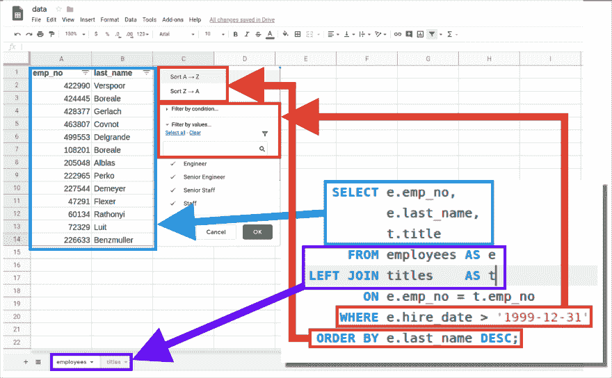

# 理解 MySQL 查询

> 原文：<https://dev.to/ladvien/understanding-the-mysql-query-26gd>

欢迎回来！好了，现在我们知道了如何从 MySQL Workbench 中连接到远程服务器，让我们开始编写一些查询。

下面是一个常见的 SQL 查询:

```
 SELECT e.emp_no,
           e.last_name,
           t.title
      FROM employees AS e
 LEFT JOIN titles    AS t
        ON e.emp_no = t.emp_no
     WHERE e.hire_date > '1999-12-31'
  ORDER BY e.last_name DESC; 
```

Enter fullscreen mode Exit fullscreen mode

当在我们的`employees`数据库上运行时，这个查询产生了下表。

| 行编号 | 员工编号 | 姓氏 | 标题 |
| --- | --- | --- | --- |
| Zero | Forty-seven thousand two hundred and ninety-one | Flexer | 员工 |
| one | Sixty thousand one hundred and thirty-four | 拉索尼伊 | 员工 |
| Two | Seventy-two thousand three hundred and twenty-nine | Luit | 员工 |
| three | One hundred and eight thousand two hundred and one | Boreale | 高级工程师 |
| four | Two hundred and five thousand and forty-eight | 艾芭 | 高级人员 |
| five | Two hundred and twenty-two thousand nine hundred and sixty-five | Perko | 高级人员 |
| six | Two hundred and twenty-six thousand six hundred and thirty-three | 本茨穆勒 | 员工 |
| seven | Two hundred and twenty-seven thousand five hundred and forty-four | 结婚 | 高级人员 |
| eight | Four hundred and twenty-two thousand nine hundred and ninety | 去你妈的 | 工程师 |
| nine | Four hundred and twenty-four thousand four hundred and forty-five | Boreale | 工程师 |
| Ten | Four hundred and twenty-eight thousand three hundred and seventy-seven | 杰拉赫 | 工程师 |
| Eleven | Four hundred and sixty-three thousand eight hundred and seven | 女修道院 | 工程师 |
| Twelve | Four hundred and ninety-nine thousand five hundred and fifty-three | 德尔格兰德 | 工程师 |

当数据以这种方式呈现时，它看起来类似于我们传统的 Excel 电子表格，对吗？

让我们比较一下 SQL 查询和电子表格。

[](https://res.cloudinary.com/practicaldev/image/fetch/s--HNc7MjU0--/c_limit%2Cf_auto%2Cfl_progressive%2Cq_auto%2Cw_880/https://ladvien.cimg/data-analytics-series/sql_to_excel_compare.png)

现在，再过几周，当你成为 SQL 编写机器时，你会注意到 Excel 和 SQL 查询之间的这种类比失效了。但是现在，让上面的图片安慰你，让你知道 SQL 的核心函数与电子表格的类似。你也很了解这些电子表格函数*。*

 **   选择列
*   过滤列和行
*   排序行
*   组合数据集

然而，SQL 有很多 Excel 电子表格没有的超能力。当然，代价是你必须放弃舒适的图形用户界面。但是不要让它把你吓跑——它只需要 3-4 个月来适应，但是之后你会意识到那些图形界面已经把你束缚住了。

好吧，回到问题上来。让我们看看上面查询的不同部分。

# 选择

`SELECT`语句是你如何选择在结果部分出现的内容。如果不把东西放在`SELECT`区，那么你将什么也得不到。它通常用于从数据库中的一个或多个表中检索数据，称为字段。

### 选择区域

你可能会问，什么是“选择区域”是单词`SELECT`到`FROM`之间的一切。

```
SELECT -------------------------------
       -- ALL THIS IS THE SELECT AREA
       -------------------------------
FROM 
```

Enter fullscreen mode Exit fullscreen mode

### 选择字段

有两种不同的方法来`SELECT`你想从中获得结果的字段。你可以用`*`，意思是“一切”或者您可以列出希望返回的字段名称。你放在`SELECT`区的每一项都应该跟一个逗号，除非是最后一项。

例如:

```
 SELECT  emp_no,
            last_name,
            title
... 
```

Enter fullscreen mode Exit fullscreen mode

上面的代码请求在结果集中返回三个不同的字段:`emp_no`、`last_name`和`title`。

或者

```
 SELECT  *
... 
```

Enter fullscreen mode Exit fullscreen mode

返回列出的每个表中的每个字段。

我应该指出，如果你忘记了一个逗号，它会变得混乱。通常，SQL server 会发送一条错误消息**，但并不总是**。我们一会儿会看到。

### 选择计算方式

`SELECT`不仅仅是从数据库的表中检索数据。它还可以执行即时计算，例如

```
SELECT 1 + 1,
       2 *25,
       55 / 75, 
```

Enter fullscreen mode Exit fullscreen mode

这将返回以下内容:

|  | 1 + 1 | 2 *25 | 55 / 75 |
| --- | --- | --- | --- |
| Zero | Two | Fifty | 0.7333 |

# 字段

SQL 中的字段类似于电子表格中的列。它在每一行都包含相同类型的数据(稍后将详细介绍数据类型)。在整个 SQL 查询中可以引用字段，但是为了在查询结果中显示它们，它们必须包含在`SELECT`区域中——正如我们在上面的“选择”部分中所讨论的。

```
SELECT emp_no,
       first_name,
       last_name
FROM employees 
```

Enter fullscreen mode Exit fullscreen mode

### 不明确字段列表

上面的查询有效。但是，请尝试运行以下查询，其中包含两个表。

```
SELECT emp_no,
       first_name,
       last_name
FROM employees
LEFT JOIN titles
    ON employees.emp_no = titles.emp_no 
```

Enter fullscreen mode Exit fullscreen mode

有什么结果吗？我也是。只有一条来自数据库的错误消息，说明:

```
Error Code: 1052\. Column 'emp_no' in field list is ambiguous 
```

Enter fullscreen mode Exit fullscreen mode

这是因为`employees`和`titles`表都有一个名为`emp_no`的字段，而 SQL 程序无法判断出你想要哪个。

为了解决这个问题，我们在每个字段名前面加上表名和`.`。这将告诉 SQL 程序我们希望字段来自哪个表——不会有歧义。电脑*讨厌*的暧昧。

让我们用表名再次运行查询。

```
SELECT employees.emp_no,
       employees.first_name,
       employees.last_name
FROM employees
LEFT JOIN titles
    ON employees.emp_no = titles.emp_no 
```

Enter fullscreen mode Exit fullscreen mode

这一次我们得到了预期的结果，没有错误。

在此基础上，一个好的 SQL 编码者会*总是*将表名放在查询的前面，不管是否需要。这防止了将来的错误。

例如，假设您编写了以下代码:

```
SELECT emp_no,
       salary
FROM salaries 
```

Enter fullscreen mode Exit fullscreen mode

您的代码被投入生产(这个术语的意思是供您的企业使用)，一年后，另一个编码人员在没有仔细查看整个查询的情况下向查询中添加了第二个表(一个糟糕的 SQL 编码人员会忘记这样做)。

新的查询如下所示:

```
SELECT emp_no,
       salary,
       first_name,
       last_name

FROM salaries
LEFT JOIN employees
    ON salaries.emp_no = employees.emp_no; 
```

Enter fullscreen mode Exit fullscreen mode

尝试运行此查询。您会发现与我们之前看到的相同的`field list is ambiguous`错误。

这里更深刻的教训是:**一个好的程序员就像一个防御性的司机；他们以一种期望他人不计后果的方式编码。**

回到上面的例子，如果我们在字段名中包含表，那么一个粗心的同事添加另一个表也没关系。

```
SELECT salaries.emp_no,
       salaries.salary,
       employees.first_name,
       employees.last_name

FROM salaries
LEFT JOIN employees
    ON salaries.emp_no = employees.emp_no; 
```

Enter fullscreen mode Exit fullscreen mode

### 字段别名

通常，您会希望将您的结果导出为 CSV 格式发送给某人。您可能已经注意到，当您执行一个查询时，SQL 会在一个简洁的电子表格中返回结果。我不知道我是否提到过它，但是您可以通过点击结果上方的小磁盘按钮将这些结果导出到 CSV 文件中。

[](https://res.cloudinary.com/practicaldev/image/fetch/s--3plO9EoB--/c_limit%2Cf_auto%2Cfl_progressive%2Cq_auto%2Cw_880/https://ladvien.cimg/data-analytics-series/mysql_setup_33.png)

但是，您可能不喜欢机器格式化的列名。我是说，别误会，我们是书呆子！我们能很好地阅读机器友好的文字，但我们的老板却不能。

MySQL 有一个内置命令，允许你动态地重命名字段(以及更多)。这个命令是`AS`，出现在下面的查询中，用来重命名列名。

```
SELECT salaries.emp_no      AS Id,
       salaries.salary      AS Salary,
       employees.first_name AS "First Name",
       employees.last_name  AS "Last Name"

FROM salaries
LEFT JOIN employees
    ON salaries.emp_no = employees.emp_no; 
```

Enter fullscreen mode Exit fullscreen mode

现在，列标题有了“老板友好”的名称。

[](https://res.cloudinary.com/practicaldev/image/fetch/s--8hOKLBkQ--/c_limit%2Cf_auto%2Cfl_progressive%2Cq_auto%2Cw_880/https://ladvien.cimg/data-analytics-series/mysql_setup_34.png)

您可能已经注意到，前两个别名没有引号，后两个被引号括起来。SQL 程序可能会被空格搞糊涂，所以我们将新名称用`"`标记括起来。当 SQL 程序看到这些标记时，它会对自己说，“哦，我打赌用户将会有一个有趣的人类名称，我将假设在第一个引号和下一个引号之间的所有内容都是一个有趣的人类单词。愚蠢的人类。”

对于引号内的人来说，一个更专业的术语是**文字常量。然而，程序员称它们为“字符串”很可能是 b**

### 不要失去你的作为

继续并尝试运行以下查询:

```
SELECT emp_no
       first_name,
       employees.last_name
FROM employees; 
```

Enter fullscreen mode Exit fullscreen mode

你查过了吗？有什么奇怪的事吗？你不会真的经营它吧？去办吧，我等着。

好了，你会看到这样的东西:
|名|姓|
|: - |: - |
| 10001 |费塞罗|
| 10002 |西美尔|
| 10003 |巴姆福德|
|...|...|
超级诡异对吧？只有两列，列名看起来很混乱。事实正是如此。这是由于在`emp_no`之后缺少了`,`。这是 SQL 中一个我认为很愚蠢的东西的结果——你可以省略字段和它的别名之间的`AS`关键字。

也就是说，我们可以重写前面显示别名用法的查询，如下所示:

```
SELECT salaries.emp_no      Id,
       salaries.salary      Salary,
       employees.first_name "First Name",
       employees.last_name  "Last Name"

FROM salaries
LEFT JOIN employees
    ON salaries.emp_no = employees.emp_no; 
```

Enter fullscreen mode Exit fullscreen mode

但是，当你第一次漏掉一个逗号时，你会问，“为什么！？MySQL 为什么允许这样！”我不确定，但我们必须处理它。这就是为什么我问你*总是*包括`AS`关键字。同样，你是在帮助防止错误发生。

# 从

正如您已经看到的，`FROM`命令告诉 SQL 它应该在数据库的什么地方寻找数据。如果您没有在`FROM`子句中指定一个表，那么 SQL 程序将在该表不存在的情况下运行，并且将无法找到您请求的字段。

```
SELECT *
FROM employees
LEFT JOIN departments
    ON employees.emp_no = departments.emp_no 
```

Enter fullscreen mode Exit fullscreen mode

在下一篇文章中，我们将讨论`JOINS`，它们是查询的`FROM`子句的扩展，但是，它们应该有自己的文章。现在，将`LEFT JOIN`视为`FROM`条款的扩展。一个连接告诉 SQL 程序，“首先查看雇员表，然后检查部门表，*是否与雇员表有关系。”*

如我所说，我们将在下一篇文章中彻底回顾`JOINS`。

### 表别名

就像我们可以给字段取别名一样，我们也可以给表名取别名。然而，这通常是出于不同的原因:节省打字。

糟糕的编码者不写出表名的主要原因之一(不是*你*，你会成为一个好的编码者)是它增加了*更多的输入。你可能会说，“好吧，那只是懒惰。”是的，但是它很聪明-懒惰-也很有效率。而效率是你想在你的代码和*编码*中争取的东西。*

让我们看一个之前的例子。

```
SELECT salaries.emp_no      AS Id,
       salaries.salary      AS Salary,
       employees.first_name AS "First Name",
       employees.last_name  AS "Last Name"

FROM salaries
LEFT JOIN employees
    ON salaries.emp_no = employees.emp_no; 
```

Enter fullscreen mode Exit fullscreen mode

这个查询可以通过使用表别名来重写，从而节省大量的输入。大概最好给你看看。

```
SELECT s.emp_no     AS Id,
       s.salary     AS Salary,
       e.first_name AS "First Name",
       e.last_name  AS "Last Name"

FROM salaries       AS s
LEFT JOIN employees AS e
    ON s.emp_no = e.emp_no; 
```

Enter fullscreen mode Exit fullscreen mode

执行此查询，并将其结果与没有表别名的查询进行比较。你会发现结果完全一样。此外，这次重写节省了 45 次击键。你可能会想，“嗯，不多。”嗯，这是一个小查询。想象一下，整天编写两倍于此大小的查询。你的储蓄是值得的——也许是时候来一杯额外的咖啡(或壶，对我来说)。

它也更容易被人脑理解——至少，当你阅读 SQL 一段时间后。你的大脑会同样理解`e`和`employees`，但它不必努力理解`e`。

简而言之，好的编码人员使用表别名。

# 排序依据

在电子表格中，通常会有一种对数据进行排序的方法。通常，您的选项将基于列的上下文顺序。如果数据是数字，则分别为低到高或高到低。如果是文本，那么你的选择可能是字母顺序，从 A-Z 到 Z-A。如果是日期，那么它将是首尾相连，或首尾相连。这些订单类型中的每一种都有一个共性，它们的价值要么从低值到高值，要么从高值到低值。这些类型的排序分别称为升序和降序。

在 SQL 中，有两种类型的`ORDER BY`、`ASC`和`DESC`，用于升序和降序。它们的操作与大多数电子表格应用程序稍有不同。它们仍然按照从低到高或从高到低对数据进行排序，但是，当您应用`ORDER BY`时，它会影响整个结果集。当一个字段被一个`ORDER BY`定位时，同一行上的所有其他字段都与目标字段一起排序。

话说够了。让我们来看一些例子:

### DESC

```
SELECT employees.emp_no,
       employees.first_name,
       employees.last_name
FROM employees
ORDER BY employees.emp_no DESC 
```

Enter fullscreen mode Exit fullscreen mode

[](https://res.cloudinary.com/practicaldev/image/fetch/s---OHSMw5_--/c_limit%2Cf_auto%2Cfl_progressive%2Cq_auto%2Cw_880/https://ladvien.cimg/data-analytics-series/mysql_setup_35.png)

### ASC

```
SELECT employees.emp_no,
       employees.first_name,
       employees.last_name
FROM employees
ORDER BY employees.emp_no ASC 
```

Enter fullscreen mode Exit fullscreen mode

[](https://res.cloudinary.com/practicaldev/image/fetch/s--5WEIepnB--/c_limit%2Cf_auto%2Cfl_progressive%2Cq_auto%2Cw_880/https://ladvien.cimg/data-analytics-series/mysql_setup_36.png)

关于`ASC`有一点需要注意，如果你不指定`ORDER BY`的类型，那么它将默认为`ASC`。

例如，这个查询将提供与上面的查询完全相同的结果:

```
SELECT employees.emp_no,
       employees.first_name,
       employees.last_name
FROM employees
ORDER BY employees.emp_no 
```

Enter fullscreen mode Exit fullscreen mode

`ORDER BY`的大部分是给人用的，更容易发现你的数据是否被正确返回。然而，在某些情况下,`ORDER BY`实际上会改变查询的结果，但是在我们进入这类查询之前还需要一段时间。

稍后，我们将开始致力于使我们的查询高效快速，但现在我将声明:**确保您需要您的结果在`ORDER BY`** 之前排序。

SQL 程序很难对结果进行排序，这意味着执行时间更长。如果您试图编写一个速度查询(当您为生产软件编写代码时，您将会这样做)，这是您想要避免的。

### 多列排序

SQL 也可以进行多字段排序。其工作原理是按`ORDER BY`中的第一个字段排序，如果有平局，再按第二个字段排序。

例如:

```
SELECT employees.emp_no,
       employees.first_name,
       employees.last_name
FROM employees
ORDER BY employees.last_name ASC, employees.emp_no DESC 
```

Enter fullscreen mode Exit fullscreen mode

[](https://res.cloudinary.com/practicaldev/image/fetch/s--D3K42E21--/c_limit%2Cf_auto%2Cfl_progressive%2Cq_auto%2Cw_880/https://ladvien.cimg/data-analytics-series/mysql_setup_37.png)

当`ORDER BY`设置为`ASC`时，“Aamodt”是`last_name`字段中的第一个雇员，然而，在该表中有许多“Aamodt”。这就是第二个`ORDER BY`出现的地方。第二个`ORDER BY`设置在`emp_no`域上，为`DESC`，这就是为什么所有的数字都从最高值开始并向最低值移动。当然，当`last_name`值改变时，`emp_no`订单将重新开始，仍然从最高到最低移动。

[](https://res.cloudinary.com/practicaldev/image/fetch/s--jmPmLwlD--/c_limit%2Cf_auto%2Cfl_progressive%2Cq_auto%2Cw_880/https://ladvien.cimg/data-analytics-series/mysql_setup_38.png)

好吧，我们继续。只需记住，`ORDER BY`对人类极其有用，但却让计算机处理速度变慢。因此，当您编写查询时，请考虑您的受众。

# 哪里

SQL 查询的`WHERE`子句是一个过滤器。就这么简单。它进一步限制了你的结果。它可能是查询中第二重要的部分，仅次于`FROM`子句。减少你的结果不仅能帮助你找到你需要的，还能让你在电脑上更容易找到结果。

不过，在我们进入更多细节之前，让我们看一个例子:

```
SELECT employees.emp_no         AS Id,
       employees.first_name     AS "First Name",
       employees.last_name      AS "Last Name"
FROM employees
WHERE employees.emp_no = 10006
ORDER BY employees.emp_no, employees.first_name 
```

Enter fullscreen mode Exit fullscreen mode

这将返回一条记录，这是有意义的。我们告诉 SQL 程序，我们希望从`employees`表中得到`emp_no`、`first_name`、`last_name`，其中`emp_no`等于`10006`。

[](https://res.cloudinary.com/practicaldev/image/fetch/s--1Q_roPN8--/c_limit%2Cf_auto%2Cfl_progressive%2Cq_auto%2Cw_880/https://ladvien.cimg/data-analytics-series/mysql_setup_39.png)

但是，让我们也来看看`Database Message`

| 时间 | 行动 | 消息 | 持续时间/提取 |
| --- | --- | --- | --- |
| 07:35:17 | SELECT employees.emp_no，employees.first_name，employees . last _ name FROM employees ORDER BY employees . last _ name ASC，employees.emp_no DESC 限制 0，1000 | 返回了 1000 行 | 0.152 秒/ 0.0035 秒 |
| 07:48:56 | SELECT employees.emp_no 作为 Id，employees.first_name 作为“名字”，employees.last_name 作为“姓氏”FROM employees WHERE employees . EMP _ no = 10006 ORDER BY employees . employees . First _ Name 限制为 0，1000 | 返回了 1 行 | 0.0036 秒/0.000072 秒 |

注意我们对一个结果的查询比对 1000 个结果的查询花费了*少得多*的时间？我将在后面详细介绍这一点，但我觉得现在有必要指出这一点。使用`WHERE`子句将数据限制在您需要的范围内，这将极大地提高您的查询效率。

有没有去过一个便宜的自助餐厅，它的防喷嚏装置上贴着这样的标语:“只拿你想吃的东西！！!"好吧，假设您的 SQL 数据库有相同的符号——您用`WHERE`子句选择您需要的。

好了，关于效率的讨论到此为止，让我们关注一下`WHERE`子句如何让你得到你想要的结果。

在我们之前编写的查询中，我们已经从包含在`FROM`子句中的每个表中接收了数据库中的每一行。现在，我们正在将结果缩小到感兴趣的那些。

这也可以用字符串(在`"`标记内的文本)来完成。

```
SELECT employees.emp_no         AS Id,
       employees.first_name     AS "First Name",
       employees.last_name      AS "Last Name"
FROM employees
WHERE employees.first_name = "Ramzi"
ORDER BY employees.emp_no, employees.first_name 
```

Enter fullscreen mode Exit fullscreen mode

[](https://res.cloudinary.com/practicaldev/image/fetch/s--hGjFgxHW--/c_limit%2Cf_auto%2Cfl_progressive%2Cq_auto%2Cw_880/https://ladvien.cimg/data-analytics-series/mysql_setup_40.png)

但是，如果我们想要包括多个不同的员工，而不是所有的员工，该怎么办呢？这就是`IN`的由来...英寸

### 在

`WHERE`子句后面可以跟着`IN`关键字，紧接着是一组括号；在括号内，您可以放入要过滤的值列表。每个值必须用逗号分隔。

例如:

```
SELECT employees.emp_no         AS Id,
       employees.first_name     AS "First Name",
       employees.last_name      AS "Last Name"
FROM employees
WHERE employees.last_name IN ("Bamford", "Casley", "Benveniste")
ORDER BY employees.last_name ASC, employees.first_name ASC; 
```

Enter fullscreen mode Exit fullscreen mode

[](https://res.cloudinary.com/practicaldev/image/fetch/s--wjgco7Vd--/c_limit%2Cf_auto%2Cfl_progressive%2Cq_auto%2Cw_880/https://ladvien.cimg/data-analytics-series/mysql_setup_41.png)

这也可以用数字
来完成

```
SELECT employees.emp_no         AS Id,
       employees.first_name     AS "First Name",
       employees.last_name      AS "Last Name"
FROM employees
WHERE employees.emp_no IN (422990, 428377)
ORDER BY employees.last_name ASC, employees.first_name ASC; 
```

Enter fullscreen mode Exit fullscreen mode

### 大于且小于

如果您使用的字段是数字数据，那么您也可以使用`>`、`<`、`<=`和`>=`比较。

```
SELECT employees.emp_no         AS Id,
       employees.first_name     AS "First Name",
       employees.last_name      AS "Last Name"
FROM employees
WHERE employees.emp_no > 40000
ORDER BY employees.emp_no, employees.first_name; 
```

Enter fullscreen mode Exit fullscreen mode

[](https://res.cloudinary.com/practicaldev/image/fetch/s--Y52y8FFl--/c_limit%2Cf_auto%2Cfl_progressive%2Cq_auto%2Cw_880/https://ladvien.cimg/data-analytics-series/mysql_setup_42.png)

如果你不熟悉等式，这里有一个分解。

*   " > 5000 "将查找在 5000 之后**出现的所有值，但是**不包括** 5000 本身**
*   < 5000" will find all values which come **在** 5000 之前，但**不包括** 5000 本身
*   " > = 5000 "将查找在 5000 **之后**出现的所有值，包括** 5000 本身**
*   <= 5000" will find all values which come **之前的** 5000 **包括** 5000 本身

**关闭**
咻，这些是一个 SQL 查询的基本，但是，这只是开始。SQL 查询还有更多的部分，比如`AND`、`OR`、`<>`、`!=`、`JOIN`、函数、`UNION`、`DISTINCT`——我们还有很多事情要做。但是！别担心，你完全可以做到。

不相信我？别担心，我会让你证明给自己看的。让我们做些作业吧！:)

# 作业#1

接下来的作业将会让你接受所提供的查询并修改它以返回所描述的结果。一旦所有的问题都完成，填写免费电子邮件给我，我会为你“评分”。

对于问题#1-6，使用以下查询:

```
SELECT *
FROM employees
LEFT JOIN dept_emp
    ON employees.emp_no = dept_emp.emp_no
LEFT JOIN departments
    ON dept_emp.dept_no = departments.dept_no
LEFT JOIN titles
    ON employees.emp_no = titles.emp_no
LEFT JOIN salaries
    ON employees.emp_no = salaries.emp_no; 
```

Enter fullscreen mode Exit fullscreen mode

*   问题 1——将上面的查询修改为**,使用表别名而不是完整的表名。**
*   问题#2 -将结果查询修改为**，仅返回`emp_no`、`first_name`、`last_name`、`dept_name`、`salary`的结果。**
*   问题#3 -将结果查询修改为*将字段重命名为以下内容:“员工#”、“名字”、“姓氏”、“部门#”和“薪金”。
*   问题#4 -修改结果查询，按薪水列出雇员**；命令他们从最低工资到最高工资。**
*   问题 5——在保持从最低到最高工资顺序的同时，修改结果查询为**,按照姓氏的字母顺序列出员工的工资。**
*   问题 6 -将结果查询修改为**仅提供收入超过 50，000 的客户**

对于问题#7-10，使用以下查询:

```
SELECT *
FROM employees          AS e
LEFT JOIN dept_emp      AS de
    ON e.emp_no = de.emp_no
LEFT JOIN departments   AS d
    ON de.dept_no = d.dept_no
LEFT JOIN titles        AS t
    ON e.emp_no = t.emp_no
LEFT JOIN salaries      AS s
    ON e.emp_no = s.emp_no 
```

Enter fullscreen mode Exit fullscreen mode

*   问题 7——将上面的查询修改为**只返回名字为“Yishay”、“Huan”或“Otmar”的人的结果**
*   问题 8——修改对**的结果查询，也只显示它们的`first_name`、`last_name`和`salary`。**
*   问题 9——将结果查询修改为**,同时显示他们在**的哪个部门工作。
*   问题#10 -将结果查询修改为**并显示他们的雇佣日期**。*