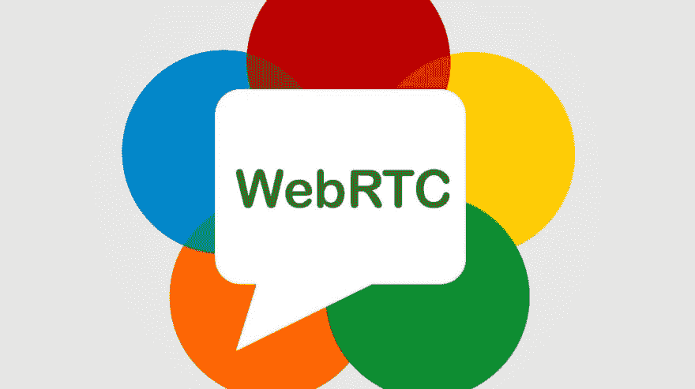
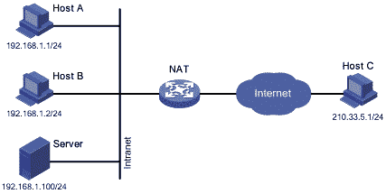
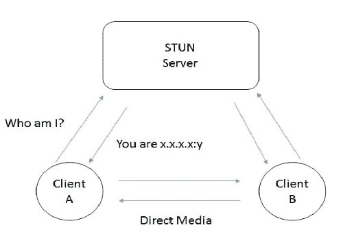
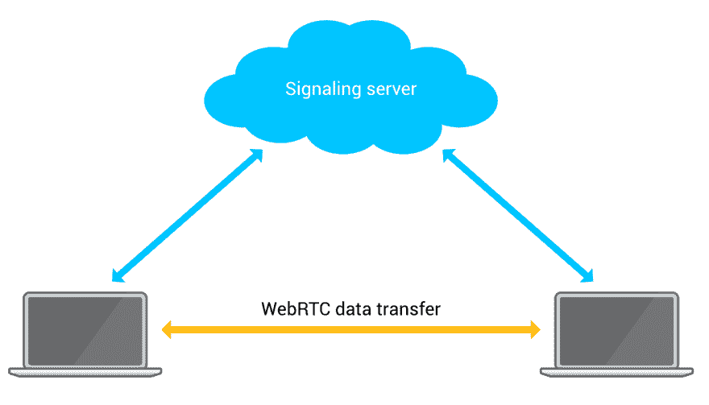

# 理解网络实时交流

> 原文：<https://dev.to/anto_christo/understanding-web-real-time-communication-2g6>

# 简介

Web 实时通信(WebRTC)是一个开源项目，目前正在开发，旨在提供 web 应用程序之间的实时对等通信。

WebRTC 提供简单的 JavaScript APIs，帮助开发人员轻松构建具有实时音频、视频和数据传输功能的 web 应用程序。WebRTC 最近的发展也使它能够被集成到本地应用程序中。因为在 API 下发生了很多事情，所以为了充分利用该技术，理解 WebRTC 的概念和工作方式很重要。

这篇博客是在假设读者对 WebRTC 如何工作一无所知的情况下撰写的，因此尽可能使用简单的术语和类比详细解释了整个工作过程。我们开始吧！

* * *

为了建立 WebRTC 连接，我们需要执行以下两个步骤:

1.  找到对等点的位置。
2.  通知对等方建立 WebRTC 连接。

# 第一步:定位对等点

把这想象成打电话，当你需要通过电话与某人交谈时，你拨对方的电话号码并与那个人联系。当有人想给你打电话时，也会发生同样的事情。在移动通信的情况下，我们使用手机/电话号码作为用户的标识。电信系统进一步使用该标识来定位用户。

但是，web 应用程序不能互相“拨号和呼叫”。世界上数百万个浏览器中的每一个都没有分配给它们的唯一 id(比如电话号码)。但是，这些应用程序所在的系统被分配了一个唯一的 IP 地址，该地址可用于“定位”一个对等体。

然而，这个过程并不像听起来那么容易。因为，这些系统大多位于一个**网络地址转换(NAT)** 设备之后。出于安全考虑和对可用公共 IP 地址的 IPv4 限制，需要 NAT 设备。NAT 设备为本地网络中的系统分配私有 IP 地址。该私有 IP 地址仅在本地网络内有效和可见，并且不能用于接受来自外部世界的通信，因为网络外的系统不知道网络内设备的公共 IP。

由于 NAT 设备的参与，对等体不知道它自己的公共 IP 地址，因为它被 NAT 分配的私有 IP 地址屏蔽了。因此，它不能与另一个对等体共享其公共 IP 地址来接受连接。用更容易理解的术语来说，如果你想让某人给你打电话，你需要把你的电话号码给对方。但是，在 NAT 存在的情况下，就像住在一个对外界隐藏了您房间的电话号码的酒店里，打到酒店的电话在接待处处理，并根据要求进一步重定向到您的房间。这种间接形式的连接在对等连接技术中并不适用。

为了克服这一点，我们使用一种称为**交互式连接建立(ICE)** 的协议。ICE 的工作是找到连接两个对等点的最佳路径。ICE 可以在没有 NAT 的情况下执行直接连接，也可以在有 NAT 的情况下执行间接连接。ICE 框架为我们提供了‘ICE 候选者’。“ICE 候选”只是包含我们自己的公共 IP 地址、端口号和其他连接相关信息的对象。

在没有 NAT 的情况下，ICE 非常简单，因为对等体的公共 IP 地址很容易获得。然而，在存在 NAT 的情况下，ICE 依赖于称为用于 NAT (STUN) 和/或使用 NAT (TURN) 周围中继的**穿越的**会话穿越实用程序的实体。****

STUN 服务器基本上允许对等体找到自己的公共 IP 地址。需要知道自己公共 IP 地址的对等点向 STUN 服务器发送请求。STUN 服务器回复该对等体的公共 IP 地址。这个公共地址现在可以与其他对等方共享，以便他们可以找到您。然而，如果对等体位于复杂的 NAT 和/或防火墙之后，即使 STUN 也无法找到并向请求对等体提供其 IP 地址。在这种情况下，ICE 依靠转弯来建立连接。顾名思义，TURN 是一个中继服务器，当两个对等点之间无法直接连接时，它充当传输数据、音频、视频的中介。

STUN 服务器仅在寻找公共 IP 的过程中涉及。一旦建立了 WebRTC 连接，所有进一步的通信都通过 WebRTC 进行。但是，在 TURN 的情况下，TURN 服务器始终是必需的，即使在 WebRTC 连接已经建立之后。

回合服务器不是我们想要的，但是由于眩晕的限制，我们不得不依赖它。STUN 服务器只有 86%的成功率。

“冰很复杂，因为我们生活在一个复杂的世界里。”

# 第二步:通知对等体建立 WebRTC 连接

既然我们已经获得了 ICE 候选者，下一步就是将这个候选者发送给我们希望连接的对等体。与候选项一起发送的还有会话描述，如会话信息、时间描述、媒体描述。ICE 候选和会话描述被捆绑在一个对象中，并使用**会话描述协议(SDP)** 进行传送。在某些情况下，ICE 候选不与会话描述捆绑在同一个对象中，而是单独发送，这被称为 Trickle ICE(这是一个全新的概念，我们现在不深入讨论它！).

我写道，我们需要将信息“发送”给其他对等方。但是，当我们只知道发送方的 IP 地址而不知道接收方的 IP 地址时，如何传输候选项和会话描述呢？而且由于 WebRTC 连接还没有建立，这些信息是通过什么媒介传递的？

所有这些问题的答案都存在于一个叫做**信号机制**的概念中。在 WebRTC 连接建立之前，我们需要某种媒介在对等体之间传递上述信息，并让它们知道如何定位和相互连接 WebRTC 连接。这就是信号机制发挥作用的地方。顾名思义，信令机制在打算连接的两个对等体之间交换连接信号(ICE 候选、会话描述等)。

WebRTC 没有为实现这种信令机制定义任何标准，而是让开发人员自己创建一种机制。交换信息的信令机制可以通过简单地将任一信息复制粘贴到各自的对等体中或者通过使用诸如 WebSockets、Socket.io、服务器端事件等通信信道来实现。简而言之，信令机制只是对等体之间交换连接相关信息的一种模式，以便对等体可以相互识别并开始使用 WebRTC 进行进一步的通信。

# 快速回顾

为了更好地理解，让我们一步一步地快速浏览整个过程。

假设对等方 **A** 想要建立与对等方 **B** 的 WebRTC 连接，他们需要执行以下操作:

1.  对等体 **A** 使用**交互连接建立(ICE)** 生成它的 ICE 候选。在大多数情况下，它需要一个用于 NAT (STUN) 的**会话遍历实用程序，或者使用 NAT (TURN)** 服务器周围的中继进行**遍历。**

2.  Peer **A** 将 ICE 候选和会话描述捆绑到一个对象中。该对象作为**本地描述**(对等体自己的连接信息)存储在对等体 A 中，并通过信令机制传输到对等体 B。这部分被称为**报价**。

3.  对等方 **B** 接收到该提议，并将其存储为**远程描述**(另一端对等方的连接信息)以备后用。对等方 **B** 生成其自己的 ICE 候选和会话描述，将其存储为其**本地描述**，并通过信令机制将其发送给对等方 **A** 。这部分叫做**答案**。*(注意:如前所述，步骤 2 和 3 中的 ICE 候选也可以单独发送)*

4.  对等方 **A** 接收来自对等方 **B** 的答案，并将其存储为其**远程描述**。

这样，双方都有了彼此的连接信息，可以通过 WebRTC 成功地开始通信了！

# 图像学分

1.  [https://html 5-chat . com/blog/WP-content/uploads/2018/01/webrtc . jpg](https://html5-chat.com/blog/wp-content/uploads/2018/01/webrtc.jpg)

2.  [https://i.stack.imgur.com/qQuEV.gif](https://i.stack.imgur.com/qQuEV.gif)

3.  [https://www . Avaya . com/blogs/WP-content/uploads/2014/08/stun 3 . jpg](https://www.avaya.com/blogs/wp-content/uploads/2014/08/stun3.jpg)

4.  [https://www.kirupa.com/htmimg/signaling_server.png](https://www.kirupa.com/htmimg/signaling_server.png)