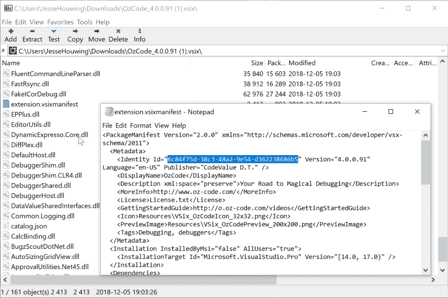
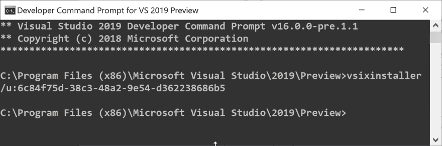

# 从命令行卸载 Visual Studio 扩展

> 原文：<https://dev.to/xpirit/uninstall-visual-studio-extension-from-the-command-line-p5p>

> 下面的过程仍然使用 OzCode 作为例子，但是问题已经解决了。原来是 OzCode 和 Resharper 互动的方式。OzCode 在提供用 dotTrace 捕获的跟踪后能够重现该问题。

安装 Visual Studio 2019 预览版后，在安装了所有我喜欢的扩展后，它无法启动。冻结的主要候选人是 Resharper 和 OzCode。Resharper 有一个安装程序，允许我卸载扩展，但 OzCode 是一个 vsix 扩展，如果你不知道如何卸载，只能从 Visual Studio 本身的扩展窗口卸载。由于 Visual Studio 在启动时停滞不前，这不是一件容易的事情。

还有一个替代方法，你可以使用`vsixinstaller`从命令行卸载扩展。步骤如下:

1.  找到用于安装扩展的 vsix 文件
2.  在你最喜欢的归档程序中打开它(我的是 [7-zip](https://www.7-zip.org/)
3.  从`extension.vsixmanifest`中获取扩展的 GUID。
4.  运行`vsixinstaller /u:GUID`从开发者命令提示符中删除扩展。

 

<figcaption>查找扩展的 Visual Studio 扩展标识符</figcaption>

 

<figcaption>删除分机</figcaption>

图片来源:[绝杀](https://www.flickr.com/photos/vollefolklore/3691933988/)。