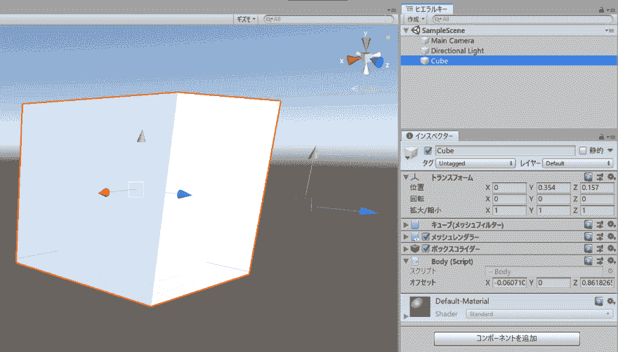

# 想在 Unity 中用 3D 光标调整偏移值等

> 原文：<https://dev.to/shiena/unity-3d-1049>

# 前言

在 Unity 中，想要偏移 GameObject 的配置位置时，可以通过 Inspector 调整字段。 但是，想将 Vector3 倾斜偏移时等，有时仅靠数值很难调整。 这时在[编辑器扩展入门](https://anchan828.github.io/editor-manual/web/index.html)中找到了制作 Gizmo 和 Handle 的方法，制作简单的编辑器扩展就非常方便了。

# 编辑器扩展的制作方法

假设有以下类别，想用 3D 光标调整`offset`。

```
using UnityEngine;

public class Body : MonoBehaviour
{
    /// <summary>
    /// 3Dカーソルを作りたいフィールド
    /// </summary>
    public Vector3 offset;
} 
```

通过创建以下编辑器扩展，可以在 Scene View 上创建 3D 光标和小控件。

```
#if UNITY_EDITOR
using UnityEditor;
using UnityEngine;

/// <summary>
/// 操作したいクラスをCustomEditorAttributeのtypeofで指定する
/// </summary>
[CustomEditor(typeof(Body))]
public class BodyEditor : Editor
{
    /// <summary>
    /// 3Dカーソルを作る
    /// </summary>
    private void OnSceneGUI()
    {
        var component = target as Body;
        var offset = component.offset;
        var transform = component.transform;
        offset = Handles.PositionHandle(transform.TransformPoint(offset), transform.rotation);
        component.offset = transform.InverseTransformPoint(offset);
    }

    /// <summary>
    /// ギズモを作る
    /// </summary>
    /// <param name="body"></param>
    /// <param name="gizmoType"></param>
    [DrawGizmo(GizmoType.NonSelected | GizmoType.Active)]
    private static void DrawEyeTargetGizmos(Body body, GizmoType gizmoType)
    {
        var transform = body.transform;
        Gizmos.color = Color.gray;
        Gizmos.DrawSphere(transform.TransformPoint(body.offset), 0.05f);
    }
}
#endif 
```

[](https://res.cloudinary.com/practicaldev/image/fetch/s--H4L4S8cw--/c_limit%2Cf_auto%2Cfl_progressive%2Cq_auto%2Cw_880/https://dev-to-uploads.s3.amazonaws.com/i/tknisohjntfmjqj9iiur.png)

# 参考链接

*   [编辑器扩展入门](https://anchan828.github.io/editor-manual/web/index.html)
    *   [第 16 章 gizmo ( gizmo )](https://anchan828.github.io/editor-manual/web/gizmo.html)
    *   [第 17 章 Handle (方向盘)](https://anchan828.github.io/editor-manual/web/handles.html)