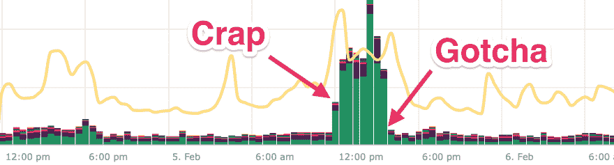

# 无限制的软件不存在

> 原文：<https://dev.to/scottw/unlimited-software-does-not-exist-29cp>

在软件中，没有什么是无限的。你可以不受任何限制地推广和销售你的产品*，但是当涉及到计算的时候，**总会有限制**。*

 *一个这样的限制，昨天咬了我的屁股。

KickoffLabs 在几个地方使用递归查询。这些都很棒，因为它们通常可以限制到数据库的来回跳跃。通常，它们递归两层左右。

不幸的是，一个客户(或客户的客户)设法深入许多层次…你现在可能已经猜到了，没有任何限制。此外，这些查询中的一个会生成更多相关的递归查询。

图中的绿色是数据库工作。导致问题的不是查询的数量，而是他们所做的工作量。这些查询反过来又开始推回其他所有东西，耗尽连接，等等。所有人的欢乐时光。

好消息是，总体而言，该系统运行良好。有几个小时，我们的响应时间超过了我们期望的限制，但我们仍然可以正常运行。

我们现在对递归查询的深度有了限制。

这些虫子让我心烦意乱。一旦你看到它，它就变得如此明显，我不确定地说，总是有一些限制。

作为对我反对计算的罪过的忏悔，我昨晚无法入睡，最后在凌晨 2 点开始真正的修复。

如果你有时间，看看你的代码，看看是否有什么需要一些“以防万一”的限制。

我不得不用 bajeebus 这个词…这一切都是值得的。↩︎*