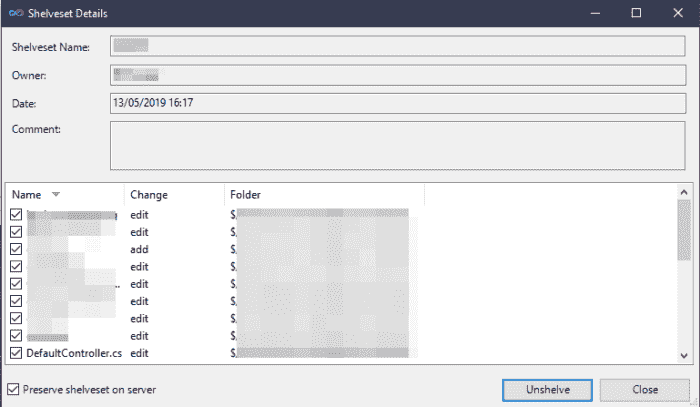
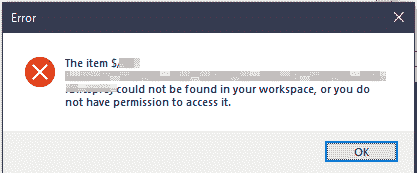

# 取消搁置 TFS 更改为另一个分支(VS 2017)

> 原文：<https://dev.to/yerac/unshelving-tfs-changes-into-another-branch-vs-2017-4kip>

我最近在 Visual Studio 2017 的 TFS 内的错误分支上有一些待定的更改(与 2019 相同)。我想“迁移”我的变更，而不是在另一个分支中克隆我所有的变更。在 GIT 中这是相当微不足道的，然而在 TFS…

要在两个分支之间移动变更，您必须确保:

*   您想要迁移的变更被**搁置在源分支的**上。
*   工作区中没有**没有** **待决的变更**——这很烦人，但却是工具的限制。
*   您对两个分支都进行“获取最新”操作。
*   您可以访问 Visual Studio 命令提示符。
*   如果您使用低于 VS2017 的版本，您还需要 TFS 电动工具。
*   源和目标分支在**同一个工作空间中。**我花了比我想承认的更长的时间来解决这个问题，因为这个错误是没有帮助的！

满足上述先决条件后，您需要启动 VS 命令提示符。这可以通过开始菜单搜索找到，但是你也可以把它添加到 VS 中(如果还没有的话)，按照下面 VS 中的步骤。

## 向 Visual Studio 添加 Visual Studio 命令提示符

转到“工具”>“外部工具”，然后选择“添加”。

给它一个合适的标题——我选择了“VS 命令提示符”。在这里，我们希望指定以下内容:

*   命令:C:\Windows\System32\cmd.exe
*   参数:/k " C:\ Program Files(x86)\ Microsoft Visual Studio \ 2017 \ Enterprise \ common 7 \ Tools \ vsdevcmd . bat "
*   初始目录:$(解决方案目录)

这意味着(在保存时)如果你进入“工具”，你会看到一个选项“VS 命令提示符”。

## 回迁移…

打开控制台，使用源代码控制下的文件夹的工作目录(我使用源代码解决方案目录)，运行命令:

```
tfpt unshelve /migrate /source:"$/Core/MyProduct" /target:"$Core/MyProduct-Branch" "MyShelveset" 
```

Enter fullscreen mode Exit fullscreen mode

在这个命令中，我们说使用 TFS 工具来取消搁置名为“MyShelveset”的搁置集。迁移标志表示它将在区域之间移动，源和目标被命名为 TFS 文件夹。

如果您得到一个错误“**具有相同键的项目已经被添加**”，请确保您在源或目标中没有任何挂起的更改。

如果您得到错误“**无法确定工作空间**”，请确保您正在源文件夹下的目录中运行该工具。

如果该命令成功运行，您将会看到“搁置集详细信息”面板。

<figure>[](https://res.cloudinary.com/practicaldev/image/fetch/s--etivKavm--/c_limit%2Cf_auto%2Cfl_progressive%2Cq_auto%2Cw_880/https://i1.wp.com/yer.ac/blog/wp-content/uploads/2019/05/image-1.png%3Ffit%3D700%252C407) 

<figcaption>搁置集详情</figcaption>

</figure>

在此面板中，您应该可以看到组成您在命令中定义的搁置集的文件。按“取消搁置”将开始该过程。

在我的例子中，我还看到了一个“取消搁置/合并搁置集”窗口。您应该能够“自动合并所有”。

奇怪的是，自动合并在我的机器上花了很长时间(你可以在 cmd 窗口中看到进度)。我不确定这是否正常，或者因为那天我通过 VPN 远程工作。

## *"在您的工作区中找不到项目，或者您没有权限访问它。*

<figure>[](https://res.cloudinary.com/practicaldev/image/fetch/s--UV2qI3mZ--/c_limit%2Cf_auto%2Cfl_progressive%2Cq_auto%2Cw_880/https://i2.wp.com/yer.ac/blog/wp-content/uploads/2019/05/image-2.png%3Fw%3D840) 

<figcaption>“在您的工作区中找不到项目，或者您没有权限访问它。”
</figcaption>

</figure>

如果你在合并过程中得到这个，你可能会像我一样，陷入获取最新数据、检查映射等的陷阱。原来**这个命令不能跨工作区工作。**当我分支时，我将分支映射到一个全新的工作区，因为它更干净。

解决这个问题的方法(如果像我一样，每个分支使用一个新的工作区)是将分支临时映射到同一个工作区。

## 总结起来

所以总的来说，这是可能做到的，但是像我这样的 GIT 新手在 GIT 中需要几分钟才能完成的过程总共需要将近一个小时！幸运的是，这仍然比手动合并省力，但是如果你只有几个文件，我建议你手动合并…

## 奖励回合:将另一个用户搁置集解除搁置到另一个分支

如果搁置集是同事的而不是您的，您可以简单地追加"；username”，它将在该用户下搜索该搁置集。

帖子[解除搁置 TFS 变化成另一个分支(VS 2017)](http://yer.ac/blog/2019/05/14/unshelving-tfs-changes-into-another-branch-vs-2017/) 最早出现在 [yer.ac |一个开发者的冒险，和其他东西上。](http://yer.ac/blog)。