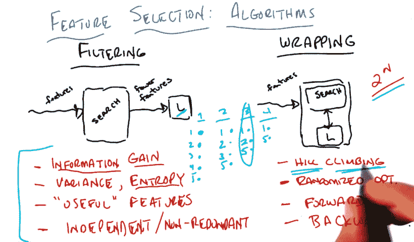

# 无监督学习:特征选择

> 原文：<https://dev.to/swyx/unsupervised-learning-feature-selection-84f>

*这是我学习[佐治亚理工学院/优达城机器学习课程](https://www.udacity.com/course/machine-learning--ud262)的系列课堂笔记中的第 15 篇。课堂教材是汤姆·米切尔的[机器学习。](https://www.cs.ubbcluj.ro/~gabis/ml/ml-books/McGrawHill%20-%20Machine%20Learning%20-Tom%20Mitchell.pdf)*

## 特征选择的目标

在我们的数据中，可能有太多重要的特征。因为即使在二进制的情况下，这些也会导致 2 N 的排列，所以尽量减少 N 是好的。想象一下，在 1000 个可能重要的特性中，你能够将它缩小到 10 个真正重要的特性。直观上，这与解释特征(知识发现)是一样的。

众所周知，特征选择(也称为任意数量参数的优化)是 NP 难的。解决它需要指数级的时间。

有两种通用的方法来解决这个问题。

## 过滤和包装

**方法 1:过滤**

通过某种最大化(也称为“搜索”)算法将许多特征减少为一组较少的特征，然后传递给学习算法。评分隐藏在搜索算法中，与学习者无关。

流程向前流动，这很容易设置，但问题是没有任何反馈。

虽然你不能在过滤时提前运行学习器，但是你仍然可以评估特征，例如信息增益。事实上，您可以让您的搜索算法只是一个决策树，并将 DTree 中使用的节点作为简化的特征传递给您的学习者。因此，这就像使用 DTrees 的归纳偏见来选择特征，然后将它传递给你的其他学习者(例如 NN 或 kNN ),并带有其他偏见。当另一个学习者(如 NN 或 kNN)遭受维数灾难时，这尤其有用。

您还可以使用其他东西作为过滤标准:

*   信息增益
*   信息增益的代理，例如方差、熵、运行神经网络和修剪掉低权重特征以保留“有用”特征
*   独立/非冗余功能

**方法 2:包装**

在特征子集上运行你的学习算法，**学习算法报告一个分数，这是你的最大化(又名“搜索”)算法的驱动力**。无论你的学习算法是什么，对特征的搜索都是围绕着它的。反馈是内置的。

您可以使用一些方法来进行包装搜索，而无需支付指数(2 N) 成本:

*   任何随机优化方法(例如爬山)
*   正向顺序选择
*   反向消除

向前搜索包括依次运行每个功能，并查看哪个功能增加了您当前拥有的最佳功能。重复(再次运行每个剩余的功能)，直到您的分数不再提高足够多。这是一种爬山。

向后搜索包括从所有 N 个特征开始，寻找可以消除的特征。N-1 个特征中的哪一组表现最好，进入下一轮，你将丢掉这个不吉利的特征。重复，直到分数下降*太多*。

**比较**

过滤比包裹更快，因为您可以应用任何只查看特征并应用过滤的算法(不涉及学习)。尽管这是一个指数问题，但您可以选择自己的过滤速度，希望多快就有多快。

包装考虑到了模型和偏差，但是因为必须学习，所以速度很慢。

过滤只关心标签，而包装利用了学习者，但是有一个指数级的搜索问题。

## 相关性 vs 实用性

这里我们要定义一些正式术语。

相关性度量对贝叶斯最优分类器(BOC)的影响:

*   `Xi`非常相关，如果去除它会降解 BOC
*   `Xi`弱相关 if
    *   不太相关
    *   存在特征 S 的子集，使得向 S 添加 Xi 改善了 BOC
*   否则就无关紧要了

相关的是关于*信息*。

有用性衡量对*特定预测值*的影响，更准确地说，是对给定特定分类器的误差的影响。

功能选择通常是选择最相关的功能，但我们真正想要的往往是有用性。

包装很慢，但**有用**，过滤试图优化相关性，但忽略了我们真正想要的学习者的偏见。

## 我们系列的下一个

希望这是对特性选择的一个好的介绍。我正在计划更多的初级读本，希望您能就以下方面提供反馈和问题:

*   [概述](https://dev.to/swyx/machine-learning-an-overview-216n)
*   监督学习
    *   [决策树](https://dev.to/swyx/machine-learning-classification-learning--decision-trees-1mbh)
    *   [回归](https://dev.to/swyx/supervised-learning-regression-4d17)
    *   [神经网络](https://dev.to/swyx/supervised-learning-neural-networks-mpo)
    *   [基于实例的学习(K 最近邻)](https://dev.to/swyx/supervised-learning-instance-based-learning-and-k-nearest-neighbors-kge)
    *   [集成学习(AdaBoost)](https://dev.to/swyx/supervised-learning-ensemble-learning-lim)
    *   [内核方法&支持向量机](https://dev.to/swyx/supervised-learning-support-vector-machines-3mgk)
    *   [计算学习理论](https://dev.to/swyx/supervised-learning-computational-learning-theory-160h)
    *   [VC 尺寸](https://dev.to/swyx/supervised-learning-vc-dimensions-10b)
    *   [贝叶斯学习](https://dev.to/swyx/supervised-learning-bayesian-learning-403l)
    *   [贝叶斯推理](https://dev.to/swyx/supervised-learning-bayesian-inference-4l72)
*   无监督学习
    *   [随机优化](https://dev.to/swyx/unsupervised-learning-randomized-optimization-4c1i)
    *   [信息论](https://dev.to/swyx/unsupervised-learning-information-theory-recap-4iem)
    *   [聚类](https://dev.to/swyx/unsupervised-learning-clustering-42mi)
    *   [功能选择](https://dev.to/swyx/unsupervised-learning-feature-selection-84f)
    *   [特征变换](https://dev.to/swyx/unsupervised-learning-feature-transformation-pcf)
*   强化学习
    *   马尔可夫决策过程-3 月 25 日的一周
    *   “真实”RL-4 月 1 日开始的一周
    *   博弈论-4 月 15 日的一周