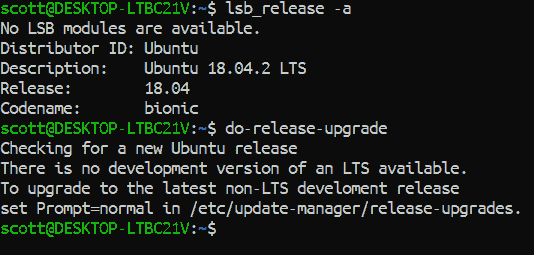
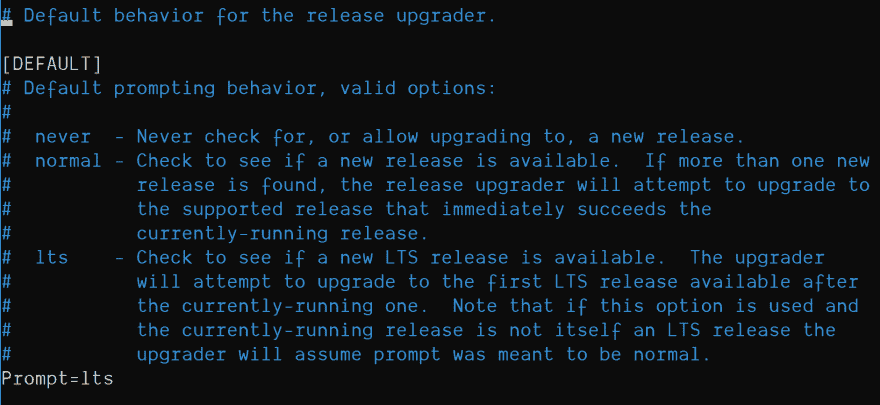
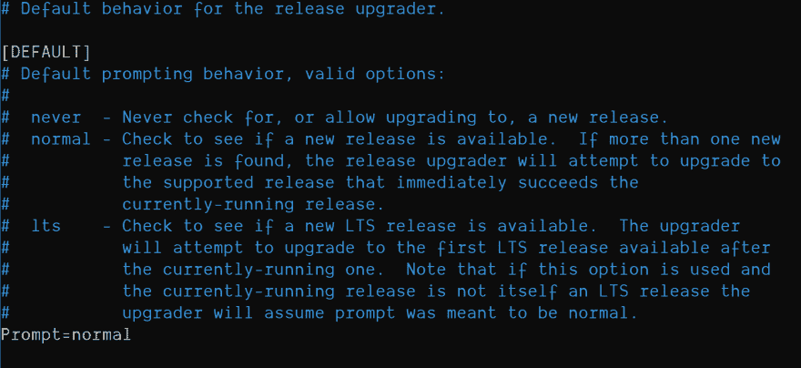
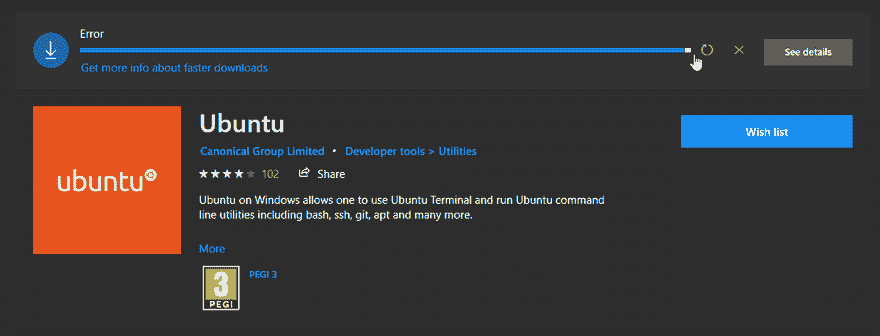

# 将 WSL 上的 Ubuntu 从 18.04 升级到 18.10

> 原文：<https://dev.to/spences10/upgrade-ubuntu-on-wsl-from-18-04-to-18-10-4pa1>

###### 詹姆斯·博尔德在 Unsplash 上的照片

## 已经用 WSL 搭配 Ubuntu 了？想要升级吗？？

这是一个将 Windows 子系统 Linux (WSL)从当前的 LTS 版本升级到最新的“普通”版本 18.10 的指南。

我在本周末的 [dev.to](https://dev.to) 上发现了这篇文章，详细介绍了 Windows 子系统 Linux 的 Ubuntu 从 18.04 版本升级到 18.10 版本。你会从[我之前的帖子](https://blog.scottspence.me/wsl-bootstrap-2019#update-upgrade-and-autoremove)中知道，试图在 WSL 上更新是很费时间的，你最好从头开始。

我自己也尝试过，遇到了一点麻烦，你可以看看[大卫的帖子](https://dev.to/david_j_eddy/how-to-upgrade-wsl-ubuntu-18-04-to-18-10-203)上的评论

因此，从卸载我的 Ubuntu 版本开始，我继续尝试了一次，如果你已经阅读了 [David 的帖子](https://dev.to/david_j_eddy/how-to-upgrade-wsl-ubuntu-18-04-to-18-10-203)上的评论，你会看到我遇到了无法访问“快照商店”的问题。我不知道这是什么意思，但基本上它停止了我的升级，我不知道我是否完全升级了。

值得庆幸的是，其他人也遇到了同样的问题，并问及[堆栈溢出](https://askubuntu.com/questions/1119301/your-system-is-unable-to-reach-the-snap-store)，基本上你需要用
卸载 Lxd

```
sudo dpkg --force depends -P lxd; sudo dpkg --force depends -P lxd-client 
```

Enter fullscreen mode Exit fullscreen mode

现在我们可以用`do-release-upgrade`命令更新 Ubuntu 了，如果你马上这么做，你可能会看到类似下面的内容:

[](https://res.cloudinary.com/practicaldev/image/fetch/s--lF7d9SNH--/c_limit%2Cf_auto%2Cfl_progressive%2Cq_auto%2Cw_880/https://thepracticaldev.s3.amazonaws.com/i/z1ux2rdf5i0by8jpx6lx.png)

这是将更新程序设置为仅检查长期支持版本，我们现在将通过将提示符从`lts`更改为`normal`来改变这一点，在 bash 中使用:

```
sudo nano /etc/update-manager/release-upgrades 
```

Enter fullscreen mode Exit fullscreen mode

您应该会看到默认的版本升级程序设置:

[](https://res.cloudinary.com/practicaldev/image/fetch/s--Up_6jn_v--/c_limit%2Cf_auto%2Cfl_progressive%2Cq_auto%2Cw_880/https://thepracticaldev.s3.amazonaws.com/i/r411tazwed1oc2tgoire.png)

您需要将其设置为正常:

[](https://res.cloudinary.com/practicaldev/image/fetch/s--vXsuA-oK--/c_limit%2Cf_auto%2Cfl_progressive%2Cq_auto%2Cw_880/https://thepracticaldev.s3.amazonaws.com/i/c800wq7otudak7al8cjf.png)

现在我们可以开始发布升级命令:

```
sudo do-release-upgrade 
```

Enter fullscreen mode Exit fullscreen mode

## 升级时间！

现在，我很惊讶地发现升级并没有花那么长的时间，你可能会被问到关于修改后的软件包的问题，以及你是想接受维护者还是保留你的版本，我会一直使用任何软件包的维护者版本。你可以做你想做的事，我不是你妈妈😜

## 就是这样

你现在应该有 18.10 版本的 Ubuntu WSL 了👏

[](https://res.cloudinary.com/practicaldev/image/fetch/s--FvquCy-J--/c_limit%2Cf_auto%2Cfl_progressive%2Cq_auto%2Cw_880/https://thepracticaldev.s3.amazonaws.com/i/puuwb6pt8x0f85g7bdtm.png)

如果你像我一样，卸载了 Ubuntu 并试图重新安装它，并且得到如下错误:

[](https://res.cloudinary.com/practicaldev/image/fetch/s--OoyCYzHH--/c_limit%2Cf_auto%2Cfl_progressive%2Cq_66%2Cw_880/https://thepracticaldev.s3.amazonaws.com/i/r2dqv5xyzrltgrks9dhv.gif)

然后对我有用的是通过 PowerShell 控制台用管理员权限重启`LxssManager`。

```
Get-Service  LxssManager  |  Restart-Service 
```

Enter fullscreen mode Exit fullscreen mode

## 总结一下！

我们继续将 WSL Ubuntu 版本从 18.04 升级到 18.10，我们删除了 Lxd，它在 WSL 上是不需要的，但却是微软商店版本的一部分🤷‍♂️

然后，我们将版本升级者的默认行为从`lts`更改为`normal`。

一旦我们完成了这两个部分，我们就可以继续用“执行-发布-升级”来升级 Ubuntu 了。

**感谢阅读**🙏

如果你喜欢这个，请看看我的其他内容。

在 Twitter 上关注我，或者在 GitHub 上关注 T2 问我任何问题。