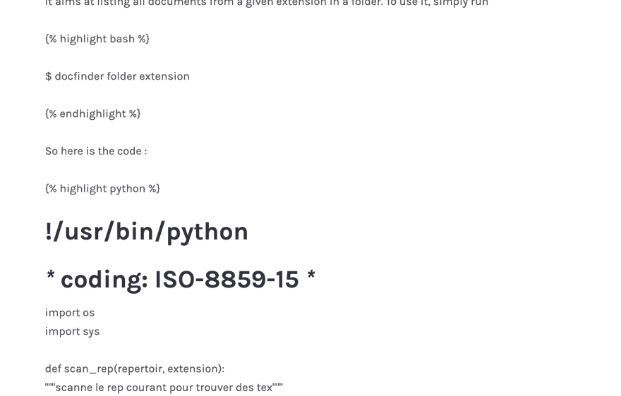

# 从哲基尔升级到幽灵

> 原文：<https://dev.to/jlengrand/upgrading-from-jekyll-to-ghost-3p66>

[我已经在我的上一篇帖子](https://dev.to/jlengrand/goodbye-github-pages-welcome-ghost-37i2-temp-slug-6492567)中解释了离开 **[杰基尔](https://jekyllrb.com/)** 运行 [Github 页面](https://pages.github.com/)的原因。

这篇文章描述了我将所有东西转移到的步骤，重点是内容，而不是网络/领域部分。

## 创建幽灵博客

我用的是[数字海洋](https://marketplace.digitalocean.com/apps/ghost)的一键安装 droplet。两分钟，很容易< 3。

## 将帖子移至 Ghost

迁移的最重要的部分当然是让你所有的帖子恢复。为此，我需要提取 Jekyll 的帖子，并以 Ghost 可以理解的格式获取它们。

**获取 Ghost 格式的内容**

网上有几个转换器可以将你所有的 Jekyll 帖子转换成 Ghost 格式。[这里有一个用**Python**T3 写的。](https://github.com/kshaffer/jekylltoghost)[这里还有一个写在**节点**](https://github.com/weblancaster/nodejs-jekyll-to-ghost) 的。我两个都用的很成功:)。

它们相当容易使用，只需在本地复制包含你的文章的文件夹，让脚本为你工作。

**将输出转换为 V2 Ghost 格式**

上面列出的转换器有一个问题:它们创建一个以 Ghost **V1** 格式编写的转储。然而，最新的幽灵版本现在是 V2。为了能够接收转储，您需要对其进行升级。

为此，我有:

*   [在本地安装了旧版本的 Ghost](https://docs.ghost.org/install/local/)(`npm install ghost-cli@latest -g ;ghost install 1.25.6`)
*   上传了转储
*   将 Ghost 实例升级到最新版本(`ghost update --v1 ;ghost update`)
*   再次导出数据

使用`ghost-cli`工具，这个过程相当简单，一切都在 10 分钟内完成。最后一步是将 V2 转储文件导入到 Ghost 实例中。现在，您可以删除 ghost 的本地实例了。

**更新图片链接**

我很少在我的帖子中使用图片，但我知道转换器不会使用这些图片。最推荐的解决这个限制的方法是压缩你所有的图片并上传到你的 ghost 实例中，然后直接更新你文章中的链接。我没有这样做过，但你可以在网上找到指南，解释如何做。

## 让您的重定向发挥作用

Jekyll 默认使用一种`yyyy/mm/name-of-the-file`格式来创建 URL。Ghost 使用的是基于文章标题的东西，而不是文件名。因为我的博客已经在线一段时间了，对我来说重要的是以前的网址仍然让人们访问正确的帖子，而不是 404 页面。

我没有找到简单的方法来产生这些。所以由于懒惰，我为它创建了一个脚本。[你可以在这里找到](https://github.com/jlengrand/redirectsJekyllToGhost)。

该脚本获取列表中的每个降价文件，并在以下各项之间创建一个关系:

*   哲基尔格式:`n/yyyy/mm/filename_without_date/`
*   鬼格式:`/title_of_article_in_yaml`
*   需要一些额外的魔法(过滤特殊字符(如'()！，-')，删除多空格，将空格转换为-)

这足以正确地转换我的大部分重定向。正如你可以在回购的自述文件中看到的，仍然有一些警告。但这已经足够让我收工了。我得到了一个 JSON 文件，其中有一个可以上传到 Ghost 的重定向列表。

## 主题化

我对默认的 Ghost 主题并不感到惊讶，并浏览了市场寻找更好的主题。我决定选择贺拉斯，它看起来很有视觉吸引力，同时保持简单。市场上有很多漂亮的东西，我绝对推荐去逛逛。

该主题几乎可以直接使用。我只改变了主色，使其成为我的，并删除了评论(我更喜欢在 Twitter 或电子邮件上拍照)。MyColor.space 给了我很大的帮助**让我找到了另一种能与主题其余部分搭配的颜色**。只需选择你想改变的颜色，该工具将提供可能的替代品。

## 工作进行中

*   转换时我丢失了我的标签。不知道为什么。对我来说这不是一个大问题，但是在你跳之前，也许值得你调查一下
*   我非常老的帖子不是用 Markdown 写的，而是用带有代码横幅的 HTML 写的。那些转换的时候不好玩。我不得不手动修复这些(有些仍然存在，例如[这个](https://dev.to/jlengrand/goodbye-github-pages-welcome-ghost-37i2-temp-slug-6492567))。<！-kg-卡-begin: image - >

<figure> 

<figcaption>将一个非标售的帖子转换成幽灵</figcaption>

</figure>

*   Ghost 允许您使用图像来说明帖子的标题。如果您需要，这显然是您必须手动完成的事情。为了节省时间，我把重点放在了帖子列表的前两页，以及我拥有的阅读量最大的文章上。

## 终注

总而言之，一个漫长但不复杂的过程。在这个过程中，我丢失了一些东西，但是考虑到博客的历史，以及它所经历的不同阶段，我认为它还不错。

我希望有一个更完整和最新的转换器从哲基尔到幽灵，虽然，所有的选项似乎没有在几年内更新(也许因为他们工作得足够好....).但至少一个 V2 的转换器会很好。

干杯！