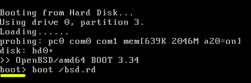
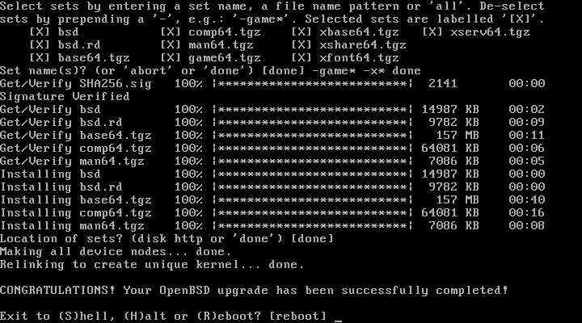

# 将 OpenBSD 从 6.3 升级到 6.4

> 原文：<https://dev.to/nabbisen/upgrading-openbsd-63-to-64-59a5>

# 总结

这篇帖子是关于将 OpenBSD 从 [6.3](https://www.openbsd.org/63.html) 升级到 [6.4](https://www.openbsd.org/64.html) 的。
需要做的是**在根目录下找到目标版本的 bsd.rd 并在引导时运行**。
bsd.rd 是“一个特殊的 ramdisk 内核。”

本教程不仅适用于手边的计算机，还适用于提供 OpenBSD 镜像和 VNC(虚拟网络计算)的 VPS 服务，例如 [Vultr](https://vultr.com/) 和 [CloudSigma](https://www.cloudsigma.com/) 。

### 公文

OpenBSD 项目总是提供关于他们产品的丰富文档。
这也是[升级 OS](https://www.openbsd.org/faq/upgrade64.html) 的情况:

> 仅支持从一个版本升级到紧随其后的版本。在尝试之前，通读并理解这个过程。对于关键的或物理上远程的机器，首先在相同的本地系统上测试它。
> 
> 首先执行升级前的步骤。接下来，从安装内核 bsd.rd 引导:使用可引导的安装介质，或者将 6.4 版本的 bsd.rd 放在文件系统的根目录下，并指示引导加载程序引导这个内核。这个内核启动后，选择(U)pgrade 选项并按照提示进行操作。应用配置更改，最后升级软件包:pkg_add -u
> 
> 或者，您可以使用手动升级过程。
> 
> 您可能希望查看勘误表页面或升级到 stable 分支以获得任何发布后的修复。

然而，令我难过的是，我还不够成熟，无法理解如何“指示引导加载程序引导这个内核”...这是一个简单的方法；我只是不得不在屏幕等待几秒钟的时候在 boot 上显示“boot >”输入一些东西。

<center>✿ ✿ ✿</center>

# 教程

### 第一步:准备

获取目标版本的 BSD . rd:

```
#  # get bsd.rd
#  wget https://cdn.openbsd.org/pub/OpenBSD/6.4/amd64/bsd.rd
#  wget https://cdn.openbsd.org/pub/OpenBSD/6.4/amd64/SHA256.sig
#  # verify it
#  signify -C -p /etc/signify/openbsd-64-base.pub -x SHA256.sig bsd.rd
Signature Verified
bsd.rd: OK 
```

Enter fullscreen mode Exit fullscreen mode

替换为根目录下的旧版本:

```
#  # create backup of the previous version
#  cp /bsd.rd ./bsd.rd.63
#  # replace /bsd.rd
#  cp bsd.rd /
  #  # remove downloaded files as needed
#  rm ./bsd.rd
#  rm ./SHA256.sig 
```

Enter fullscreen mode Exit fullscreen mode

**注:如果您从 2013 年开始升级您的系统，并且从未删除用户和组:*

```
#  userdel _btd
#  # "userdel: No such user `_btd'" is echoed if not applicable to the above
#  groupdel _btd
#  # "groupdel: No such group: `_btd'" is echoed if not applicable to the above 
```

Enter fullscreen mode Exit fullscreen mode

### 第二步:运行 bsd.rd

确保通过直接连接或 VNC 连接与服务器连接。

**注意:使用 VNC 连接，[remina](https://remmina.org/)是作为客户端的有用工具之一。*

重新启动操作系统:

```
#  reboot 
```

Enter fullscreen mode Exit fullscreen mode

等待引导控制台显示" boot > ":

[](https://res.cloudinary.com/practicaldev/image/fetch/s--uJwGi9z2--/c_limit%2Cf_auto%2Cfl_progressive%2Cq_auto%2Cw_880/https://thepracticaldev.s3.amazonaws.com/i/v2qy8nz6kr0ijq0l67pc.png)

现在，快速输入一些东西，这样自动过程就停止了。

如上输入`boot /bsd.rd`。就是这样！

### 第三步:升级

OpenBSD 6.4 安装程序是这样启动的:

```
Welcome to the OpenBSD/amd64 6.4 installation program.
(I)nstall, (U)pgrade, (A)utoinstall or (S)hell? u 
```

Enter fullscreen mode Exit fullscreen mode

选择“u ”,这样会给出与初始安装非常相似的问题。

**注:选择“I”将给出在现有磁盘或空的空间中安装 OpenBSD 6.4 的方式。*

像这样回答他们:

| 问题 | 回答 |
| --- | --- |
| 哪个磁盘是根磁盘 | sd0 |
| 强制检查干净的非根文件系统 | 不 |
| 集合的位置 | 超文本传送协议（Hyper Text Transport Protocol 的缩写） |
| HTTP 代理 URL | 没有人 |
| HTTP 服务器 | cdn.openbsd.org |
| 服务器目录 | 酒吧/开放式 BSD/6.4/amd64 |
| 集合名称 | -game* done(如果在各种场景下使用 php，这比“-game* -x* done”要好) |
| 集合的位置 | 完成的 |

当然，它们取决于环境。

安装后，您将收到祝贺消息:

[](https://res.cloudinary.com/practicaldev/image/fetch/s--fAq5eSKy--/c_limit%2Cf_auto%2Cfl_progressive%2Cq_auto%2Cw_880/https://thepracticaldev.s3.amazonaws.com/i/tyeua2q2vkxqkiwwrevj.png)

让我们重新启动它，OpenBSD 6.4 将在你的手中！

### 第四步:升级

我推荐第一次启动新 OS 时的附加操作:

```
#  # apply base system binary patches
#  syspatch
#  # upgrade packages
#  pkg_add -u 
```

Enter fullscreen mode Exit fullscreen mode

<center>✿ ✿ ✿</center>

为🕊服务愉快