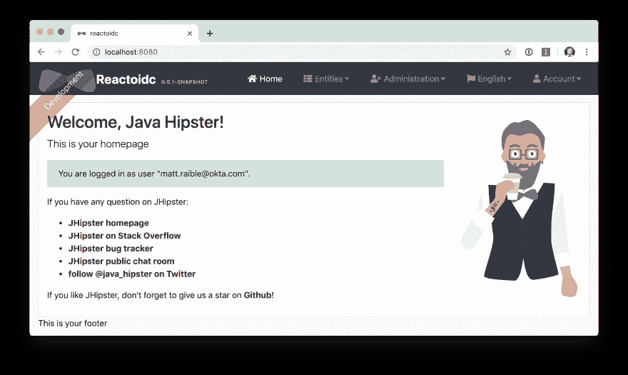
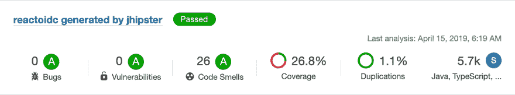

# 通过升级 Spring 安全 OAuth 和 JUnit 测试👀一个爪哇潮人

> 原文：<https://dev.to/oktadev/upgrading-spring-security-oauth-and-junit-tests-through-the-of-a-java-hipster-bn3>

使用单元测试和集成测试来验证你的代码质量是展示你关心你的代码的一个很好的方式。我最近在流行的 JHipster 开源项目中做了大量工作，以升级它来使用最新发布的 Spring Security。

Spring Security 5.1+将 OAuth 2.0 和 OIDC 添加为一等公民，您可以使用其优雅的 DSL 进行配置(也称为酷方法链接，也称为构建器模式)。自从 Rob Winch 和他的团队第一次推出它，我就一直在使用它。在一个非常创新的项目上与他们合作很有趣。春安让 OAuth 牛逼！

我在 2017 年秋天给 JHipster 添加了 OAuth 2.0 支持。这次经历对我影响很大。我学到了很多关于 Keycloak、Docker Compose 以及如何在身份提供者(IDP)之间切换的知识。

我花了上个月的时间升级 JHipster 以使用 Spring Security 5.1(Spring Boot 2.1 的默认版本)。我一路上经历了一些挫折，对着 Travis CI 挥了挥拳头，在想出解决办法的时候欢欣鼓舞。在这个过程中我也学到了不少东西。今天我将与你们分享这些经历。

## 用 OAuth 2.0 和 OIDC 注销

在 JHipster 中集成了对 Keycloak 和 Okta 的支持后不久，该项目就收到了大量用户的抱怨，说他们无法注销。JHipster 用户熟悉点击**注销**(检查最新的)和被*完全注销*。使用默认的 Spring 安全支持，用户可以从本地应用中注销，但不能从 IdP 中注销。

这花了我一年的时间，但我终于在今年早些时候添加了[全球 SSO 注销](https://github.com/jhipster/generator-jhipster/pull/8757)。Keycloak 和 Okta 都要求您向端点发送一个 GET 请求，请求中包含 ID 标记和重定向到的 URL。因此，我创建了一个返回这些值的`LogoutResource`。

```
@RestController
public class LogoutResource {
    private final Logger log = LoggerFactory.getLogger(LogoutResource.class);
    private final UserInfoRestTemplateFactory templateFactory;
    private final String accessTokenUri;

   public LogoutResource(UserInfoRestTemplateFactory templateFactory,
                         @Value("${security.oauth2.client.access-token-uri}") String accessTokenUri) {
       this.templateFactory = templateFactory;
       this.accessTokenUri = accessTokenUri;
   }

    /**
     * POST /api/logout : logout the current user
     *
     * @return the ResponseEntity with status 200 (OK) and a body with a global logout URL and ID token
     */
    @PostMapping("/api/logout")
    public ResponseEntity<?> logout(HttpServletRequest request, Authentication authentication) {
        log.debug("REST request to logout User : {}", authentication);
        OAuth2RestTemplate oauth2RestTemplate = this.templateFactory.getUserInfoRestTemplate();
        String idToken = (String) oauth2RestTemplate.getAccessToken().getAdditionalInformation().get("id_token");

        String logoutUrl = accessTokenUri.replace("token", "logout");
        Map<String, String> logoutDetails = new HashMap<>();
        logoutDetails.put("logoutUrl", logoutUrl);
        logoutDetails.put("idToken", idToken);
        request.getSession().invalidate();
        return ResponseEntity.ok().body(logoutDetails);
    }
} 
```

Angular 客户端调用`/api/logout`端点并构建 IdP 注销 URL。

```
this.authServerProvider.logout().subscribe(response => {
  const data = response.body;
  let logoutUrl = data.logoutUrl;
  // if Keycloak, uri has protocol/openid-connect/token
  if (logoutUrl.indexOf('/protocol') > -1) {
    logoutUrl = logoutUrl + '?redirect_uri=' + window.location.origin;
  } else {
    // Okta
    logoutUrl = logoutUrl + '?id_token_hint=' +
    data.idToken + '&post_logout_redirect_uri=' + window.location.origin;
  }
  window.location.href = logoutUrl;
}); 
```

测试`LogoutResource`非常简单。大部分工作涉及模仿`UserInfoRestTemplateFactory`以便它返回一个 ID 令牌。

```
@RunWith(SpringRunner.class)
@SpringBootTest(classes = JhipsterApp.class)
public class LogoutResourceIntTest {

    @Autowired
    private MappingJackson2HttpMessageConverter jacksonMessageConverter;

    private final static String ID_TOKEN = "eyJ0eXAiOiJKV1QiLCJhbGciOiJIUzI1NiJ9" +
        ".eyJzdWIiOiIxMjM0NTY3ODkwIiwibmFtZSI6IkpvaG4gRG9lIiwiYWRtaW4iOnRydWUsIm" +
        "p0aSI6ImQzNWRmMTRkLTA5ZjYtNDhmZi04YTkzLTdjNmYwMzM5MzE1OSIsImlhdCI6MTU0M" +
        "Tk3MTU4MywiZXhwIjoxNTQxOTc1MTgzfQ.QaQOarmV8xEUYV7yvWzX3cUE_4W1luMcWCwpr" +
        "oqqUrg";

    @Value("${security.oauth2.client.access-token-uri}")
    private String accessTokenUri;

    private MockMvc restLogoutMockMvc;

    @Before
    public void before() {
        LogoutResource logoutResource = new LogoutResource(restTemplateFactory(), accessTokenUri);
        this.restLogoutMockMvc = MockMvcBuilders.standaloneSetup(logoutResource)
            .setMessageConverters(jacksonMessageConverter).build();
    }

    @Test
    public void getLogoutInformation() throws Exception {
        String logoutUrl = accessTokenUri.replace("token", "logout");
        restLogoutMockMvc.perform(post("/api/logout"))
            .andExpect(status().isOk())
            .andExpect(content().contentType(MediaType.APPLICATION_JSON_UTF8_VALUE))
            .andExpect(jsonPath("$.logoutUrl").value(logoutUrl))
            .andExpect(jsonPath("$.idToken").value(ID_TOKEN));
    }

    private UserInfoRestTemplateFactory restTemplateFactory() {
        UserInfoRestTemplateFactory factory = mock(UserInfoRestTemplateFactory.class);
        Map<String, Object> idToken = new HashMap<>();
        idToken.put("id_token", ID_TOKEN);
        DefaultOAuth2AccessToken token = new DefaultOAuth2AccessToken("my-fun-token");
        token.setAdditionalInformation(idToken);
        when(factory.getUserInfoRestTemplate()).thenReturn(mock(OAuth2RestTemplate.class));
        when(factory.getUserInfoRestTemplate().getAccessToken()).thenReturn(token);
        return factory;
    }
} 
```

我[在 1 月下旬将全球注销支持](https://github.com/jhipster/generator-jhipster/pull/8757)并入 JHipster 的`master`分支，几周后开始升级 Spring Security 的 OIDC 支持。

## 升级春天安全的 OIDC 支持

我首先创建了 [issue #9276](https://github.com/jhipster/generator-jhipster/issues/9276) 来跟踪我的目标、动机和已知问题。

此时，如果你不熟悉 Spring Security，你可能会想:**为什么升级到 Spring Security 的最新版本这么酷**？长话短说:他们弃用了注释，增加了特性，并使得将 OAuth 2.0 和 OIDC 集成到应用程序中变得更加容易。谢谢，春安队！

**注意:**使用`@EnableOAuth2Sso`和`@EnableResourceServer`在 Spring Boot 2.1+(也叫春安 5.1+)中不再推荐。这一变化的原因可以在乔希·朗于 2019 年 1 月 25 日发布的[播客](https://itunes.apple.com/us/podcast/a-bootiful-podcast/id1438691771?mt=2)中找到。这是对马杜拉·巴韦的采访，讨论在 21:30 开始。

除了转换所有 Java 代码和 YAML 配置以使用最新的 Spring 安全位，我还决定让每个 JHipster 应用程序[默认为资源服务器](https://github.com/jhipster/generator-jhipster/issues/9424)。下面是来自 JHipster 的 [`SecurityConfiguration.java.ejs`](https://github.com/mraible/generator-jhipster/blob/master/generators/server/templates/src/main/java/package/config/SecurityConfiguration.java.ejs) 模板的逻辑:

```
@Override
public void configure(HttpSecurity http) throws Exception {
    // @formatter:off
    http
        ...
        <%_ } else if (authenticationType === 'oauth2') { _%>
            <%_ if (['monolith', 'gateway'].includes(applicationType)) { _%>
        .and()
            .oauth2Login()
            <%_ } _%>
        .and()
            .oauth2ResourceServer().jwt();
        <%_ } _%>
        // @formatter:on
  }
} 
```

为了确保实现符合 OIDC，我用一个进行受众验证的 bean 覆盖了默认的`JwtDecoder` bean。

```
@Value("${spring.security.oauth2.client.provider.oidc.issuer-uri}")
private String issuerUri;

@Bean
JwtDecoder jwtDecoder() {
    NimbusJwtDecoderJwkSupport jwtDecoder = (NimbusJwtDecoderJwkSupport)
        JwtDecoders.fromOidcIssuerLocation(issuerUri);

    OAuth2TokenValidator<Jwt> audienceValidator = new AudienceValidator();
    OAuth2TokenValidator<Jwt> withIssuer = JwtValidators.createDefaultWithIssuer(issuerUri);
    OAuth2TokenValidator<Jwt> withAudience = new DelegatingOAuth2TokenValidator<>(withIssuer, audienceValidator);

    jwtDecoder.setJwtValidator(withAudience);

    return jwtDecoder;
} 
```

在我完成了所有运行时代码之后，我开始进行重构测试。测试是重构成功最可靠的指示器，特别是对于像 JHipster 这样有 26，000 个组合的项目！

一路走来，我遇到了许多挑战。由于我在解决这些挑战中学到了很多，我想解释它们以及我如何解决它们会很有趣。

## 如何用 ID 令牌模拟 AuthenticatedPrincipal

我遇到的第一个挑战是更新的`LogoutResource`。下面是我用 Spring Security 的`ClientRegistrationRepository`重构后的代码。

```
@RestController
public class LogoutResource {
    private ClientRegistration registration;

    public LogoutResource(ClientRegistrationRepository registrations) {
        this.registration = registrations.findByRegistrationId("oidc");
    }

    /**
     * {@code POST /api/logout} : logout the current user.
     *
     * @param request the {@link HttpServletRequest}.
     * @param idToken the ID token.
     * @return the {@link ResponseEntity} with status {@code 200 (OK)} and a body with a global logout URL and ID token.
     */
    @PostMapping("/api/logout")
    public ResponseEntity<?> logout(HttpServletRequest request,
                                    @AuthenticationPrincipal(expression = "idToken") OidcIdToken idToken) {
        String logoutUrl = this.registration.getProviderDetails()
            .getConfigurationMetadata().get("end_session_endpoint").toString();

        Map<String, String> logoutDetails = new HashMap<>();
        logoutDetails.put("logoutUrl", logoutUrl);
        logoutDetails.put("idToken", idToken.getTokenValue());
        request.getSession().invalidate();
        return ResponseEntity.ok().body(logoutDetails);
    }
} 
```

我试图模拟出`LogoutResourceIT.java`中的`OAuth2AuthenticationToken`，认为这会导致`AuthenticationPrincipal`被填充。

```
@RunWith(SpringRunner.class)
@SpringBootTest(classes = JhipsterApp.class)
public class LogoutResourceIT {

    @Autowired
    private ClientRegistrationRepository registrations;

    @Autowired
    private MappingJackson2HttpMessageConverter jacksonMessageConverter;

    private final static String ID_TOKEN = "eyJ0eXAiOiJKV1QiLCJhbGciOiJIUzI1NiJ9" +
        ".eyJzdWIiOiIxMjM0NTY3ODkwIiwibmFtZSI6IkpvaG4gRG9lIiwiYWRtaW4iOnRydWUsIm" +
        "p0aSI6ImQzNWRmMTRkLTA5ZjYtNDhmZi04YTkzLTdjNmYwMzM5MzE1OSIsImlhdCI6MTU0M" +
        "Tk3MTU4MywiZXhwIjoxNTQxOTc1MTgzfQ.QaQOarmV8xEUYV7yvWzX3cUE_4W1luMcWCwpr" +
        "oqqUrg";

    private MockMvc restLogoutMockMvc;

    @Before
    public void before() {
        LogoutResource logoutResource = new LogoutResource(registrations);
        this.restLogoutMockMvc = MockMvcBuilders.standaloneSetup(logoutResource)
            .setMessageConverters(jacksonMessageConverter).build();
    }

    @Test
    public void getLogoutInformation() throws Exception {

        Map<String, Object> claims = new HashMap<>();
        claims.put("groups", "ROLE_USER");
        claims.put("sub", 123);
        OidcIdToken idToken = new OidcIdToken(ID_TOKEN, Instant.now(),
            Instant.now().plusSeconds(60), claims);

        String logoutUrl = this.registrations.findByRegistrationId("oidc").getProviderDetails()
            .getConfigurationMetadata().get("end_session_endpoint").toString();
        restLogoutMockMvc.perform(post("/api/logout")
            .with(authentication(createMockOAuth2AuthenticationToken(idToken))))
            .andExpect(status().isOk())
            .andExpect(content().contentType(MediaType.APPLICATION_JSON_UTF8_VALUE))
            .andExpect(jsonPath("$.logoutUrl").value(logoutUrl));
    }

    private OAuth2AuthenticationToken createMockOAuth2AuthenticationToken(OidcIdToken idToken) {
        Collection<GrantedAuthority> authorities = new ArrayList<>();
        authorities.add(new SimpleGrantedAuthority(AuthoritiesConstants.USER));
        OidcUser user = new DefaultOidcUser(authorities, idToken);

        return new OAuth2AuthenticationToken(user, authorities, "oidc");
    }
} 
```

但是，这导致了以下错误:

```
Caused by: java.lang.IllegalArgumentException: tokenValue cannot be empty
    at org.springframework.util.Assert.hasText(Assert.java:284)
    at org.springframework.security.oauth2.core.AbstractOAuth2Token.<init>(AbstractOAuth2Token.java:55)
    at org.springframework.security.oauth2.core.oidc.OidcIdToken.<init>(OidcIdToken.java:53)
    at java.base/jdk.internal.reflect.NativeConstructorAccessorImpl.newInstance0(Native Method)
    at java.base/jdk.internal.reflect.NativeConstructorAccessorImpl.newInstance(NativeConstructorAccessorImpl.java:62)
    at java.base/jdk.internal.reflect.DelegatingConstructorAccessorImpl.newInstance(DelegatingConstructorAccessorImpl.java:45)
    at java.base/java.lang.reflect.Constructor.newInstance(Constructor.java:490)
    at org.springframework.beans.BeanUtils.instantiateClass(BeanUtils.java:172) 
```

我[将这个问题发布到 Stack Overflow](https://stackoverflow.com/questions/55163989/how-to-test-authenticationprincipal-and-getting-an-id-token-in-spring-security) 上，也给 Spring 安全团队发了一封电子邮件。[乔·格兰贾](https://twitter.com/joe_grandja)给出了问题的解决方案。

*“`AuthenticationPrincipalArgumentResolver`不会在您的测试中注册。*

***注**:当“完整”的 spring-web-mvc 被启用时，它自动注册，例如`@EnableWebMvc`。*

*但是，在你的`@Before`里，你有:*

*`MockMvcBuilders.standaloneSetup()`——这并没有初始化完整的 web-mvc 基础设施——只是一个子集。*

*试试这个:*

*`MockMvcBuilders.webAppContextSetup(this.context)` -这将注册`AuthenticationPrincipalArgumentResolver`，并且您的测试将解决`OidcIdToken`。”*

乔是对的。我把测试改成了下面的，测试通过了。✅

```
@RunWith(SpringRunner.class)
@SpringBootTest(classes = JhipsterApp.class)
public class LogoutResourceIT {

    @Autowired
    private ClientRegistrationRepository registrations;

    @Autowired
    private WebApplicationContext context;

    private final static String ID_TOKEN = "eyJ0eXAiOiJKV1QiLCJhbGciOiJIUzI1NiJ9" +
        ".eyJzdWIiOiIxMjM0NTY3ODkwIiwibmFtZSI6IkpvaG4gRG9lIiwiYWRtaW4iOnRydWUsIm" +
        "p0aSI6ImQzNWRmMTRkLTA5ZjYtNDhmZi04YTkzLTdjNmYwMzM5MzE1OSIsImlhdCI6MTU0M" +
        "Tk3MTU4MywiZXhwIjoxNTQxOTc1MTgzfQ.QaQOarmV8xEUYV7yvWzX3cUE_4W1luMcWCwpr" +
        "oqqUrg";

    private MockMvc restLogoutMockMvc;

    @Before
    public void before() throws Exception {
        Map<String, Object> claims = new HashMap<>();
        claims.put("groups", "ROLE_USER");
        claims.put("sub", 123);
        OidcIdToken idToken = new OidcIdToken(ID_TOKEN, Instant.now(),
            Instant.now().plusSeconds(60), claims);
        SecurityContextHolder.getContext().setAuthentication(authenticationToken(idToken));
        SecurityContextHolderAwareRequestFilter authInjector = new SecurityContextHolderAwareRequestFilter();
        authInjector.afterPropertiesSet();

        this.restLogoutMockMvc = MockMvcBuilders.webAppContextSetup(this.context).build();
    }

    @Test
    public void getLogoutInformation() throws Exception {
        String logoutUrl = this.registrations.findByRegistrationId("oidc").getProviderDetails()
            .getConfigurationMetadata().get("end_session_endpoint").toString();
        restLogoutMockMvc.perform(post("/api/logout"))
            .andExpect(status().isOk())
            .andExpect(content().contentType(MediaType.APPLICATION_JSON_UTF8_VALUE))
            .andExpect(jsonPath("$.logoutUrl").value(logoutUrl))
            .andExpect(jsonPath("$.idToken").value(ID_TOKEN));
    }

    private OAuth2AuthenticationToken authenticationToken(OidcIdToken idToken) {
        Collection<GrantedAuthority> authorities = new ArrayList<>();
        authorities.add(new SimpleGrantedAuthority(AuthoritiesConstants.USER));
        OidcUser user = new DefaultOidcUser(authorities, idToken);
        return new OAuth2AuthenticationToken(user, authorities, "oidc");
    }
} 
```

正确测试注销功能是一个重要的里程碑。我继续升级 JHipster 的微服务架构。

## 如何用 Zuul 将 OAuth 2.0 访问令牌传递给下游微服务

JHipster 使用网飞·祖尔来代理从网关到下游微服务的请求。我创建了一个`AuthorizationHeaderFilter`来处理访问令牌传播。

```
public class AuthorizationHeaderFilter extends ZuulFilter {

    private final AuthorizationHeaderUtil headerUtil;

    public AuthorizationHeaderFilter(AuthorizationHeaderUtil headerUtil) {
        this.headerUtil = headerUtil;
    }

    @Override
    public String filterType() {
        return PRE_TYPE;
    }

    @Override
    public int filterOrder() {
        return Ordered.LOWEST_PRECEDENCE;
    }

    @Override
    public boolean shouldFilter() {
        return true;
    }

    @Override
    public Object run() {
        RequestContext ctx = RequestContext.getCurrentContext();
        Optional<String> authorizationHeader = headerUtil.getAuthorizationHeader();
        authorizationHeader.ifPresent(s -> ctx.addZuulRequestHeader(TokenRelayRequestInterceptor.AUTHORIZATION, s));
        return null;
    }
} 
```

但是，添加此选项不会导致成功的访问令牌传播。在乔恩·鲁德尔的帮助下，我发现这是因为 JHipster 有一个`LazyInitBeanFactoryPostProcessor`导致所有的 beans 都被延迟加载。该逻辑中包含了`ZuulFilterInitializer`。让`ZuulFilterInitializer`成为一颗急切加载的豆子让一切都像以前一样工作。

此时，我已经准备好了一切，所以我[创建了一个 pull 请求来升级 JHipster 的模板](https://github.com/jhipster/generator-jhipster/pull/9416)。

我知道我签入的内容需要 Keycloak 运行才能通过集成测试。这是因为 OIDC 发现以及如何从`.well-known/openid-configuration`开始查找端点。

## 如何处理 Spring Boot 集成测试中的 OIDC 发现

我并不太担心 Keycloak 需要运行才能通过集成测试。然后我们的一些 Azure 和 Travis 构建开始失败。JHipster 开发人员指出，当 Keycloak 没有运行时，他们会看到如下错误。

```
Factory method 'clientRegistrationRepository' threw exception; nested exception isjava.lang.IllegalArgumentException: Unable to resolve the OpenID Configurationwith the provided Issuer of "http://localhost:9080/auth/realms/jhipster" 
```

我通过 Spring Security 的 OAuth 和 OIDC 测试进行了一些探索，并提出了一个[解决方案](https://github.com/jhipster/generator-jhipster/pull/9484)。修复包括添加一个`TestSecurityConfiguration`类，覆盖默认的 Spring 安全设置并模仿 beans，这样 OIDC 发现就不会发生。

```
@TestConfiguration
public class TestSecurityConfiguration {
    private final ClientRegistration clientRegistration;

    public TestSecurityConfiguration() {
        this.clientRegistration = clientRegistration().build();
    }

    @Bean
    ClientRegistrationRepository clientRegistrationRepository() {
        return new InMemoryClientRegistrationRepository(clientRegistration);
    }

    private ClientRegistration.Builder clientRegistration() {
        Map<String, Object> metadata = new HashMap<>();
        metadata.put("end_session_endpoint", "https://jhipster.org/logout");

        return ClientRegistration.withRegistrationId("oidc")
            .redirectUriTemplate("{baseUrl}/{action}/oauth2/code/{registrationId}")
            .clientAuthenticationMethod(ClientAuthenticationMethod.BASIC)
            .authorizationGrantType(AuthorizationGrantType.AUTHORIZATION_CODE)
            .scope("read:user")
            .authorizationUri("https://jhipster.org/login/oauth/authorize")
            .tokenUri("https://jhipster.org/login/oauth/access_token")
            .jwkSetUri("https://jhipster.org/oauth/jwk")
            .userInfoUri("https://api.jhipster.org/user")
            .providerConfigurationMetadata(metadata)
            .userNameAttributeName("id")
            .clientName("Client Name")
            .clientId("client-id")
            .clientSecret("client-secret");
    }

    @Bean
    JwtDecoder jwtDecoder() {
        return mock(JwtDecoder.class);
    }

    @Bean
    public OAuth2AuthorizedClientService authorizedClientService(ClientRegistrationRepository clientRegistrationRepository) {
        return new InMemoryOAuth2AuthorizedClientService(clientRegistrationRepository);
    }

    @Bean
    public OAuth2AuthorizedClientRepository authorizedClientRepository(OAuth2AuthorizedClientService authorizedClientService) {
        return new AuthenticatedPrincipalOAuth2AuthorizedClientRepository(authorizedClientService);
    }
} 
```

然后在使用`@SpringBootTest`的类中，我将其配置为配置源。

```
@SpringBootTest(classes = {MicroApp.class, TestSecurityConfiguration.class}) 
```

## 在使用 OAuth 2.0 保护的 JHipster 微服务上运行端到端测试

最后一个问题很快浮出水面。jhipster-daily-builds (运行在 Azure DevOps 上)在尝试测试微服务时失败了。

```
Caused by: java.lang.IllegalArgumentException: Unable to resolve the OpenID Configuration with the provided Issuer of "http://localhost:9080/auth/realms/jhipster" 
```

我们没有为微服务提供 Keycloak Docker Compose 文件，因为我们不希望它们独立运行。它们需要网关来访问它们，因此它们的 OAuth 2.0 设置应该与您的网关相匹配，并且网关项目包含 Keycloak 文件。

在 Azure 上运行的端到端测试，其中 1)启动微服务，2)达到其健康端点以确保它成功启动。为了解决这个问题，[帕斯卡·格里莫](https://twitter.com/pascalgrimaud) [禁用了启动/测试微服务](https://github.com/hipster-labs/jhipster-daily-builds/commit/5b8f125131a3d39c190e0572dd60fd4c3d7a44d4)。他还创建了一个[新版本](https://github.com/hipster-labs/jhipster-daily-builds/issues/6)来改进流程，以便使用 JHipster 的 JDL 生成完整的微服务堆栈。

## 升级到 Spring Security 5.1 及其一流的 OIDC 支持

我希望这个挑战和修复列表对你有所帮助。如果你使用的是废弃的`@EnableOAuth2Sso`或`@EnableResourceServer`，我鼓励你尝试升级到 Spring Security 5.1。我用来跟踪升级的[问题](https://github.com/jhipster/generator-jhipster/issues/9276)有显示所有需要的代码更改的链接。

*   [整体所需的代码变更](https://github.com/mraible/jhipster-oidc-improved/pull/1)

*   [微服务架构所需的代码变更](https://github.com/mraible/jhipster-ms-oidc-improved/pull/1)

## 用 JHipster 6 生成一个 Spring Boot + React 的 app，用 OIDC 进行 Auth

JHipster 6 使用最新、最好的 Spring Boot 和 Spring Security 版本。它支持角度和反应为其前端。它[也支持 Vue](https://github.com/jhipster/jhipster-vuejs)，只是它不是主发电机的一部分。

如果您使用 JHipster 6 生成一个应用程序，那么本文中提到的所有测试特性都将包含在您的应用程序中。你是怎么做到的？很高兴你问了！

首先安装 JHipster 6 的测试版:

```
npm install -g generator-jhipster@beta 
```

**注意:**`npm`命令是 [Node.js](https://nodejs.org) 的一部分。您需要 Node 10.x 来安装 JHipster 并运行有用的命令。

JHipster 6 支持 Java 8、11 和 12(多亏了 Spring Boot 2.1)。我推荐用 [SDKMAN 管理你的 Java SDK！](https://sdkman.io/)比如你可以安装 Java 12，把它设为默认。

```
sdk install java 12.0.0-open
sdk default java 12.0.0-open 
```

你可以用几个命令创建一个使用 React 和 OIDC 的 JHipster 应用程序:

```
mkdir app && cd app

echo "application { config { baseName reactoidc, \ authenticationType oauth2, clientFramework react } }" >> app.jh

jhipster import-jdl app.jh 
```

下面是一段终端录音，显示了这些命令的结果。

[https://www.youtube.com/embed/LJ2-XcI1DiM](https://www.youtube.com/embed/LJ2-XcI1DiM)

已配置的 OIDC 提供程序必须正在运行，JHipster 生成的 Spring Boot 应用程序才能成功启动。您可以使用 Docker Compose:
启动 Keycloak

```
docker-compose -f src/main/docker/keycloak.yml up -d 
```

然后使用 Maven:
启动您的应用程序

```
./mvnw 
```

启动完成后，打开`http://localhost:8080`，点击**登录**。你将被重定向到 Keycloak，在那里你可以输入`admin/admin`登录。

### 为什么是 Okta 而不是 Keycloak？

Keycloak 非常好用，但是这是在 [Okta 开发者博客](https://developer.okta.com/blog/)上的一篇文章，所以让我来告诉你如何使用 Okta！为什么要用 Okta？这是一个很好的问题。

[Okta](https://developer.okta.com/) 是一个永远在线的身份提供商，为开发者提供认证和授权服务。它还允许您管理您的用户。我喜欢称之为软件服务用户，但 UASS 不是一个伟大的缩写。用户管理即软件服务(UMASS)更容易脱口而出。无论如何，这是一个很好的服务，你应该试一试。

### 注册您的安全 Spring Boot 应用

首先，注册一个[免费的 Okta 开发者账户](https://developer.okta.com/signup/)(或者如果你已经有账户的话，登录`{yourOktaDomain}`)。

登录 Okta 后，注册您的 Spring Boot 应用程序。

*   在顶部菜单中，点击**应用**

*   点击**添加应用**

*   选择**网页**，点击**下一步**

*   输入一个**名**

*   将登录重定向 URI 更改为`http://localhost:8080/login/oauth2/code/oidc`

*   点击**完成**，然后**编辑**，添加`http://localhost:8080`为注销重定向 URI

*   点击**保存**

完成后，您的设置应该类似于下面的截图。

[](https://res.cloudinary.com/practicaldev/image/fetch/s---3G0jcu0--/c_limit%2Cf_auto%2Cfl_progressive%2Cq_auto%2Cw_880/https://developer.okta.com/assets-jekyll/blog/testing-jhipster-6/app-settings-36cee2d55fa2872188a92e5c2c3c8d9d20ad2082d86b8fe6c7433c89567c3145.png)

在项目的根目录下创建一个`okta.env`文件，并用 Okta 应用程序中的值替换`{..}`值:

```
export SPRING_SECURITY_OAUTH2_CLIENT_PROVIDER_OIDC_ISSUER_URI=https://{yourOktaDomain}/oauth2/default
export SPRING_SECURITY_OAUTH2_CLIENT_REGISTRATION_OIDC_CLIENT_ID={clientId}
export SPRING_SECURITY_OAUTH2_CLIENT_REGISTRATION_OIDC_CLIENT_SECRET={clientSecret} 
```

**提示:**将`*.env`添加到你的`.gitignore`文件中，这样这个文件就不会出现在 GitHub 上。

### 创建组并将它们作为声明添加到 ID 令牌中

JHipster 默认配置为与两种类型的用户一起工作:管理员和用户。Keycloak 会自动配置用户和组，但是您需要为您的 Okta 组织进行一些一次性配置。

创建一个`ROLE_ADMIN`和`ROLE_USER`组(**用户** > **组** > **添加组**)并向其中添加用户。您可以使用您注册的帐户，或者创建一个新用户(**用户** > **添加人员**)。导航到 **API** > **授权服务器**，点击`default`服务器。点击**索赔**标签和**添加索赔**。将其命名为`groups`，并包含在 ID 令牌中。将值类型设置为`Groups`，并将过滤器设置为`.*`的正则表达式。点击**创建**。

[](https://res.cloudinary.com/practicaldev/image/fetch/s--Jpn4MxNC--/c_limit%2Cf_auto%2Cfl_progressive%2Cq_auto%2Cw_880/https://developer.okta.com/assets-jekyll/blog/testing-jhipster-6/add-claim-915f54ead19da14f9117ac982daa317f6782c0f8d9fe9fcb5de68f7beb2d6f90.png)

使用以下命令启动您的应用程序:

```
source okta.env
./mvnw 
```

导航到`http://localhost:8080`并使用您的 Okta 凭证登录。

[](https://res.cloudinary.com/practicaldev/image/fetch/s--LjLPLY_j--/c_limit%2Cf_auto%2Cfl_progressive%2Cq_auto%2Cw_880/https://developer.okta.com/assets-jekyll/blog/testing-jhipster-6/authenticated-by-okta-052361a501553d3d068cc68f50065836ff502db4f4af32b0867337cc614bf439.png)

很时髦，你不觉得吗？！🤓

## 用 JHipster 更好地测试 Java

JHipster 为您生成了一个开箱即用的具有良好测试覆盖率的应用程序。使用自动为您配置的 [SonarCloud](https://sonarcloud.io/) 来分析代码覆盖率。运行以下命令在 Docker 容器中启动 Sonar。

```
docker-compose -f src/main/docker/sonar.yml up -d 
```

然后运行下面的 Maven 命令:

```
./mvnw -Pprod clean test sonar:sonar -Dsonar.host.url=http://localhost:9001 
```

一旦该过程完成，导航到`http://localhost:9001/projects`，您将看到您的项目报告。

[](https://res.cloudinary.com/practicaldev/image/fetch/s--lUm1dgKR--/c_limit%2Cf_auto%2Cfl_progressive%2Cq_auto%2Cw_880/https://developer.okta.com/assets-jekyll/blog/testing-jhipster-6/sonar-report-6054eda4ee3dc746f0ad23c618ad457e2ef512a824c3aef2a9c07b4b6780b3e6.png)

**注意:**代码覆盖率比这份报告中显示的要高得多。我们最近改变了许多测试以在集成测试阶段运行，还没有想出如何将这些数据报告给 Sonar。

参见 [JHipster 的代码质量文档](https://www.jhipster.tech/code-quality/)了解更多关于该特性的信息。

JHipster 对 JUnit 5 的支持[也在进行中](https://github.com/jhipster/generator-jhipster/issues/9498)。

## 了解更多关于 Spring Security、Spring Boot 和 JHipster 的信息

我希望你喜欢我关于升级 JHipster 以使用 Spring Security 5.1 及其出色的 OAuth 2.0 + OIDC 支持的故事。我真的很喜欢 Spring 安全团队为简化其配置和使 OIDC 发现(以及其他)正常工作所做的工作。

我没有为这个例子创建 GitHub 存储库，因为 JHipster 生成了所有代码，我不需要修改任何东西。

如果你想了解更多关于 JHipster 6 的知识，请参见[更好、更快、更轻便的 Java with Java 12 和 JHipster 6](https://dev.to/blog/2019/04/04/java-11-java-12-jhipster-oidc) 。如果你对 JHipster 的 CRUD 生成能力和 PWA 支持感兴趣，我鼓励你看看我在[发表的关于如何用 React、Spring Boot 和 JHipster](https://dev.to/blog/2018/06/25/react-spring-boot-photo-gallery-pwa) 构建照片图库 PWA 的博文。

我们还发布了一些关于测试和 Spring Security 5.1 的帖子:

*   [使用 JUnit 5 测试您的 Spring Boot 应用](https://developer.okta.com/blog/2019/03/28/test-java-spring-boot-junit5)

*   [用 WireMock、Jest、量角器和 Travis CI 测试 Spring Boot API 和角形组件的指南](https://developer.okta.com/blog/2018/05/02/testing-spring-boot-angular-components)

*   [使用 Spring Security 的 OAuth 2.0 快速指南](https://developer.okta.com/blog/2019/03/12/oauth2-spring-security-guide)

*   [将你的 Spring Boot 应用迁移到最新最好的 Spring Security 和 OAuth 2.0](https://developer.okta.com/blog/2019/03/05/spring-boot-migration)

想要更多技术技巧吗？在社交网络{ [Twitter](https://twitter.com/oktadev) 、 [LinkedIn](https://www.linkedin.com/company/oktadev) 、[脸书](https://www.facebook.com/oktadevelopers/)、 [YouTube](https://www.youtube.com/channel/UC5AMiWqFVFxF1q9Ya1FuZ_Q) 上关注我们，以便在我们发布新内容时得到通知。

*有与本帖无关的关于 Okta 的问题？请在我们的[开发者论坛](https://devforum.okta.com/)上提问。*