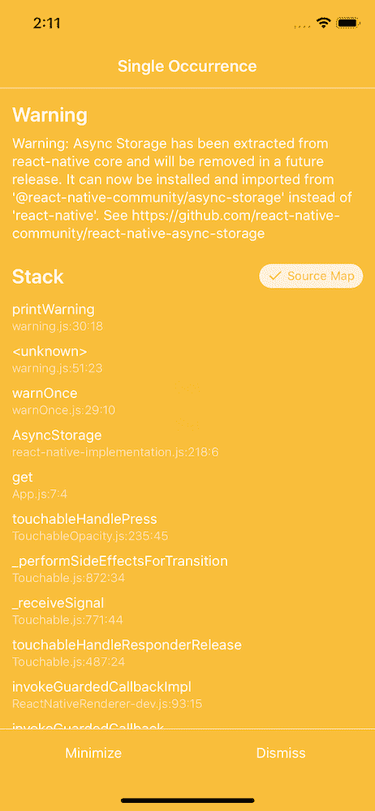

# 升级到 React Native 0.59+并处理弃用警告

> 原文：<https://dev.to/spencercarli/upgrading-to-react-native-0-59-handling-deprecation-warnings-3d07>

React Native 的 v0.59 是大事。它...

1.  增加挂钩支撑
2.  是对“精益核心”计划的巨大推动
3.  改进开发人员工具

有了这些，我想花一些时间来了解如何升级(这很简单！)，以后怎么升级，处理变化。

> 本帖最初[发表于 React 原生学校](https://www.reactnativeschool.com/upgrading-to-react-native-0.59+-and-handling-deprecation-warnings)。如果您有兴趣了解 React Native 的更多信息，请访问！每周新文章！

[https://www.youtube.com/embed/3qq2uziLdg8](https://www.youtube.com/embed/3qq2uziLdg8)

## 如何升级

React Native 正在明确升级 React Native 的正确方法，我很高兴看到社区团结在一个解决方案周围。

要升级，您需要使用 [`rn-diff-purge`](https://github.com/react-native-community/rn-diff-purge) 。该工具将允许您查看 React Native 的当前版本与目标版本之间的差异。例如，这里是[从 0.58.3 升级到 0.59.2](https://github.com/react-native-community/rn-diff-purge/compare/version/0.58.3...version/0.59.2) 所需的所有更改。

一旦你完成了这些并且运行了`v0.59+`，你就可以使用`react-native upgrade`工具了。

说到 CLI 工具...

## CLI 已移出 React 本机核心

这是一件很棒的事情。为什么？因为脸书(对什么合并到 React Native 有最终决定权)没有在内部使用 React Native CLI。这使得它的优先级较低，因此 CLI 有点停滞。随着向社区的转移，这意味着它可以独立于核心 React Native 进行改进。我们已经从中受益了！

[了解有关 CLI 改进的更多信息](http://facebook.github.io/react-native/blog/#cli-improvements)。

## 将核心包移动到社区

如果您升级到 React Native v0.59+版本，您可能会开始收到一些黄框警告，指出某些 API 已被弃用。

不要惊慌！

就像 CLI 一样，这对于整个 React 原生社区来说是一件好事，因为这些包现在可以独立于 React 原生版本进行更新和管理。

[了解哪些 API 以及它们为何被移至社区](http://facebook.github.io/react-native/blog/#lean-core-is-underway)。

## v 0.59+中的弃用警告处理

好吧，你已经升级到 React 原生 v0.59+(或者你正在考虑它，想知道处理那些弃用警告是什么感觉)。我如何处理这些警告？假设我们看到了这个警告:

[](https://res.cloudinary.com/practicaldev/image/fetch/s--Ek6PdxLk--/c_limit%2Cf_auto%2Cfl_progressive%2Cq_auto%2Cw_880/https://www.reactnativeschool.com/static/f8dfbf477b2d90f56a0afc5f94f36138/c8590/01.png)

导致此警告的代码:

```
import React, { Component } from 'react';
import { StyleSheet, Text, View, Button, AsyncStorage } from 'react-native';

export default class App extends Component {
  get = () => {
    AsyncStorage.getItem('item').then(result => alert(result));
  };

  write = () => {
    AsyncStorage.setItem('item', Math.random().toString()).then(() =>
      alert('set!')
    );
  };

  render() {
    return (
      <View style={styles.container}>
        <Button title="Get" onPress={this.get} />
        <Button title="Set" onPress={this.write} />
      </View>
    );
  }
}

const styles = StyleSheet.create({
  container: {
    flex: 1,
    justifyContent: 'center',
    alignItems: 'center',
    backgroundColor: '#F5FCFF',
  },
}); 
```

### 走错了路

最简单的方法是使用`Yellowbox.ignoreWarnings`，像这样:

```
import React, { Component } from 'react';
import {
  StyleSheet,
  Text,
  View,
  Button,
  AsyncStorage,
  Yellowbox,
} from 'react-native';

Yellowbox.ignoreWarnings(['Warning: Async Storage has been extracted...']);

// ... 
```

为什么这是错的？因为当你将来升级 React Native 并且 API 实际上被移除的时候，你将会困惑为什么事情不能工作。不行，让我们现在就解决它。

### 正确的方式

升级 React Native(通过`rn-diff-purge`)后，你可以快速处理每个弃用错误。[找到受影响的 API 和它们的新家](http://facebook.github.io/react-native/blog/#lean-core-is-underway)。

末端的

```
yarn add @react-native-community/async-storage
react-native link @react-native-community/async-storage 
```

然后更新您的代码:

```
import React, { Component } from 'react';
import { StyleSheet, Text, View, Button } from 'react-native';
import AsyncStorage from '@react-native-community/async-storage';

// ... 
```

当然，你可能不得不在少数地方这样做，但这是最好的！

## 结论

如果说我在 React Native 上学到了什么，那就是经常更新。我知道这会很累，但会有回报的。每个月花一两个小时升级到下一个版本(即使是最新的版本！)胜过必须从 v0.48 升级到 v0.59。这将会带来伤害，需要大量时间，并且很可能会损坏东西。

不要害怕升级到 v0.59！去拿钩子🎣(包括所有其他精彩的更新)。

> 如果你想了解更多关于 React Native 的知识，一定要去 reactnativeschool.com 参观！