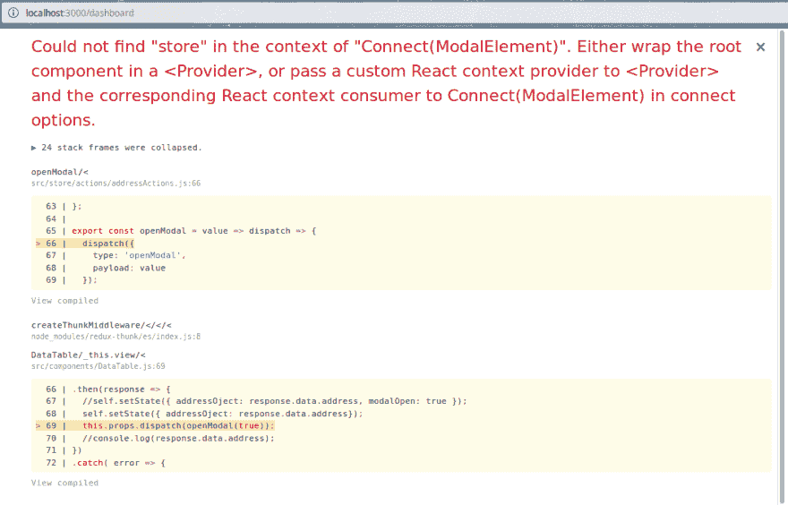

# React Redux 在情态动词中的用法

> 原文：<https://dev.to/afoysal/usage-of-react-redux-in-modal-1icn>

我正在 React 中学习 Redux。我在 React 中使用 Redux 进行模态开发。我的代码如下所示

```
render() {
    return (
      <Modal id="addressModal" open={this.props.controlModal} onClose={this.props.action}>
        <Provider store={store}>
          {this.props.addresObj ? (
            <Modal.Header>Address Details</Modal.Header>
          ) : (
            <Modal.Header>Insert Address</Modal.Header>
          )}
          <Modal.Content>
              <ModalElement
                update={this.update}
                element={this.props.addresObj}
                errors = {this.state.errors}
                update_state_photo={this.update_state_photo}
                address={this.props.address}
                action={this.props.action}
              />
          </Modal.Content>

          <Modal.Actions>
            {this.props.addresObj ? (
              <Button
                positive
                icon="checkmark"
                labelPosition="right"
                onClick={this.closeModal}
                content="OK"
              />
            ) : (
              <Button
                positive
                icon="checkmark"
                labelPosition="right"
                onClick={this.insertAddress}
                content="Save"
              />
            )}
          </Modal.Actions>
        </Provider>
      </Modal>
    );
  }
} 
```

(我用`<Provider store={store}>`合适吗？)在子组件中，我不能使用 Redux 语法。比如，如果我使用这个`export default connect()(EditableRow);`，我会得到一个错误(组件执行没有在那个组件上完成，执行被警告)。如果我使用这个语法`export default EditableRow;`，我不会得到任何错误。

也许我不能恰当地表达我的问题。

下面是我的 repo[https://github . com/AFO ysal/mern/blob/master/client/src/components/modal body . js](https://github.com/afoysal/mern/blob/master/client/src/components/ModalBody.js)

我越来越不犯错了。

[](https://i.stack.imgur.com/GMzMj.png)

React Modal 中如何使用 Redux？