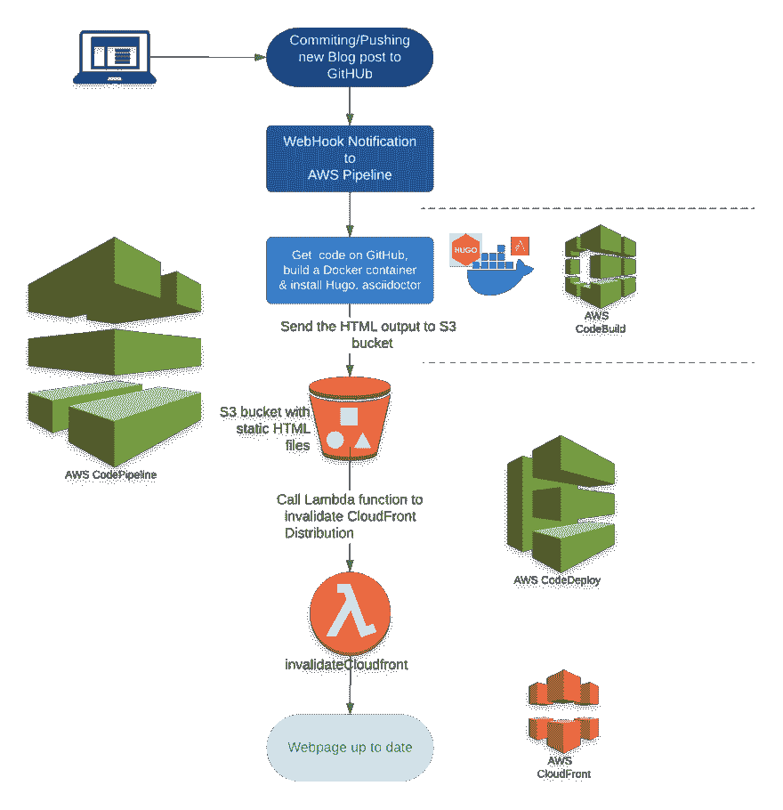
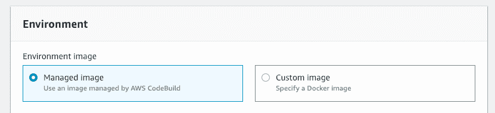
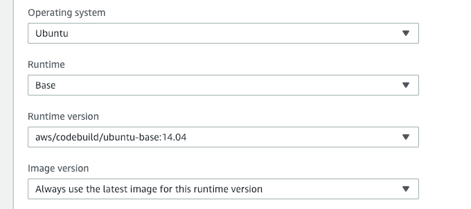
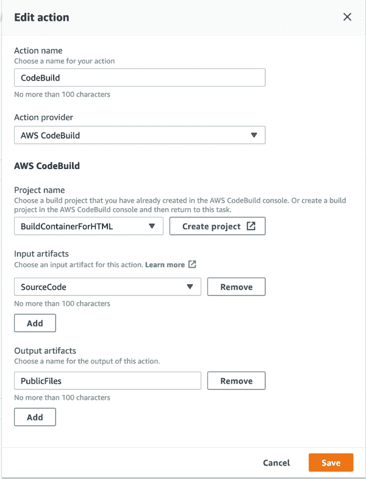
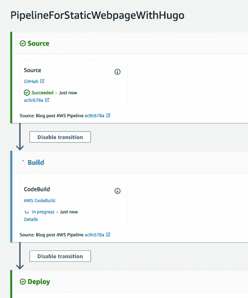

# 使用 AWS CodePipeline 自动将 Hugo 网站部署到 AWS S3

> 原文：<https://dev.to/kbild/use-aws-codepipeline-to-automatically-deploy-your-hugo-website-to-aws-s3-7li>

所以我现在有了一个 Hugo 网站，但是将生成的 HTML 文件部署到我的 AWS S3 桶，并使我的 AWS Cloudfront 部署无效是非常耗时的。

因此，我计划有一个 AWS 代码管道来帮助我完成这个过程。需要采取以下步骤:

[](https://res.cloudinary.com/practicaldev/image/fetch/s--vDumOiVl--/c_limit%2Cf_auto%2Cfl_progressive%2Cq_auto%2Cw_880/https://kbild.ch/201902/AWSCodePipeline01.png)

其他博主的阅读指南( [alimac.io](https://alimac.io/static-websites-with-s3-and-hugo-part-1/) 、 [YagoYns](https://medium.com/@yagonobre/automatically-invalidate-cloudfront-cache-for-site-hosted-on-s3-3c7818099868) 、 [Symphonia](https://github.com/symphoniacloud/github-codepipeline) )给了我一个很好的起点，让我基于 AWS CodePipeline 构建自己的解决方案。

我将在下面的一篇博客文章中发布一个完整的 CloudFormation 脚本，但今天我将只讨论 [AWS CodeBuild](https://aws.amazon.com/codebuild/) 部分。

在构建过程中，我需要一个基于 GitHub repo 中的 Hugo 和 asciidoc 文件生成静态 HTML 文件的功能。获得这个功能最简单的方法是使用一个安装了 Hugo 和 asciidoctor 的 Docker 容器。

让我们从点击`Create project`并定义项目名`BuildContainerForHTML`在 AWS CodeBuild 中创建一个构建项目开始。

在构建项目的创建过程中，您可以选择是使用 AWS 托管 Docker 映像，还是使用自定义映像:

[](https://res.cloudinary.com/practicaldev/image/fetch/s--WlXmTFe3--/c_limit%2Cf_auto%2Cfl_progressive%2Cq_auto%2Cw_880/https://kbild.ch/201902/DockerImage.png)

这里我们将选择`Managed Image`，并将使用以下参数:

[](https://res.cloudinary.com/practicaldev/image/fetch/s--qxzAciTe--/c_limit%2Cf_auto%2Cfl_progressive%2Cq_auto%2Cw_880/https://kbild.ch/201902/DockerImage02.png)

这意味着我们将使用标准的 AWS Ubuntu 14.04 Base Docker 容器，因此默认情况下不安装任何东西。

现在我们需要安装所需的软件，该软件是通过一个名为 buildspec.yml 的文件定义的(该文件应该放在源代码根目录→ GitHub repo 中)。

对我来说最难的部分是找出 [buildspec.yml](https://docs.aws.amazon.com/codebuild/latest/userguide/build-spec-ref.html) 应该是什么样子。这个 buildspec 文件用于创建将在 docker 容器中使用的构建命令。

正如你所看到的，我在这个例子中只使用了两个阶段并定义了输出工件:

buildspec.yml

```
version: 0.2

phases:
  install:
    commands:
      - echo Entered the install phase...
      - apt-get -qq update && apt-get -qq install curl
      - apt-get -qq install asciidoctor
      - curl -s -L https://github.com/gohugoio/hugo/releases/download/v0.53/hugo_0.53_Linux-64bit.deb -o hugo.deb
      - dpkg -i hugo.deb
    finally:
      - echo Installation done
  build:
    commands:
      - echo Entered the build phase ...
      - echo Build started on `date`
      - cd $CODEBUILD_SRC_DIR
      - rm -f buildspec.yml && rm -f .git && rm -f README.md
      - hugo --quiet
    finally:
      - echo Building the HTML files finished
artifacts:
  files:
    - '**/*'
  base-directory: $CODEBUILD_SRC_DIR/public/
  discard-paths: no 
```

**install:**

这里我们有安装 Hugo 和 asciidoctor 的所有命令

**build:**

在这里，我们从 GitHub ($CODEBUILD_SRC_DIR)切换到源文件所在的目录，并执行 Hugo build 命令，该命令将在目录 **public** 中创建所有静态页面

**artifacts:**

这里，我们将$CODEBUILD_SRC_DIR/public/定义为基本目录，并将该目录中的所有文件添加到输出工件中

我们还必须定义 CodeBuild 项目应该使用的策略。在这个例子中，我们只需要访问输入(kbil-artifacts)和输出(kbild-yourwebsite) S3 桶和 CloudWatch 日志。使用以下策略:

代码构建策略

```
---
{
    "Version": "2012-10-17",
    "Statement": [
        {
            "Action": "s3:*",
            "Resource": [
                "arn:aws:s3:::kbild-yourwebsite",
                "arn:aws:s3:::kbild-yourwebsite/*",
                "arn:aws:s3:::kbil-artifacts",
                "arn:aws:s3:::kbil-artifacts/*"
            ],
            "Effect": "Allow",
            "Sid": "VisualEditor0"
        },
        {
            "Action": "logs:*",
            "Resource": "*",
            "Effect": "Allow",
            "Sid": "VisualEditor1"
        }
    ]
}
--- 
```

这个构建项目现在可以作为构建阶段添加到代码管道中。来自 GitHub 的

`SourceCode`工件将被用作输入，**公共 html 文件**将被导出为`PublicFiles`工件，稍后将被发送到 S3。

[](https://res.cloudinary.com/practicaldev/image/fetch/s--rtxFEu7K--/c_limit%2Cf_auto%2Cfl_progressive%2Cq_auto%2Cw_880/https://kbild.ch/201902/BuildAction.png)

在 GitHub Repo 上发布了一篇新的博客文章后，我们将看到我们的代码管道在全面运行:

[](https://res.cloudinary.com/practicaldev/image/fetch/s--VhPsOl1a--/c_limit%2Cf_auto%2Cfl_progressive%2Cq_auto%2Cw_880/https://kbild.ch/201902/Buildpipeline.png)

不错！

添加额外的阶段和步骤是相当容易的，我想我将来会大量使用代码管道。

请继续关注 CloudFormation 脚本，它将创建整个管道。