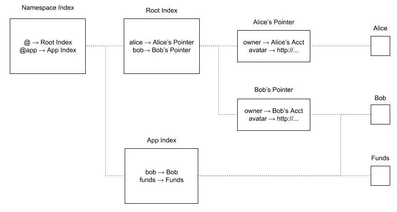

# 用例别名系统

> 原文：<https://dev.to/radixdlt/use-case-alias-system-7d3>

# 简介

在本文中，您将学习在您自己的应用程序中构建所需方法的基本概念，如“注册别名”或“解析别名”。您还将了解如何利用 Radix ledger 的特性来为您的应用程序实现一个简单的分散别名系统，而无需中央服务器来管理数据库索引或存储数据。‍

# 计算机系统中有哪些别名？

别名是某人或某物的别名。例如，布鲁斯·韦恩以他的笔名蝙蝠侠为人所知。在计算机科学中，别名是计算机、对象、文件、设备、人、组或用户的替代名称。通常，别名用于将长字符串替换为人类可读的名称。比如网站域名和用户名都是别名。这使得用户可以记住简单的 URL 地址，如 google.com，而不是复杂、不直观的谷歌服务器 IP 地址列表。

那么为什么在分布式账本上有一个别名系统很重要呢？
在分布式账本技术平台中，网络的每个成员(节点或钱包)都由其唯一的公钥来标识。记住你正在发信息或发送令牌的这个长键并不容易。这给用户体验造成了摩擦。记住或存储像用户名和域名这样人类可读的名称要容易得多。

因此，我们可以说，分布式分类帐的别名的主要目标是将人类可读的名称，如@name 或 name@namespace，解析为机器可读的标识符，包括 Radix wallet 地址、节点，甚至内容散列和/或其他标识符。

# 用 Radix 实现别名系统

如前所述，我们希望为我们的应用程序构建一个分散的别名系统，而不需要一个专门的服务器来管理数据库索引。现在，让我们看看通过与 Radix ledger 交互来实现我们的目标是多么简单。

假设我们的应用程序希望为用户提供一个支持简单别名(以@name 的形式)和名称空间别名(以 name@namespace 的形式)的别名系统。实现的别名逻辑必须是应用程序客户端代码的一部分，以便所有钱包可以一致地解释它。

首先，在我们的应用程序中，我们定义一个帐户作为名称空间索引，另一个帐户作为根索引。在名称空间索引中，我们添加了一个指向根索引的记录，这样我们就可以处理任何简单的别名。

图中所示的系统元件:

-命名空间索引:全局索引，使系统能够分别存储根和每个命名空间的别名。

-根索引:这个索引存储简单的别名。

-指针帐户:根索引上的每个别名都链接到链接到用户的单个指针帐户。这将允许用户在将来修改或转发它。

-真实帐户:这是别名后面的实际用户帐户。

# 注册一个简单的别名

在我们的应用程序中，当用户想要注册一个简单的别名时，我们只需读取名称空间索引帐户，验证没有名称空间已经用该别名注册，找到对根索引帐户的引用，并在根中为所请求的用户别名添加一个记录。

该别名记录将指向一个用作指针引用的新帐户，我们在该帐户中存储别名所有者、他们的当前地址以及任何其他相关信息。请注意，指针帐户只能由别名所有者在以后更新，以防他需要更改任何信息。

您可能会想，实际上没有必要检查可用性或重复，因为别名是根据先到先得的原则分配的，即使有人试图注册一个名称两次，不可变的分类帐也允许我们知道谁拥有第一个有效的注册。

# 注册名称空间别名

同样，当用户想要注册一个名称空间别名(比如 name@myapp)时，我们必须从名称空间索引帐户中读取，找到对所请求的名称空间索引帐户的引用，然后在 myapp 索引中为所请求的用户别名添加一条记录。

根据特定于应用程序的需要，名称空间别名可以由名称空间的所有者(如电子邮件域)修改，也可以仅由别名所有者(如简单别名)修改。

# 解析别名

让我们回顾一下如何解析别名，以便在我们的应用程序中有一个完整的别名系统。

当我们想要解析别名时，我们从读取名称空间索引记录开始，以便为别名找到正确的索引。对于简单别名，这将是根索引，对于命名空间别名，这将是已定义的命名空间索引。如果它是一个简单的别名，我们开始读取根索引记录，并获取找到的第一个匹配，以访问别名指针帐户。

我们继续读取别名指针的第一条记录，以找到别名所有者，并继续读取指针帐户中的任何其他记录，以查看别名所有者是否对别名进行了任何其他更新。一旦到达指针数据的末尾，我们就有了简单别名的最新帐户地址。相反，如果它是一个名称空间别名，接下来，我们开始读取定义的名称空间索引记录，并获取我们找到的第一个匹配。

在这个场景中，这个过程被简化了，我们在私有名称空间索引中找到的第一个匹配是别名的帐户地址。

# 加入 Radix 社区

[电报](https://t.me/radix_dlt)普通聊天
[不和](https://discord.gg/7Q7HSZZ)开发者聊天
[Reddit](https://reddit.com/r/radix) 普通讨论
[论坛](https://forum.radixdlt.com/)技术讨论
[推特](https://twitter.com/radixdlt)发布公告
[电子邮件](https://radixdlt.typeform.com/to/nyKvMV)简讯每周更新
邮件[hello@radixdlt.com](//hello@radixdlt.com)普通查询