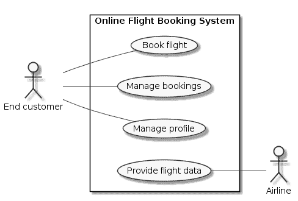

# 用例与组织结构

> 原文：<https://dev.to/bertilmuth/use-cases-and-organizational-structure-1lb3>

下面是一个简化的在线机票预订系统的用例图:

如您所见，该图显示了用户的目标:一个*最终客户*想要*预订一个航班*。该图没有显示达到目标的步骤，例如搜索航班。

拥有这样一个高层次的用例图有很多好处:

*   它提供了系统功能的总体情况
*   它有助于开发人员和利益相关者就范围达成一致
*   它可以用于长期的粗粒度规划

但是用例也可以帮助设计产品开发组织的结构。敏捷团队应该能够交付有价值的软件，尽可能独立于其他团队。用例就是这样一个价值单位。

用例*预订航班*本身是有价值的。它直接关系到用户从一个地方到另一个地方的需求。这就是为什么它是软件的卖点。

典型的应用程序不超过 10 到 20 个用例。当敏捷团队负责贯穿整个技术栈的整个用例时，与其他团队交流的需求是有限的。这使得团队能够尽早并持续地交付价值。

但是其他因素可能会迫使团队将其职责限制在用例的部分。例如，一个团队的开发能力可能不足以开发一个完整的用例。或者团队没有必要的知识。质量属性也可能发挥作用。

每个组织都需要定义自己在团队之间分配工作的标准。并在实践中尝试一下，看看是否有效。