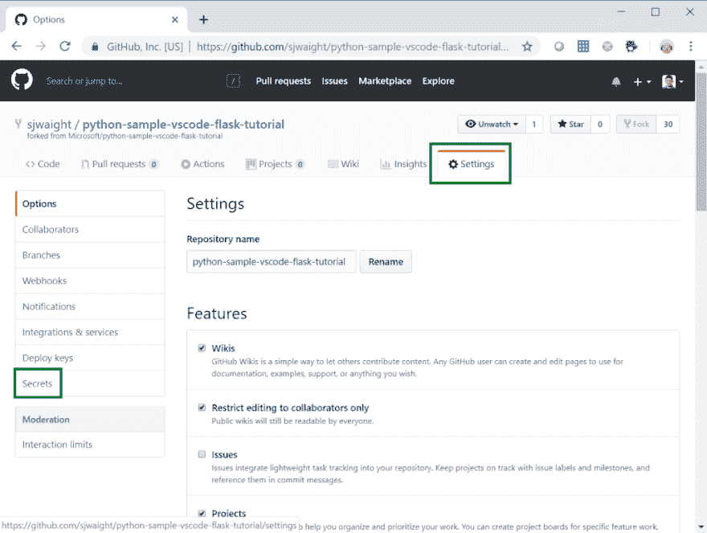
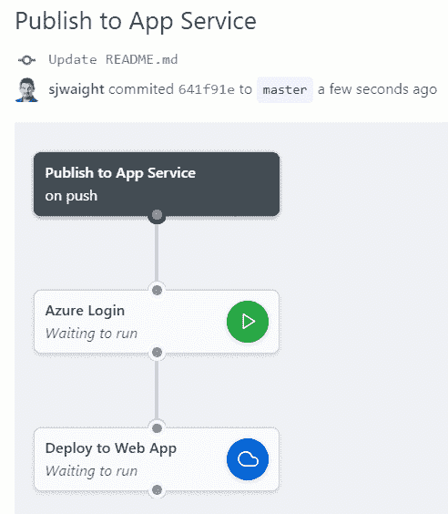
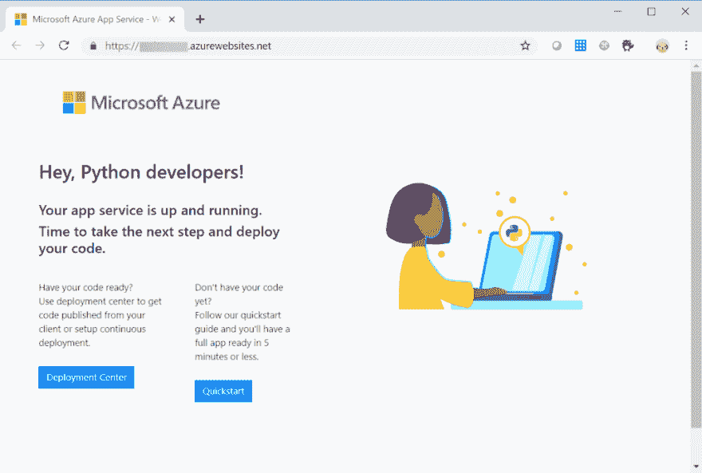
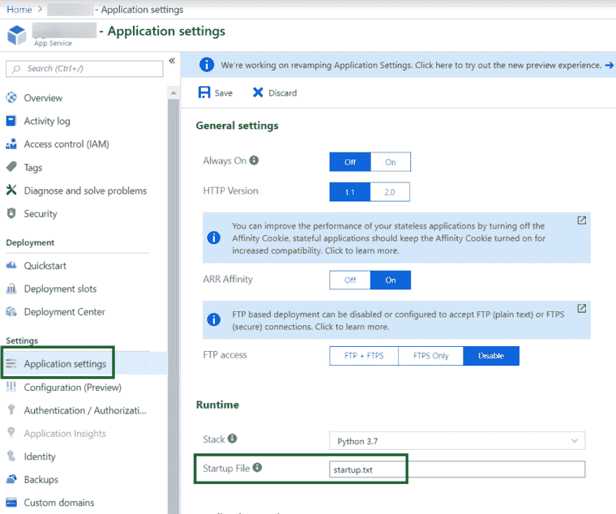
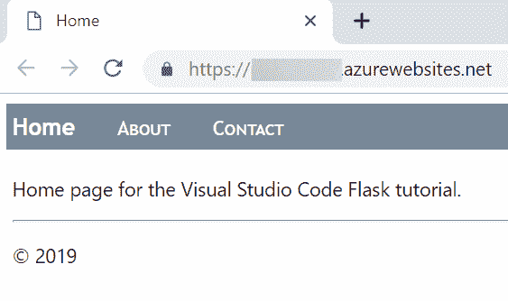

# 使用 GitHub 操作将 Python Flask web 应用程序部署到 Linux 上的 Azure 应用程序服务

> 原文：<https://dev.to/simonwaight/use-github-actions-to-deploy-a-python-flask-web-app-to-azure-app-service-on-linux-5dgp>

在这篇文章中，我将介绍如何使用 [GitHub Actions](https://github.com/features/actions) 快速将 Python Flask web 应用部署到 Azure 在 Linux 上的[应用服务上托管的 web 应用中。](https://docs.microsoft.com/en-us/azure/app-service/containers/app-service-linux-intro)

### 准备好 Azure

#### 创建 Azure 活动目录(AAD)服务主体

[服务主体](https://docs.microsoft.com/en-us/azure/active-directory/develop/app-objects-and-service-principals)是 Azure Active Directory 中一种特殊形式的身份，可用于授权应用程序组件相互连接。在 Azure 的软件部署环境中，服务主体是授权外部服务(如 GitHub 操作)与各种 Azure 服务 API 交互的主要方式。

服务主体注册的伟大之处在于，我们可以真正限制它们的范围，使它们只能与 Azure 中特定的[资源组](https://docs.microsoft.com/en-us/azure/azure-resource-manager/resource-group-overview#resource-groups)进行交互，如下面的示例命令所示。

```
az ad sp create-for-rbac -n "laps-ghactions" \
 --role contributor \ 
 --scopes /subscriptions/AZURE_SUB_ID/resourceGroups/RESOURCE_GROUP 
```

如果你想使用上述命令，请确保更改名称(“laps-ghactions”)并添加你的订阅 ID 和资源组名称，然后你可以使用 [Azure Cloud Shell](https://shell.azure.com/) 来运行该命令。

运行该命令将得到类似如下的输出。您将需要的重要信息是“appId”、“密码”和“租户”，我们将在稍后配置 GitHub 操作时使用它们。

```
{  "appId":  "ef037512-0000-0000-0000-000000000000",  "displayName":  "laps-ghactions",  "name":  "http://laps-ghactions",  "password":  "d9ebbc41-0000-0000-0000-000000000000",  "tenant":  "72f988bf-0000-0000-0000-000000000000"  } 
```

#### 在 Linux 上创建 Azure 应用服务

在应用服务上运行 Python 的最佳方式是使用 [Linux 服务计划](https://docs.microsoft.com/en-us/azure/app-service/containers/app-service-linux-intro)。[这个 bash 脚本](https://gist.githubusercontent.com/sjwaight/a105617a766717fda831df70373d92c0/raw/8017774e30d6c5366b07b34932c8fa50c9c4a205/createlinuxappservice.sh)是实现这一点的最快方法。

如果你想使用这个脚本，你可以！在您想要部署服务计划的订阅中打开一个 [Azure Cloud Shell](https://shell.azure.com/) 会话(并选择 Bash ),然后使用 curl 下载文件并执行它。

```
curl https://gist.githubusercontent.com/sjwaight/a105617a766717fda831df70373d92c0/raw/8017774e30d6c5366b07b34932c8fa50c9c4a205/createlinuxappservice.sh -o createlinuxappservice.sh 
chmod 755 createlinuxappservice.sh 
./createlinuxappservice.sh YOUR_WEB_APP YOUR_RESOURCE_GROUP_NAME 
```

好了，我们现在有了 Azure 基础设施，所以让我们开始 GitHub 操作设置。

### GitHub Actions Ahoy！

在撰写本文时，GitHub Actions 仍处于私有预览中，因此可能无法在您的存储库中使用，尽管您可以[请求访问](https://github.com/features/actions)测试版程序。如果您拥有(或获得)访问权限，您应该知道“操作”选项卡和可视编辑器仅对参与预览的用户显示。

出于演示的目的，我将包含 Python Flask web 应用程序的现有存储库分支到[https://github . com/SJ waight/Python-sample-vs code-Flask-tutorial](https://github.com/sjwaight/python-sample-vscode-flask-tutorial)。

如果您打开这个存储库，您会注意到它有一个名为“[”的附加子文件夹。github](https://github.com/sjwaight/python-sample-vscode-flask-tutorial/tree/master/.github) ”对比源码。这是存储操作工作流的位置。令人惊叹的是，您的 CI/CD 逻辑与您的解决方案共存很长时间，并且以同样的方式进行源代码控制和版本控制！

工作流声明的副本如下所示。

```
workflow "Publish to App Service" {
  on = "push"
  resolves = ["Deploy to Web App"]
}

action "Azure Login" {
  uses = "Azure/github-actions/login@master"
  env = {
    AZURE_SUBSCRIPTION = "YOUR_AZURE_SUBSCRIPTION_NAME"
  }
  secrets = ["AZURE_SERVICE_APP_ID", "AZURE_SERVICE_PASSWORD", "AZURE_SERVICE_TENANT"]
}

action "Deploy to Web App" {
  uses = "Azure/github-actions/webapp@master"
  needs = ["Azure Login"]
  env = {
    AZURE_APP_NAME = "YOUR_LINUX_WEB_APP_NAME"
    AZURE_APP_PACKAGE_LOCATION = "./"
  }
} 
```

工作流由多个步骤(动作)组成，这些步骤可以是现有动作的任意组合，比如来自微软的 Azure，或者你可以[定制构建你自己的](https://developer.github.com/actions/creating-github-actions/creating-a-new-action/)。微软的 Azure 是 GitHub 上的[，包括文档。](https://github.com/Azure/github-actions)

工作流块定义触发器(推送时),并包含对工作流最后一个操作的引用。当通过可视化设计器创建操作时，您看不到任何这些，但它是为您生成的。

Azure 登录操作没有依赖关系(它没有“needs”属性)，但需要您提供三个秘密，以及一个环境变量(Azure Subscription)。查看[文档](https://github.com/Azure/github-actions/tree/master/login)我们可以看到，只有当您的 Azure AD 租户与多个 Azure 订阅相关联时，才需要环境变量。

我们的最后一步， [Deploy to Web App](https://github.com/Azure/github-actions/tree/master/webapp) ，依赖于 Azure 登录操作，需要您提供两个环境变量——要部署到的目标 Web 应用程序的名称，以及您希望部署的本地 GitHub 引用(或 zip 文件)。

#### 在工作流程中保守秘密

你会注意到在 Azure 登录步骤中，我们列出了三个“秘密”。设计机密是为了让开发人员避免在工作流中存储凭据或访问密钥。

您可以在屏幕顶部选项卡中的“设置”下，在您想要部署的存储库中设置秘密–请参见下面的截图。

[](https://res.cloudinary.com/practicaldev/image/fetch/s--FHjOpx9e--/c_limit%2Cf_auto%2Cfl_progressive%2Cq_auto%2Cw_880/https://siliconvalve.files.wordpress.com/2019/03/2019-03-19_16-13-18.png%3Fw%3D1024%26h%3D771)

一旦你有了一个秘密集，你就不能查看它的值了——只有当它被执行时，它才能被操作使用。

在这里，您可以设置 Azure 登录操作所需的三个密码——Azure _ SERVICE _ APP _ ID、AZURE_SERVICE_PASSWORD、AZURE_SERVICE_TENANT。对于这些值，使用您在本文前面捕获的“appId”、“password”和“tenant”。

#### 运行我们的工作流程

因为我们的工作流是由推送触发的，所以我们可以编辑一个文件(在我的例子中只是 README ),工作流就会运行。如果我们切换到“操作”选项卡，我们可以观察工作流的运行并查看工作流的运行历史。😎

[](https://res.cloudinary.com/practicaldev/image/fetch/s--I2sWB3pl--/c_limit%2Cf_auto%2Cfl_progressive%2Cq_66%2Cw_880/https://siliconvalve.files.wordpress.com/2019/03/ghaction.gif%3Fw%3D1100)

### 查看网络应用程序

让我们去看看我们的 Flask web 应用程序的辉煌吧！

[](https://res.cloudinary.com/practicaldev/image/fetch/s--Q_kMkigv--/c_limit%2Cf_auto%2Cfl_progressive%2Cq_auto%2Cw_880/https://siliconvalve.files.wordpress.com/2019/03/2019-03-22_9-47-36.png%3Fw%3D1024%26h%3D690)

哦…这不是我所期待的(这是一个配置为支持 Python 的新 Azure Web 应用的默认页面)。

让我们弄清楚哪里出了问题…

如果我们看一下源代码 [Python Flask 项目自述文件](https://github.com/sjwaight/python-sample-vscode-flask-tutorial)，我们可以看到一些关于 Docker 和 Gunicorn 的讨论，以及 startup.txt 的容器启动文件。

这本身可能没什么意义，但我会分享一点 Linux 应用服务的工作原理。

在幕后，Linux App 服务使用 Docker 来展示它支持的多个运行时和框架，因此即使您没有部署容器化的应用程序(在本例中我们没有),您仍然可以利用 Docker 的特性，比如指定启动文件。

现在我们知道了这一点，我们如何解决我们的问题？

如果你返回 Azure 门户并导航到你的 Web 应用实例，你会发现一个叫做“应用程序设置”的功能，你应该打开它。

在设置栏的顶部，你会发现一个名为“启动文件”的字段。当您打开页面时，它将是空白的，您应该通过在其中输入“startup.txt”来更新该字段，然后单击“保存”按钮。

[](https://res.cloudinary.com/practicaldev/image/fetch/s--NpHyrZ_H--/c_limit%2Cf_auto%2Cfl_progressive%2Cq_auto%2Cw_880/https://siliconvalve.files.wordpress.com/2019/03/2019-03-22_9-57-21.png%3Fw%3D1024%26h%3D855)

让我们回到我们的公共网站，刷新浏览器，看看我们得到了什么。

[](https://res.cloudinary.com/practicaldev/image/fetch/s--nOc_nHjU--/c_limit%2Cf_auto%2Cfl_progressive%2Cq_auto%2Cw_880/https://siliconvalve.files.wordpress.com/2019/03/2019-03-22_10-20-08.png%3Fw%3D1100)

是啊！

希望这篇文章已经让你对使用 GitHub 操作将现有的 Python Flask web 应用程序部署到 Linux 上的 Azure App Service 有了一个很好的了解。如果你有任何问题，或者你想看我做同样的网络应用程序，但使用 Docker，请在下面留下评论。

快乐的日子！😎