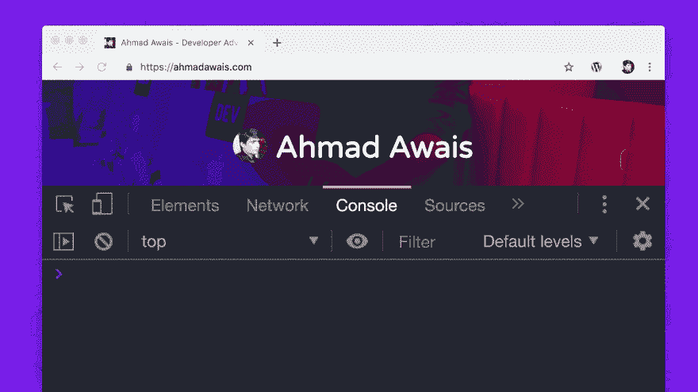

# 在没有 jQuery 的 JavaScript 中使用$ & $$而不是 document.querySelector/All

> 原文：<https://dev.to/ahmadawais/use-instead-of-document-queryselector-all-in-javascript-without-jquery-3ef1>

我开始写 JavaScript 代码是因为 2007 年的 WordPress。JavaScript 不是今天的样子。它在不同的浏览器上会有不同的表现，围绕基本的东西有太多的漏洞，以至于无法一直跟上所有的变化。

因此，我们中的许多人决定依赖 jQuery——一个简单的 JavaScript 库，具有单一形式的语法，可以在所有浏览器中的任何地方工作。

快进到 2019 年，作为一个全职的 JavaScript 开发者倡导者——我提倡现代 JavaScript。因为超级牛逼。虽然有时我会怀念 jQuery 的简单，比如你只需要一个`$`符号就可以选择一个元素并对其进行操作。

现在有了 JavaScript，我发现自己在一个应用程序中多次使用`document.querySelector`。好吧，猜猜看，有一种简单的方法可以将那个`$`符号绑定到你的文档的`document.querySelector`。

[](https://res.cloudinary.com/practicaldev/image/fetch/s--os7vpXoV--/c_limit%2Cf_auto%2Cfl_progressive%2Cq_66%2Cw_880/https://thepracticaldev.s3.amazonaws.com/i/se386yy0s87edjw2z38k.gif)

你应该这么做。

```
const $ = document.querySelector.bind(document);
const $$ = document.querySelectorAll.bind(document); 
```

Enter fullscreen mode Exit fullscreen mode

现在你可以使用下面的:

```
 // Change the background color of a class.
$('.class').style.background="#BADA55";

// Change the inner HTML of an ID.
$('#id').innerHTML="<span>Cool beans!</span>";

// Select all images on the webpage.
$$('img')

// Print the image addresses for all the images on a webpage.
$$('img').forEach(img => console.log(img.src)) 
```

Enter fullscreen mode Exit fullscreen mode

液体错误:内部

善用你的代码，并从中获得乐趣！:)
平安！✌️