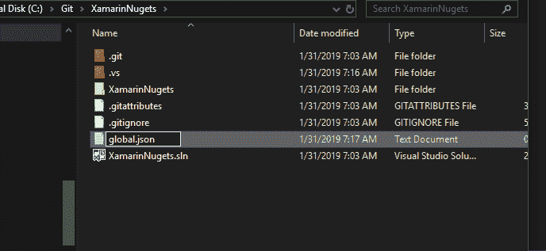
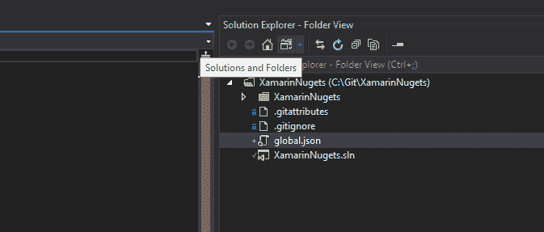
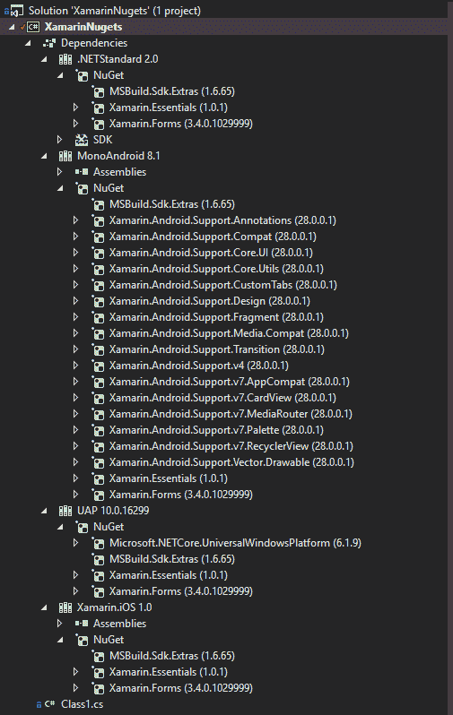
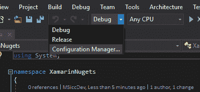
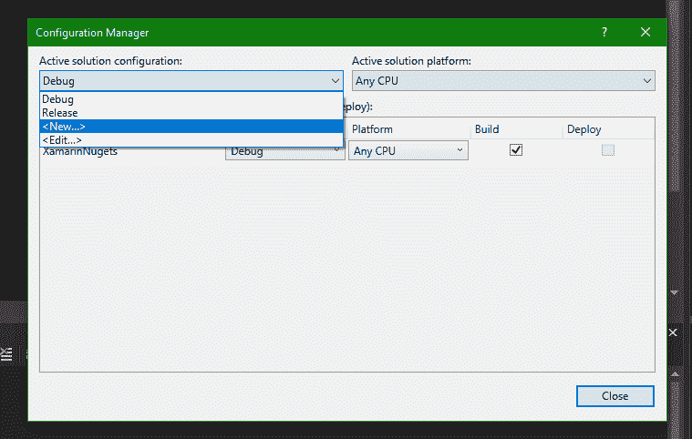
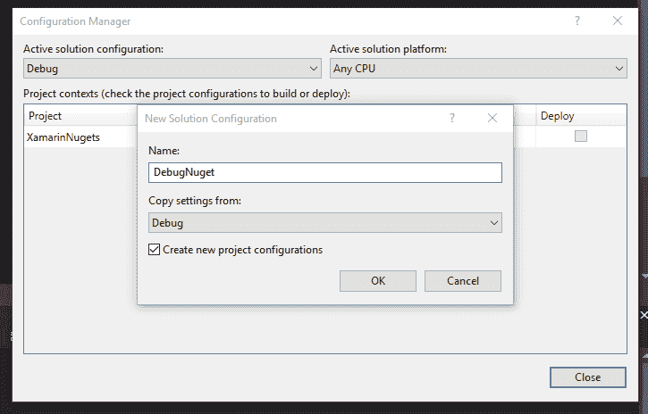
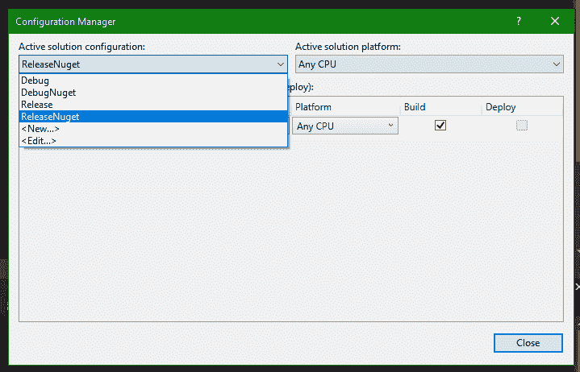
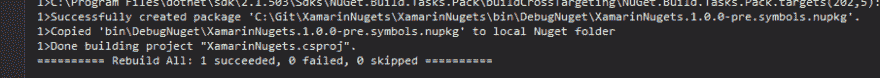
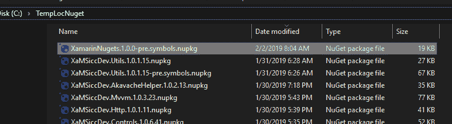
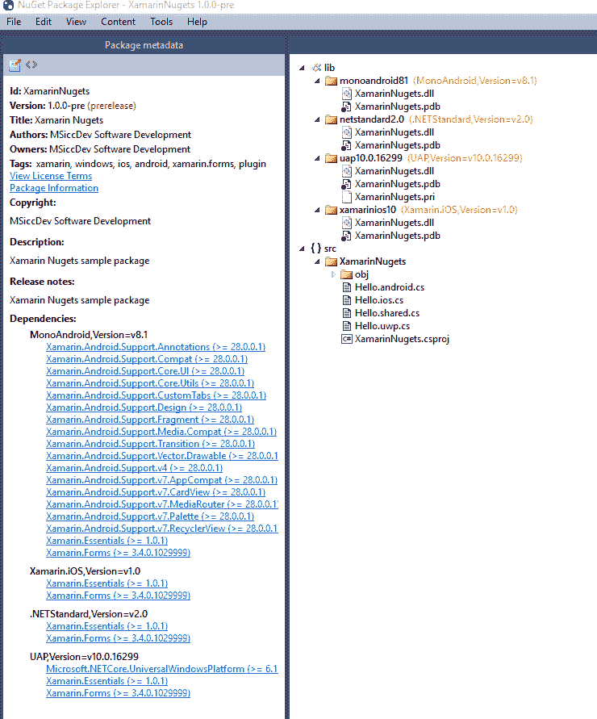

# 将 NuGets 用于常见的 Xamarin (Forms)代码(并自动化创建过程)

> 原文：<https://dev.to/msicc/use-nugets-for-your-common-xamarin-forms-code-and-automate-the-creation-process-2504>

### 内部库

反复编写(或者复制粘贴)相同的代码是我在编写代码时尽量避免的事情之一。很长一段时间以来，我已经在库中组织了这样的代码。直到去年，管理我使用的每个 Xamarin 平台的所有库都需要相当多的工作。幸运的是， [MSBuild SDK Extras 扩展](https://github.com/onovotny/MSBuildSdkExtras)的出现让一切都变得简单多了，尤其是在 James Montemagno 做了一个关于如何充分利用 Xamarin 插件/库的[详细解释之后](https://montemagno.com/converting-xamarin-libraries-to-sdk-style-multi-targeted-projects/)。

### 入门

即使我重复了詹姆斯帖子中的一些步骤，我也要在这里从头开始设置部分。我希望让每个人都明白整个过程——这就是为什么我认为展示每一步都是有意义的。请确保您使用的是新的。csproj 类型。如果您需要更新，您可以[查看我关于迁移到 it 的帖子(如果需要)](https://msicc.net/xamarin-forms-the-mvvmlight-toolkit-and-i-migrating-the-forms-project-and-mvvmlight-to-net-standard/)。

#### MSBuild。Sdk.Extras

第一步是引入 [MSBuild。Sdk.Extras](https://github.com/onovotny/MSBuildSdkExtras#msbuildsdkextras) ，这将使我们能够在单个库中定位多个平台。为此，我们需要在解决方案文件夹中有一个 global.json 文件。右键单击解决方案名称并选择“*在文件浏览器*中打开文件夹”，然后只需添加一个新的文本文件并适当命名。

[](https://res.cloudinary.com/practicaldev/image/fetch/s--KgDneAkP--/c_limit%2Cf_auto%2Cfl_progressive%2Cq_auto%2Cw_880/https://i0.wp.com/msicc.net/wp-content/uploads/2019/02/add-global-json.png%3Fw%3D1440%26ssl%3D1)

下一步是定义 MSBuild 的版本。我们想要使用的额外库。当前版本是 1.6.65，我们在文件中定义一下。只需单击“*解决方案和文件夹*按钮，即可在 Visual Studio 中找到该文件:

[](https://res.cloudinary.com/practicaldev/image/fetch/s--DhUDptT7--/c_limit%2Cf_auto%2Cfl_progressive%2Cq_auto%2Cw_880/https://i0.wp.com/msicc.net/wp-content/uploads/2019/02/switch-sln-view-open-global-json.png%3Fw%3D1440%26ssl%3D1)

将这几行添加到文件中并保存:

```
{
  "msbuild-sdks": {
    "MSBuild.Sdk.Extras": "1.6.65"
  }
} 
```

#### 修改项目文件

切换回解决方案视图，右键单击。csproj 文件。选择'*'编辑【项目名称】。csproj* 。让我们修改并添加项目定义。我们从第一行开始。更换第一条线拉入`MSBuild.Sdk.Extras` :

```
<Project Sdk="MSBuild.Sdk.Extras"> 
```

接下来，我们将分离`Version`标签。这将确保我们在文件中很快找到它:

```
 <!--separated for accessibility-->
  <PropertyGroup>
    <Version>1.0.0.0</Version>
  </PropertyGroup> 
```

现在，我们正在启用多个目标，在这种情况下，我们的 Xamarin 平台。请注意，有两个独立的版本，一个包含 UWP，另一个不包含。我想我可以删除非 UWP 的，如果我包括 UWP，并出现一些奇怪的构建错误，只有通过重新添加删除的行才能解决。我不记得原因了，但是我在我的模板中做了一个不删除它的注释——所以让我们就保持这样吧。

```
 <!--make it multi-platform library!-->
  <PropertyGroup>
    <UseFullSemVerForNuGet>false</UseFullSemVerForNuGet>
    <!--we are handling compile items ourselves below with a custom naming scheme-->
    <EnableDefaultCompileItems>false</EnableDefaultCompileItems>
    <KEEP ALL THREE IF YOU ADD UWP!-->
    <TargetFrameworks></TargetFrameworks>
    <TargetFrameworks Condition=" '$(OS)' == 'Windows_NT' ">netstandard2.0;MonoAndroid81;Xamarin.iOS10;uap10.0.16299;</TargetFrameworks>
    <TargetFrameworks Condition=" '$(OS)' != 'Windows_NT' ">netstandard2.0;MonoAndroid81;Xamarin.iOS10;</TargetFrameworks>
  </PropertyGroup> 
```

现在我们将添加一些默认的 NuGet 包到项目中，并确保我们的文件只包含在正确的平台上。我们遵循一个简单的文件命名方案( [Xamarin)。要领](https://github.com/xamarin/Essentials/blob/master/Xamarin.Essentials/Xamarin.Essentials.csproj)使用相同):

> 【类】。【平台】。铯

这样，我们能够将所有平台特定的代码和共享入口点一起添加到一个文件夹中。让我们从共享项目开始。这些将在上述`PropertyGroup`中列出的所有平台上提供:

```
 <!--shared items-->
  <ItemGroup>
    <!--keeping this one ensures everything goes smooth-->
    <PackageReference Include="MSBuild.Sdk.Extras" Version="1.6.65" PrivateAssets="All" />

    <!--most commonly used (by me)-->
    <PackageReference Include="Xamarin.Forms" Version="3.4.0.1029999" />
    <PackageReference Include="Xamarin.Essentials" Version="1.0.1" />

    <!--include content, exclude obj and bin folders-->
    <None Include="**\*.cs;**\*.xml;**\*.axml;**\*.png;**\*.xaml" Exclude="obj\**\*.*;bin\**\*.*;bin;obj" />
    <Compile Include="**\*.shared.cs" />
  </ItemGroup> 
```

`Compile`标记的`Include`属性中的“_**_”部分确保 MSBuild 也包括子文件夹中的类。现在让我们给项目添加一些平台特定的规则:

```
 <ItemGroup Condition=" $(TargetFramework.StartsWith('netstandard')) ">
    <Compile Include="**\*.netstandard.cs" />
  </ItemGroup>

  <ItemGroup Condition=" $(TargetFramework.StartsWith('uap10.0')) ">
    <PackageReference Include="Microsoft.NETCore.UniversalWindowsPlatform" Version="6.1.9" />
    <Compile Include="**\*.uwp.cs" />
  </ItemGroup>

  <ItemGroup Condition=" $(TargetFramework.StartsWith('MonoAndroid')) ">
    <!--need to reference all those libs to get latest minimum Android SDK version (requirement by Google)... #sigh-->
    <PackageReference Include="Xamarin.Android.Support.Annotations" Version="28.0.0.1" />
    <PackageReference Include="Xamarin.Android.Support.Compat" Version="28.0.0.1" />
    <PackageReference Include="Xamarin.Android.Support.Core.Utils" Version="28.0.0.1" />
    <PackageReference Include="Xamarin.Android.Support.CustomTabs" Version="28.0.0.1" />
    <PackageReference Include="Xamarin.Android.Support.v4" Version="28.0.0.1" />
    <PackageReference Include="Xamarin.Android.Support.Design" Version="28.0.0.1" />
    <PackageReference Include="Xamarin.Android.Support.v7.AppCompat" Version="28.0.0.1" />
    <PackageReference Include="Xamarin.Android.Support.v7.CardView" Version="28.0.0.1" />
    <PackageReference Include="Xamarin.Android.Support.v7.Palette" Version="28.0.0.1" />
    <PackageReference Include="Xamarin.Android.Support.v7.MediaRouter" Version="28.0.0.1" />
    <PackageReference Include="Xamarin.Android.Support.Core.UI" Version="28.0.0.1" />
    <PackageReference Include="Xamarin.Android.Support.Fragment" Version="28.0.0.1" />
    <PackageReference Include="Xamarin.Android.Support.Media.Compat" Version="28.0.0.1" />
    <PackageReference Include="Xamarin.Android.Support.v7.RecyclerView" Version="28.0.0.1" />
    <PackageReference Include="Xamarin.Android.Support.Transition" Version="28.0.0.1" />
    <PackageReference Include="Xamarin.Android.Support.Vector.Drawable" Version="28.0.0.1" />
    <PackageReference Include="Xamarin.Android.Support.Vector.Drawable" Version="28.0.0.1" />
    <Compile Include="**\*.android.cs" />
  </ItemGroup>

  <ItemGroup Condition=" $(TargetFramework.StartsWith('Xamarin.iOS')) ">
    <Compile Include="**\*.ios.cs" />
  </ItemGroup> 
```

两个旁注:

*   不要参考版本 6.2.2 的`Microsoft.NETCore.UniversalWindowsPlatform` NuGet。[这里似乎有一个错误](https://stackoverflow.com/questions/53350429/app-certificaion-fails-with-api-freeaddrinfoex-in-ws2-32-dll-is-not-supported-f)会导致你的应用被微软商店拒绝。就保持 6.1.9 吧(暂时)。
*   你可能不需要所有的`Xamarin.Android`包，但是它们和其他包之间有很多依赖关系，所以我决定保留它们

如果您已经完成了，点击保存按钮并关闭`.csproj`文件。验证一切顺利非常容易——您的解决方案结构应该如下所示:

[](https://res.cloudinary.com/practicaldev/image/fetch/s--K40HeRtF--/c_limit%2Cf_auto%2Cfl_progressive%2Cq_auto%2Cw_880/https://i1.wp.com/msicc.net/wp-content/uploads/2019/02/multi-platform-project.png%3Fw%3D1440%26ssl%3D1)

在我们看这篇文章的 NuGet 创建部分之前，让我们添加一些示例代码。只需将它插入到静态分部类中，并为每个平台使用适当的命名方案，然后编辑代码以匹配平台。的。此的共享版本应该为空(对于此示例)。

```
 public static partial class Hello
    {
        public static string Name { get; set; }

        public static string Platform { get; set; }

        public static  void Print()
        {
            if (!string.IsNullOrEmpty(Name) && !string.IsNullOrEmpty(Platform))
                System.Diagnostics.Debug.WriteLine($"Hello {Name} from {Platform}");
            else
                System.Diagnostics.Debug.WriteLine($"Hello unkown person from {Device.Android}");
        }
    } 
```

通常，这将是一个渲染器或其他特定于平台的代码。你应该明白了。

### 准备创建 NuGet 包

我们现在将准备我们的解决方案，为`DEBUG`和`RELEASE`配置自动生成 NuGet 包。一旦创建了包，我们将把它推到一个本地(或网络)文件夹中，这个文件夹就是我们的本地 NuGet-Server。这将适合大多数独立开发者——他们倾向于不复制完整的企业基础设施来满足他们的开发运维需求。我还将提到如何将包推到一个内部的 NuGet 服务器上(我们在工作中使用了类似的设置)。

#### 添加 NuGet 推送配置

我们想确定的一件事是，我们不会在库的每次编译时都推出包。这就是为什么我们需要分离配置。要添加新的配置，打开 *Visual Studio* 中的*配置管理器*:

[](https://res.cloudinary.com/practicaldev/image/fetch/s--f3U_itlJ--/c_limit%2Cf_auto%2Cfl_progressive%2Cq_auto%2Cw_880/https://i1.wp.com/msicc.net/wp-content/uploads/2019/02/open-configuration-manager.png%3Fw%3D1440%26ssl%3D1)

在*配置管理器*对话框中，从“*活动解决方案配置*组合框中选择“ *<新… >* ”选项:

[](https://res.cloudinary.com/practicaldev/image/fetch/s--mdKVDA-G--/c_limit%2Cf_auto%2Cfl_progressive%2Cq_auto%2Cw_880/https://i2.wp.com/msicc.net/wp-content/uploads/2019/02/configmanager-add-new.png%3Fw%3D1440%26ssl%3D1)

命名新的配置来满足你的需求，我只是使用 *DebugNuget* 来表示我们正在发布 Nuget 包。我从*调试*配置中复制设置，并让 Visual Studio 将这些配置添加到解决方案内的项目文件中。对发布配置重复相同的操作。

[](https://res.cloudinary.com/practicaldev/image/fetch/s--DKQ3b046--/c_limit%2Cf_auto%2Cfl_progressive%2Cq_auto%2Cw_880/https://i0.wp.com/msicc.net/wp-content/uploads/2019/02/create-nuget-copy-from.png%3Fw%3D1440%26ssl%3D1)

结果应该是这样的:

[](https://res.cloudinary.com/practicaldev/image/fetch/s--LYYWD5El--/c_limit%2Cf_auto%2Cfl_progressive%2Cq_auto%2Cw_880/https://i0.wp.com/msicc.net/wp-content/uploads/2019/02/configmanager-with-new-config.png%3Fw%3D1440%26ssl%3D1)

#### (再次)修改项目文件

如果您浏览您的项目文件，您会看到`Configurations`标签有了新的条目:

```
 <PropertyGroup>
    <Configurations>Debug;Release;DebugNuget;ReleaseNuget</Configurations>
  </PropertyGroup> 
```

接下来，添加您的程序集和包的属性:

```
 <!--assmebly properties-->
  <PropertyGroup>
    <AssemblyName>XamarinNugets</AssemblyName>
    <RootNamespace>XamarinNugets</RootNamespace>
    <Product>XamarinNugets</Product>
    <AssemblyVersion>$(Version)</AssemblyVersion>
    <AssemblyFileVersion>$(Version)</AssemblyFileVersion>
    <NeutralLanguage>en</NeutralLanguage>
    <LangVersion>7.1</LangVersion>
  </PropertyGroup>

  <!--nuget package properties-->
  <PropertyGroup>
    <PackageId>XamarinNugets</PackageId>
    <PackageLicenseUrl>https://github.com/MSiccDevXamarinNugets</PackageLicenseUrl>
    <PackageProjectUrl>https://github.com/MSiccDevXamarinNugets</PackageProjectUrl>
    <RepositoryUrl>https://github.com/MSiccDevXamarinNugets</RepositoryUrl>

    <PackageReleaseNotes>Xamarin Nugets sample package</PackageReleaseNotes>
    <PackageTags>xamarin, windows, ios, android, xamarin.forms, plugin</PackageTags>

    Xamarin Nugets
    <Summary>Xamarin Nugets sample package</Summary>
    <Description>Xamarin Nugets sample package</Description>

    <Owners>MSiccDev Software Development</Owners>
    <Authors>MSiccDev Software Development</Authors>
    <Copyright>MSiccDev Software Development</Copyright>
  </PropertyGroup> 
```

### 配置特定属性

现在，我们将添加一些特定于配置的`PropertyGroups`来控制是否创建一个包。

#### Debug 和 DebugNuget

```
 <PropertyGroup Condition=" '$(Configuration)'=='Debug' ">
    <DefineConstants>DEBUG</DefineConstants>
    <!--making this pre-release-->
    <PackageVersion>$(Version)-pre</PackageVersion>
    <!--needed for debugging!-->
    <DebugType>full</DebugType>
    <DebugSymbols>true</DebugSymbols>
  </PropertyGroup>

  <PropertyGroup Condition=" '$(Configuration)'=='DebugNuget' ">
    <DefineConstants>DEBUG</DefineConstants>
    <!--enable package creation-->
    <GeneratePackageOnBuild>true</GeneratePackageOnBuild>
    <!--making this pre-release-->
    <PackageVersion>$(Version)-pre</PackageVersion>
    <!--needed for debugging!-->
    <DebugType>full</DebugType>
    <DebugSymbols>true</DebugSymbols>
    <GenerateDocumentationFile>false</GenerateDocumentationFile>
    <!--this makes msbuild creating src folder inside the symbols package-->
    <IncludeSource>True</IncludeSource>
    <IncludeSymbols>True</IncludeSymbols>
  </PropertyGroup> 
```

*Debug* 配置使我们能够在开发期间直接引用项目时进入 *Debug* 代码，而 *DebugNuget* 配置也将生成一个包含源代码和符号的 Nuget 包。一旦你在 NuGet 包中发现一个 bug，这是很有帮助的，如果我们引用 NuGet 而不是项目，这也允许我们进入这个代码。这两种配置都会将' *-pre* '添加到版本中，使得这些包只有在您勾选了 NuGet 包管理器中的' *Include prerelease* '复选框时才会出现。

#### 发布和释放获取

```
 <PropertyGroup Condition=" '$(Configuration)'=='Release' ">
    <DefineConstants>RELEASE</DefineConstants>
    <PackageVersion>$(Version)</PackageVersion>
  </PropertyGroup>

  <PropertyGroup Condition=" '$(Configuration)'=='ReleaseNuget' ">
    <DefineConstants>RELEASE</DefineConstants>
    <PackageVersion>$(Version)</PackageVersion>
    <!--enable package creation-->
    <GeneratePackageOnBuild>true</GeneratePackageOnBuild>
    <!--include pdb for analytic services-->
    <DebugType>pdbonly</DebugType>
    <GenerateDocumentationFile>true</GenerateDocumentationFile>
  </PropertyGroup> 
```

relase 配置很适合较少的设置。这里我们不生成一个单独的符号包，如*。pdb*-没有源文件的文件在大多数情况下会做得很好。

### 添加构建目标

我们已经接近完成我们的实现了。当然，我们希望确保只推送最新的包。为了确保这一点，我们在构建项目/解决方案之前清理了所有生成的 NuGet 包:

```
 <!--cleaning older nugets-->
  <Target Name="CleanOldNupkg" BeforeTargets="Build">
    <ItemGroup>
      <FilesToDelete Include="$(ProjectDir)$(BaseOutputPath)$(Configuration)\$(AssemblyName).*.nupkg"></FilesToDelete>
    </ItemGroup>
    <Delete Files="@(FilesToDelete)" />
    <Message Text="Old nupkg in $(ProjectDir)$(BaseOutputPath)$(Configuration) deleted." Importance="High"></Message>
  </Target> 
```

MSBuild 提供了许多选项来配置。我们将目标的`BeforeTargets`属性设置为`Build`，所以一旦我们*清理/构建/重建*，所有旧的包都将被`Delete`命令删除。最后，我们正在打印确认删除的消息。

### 推包

完成以上所有步骤后，我们就可以发布我们的包了。在我们的例子中，我们用`Copy`命令将包复制到一个本地文件夹。

```
 <!--pushing to local folder (or network path)-->
  <Target Name="PushDebug" AfterTargets="Pack" Condition="'$(Configuration)'=='DebugNuget'">
    <ItemGroup>
      <PackageToCopy Include="$(ProjectDir)$(BaseOutputPath)$(Configuration)\$(AssemblyName).*.symbols.nupkg"></PackageToCopy>
    </ItemGroup>
    <Copy SourceFiles="@(PackageToCopy)" DestinationFolder="C:\TempLocNuget" />
    <Message Text="Copied '@(PackageToCopy)' to local Nuget folder" Importance="High"></Message>
  </Target>

  <Target Name="PushRelease" AfterTargets="Pack" Condition="'$(Configuration)'=='ReleaseNuget'">
    <ItemGroup>
      <PackageToCopy Include="$(ProjectDir)$(BaseOutputPath)$(Configuration)\$(AssemblyName).*.nupkg"></PackageToCopy>
    </ItemGroup>
    <Copy SourceFiles="@(PackageToCopy)" DestinationFolder="C:\TempLocNuget" />
    <Message Text="Copied '@(PackageToCopy)' to local Nuget folder" Importance="High"></Message>
  </Target> 
```

请注意，本地文件夹可能会被网络路径替换。您必须确保该路径的可用性——如果您选择这条路径，这将增加一些额外的工作。

如果您正在运行一个完整的 NuGet 服务器(在企业环境中经常发生)，您可以使用这个命令(而不是`Copy`命令)来推送包:

```
<Exec Command="NuGet push "$(ProjectDir)$(BaseOutputPath)$(Configuration)\$(AssemblyName).*.symbols.nupkg" [YourPublishKey] -Source [YourNugetServerUrl]" /> 
```

#### 结果

如果我们现在选择 *DebugNuget/ReleaseNuget* 配置，Visual Studio 将创建我们的 Nuget 包并将其推送到我们的 Nuget 文件夹/服务器:

[](https://res.cloudinary.com/practicaldev/image/fetch/s--Bf_IQMvN--/c_limit%2Cf_auto%2Cfl_progressive%2Cq_auto%2Cw_880/https://i0.wp.com/msicc.net/wp-content/uploads/2019/02/Nuget-created-and-pushed.png%3Fw%3D1440%26ssl%3D1)

让我们也来看看 NuGet 包。打开上面定义的文件位置并搜索您的包:

[](https://res.cloudinary.com/practicaldev/image/fetch/s--VY-Iasem--/c_limit%2Cf_auto%2Cfl_progressive%2Cq_auto%2Cw_880/https://i0.wp.com/msicc.net/wp-content/uploads/2019/02/nuget-folder-created-package.png%3Fw%3D1440%26ssl%3D1)

如您所见，`Copy`命令执行成功。要检查 NuGet 包，你需要 [NuGet 包浏览器应用](https://www.microsoft.com/store/productId/9WZDNCRDMDM3)。安装完成后，只需双击软件包即可查看其内容。对于*调试*包，您的结果应该与此类似:

[](https://res.cloudinary.com/practicaldev/image/fetch/s--t6Q5gzOq--/c_limit%2Cf_auto%2Cfl_progressive%2Cq_auto%2Cw_880/https://i1.wp.com/msicc.net/wp-content/uploads/2019/02/nuget-with-symbols-and-source.png%3Fw%3D1440%26ssl%3D1)

如你所见我们既有。pdb 文件以及我们的包中的源代码。

### 结论

即使作为独立开发人员，您也可以利用 Visual Studio 和`MSBuild`提供的 DevOps 选项。`MSBuild.Sdk.Extras`包使我们能够为我们的`Xamarin(.Forms)`代码维护一个多目标包。整个过程需要一些设置，但是一旦你执行了上面的步骤，扩展你的库就很快了。

我计划写这个帖子已经有一段时间了，我很高兴能把它作为我对 [#XamarinMonth](https://luismts.com/blog/xamarin/xamarin-month-february-2019/) ( [由路易斯·马托斯](https://twitter.com/luismatosluna)发起)的贡献。一如既往，我希望这篇文章对你们有些人有所帮助。请随意用我上传到 Github 的完整样本来克隆和播放[。](https://github.com/MSiccDev/XamarinNuGets)

#### 直到下一个帖子，大家编码快乐！

有用的链接:

*   [MSBuild 引用](https://docs.microsoft.com/en-us/visualstudio/msbuild/msbuild-reference?view=vs-2017)
*   [MSBuild。附加软件开发套件(Github)](https://github.com/onovotny/MSBuildSdkExtras)
*   [詹姆斯·蒙泰格曼诺登上](https://montemagno.com/converting-xamarin-libraries-to-sdk-style-multi-targeted-projects/) [多目标](https://montemagno.com/converting-xamarin-libraries-to-sdk-style-multi-targeted-projects/) [图书馆](https://montemagno.com/converting-xamarin-libraries-to-sdk-style-multi-targeted-projects/)
*   [获取文档:创建包](https://docs.microsoft.com/en-us/nuget/create-packages/overview-and-workflow)
*   [获取文档:托管包](https://docs.microsoft.com/en-us/nuget/hosting-packages/overview)

[片头图像片尾](https://pixabay.com/en/boxes-cardboard-carrying-overload-2624231/)

另外，请随意下载我博客的官方应用程序(使用了我博客中的很多内容):

[iOS](https://itunes.apple.com/de/app/msiccs-blog/id1359113195)|[Android](https://play.google.com/store/apps/details?id=com.msiccdev.msiccsblog)|[Windows 10](https://www.microsoft.com/store/apps/9WZDNCRDPQLK)